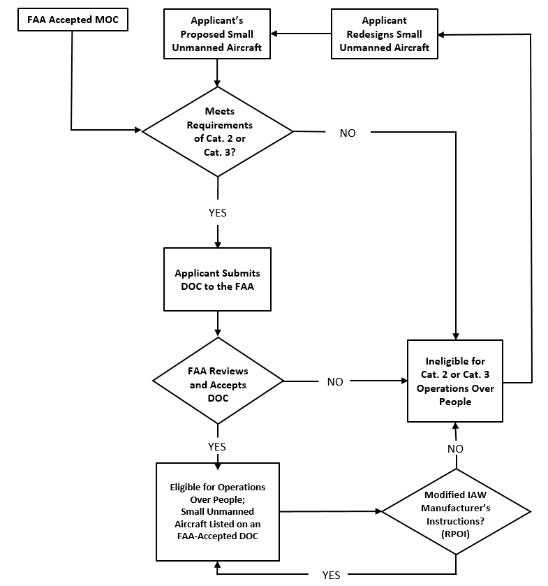

# AC_107-2A

- Source file: `AC_107-2A.pdf`
- Total pages: 104
- Relevance: P0 (Primary FAA advisory guidance for Part 107 operations.)
- Large images kept: False
- Generated UTC: 2026-02-19T12:27:17.552095+00:00

Each page section below includes extracted text and linked page-clipped images.

## Page 1

`source: AC_107-2A.pdf#page=1`

U.S. Department 
of Transportation 
Federal Aviation 
Administration 
Advisory 
Circular 
Subject: Small Unmanned Aircraft System 
(Small UAS) 
Date: 2/1/21 
AC No: 107-2A 
Initiated by: AFS-800 
Change: 
This advisory circular (AC) provides guidance for conducting small unmanned aircraft systems 
(UAS) operations in the National Airspace System (NAS) in accordance with Title 14 of the 
Code of Federal Regulations (14 CFR) part 107. 
Robert C. Carty 
Deputy Executive Director, Flight Standards Service

## Page 2

`source: AC_107-2A.pdf#page=2`

2/1/21 
AC 107-2A 
ii 
CONTENTS 
Paragraph 
Page 
Chapter 1. General ....................................................................................................................... 1-1
1.1 Purpose of This Advisory Circular (AC) ...................................................................... 1-1
1.2 Where You Can Find This AC...................................................................................... 1-1
1.3 What This AC Cancels.................................................................................................. 1-1
1.4 Request for Information ................................................................................................ 1-1
1.5 AC Feedback Form ....................................................................................................... 1-2
Chapter 2. References .................................................................................................................. 2-1
2.1 Related Code of Federal Regulations (CFR) Parts ....................................................... 2-1
2.2 Notices to Airmen (NOTAM) ....................................................................................... 2-1
2.3 Related Reading Material ............................................................................................. 2-1
Chapter 3. Background ................................................................................................................ 3-1
3.1 PL 112-95, Title III, Subtitle B ..................................................................................... 3-1
3.2 Organization of Part 107 ............................................................................................... 3-1
Chapter 4. Part 107 Subpart A, General ...................................................................................... 4-1
4.1 Applicability ................................................................................................................. 4-1
4.2 Definitions..................................................................................................................... 4-1
4.3 Falsification, Reproduction, or Alteration .................................................................... 4-5
4.4 Accident Reporting ....................................................................................................... 4-5
Chapter 5. Part 107 Subpart B, Operating Rules (Small UAS) ................................................... 5-1
5.1 Applicability ................................................................................................................. 5-1
5.2 Aircraft Operation ......................................................................................................... 5-1
5.3 Aeronautical Decision-Making (ADM) and Crew Resource Management (CRM) ..... 5-2
5.4 Aircraft Registration ..................................................................................................... 5-2
5.5 Small Unmanned Aircraft Maintenance, Inspections, and Condition for Safe 
Operation....................................................................................................................... 5-3
5.6 Medical Condition ........................................................................................................ 5-3
5.7 Civil Twilight and Operations at Night ........................................................................ 5-4
5.8 Operations Over Open-Air Assemblies of Persons ...................................................... 5-5
5.9 VLOS Aircraft Operation ............................................................................................. 5-5

## Page 3

`source: AC_107-2A.pdf#page=3`

2/1/21 
AC 107-2A 
iii 
5.10 Operation Near Airports, in Certain Airspace, in Prohibited or Restricted Areas, or 
in the Proximity of Certain Areas Designated by a Notice to Airmen (NOTAM) ..... 5-7
5.11 Preflight Familiarization, Inspection, and Actions for Aircraft Operation ................. 5-9
5.12 Operating Limitations for Small Unmanned Aircraft ............................................... 5-11
5.13 Remaining Clear of Other Aircraft ............................................................................ 5-12
5.14 Operations from Moving Vehicles ............................................................................ 5-12
5.15 Transportation of Property ........................................................................................ 5-13
5.16 Operations While Impaired ....................................................................................... 5-13
5.17 Remote Identification of Unmanned Aircraft Systems ............................................. 5-14
5.18 In-Flight Emergency .................................................................................................. 5-15
5.19 Careless or Reckless Operation ................................................................................. 5-15
5.20 Certificate of Waiver ................................................................................................. 5-15
5.21 Supplemental Operational Information ..................................................................... 5-16
Chapter 6. Part 107 Subpart C, Remote Pilot Certification ......................................................... 6-1
6.1 Applicability ................................................................................................................. 6-1
6.2 Remote Pilot Certification ............................................................................................ 6-1
6.3 Eligibility ...................................................................................................................... 6-1
6.4 Application Process ...................................................................................................... 6-1
6.5 Security Disqualification .............................................................................................. 6-4
6.6 FAA Tracking Number (FTN) Requirement ................................................................ 6-4
6.7 Aeronautical Knowledge Test ....................................................................................... 6-4
6.8 Aeronautical Knowledge Training ................................................................................ 6-6
Chapter 7. Small UAS Maintenance and Inspection ................................................................... 7-1
7.1 Applicability ................................................................................................................. 7-1
7.2 Maintenance .................................................................................................................. 7-1
7.3 Preflight Inspection ....................................................................................................... 7-2
Chapter 8. Small Unmanned Aircraft Over People ..................................................................... 8-1
8.1 Applicability ................................................................................................................. 8-1
8.2 Category of Operations ................................................................................................. 8-1
8.3 Operations Over People ................................................................................................ 8-1
8.4 Applicant ..................................................................................................................... 8-10
8.5 Means of Compliance—General Information ............................................................ 8-12

## Page 4

`source: AC_107-2A.pdf#page=4`

2/1/21 
AC 107-2A 
iv 
8.6 FAA-Provided MOC ................................................................................................... 8-13
8.7 Voluntary Consensus Standards Body MOC .............................................................. 8-18
8.8 Means of Compliance ................................................................................................. 8-19
8.9 Declarations of Compliance ........................................................................................ 8-20
8.10 Accountability for Holders of DOCs ......................................................................... 8-24
8.11 Product Labeling ....................................................................................................... 8-29
8.12 Remote Pilot Operating Instructions ......................................................................... 8-30
8.13 Remote Pilot Responsibilities When Conducting Operations Over People .............. 8-36
8.14 Operations Over People at Night ............................................................................... 8-36
Appendix A. Risk Assessment Tools ....................................................................................... A-1
Appendix B. Supplemental Operational Information ............................................................... B-1
Appendix C. Small UAS Maintenance and Inspection Best Practices ..................................... C-1
Appendix D. Remote Pilot Certification and Applicant Identity Verification ......................... D-1
Appendix E. Sample Preflight Assessment and Inspection Checklist ...................................... E-1
List of Figures 
Figure 4-1. FAA Regional Operations Centers Telephone List ................................................ 4-6
Figure 6-1. Recurrent Training Cycle Examples ....................................................................... 6-6
Figure 8-1. Requirement to Submit a DOC for a Modified Small Unmanned Aircraft .......... 8-12
Figure 8-2. Sample Remote Pilot Operating Instructions. ....................................................... 8-32
Figure A-1. Hazard Identification and Risk Assessment Process Chart ................................... A-3
Figure A-2. Sample Safety Risk Assessment and Mitigation Steps Before Flight ................... A-4
List of Tables 
Table 4-1. 
Abbreviations/Acronyms Used in This AC ............................................................ 4-3
Table 8-1. 
Operations Over Moving Vehicles – Over or Within a Closed/Restricted 
Access Site .............................................................................................................. 8-3
Table 8-2. 
Operations Over Moving Vehicles – Not Over or Within a Closed/Restricted 
Access Site .............................................................................................................. 8-3
Table 8-3. 
Operations Over People – Over or Within a Closed/Restricted Access Site .......... 8-9
Table 8-4. 
Operations Over People – Not Over or Within a Closed/Restricted 
Access Site ............................................................................................................ 8-10
Table 8-5. 
Maximum Impact Speeds (ft/sec) for a Given Weight and Impact Kinetic 
Energy Under FAA-Provided MOC ..................................................................... 8-16

## Page 5

`source: AC_107-2A.pdf#page=5`

2/1/21 
AC 107-2A 
v 
Table 8-6. 
Maximum Impact Speeds (mph) for a Given Weight and Impact Kinetic 
Energy Under FAA-Provided MOC ..................................................................... 8-16
Table C-1. Small UAS Condition Chart .................................................................................. C-1

## Page 6

`source: AC_107-2A.pdf#page=6`

2/1/21 
AC 107-2A 
1-1
CHAPTER 1.  GENERAL 
1.1 Purpose of This Advisory Circular (AC). This AC provides guidance in the areas of 
airman (remote pilot) certification, aircraft registration and marking, aircraft 
airworthiness, and the operation of small Unmanned Aircraft Systems (UAS) in the 
National Airspace System (NAS) to promote compliance with the requirements of 
Title 14 of the Code of Federal Regulations (14 CFR) part 107. 
1.1.1 Effects of Guidance. The contents of this document do not have the force and effect of 
law and are not meant to bind the public in any way. This document is intended only to 
provide clarity to the public regarding existing requirements under the law or agency 
policies. It does not provide, nor is it intended to provide, a legal interpretation of the 
regulations. This AC uses mandatory terms, such as “must,” when the language is 
describing an established statutory or regulatory requirement. This AC does not change, 
add to, or delete regulatory requirements or authorize deviations from regulatory 
requirements or restrictions. 
1.1.2 Part 107 Provisions. This AC is not intended to cover every provision of part 107. Rather, 
this AC is intended to provide guidance on those provisions of part 107 where additional 
information may be helpful. The Federal Aviation Administration (FAA) emphasizes, 
however, that persons subject to part 107 are responsible for complying with every 
applicable provision of part 107, regardless of whether the provision is discussed in this 
AC. 
1.1.3 Privacy-Related Laws. Part 107 operators should be aware that State and local authorities 
may enact privacy-related laws specific to UAS operations. The FAA encourages small 
UAS operators to review those laws prior to operating their UAS. The National 
Telecommunications and Information Administration (NTIA) has also published the 
Voluntary Best Practices for UAS Privacy, Transparency, and Accountability (dated 
May 18, 2016), available at https://www.ntia.doc.gov/files/ntia/publications/uas_privacy_
best_practices_6-21-16.pdf. This document outlines and describes voluntary best 
practices that small UAS operators could take to advance UAS privacy, transparency, and 
accountability for the private and commercial use of UAS. 
1.2 Where You Can Find This AC. You can find this AC on the FAA’s website at 
https://www.faa.gov/regulations_policies/advisory_circulars. 
1.3 What This AC Cancels. AC 107-2, Small Unmanned Aircraft Systems (sUAS), dated 
June 21, 2016, is canceled. 
1.4 Request for Information. Direct comments and suggestions for improving this 
publication to: 
Federal Aviation Administration 
General Aviation and Commercial Division (AFS-800) 
55 M Street SE, 8th Floor, Zone 1 
Washington, DC 20003

## Page 7

`source: AC_107-2A.pdf#page=7`

2/1/21 
AC 107-2A 
1-2
1.5 AC Feedback Form. For your convenience, the AC Feedback Form is the last page of 
this AC. Note any deficiencies found, clarifications needed, or suggested improvements 
regarding the contents of this AC on the Feedback Form.

## Page 8

`source: AC_107-2A.pdf#page=8`

2/1/21 
AC 107-2A 
2-1
CHAPTER 2.  REFERENCES 
2.1 Related Code of Federal Regulations (CFR) Parts. The following regulations and parts 
can be found at https://www.faa.gov/regulations_policies/faa_regulations/. 
2.1.1 Title 14 CFR. 
•
Part 1, Definitions and Abbreviations.
•
Part 43, Maintenance, Preventive Maintenance, Rebuilding, and Alteration.
•
Part 47, Aircraft Registration.
•
Part 48, Registration and Marking Requirements for Small Unmanned Aircraft.
•
Part 71, Designation of Class A, B, C, D, and E Airspace Areas; Air Traffic Service
Routes; and Reporting Points.
•
Part 73, Special Use Airspace.
•
Part 89, Remote Identification of Unmanned Aircraft Systems.
•
Part 91, General Operating and Flight Rules.
•
Part 93, Special Air Traffic Rules.
•
Part 99, Security Control of Air Traffic.
•
Part 107, Small Unmanned Aircraft Systems.
2.1.2 Title 47 CFR. Part 87, Aviation Services. 
2.1.3 Title 49 CFR. Part 830, Notification and Reporting of Aircraft Accidents or Incidents and 
Overdue Aircraft, and Preservation of Aircraft Wreckage, Mail, Cargo, and Records. 
2.2 Notices to Airmen (NOTAM). Information on how to obtain NOTAMs can be found at 
https://pilotweb.nas.faa.gov/PilotWeb/. 
2.2.1 Additional resources to create NOTAMs, check weather, and prepare flight plans can be 
found at https://www.1800wxbrief.com/. 
2.3 Related Reading Material. The following listed reference materials contain additional 
information necessary to ensure safe operations in the NAS. A small UAS operator may 
want to consider seeking out additional publications to supplement the lists below. 
2.3.1 FAA ACs and Directives (current editions). You can find the current editions of the 
following publications on the FAA websites 
https://www.faa.gov/regulations_policies/advisory_circulars/ and 
https://www.faa.gov/regulations_policies/orders_notices/. 
•
AC 00-6, Aviation Weather.
•
AC 00-45, Aviation Weather Services.

## Page 9

`source: AC_107-2A.pdf#page=9`

2/1/21 
AC 107-2A 
2-2
•
AC 60-28, FAA English Language Standard for an FAA Certificate Issued Under
14 CFR Parts 61, 63, 65, and 107.
•
AC 61-141, Flight Instructors as Certifying Officials for Student Pilot and Remote
Pilot Applicants.
•
AC 120-92, Safety Management Systems for Aviation Service Providers.
•
FAA Order JO 7110.10, Air Traffic Organization Policy, Flight Services.
•
FAA Order JO 7110.65, Air Traffic Organization Policy, Air Traffic Control.
•
FAA Order JO 7200.23, Air Traffic Organization Policy, Processing of Unmanned
Aircraft Systems Requests.
•
FAA Order JO 7210.3, Air Traffic Organization Policy, Facility Operation and
Administration.
•
FAA Order JO 7400.11, Air Traffic Organization Policy, Airspace Designations and
Reporting Points.
•
FAA Order 8130.34, Airworthiness Certification of Unmanned Aircraft Systems and
Optionally Piloted Aircraft.
•
FAA Order 8900.1, Volume 16, Unmanned Aircraft Systems.
2.3.2 Additional FAA Online/Mobile Sources. 
•
UAS website: https://www.faa.gov/uas/.
•
UAS Registration website: https://faadronezone.faa.gov/.
•
B4UFLY mobile app.
•
UAS Flight Planning, NOTAMs, temporary flight restrictions (TFR):
https://www.1800wxbrief.com/ and https://tfr.faa.gov.
•
FAA Safety website: https://www.faasafety.gov.
•
FAA UAS Data Delivery System website: https://udds-faa.opendata.arcgis.com/.
•
FAA Waiver Safety Explanation Guidelines for Part 107 Waiver Applications:
https://www.faa.gov/uas/commercial_operators/part_107_waivers/waiver_safety_exp
lanation_guidelines/.
•
FAA Integrated Airman Certification and Rating Application (IACRA):
https://iacra.faa.gov/iacra.
•
Airman Certificate Testing Service (ACTS):
https://www.faa.gov/training_testing/testing/ACTS/.
•
Flight Standards District Offices (FSDO):
https://www.faa.gov/about/office_org/field_offices/fsdo.

## Page 10

`source: AC_107-2A.pdf#page=10`

2/1/21 
AC 107-2A 
2-3
2.3.3 FAA Handbooks, Manuals, and Other Publications. You can find the following 
handbooks, manuals, and other publications on the FAA website at 
https://www.faa.gov/regulations_policies/handbooks_manuals/. 
•
Aeronautical Information Manual (AIM):
https://www.faa.gov/air_traffic/publications/.
•
Aeronautical Charts (Digital):
https://www.faa.gov/air_traffic/flight_info/aeronav/digital_products/.
•
Pilot/Controller Glossary: https://www.faa.gov/air_traffic/publications/.
•
Pilot’s Handbook of Aeronautical Knowledge:
https://www.faa.gov/regulations_policies/handbooks_manuals/aviation/phak/.
•
Risk Management Handbook:
https://www.faa.gov/regulations_policies/handbooks_manuals/aviation/media/risk_m
anagement_hb_change_1.pdf.
•
Remote Pilot – Small Unmanned Aircraft Systems Airman Certification Standards
(ACS): https://www.faa.gov/training_testing/testing/acs/media/uas_acs.pdf.
•
Unmanned Aircraft Systems Operating Handbook:
https://www.faa.gov/about/office_org/headquarters_offices/avs/offices/afx/afs/afs600
/afs630/.
2.3.4 Statutory Resources. 
•
Public Law (PL) 112-95 (Feb. 14, 2012), Title III, Subtitle B—Unmanned Aircraft
Systems.
•
PL 114-190 (July 15, 2016), Title II, Subtitle B—UAS Safety.
•
PL 115-254 (Oct. 5, 2018), Title III, Subtitle B—Unmanned Aircraft Systems.

## Page 11

`source: AC_107-2A.pdf#page=11`

2/1/21 
AC 107-2A 
3-1
CHAPTER 3.  BACKGROUND 
3.1 PL 112-95, Title III, Subtitle B. In 2012, Congress passed the FAA Modernization and 
Reform Act of 2012, PL 112-95. Section 333 of PL 112-95 directed the Secretary of 
Transportation to determine whether UAS operations posing the least amount of public 
risk and no threat to national security could safely be operated in the NAS and, if so, to 
establish requirements for the safe operation of these systems in the NAS. As part of its 
ongoing efforts to integrate UAS operations in the NAS and in accordance with 
Section 333, in June 2016, the FAA issued a final rule adding part 107, integrating civil 
small UAS into the NAS. Part 107 allows small UAS operations for many different 
purposes without requiring airworthiness certification, exemption, or a Certificate of 
Waiver or Authorization (COA). 
3.2 Organization of Part 107. The FAA addresses aviation safety in three key areas: 
personnel, equipment, and operations. The FAA assesses each of these areas both 
independently to meet current regulations and standards, as well as collectively to ensure 
no conflicts exist overall that would create an unsafe condition. This approach allows the 
FAA to be flexible in responding to the needs of the aviation community while still being 
able to establish standards for future growth and development. To that end, part 107 
contains subparts that focus on each of these key aviation safety areas specific to small 
UAS, and the chapters in this AC are organized in the same manner.

## Page 12

`source: AC_107-2A.pdf#page=12`

2/1/21 
AC 107-2A 
4-1
CHAPTER 4.  PART 107 SUBPART A, GENERAL 
4.1 Applicability. This chapter provides guidance regarding the applicability of part 107 to 
civil small unmanned aircraft operations conducted within the NAS. However, part 107 
does not apply to the following: 
1. Limited recreational operations of UAS that occur in accordance with Title 49 of the
United States Code (49 U.S.C.) § 448091;
2. Operations conducted outside the United States;
3. Amateur rockets;
4. Moored balloons;
5. Unmanned free balloons;
6. Kites;
7. Public aircraft operations; and
8. Air carrier operations.
4.2 Definitions. The following defined terms are used throughout this AC: 
4.2.1 Applicant. A person who submits a declaration of compliance (DOC) to the FAA for 
review and acceptance. An applicant may be anyone who designs, produces, or modifies 
a small unmanned aircraft. 
4.2.2 Control Station (CS). An interface used by the remote pilot or the person manipulating 
the controls to control the flightpath of the small unmanned aircraft. 
4.2.3 Corrective Lenses. Spectacles or contact lenses. 
4.2.4 Declaration of Compliance (DOC). A record submitted to the FAA that certifies the small 
unmanned aircraft conforms to the Category 2 or Category 3 requirements under part 107 
subpart D, as described in Chapter 8, Small Unmanned Aircraft Over People. 
1 Title 49 U.S.C. § 44809(a) states that a person may operate a small unmanned aircraft without specific certification 
or operating authority from the FAA if the operation adheres to all of the following limitations: (1) the aircraft is 
flown strictly for recreational purposes; (2) the aircraft is operated in accordance with or within the programming of 
a community-based organization’s set of safety guidelines that are developed in coordination with the FAA; (3) the 
aircraft is flown within Visual Line of Sight (VLOS) of the person operating the aircraft or a visual observer (VO) 
co-located an in direct communication with the operator; (4) the aircraft is operated in a manner that does not 
interfere with and gives way to any manned aircraft; (5) in Class B, Class C, or Class D airspace or within the lateral 
boundaries of the surface area of Class E airspace designated for an airport, the operator obtains prior authorization 
from the Administrator or designee before operating and complies with all airspace restrictions and prohibitions; 
(6) in Class G airspace, the aircraft is flown from the surface to not more than 400 feet above ground level (AGL)
and complies with all airspace restrictions and prohibitions; (7) the operator has passed an aeronautical knowledge
and safety test described in § 44809(g) and maintains proof of test passage to be made available to the Administrator
or law enforcement upon request; and (8) the aircraft is registered and marked in accordance with 49 U.S.C.
chapter 441 and proof of registration is made available to the Administrator or a designee of the Administrator or
law enforcement upon request.

## Page 13

`source: AC_107-2A.pdf#page=13`

2/1/21 
AC 107-2A 
4-2
4.2.5 Means of Compliance (MOC). The method an applicant uses to show its small UAS 
would not exceed the applicable injury severity limit upon impact with a human being, 
does not contain any exposed rotating parts that would cause lacerations, and does not 
have any safety defects. 
4.2.6 Person Manipulating the Controls. A person other than the remote pilot in command 
(PIC) who is controlling the flight of a small unmanned aircraft under the supervision of 
the remote PIC. 
4.2.7 Remote Pilot in Command (Remote PIC or Remote Pilot). A person who holds a Remote 
Pilot Certificate with a small UAS rating and has the final authority and responsibility for 
the operation and safety of a small unmanned aircraft operation conducted under 
part 107. 
4.2.8 Small Unmanned Aircraft. A small unmanned aircraft weighing less than 55 pounds, 
including everything that is on board or otherwise attached to the aircraft, and can be 
flown without the possibility of direct human intervention from within or on the aircraft. 
4.2.9 Small Unmanned Aircraft System (small UAS). A small unmanned aircraft and its 
associated elements (including communication links and the components that control the 
small unmanned aircraft) that are required for the safe and efficient operation of the small 
unmanned aircraft in the NAS. 
4.2.10 Unmanned Aircraft. An aircraft operated without the possibility of direct human 
intervention from within or on the aircraft (part 1, § 1.1). 
4.2.11 Visual Observer (VO). A person the remote PIC designates as a crewmember who assists 
the small unmanned aircraft remote PIC and the person manipulating the controls to see 
and avoid other air traffic or objects aloft or on the ground (part 107, § 107.3). 
4.2.12 Voluntary Consensus Standards Body. Voluntary consensus standards bodies are 
domestic or international organizations that plan, develop, establish, or coordinate 
voluntary standards using agreed-upon procedures. A voluntary consensus standards 
body observes principles such as openness, balance of interest, and due process. These 
bodies may include nonprofit organizations, industry associations, accredited standards 
developers, professional and technical societies, committees, task forces, or working 
groups.

## Page 14

`source: AC_107-2A.pdf#page=14`

2/1/21 
AC 107-2A 
4-3
Table 4-1. Abbreviations/Acronyms Used in This AC 
AAAM 
Association for the Advancement of Automotive Medicine 
AC 
Advisory Circular 
ACR 
Airman Certification Representative 
ACS 
Airman Certification Standards 
ACTS 
Airman Certificate Testing Service 
AD 
Airworthiness Directive 
ADM 
Aeronautical Decision-Making 
AELP 
Aviation English Language Proficiency 
AGL 
Above Ground Level 
AIM 
Aeronautical Information Manual 
AIS 
Abbreviated Injury Scale 
AKTR 
Airman Knowledge Test Report 
ASI 
Aviation Safety Inspector 
AST 
Aviation Safety Technician 
ATC 
Air Traffic Control 
ATO 
Air Traffic Organization 
AWC 
Aviation Weather Center 
C2 
Command and Control 
CFI 
Certificated Flight Instructor 
CFR 
Code of Federal Regulations 
CG 
Center of Gravity 
COA 
Certificate of Waiver or Authorization 
CoW 
Certificate of Waiver 
CRM 
Crew Resource Management 
CS 
Control Station 
DHS 
Department of Homeland Security 
DOC 
Declaration of Compliance 
DOT 
Department of Transportation 
DPE 
Designated Pilot Examiner 
EDL 
Enhanced Driver’s License

## Page 15

`source: AC_107-2A.pdf#page=15`

2/1/21 
AC 107-2A 
4-4
EID 
Enhanced Identification Card 
EMS 
Emergency Medical Service 
ETC 
Enhanced Tribal Card 
FAA 
Federal Aviation Administration 
FAASTeam FAA Safety Team 
FAST 
Free and Secure Trade 
FCC 
Federal Communications Commission 
FRIA 
FAA-Recognized Identification Area 
FSDO 
Flight Standards District Office 
FTN 
FAA Tracking Number 
GCS 
Ground Control Station 
GPS 
Global Positioning System 
IACRA 
Integrated Airman Certification and Rating Application 
ICA 
Instructions for Continued Airworthiness 
ICAO 
International Civil Aviation Organization 
INS 
Immigration and Naturalization Service 
KTC 
Knowledge Testing Center 
LOC 
Loss of Control 
METAR 
Aviation Routine Weather Report 
MMC 
Merchant Mariner Credential 
MOC 
Means of Compliance 
mph 
Miles per Hour 
MSL 
Mean Sea Level 
NAS 
National Airspace System 
NOTAM 
Notice to Airmen 
NTIA 
National Telecommunications and Information Administration 
NTSB 
National Transportation Safety Board 
NWS 
National Weather Service 
PIC 
Pilot in Command 
PL 
Public Law 
RF 
Radio Frequency 
ROC 
Regional Operations Center

## Page 16

`source: AC_107-2A.pdf#page=16`

2/1/21 
AC 107-2A 
4-5
sm 
Statute Mile 
TAF 
Terminal Aerodrome Forecast 
TFR 
Temporary Flight Restriction 
TSA 
Transportation Security Administration 
TWIC 
Transportation Worker Identification Credential 
UAS 
Unmanned Aircraft System 
U.S.C. 
United States Code 
USCIS 
U.S. Citizenship and Immigration Services 
VLOS 
Visual Line of Sight 
VO 
Visual Observer 
W&B 
Weight and Balance 
WINGS 
Pilot Proficiency Program 
4.3 Falsification, Reproduction, or Alteration. The FAA relies on information provided by 
owners and remote pilots of small UAS when it authorizes operations or when it has to 
make a compliance determination. Accordingly, the United States government may take 
appropriate action against a small UAS owner, operator, remote PIC, applicant for a 
DOC, or anyone else who fraudulently or knowingly provides false records or reports, or 
otherwise reproduces or alters any records, reports, or other information for fraudulent 
purposes. Such action could include the FAA’s imposition of civil sanctions and the 
suspension or revocation of a certificate or waiver (§ 107.5). 
4.4 Accident Reporting. The remote PIC of the small unmanned aircraft is required to report 
an accident to the FAA within 10 days if it meets any of the following thresholds: 
1. At least serious injury to any person or any loss of consciousness. A serious injury is
an injury that qualifies as Level 3 or higher on the Abbreviated Injury Scale (AIS) of
the Association for the Advancement of Automotive Medicine (AAAM). The AIS is
an anatomical scoring system that provides a means of ranking the severity of an
injury and is widely used by emergency medical personnel. The FAA currently uses
serious injury (AIS Level 3) as an injury threshold in other FAA regulations.
AIS 3 Example: A person requires hospitalization, but the injury can fully
heal (including, but not limited to, head trauma, broken bone(s), or
laceration(s) to the skin that requires suturing).
2. Damage to any property, other than the small unmanned aircraft, if the cost is greater
than $500 to repair or replace the property (whichever is lower).
Example: A small unmanned aircraft damages a property with a fair market
value of $200, and it would cost $600 to repair the damage. Because the fair

## Page 17

`source: AC_107-2A.pdf#page=17`

2/1/21 
AC 107-2A 
4-6
market value is below $500, this accident is not required to be reported. 
Similarly, if the aircraft causes $200 worth of damage to property with a fair 
market value of $600, that accident is also not required to be reported because 
the repair cost is below $500 (§ 107.9). 
4.4.1 Submitting the Report. The accident report must be made within 10 calendar-days of the 
operation that created the injury or damage. The report may be submitted to the 
appropriate FAA Regional Operations Center (ROC) electronically or by telephone. 
Electronic reporting can be completed at https://www.faa.gov/uas/. To make a report by 
phone, see Figure 4-1, FAA Regional Operations Centers Telephone List. Reports may 
also be made to the responsible Flight Standards office (refer to 
https://www.faa.gov/about/office_org/field_offices/fsdo/). The report should include the 
following information: 
1. Small UAS remote PIC’s name and contact information;
2. Small UAS remote PIC’s FAA airman certificate number;
3. Small UAS registration number issued to the aircraft (FAA registration number);
4. Location of the accident;
5. Date of the accident;
6. Local time of the accident;
7. Whether any serious injury or fatality occurred;
8. Property damaged and extent of damage, if any or known; and
9. Description of what happened.
Figure 4-1. FAA Regional Operations Centers Telephone List 
FAA REGIONAL OPERATIONS CENTERS 
LOCATION WHERE ACCIDENT OCCURRED: 
TELEPHONE: 
DC, DE, MD, NJ, NY, PA, WV, and VA 
404-305-5150
AL, CT, FL, GA, KY, MA, ME, MS, NC, NH, PR, RI, SC, TN, VI, and VT 
404-305-5156
AK, AS, AZ, CA, CO, GU, HI, ID, MP, MT, NV, OR, UT, WA, and WY 
425-227-1999
AR, IA, IL, IN, KS, LA, MI, MN, MO, ND, NE, NM, OH, OK, SD, TX, and WI 
817-222-5006

## Page 18

`source: AC_107-2A.pdf#page=18`

2/1/21 
AC 107-2A 
4-7
4.4.2 National Transportation Safety Board (NTSB) Reporting. In addition to the report 
submitted to the ROC, and in accordance with the criteria established by the NTSB, 
certain small unmanned aircraft accidents must also be reported to the NTSB. NTSB’s 
regulations, codified at 49 CFR part 830, require immediate notification when an aircraft 
accident occurs. NTSB regulations define an “unmanned aircraft accident” as an 
occurrence associated with the operation of any public or civil UAS that takes place 
between the time that the system is activated with the purpose of flight and the time that 
the system is deactivated at the conclusion of its mission, in which any person suffers 
death or serious injury, or the aircraft has a maximum gross takeoff weight of 300 pounds 
or greater and sustains substantial damage. NTSB regulations contain specific definitions 
for “serious injury” and “substantial damage” (49 CFR part 830, § 830.2). For more 
information, visit https://www.ntsb.gov.

## Page 19

`source: AC_107-2A.pdf#page=19`

2/1/21 
AC 107-2A 
5-1
CHAPTER 5.  PART 107 SUBPART B, OPERATING RULES (SMALL UAS) 
5.1 Applicability. This chapter provides guidance regarding small unmanned aircraft 
operating limitations and the responsibilities of the remote pilot in command (PIC), 
person manipulating the controls, visual observer (VO), and anyone else who may 
directly participate in the small UAS operation. A person is a direct participant in the 
small UAS operation if his or her involvement is necessary for the safe operation of the 
small UAS. 
5.2 Aircraft Operation. Just like a manned-aircraft PIC, the remote PIC of a small 
unmanned aircraft is directly responsible for and is the final authority for the safe 
operation of the small unmanned aircraft (§ 107.19). Additionally, a person manipulating 
the controls (who is not the remote PIC) can participate in flight operations under certain 
conditions. It is important to note that a person may not operate or act as a remote PIC or 
VO in the operation of more than one small unmanned aircraft at the same time 
(§ 107.35). The following items describe the requirements for both a remote PIC and a
person manipulating the controls.
5.2.1 Remote PIC. A person acting as a remote PIC of a small UAS under part 107 must obtain 
a Remote Pilot Certificate with a small UAS rating issued by the FAA prior to small UAS 
operation (§ 107.12). The remote PIC must have, in that person’s physical possession and 
readily accessible, this certificate and personal identification during flight operations 
(§§ 107.7 and 107.67(b)(1) through (3)). Guidance regarding remote pilot certification is
found in Chapter 6, Part 107 Subpart C, Remote Pilot Certification.
5.2.1.1 
Part 107 permits transfer of control of a small UAS between certificated 
remote pilots. Two or more certificated remote pilots transferring operational 
control (i.e., the remote PIC designation) to each other may do so only if they 
are both capable of maintaining Visual Line of Sight (VLOS) of the small 
unmanned aircraft without loss of control (LOC). One remote pilot may be 
designated the remote PIC at the beginning of the operation, and at some point 
in the operation another remote pilot may take over as remote PIC by 
positively communicating the transfer of control. The remote PIC assuming 
control of the small UAS maintains responsibility for the safe operation of the 
small UAS. 
5.2.2 Person Manipulating the Flight Controls. A person who does not hold a Remote Pilot 
Certificate or a remote pilot who has not met the recurrent training requirements of 
part 107 may operate the small UAS under part 107, as long as he or she is directly 
supervised by a remote PIC and the remote PIC has the ability to take immediate, direct 
control of the small UAS. This ability is necessary to ensure the remote PIC can quickly 
address any hazardous situation. The ability of the remote PIC to take over the flight 
controls immediately could be achieved by using a number of different methods. The 
operation could involve a “buddy box” type system that uses two control stations (CS): 
one for the person manipulating the flight controls and one for the remote PIC that allows 
the remote PIC to override the other CS and immediately take direct control of the small 
unmanned aircraft (§ 107.19). Another method could involve the remote PIC standing

## Page 20

`source: AC_107-2A.pdf#page=20`

2/1/21 
AC 107-2A 
5-2
close enough to the person manipulating the flight controls so that he or she would be 
able to physically take over the CS from the other person. Another method could employ 
the use of an automation system where the remote PIC could immediately engage that 
system to put the small unmanned aircraft in a pre-programmed “safe” mode such as a 
hover, a holding pattern, or “return home.” 
5.2.3 Automated Operations. An automated operation is generally considered an operation in 
which the remote pilot inputs a flight plan into the CS, which sends the flight plan to the 
autopilot on board the small unmanned aircraft. During automated flight, flight control 
inputs are made by components on board the aircraft, not from a CS. If the remote PIC 
loses the control link to the small unmanned aircraft, the aircraft would continue to fly the 
programmed mission/return home to land. During automated flight, the remote PIC must 
have the ability to change routing/altitude or command the aircraft to land immediately. 
The ability to direct the small unmanned aircraft may be through manual manipulation of 
the flight controls or through commands using automation. 
5.2.3.1 
The remote PIC must retain the ability to direct the small unmanned aircraft to 
ensure compliance with the requirements of part 107. The remote PIC may 
transmit a command for the automated aircraft to climb, descend, land now, 
proceed to a new waypoint, enter an orbit pattern, or return to home. Any of 
these methods may be used to avoid a hazard or give right-of-way. 
5.2.3.2 
The use of automation does not allow a person to operate more than one small 
unmanned aircraft simultaneously (§ 107.35). 
5.3 Aeronautical Decision-Making (ADM) and Crew Resource Management (CRM). 
ADM is a systematic approach to the mental process used by pilots to determine 
consistently the best course of action in response to a given set of circumstances. A 
remote PIC uses many different resources to safely operate a small unmanned aircraft and 
needs to be able to manage these resources effectively. CRM is a component of ADM, in 
which the pilot of a small unmanned aircraft makes effective use of all available 
resources: human resources, hardware, and information. Many remote pilots operating 
under part 107 may use a VO, oversee other persons manipulating the controls of the 
small UAS, or any other person with whom the remote PIC may interact to ensure safe 
operations. Therefore, a remote PIC must be able to function in a team environment and 
maximize team performance. This skill set includes situational awareness, proper 
allocation of tasks to individuals, avoidance of work overloads for himself or herself and 
in others, and effectively communicating with other members of the crew, such as VOs 
and persons manipulating the controls of a small unmanned aircraft. Appendix A, Risk 
Assessment Tools, contains expanded information on ADM and CRM, as well as sample 
risk assessment tools to aid in identifying hazards and mitigating risks. 
5.4 Aircraft Registration. A small unmanned aircraft must be registered, in accordance with 
part 47 or part 48, prior to operating under part 107. Part 48 is the regulation that 
establishes the streamlined online registration option for small unmanned aircraft that 
will be operated only within the territorial limits of the United States. The online 
registration website is https://faadronezone.faa.gov/. Guidance regarding small

## Page 21

`source: AC_107-2A.pdf#page=21`

2/1/21 
AC 107-2A 
5-3
unmanned aircraft registration and marking may be found at 
https://www.faa.gov/licenses_certificates/aircraft_certification/aircraft_registry/. 
Alternatively, small unmanned aircraft owners or operators can elect to register under 
part 47 in the same manner as manned aircraft. 
5.4.1 Registration and Permit for Foreign-Owned and Operated Small UAS. If small UAS 
operations involve the use of foreign civil aircraft, the operator would need to obtain a 
Foreign Aircraft Permit pursuant to 14 CFR part 375, as described in § 375.41, before 
conducting any commercial air operations under this authority. Foreign civil aircraft 
means (a) an aircraft of foreign registry that is not part of the armed forces of a foreign 
nation, or (b) a U.S.-registered aircraft owned, controlled, or operated by persons who are 
not citizens or permanent residents of the United States. Application instructions are 
specified in § 375.43. Applications should be submitted by electronic mail to the 
Department of Transportation (DOT) Office of International Aviation, Foreign 
Air Carrier Licensing Division at https://cms.dot.gov/policy/aviation-policy/licensing/for
eign-carriers. Foreign-owned and operated small UAS must be registered, as provided for 
under part 47 or part 48, including submission of an Affidavit of Ownership for 
Unmanned Aircraft, if necessary. Additional information can be obtained at 
https://www.faa.gov/licenses_certificates/aircraft_certification/aircraft_registry/UA/. 
(Refer to Title 49 of the United States Code (49 U.S.C.) § 44101(b)(1) for exceptions.) 
5.5 Small Unmanned Aircraft Maintenance, Inspections, and Condition for Safe 
Operation. A small unmanned aircraft must be maintained in a condition for safe 
operation. Prior to flight, the remote PIC is responsible for conducting a check of the 
small unmanned aircraft to verify it is actually in a condition for safe operation 
(§ 107.15). Guidance regarding how to determine that a small unmanned aircraft is in a
condition for safe operation is found in Chapter 7, Small Unmanned Aircraft
Maintenance and Inspection.
5.6 Medical Condition. Being able to operate the small unmanned aircraft safely relies on, 
among other things, the physical and mental capabilities of the remote PIC, person 
manipulating the controls, VO, and any other direct participant in the small UAS 
operation. Though the person manipulating the controls of a small unmanned aircraft and 
VO are not required to obtain an airman medical certificate, they cannot participate in the 
operation of a small UAS if they know or have reason to know that they have a physical 
or mental condition that could interfere with the safe operation of the small UAS 
(§ 107.17).
5.6.1 Physical or Mental Incapacitations. Obvious examples of physical or mental 
incapacitations that could render a remote PIC, person manipulating the controls, or VO 
incapable of performing their small UAS operational duties include, but are not limited 
to, such things as: 
1. The temporary or permanent loss of the dexterity necessary to operate the CS to
control the small unmanned aircraft safely.
2. The inability to maintain the required “see and avoid” vigilance due to blurred vision.

## Page 22

`source: AC_107-2A.pdf#page=22`

2/1/21 
AC 107-2A 
5-4
3. The inability to maintain proper situational awareness of the small unmanned aircraft
operations due to illness and/or medication(s), such as after taking medications that
caution against driving or operating heavy machinery.
4. A debilitating physical condition, such as a migraine headache or moderate or severe
body ache(s) or pain(s) that would render the remote PIC, person manipulating the
controls, or VO unable to perform small UAS operational duties.
5. A hearing or speaking impairment that would inhibit the remote PIC, person
manipulating the controls, or VO from effectively communicating with each other. In
such a situation, the remote PIC must ensure he or she implements an alternative
means of effective communication. For example, a person who is hearing impaired
may be able to use sign language to communicate effectively.
5.7 Civil Twilight and Operations at Night. Night is defined in § 1.1 as the time between 
the end of evening civil twilight and the beginning of morning civil twilight, as published 
in The Air Almanac, converted to local time. In the continental United States, evening 
civil twilight is the period of sunset until 30 minutes after sunset and morning civil 
twilight is the period of 30 minutes prior to sunrise until sunrise. In Alaska, the definition 
of civil twilight differs and is described in The Air Almanac. The Air Almanac provides 
tables to determine sunrise and sunset at various latitudes. These tables can also be 
downloaded from the Naval Observatory and customized for a particular location. The 
link for the Naval Observatory is https://www.usno.navy.mil/search?SearchableText=air+
almanac+. 
5.7.1 Civil Twilight Operations. When small UAS operations occur during civil twilight, the 
small unmanned aircraft must be equipped with anti-collision lighting visible for at least 
3 statute miles (sm). However, the remote PIC may reduce the visible distance of the 
lighting to less than 3 sm during flight if he or she has determined that it would be in the 
interest of safety to do so. For more information on this determination, see 
paragraph 5.7.2.2. 
5.7.2 Operations at Night. Small UAS operations at night may occur only under the two risk 
mitigation measures listed in § 107.29. First, the remote PIC must have completed either 
an initial knowledge test or recurrent training that have been updated to include night 
operations. Second, the small unmanned aircraft must have lighted anti-collision lighting 
that is visible for at least 3 sm. The remote pilot may rely upon manufacturer statements 
indicating the anti-collision lighting is visible for 3 sm. However, the remote pilot 
ultimately remains responsible for verifying that anti-collision lighting is operational, 
visible for 3 sm, and has a flash rate sufficient to avoid a collision at the operating 
location. 
5.7.2.1 
A certificated remote pilot receives night operations privileges and may 
operate at night only after completing either a knowledge test that contains 
questions on night physiology and night visual illusions, or through 
completion of recurrent training. The recurrent training contains the topics of 
night physiology and night visual illusions. Chapter 6 provides a detailed 
explanation of both paths for night operations privileges.

## Page 23

`source: AC_107-2A.pdf#page=23`

2/1/21 
AC 107-2A 
5-5
5.7.2.2 
As is the case for civil twilight operations, the small unmanned aircraft must 
be equipped with anti-collision lighting that is visible for at least 3 sm. 
However, the remote PIC may reduce the intensity of the light if the remote 
PIC determines it is in the interest of safety to do so. For example, a bright 
light or a bright strobe light on the small unmanned aircraft in very close 
proximity to the remote pilot could cause the remote pilot to lose the ability to 
observe the small unmanned aircraft’s location, speed, attitude, or altitude 
with accuracy. The remote pilot maintains the discretion to reduce the 
intensity of the anti-collision lighting when he or she determines it would be 
in the best interest of safety to do so. Discretion is an important component of 
§ 107.19, which states that the remote PIC is directly responsible for the
operation of the small unmanned aircraft. The remote PIC must ensure the
operation of the small unmanned aircraft complies with all regulations of
part 107. This includes the requirement to maintain the capability of visually
observing the small unmanned aircraft. Section 107.29 does not require small
unmanned aircraft operating during the day to have illuminated small
unmanned aircraft anti-collision lighting. Lighting is generally not effective
for mitigating risk of collision during daytime operations. Remote pilots may
exercise their discretion, however, and elect to have lighting on during all
daytime operations.
5.7.2.3 
A remote PIC or operator may request a waiver of the anti-collision lighting 
requirement for operations at night and during civil twilight. The process for 
requesting a waiver is two-fold: the requester must (1) fully describe the 
proposed operation, and (2) establish the operation can be safely conducted 
under the terms of a Certificate of Waiver (CoW). Paragraph 5.20 below 
describes the application process for waivers. 
5.8 Operations Over Open-Air Assemblies of Persons. Remote pilots are prohibited from 
operating a small unmanned aircraft as a Category 1, 2, or 4 operation in sustained flight 
over open-air assemblies, unless the operation meets the requirements of 14 CFR part 89, 
§ 89.110 or § 89.115(a). Category 3 operations are not allowed over an open-air assembly
of persons.
Note: See paragraphs 8.3.2 and 8.3.6.4 for more information regarding open-air 
assemblies of persons. 
5.9 VLOS Aircraft Operation. The remote PIC and person manipulating the controls must 
be able to see the small unmanned aircraft at all times during flight (§ 107.31). The small 
unmanned aircraft must be operated closely enough to ensure visibility requirements are 
met during small UAS operations. This requirement also applies to the VO, if used, 
during the aircraft operation. The person maintaining VLOS may have brief moments in 
which he or she is not looking directly at or cannot see the small unmanned aircraft, but 
still retains the capability to see the small unmanned aircraft or quickly maneuver it back 
to VLOS. These moments may be necessary for the remote PIC to look at the controller 
to determine remaining battery life or for operational awareness. Should the remote PIC 
or person manipulating the controls lose VLOS of the small unmanned aircraft, he or she

## Page 24

`source: AC_107-2A.pdf#page=24`

2/1/21 
AC 107-2A 
5-6
must regain VLOS as soon as practicable. Even though the remote PIC may briefly lose 
sight of the small unmanned aircraft, the remote PIC always has the see-and-avoid 
responsibilities set out in §§ 107.31 and 107.37. The circumstances that may prevent a 
remote PIC from fulfilling those responsibilities will vary, depending on factors such as 
the type of small UAS, the operational environment, and distance between the remote 
PIC and the small unmanned aircraft. For this reason, no specific time interval exists in 
which interruption of VLOS is permissible, as it would have the effect of potentially 
allowing a hazardous interruption of the operation. If the remote PIC cannot regain 
VLOS, the remote PIC or person manipulating the controls should follow pre-determined 
procedures for the loss of VLOS. The capabilities of the small UAS will govern the 
remote PIC’s determination as to the appropriate course of action. For example, the 
remote PIC may need to land the small unmanned aircraft immediately, enter hover 
mode, or employ a return-to-home sequence. The VLOS requirement does not prohibit 
actions such as scanning the airspace or briefly looking down at the small unmanned 
aircraft CS. 
5.9.1 Unaided Vision. VLOS must be accomplished and maintained by unaided vision, except 
vision that is corrected by the use of eyeglasses (spectacles) or contact lenses. Vision 
aids, such as binoculars, may be used only momentarily to enhance situational awareness. 
For example, the remote PIC, person manipulating the controls, or VO may use vision 
aids to avoid inadvertently flying over persons or conflicting with other aircraft. First 
person view devices may be used during operations, but do not satisfy the VLOS 
requirement. 
5.9.2 VO. The use of a VO is optional. The remote PIC may choose to use a VO to supplement 
situational awareness and VLOS. Although the remote PIC and person manipulating the 
controls must maintain the capability to see the small unmanned aircraft, using one or 
more VOs allows the remote PIC and person manipulating the controls to conduct other 
mission-critical duties (such as checking displays) while still ensuring situational 
awareness of the small unmanned aircraft. The VO must be able to communicate 
effectively with regard to the following: 
•
The small unmanned aircraft location, attitude, altitude, and direction of flight;
•
The position of other aircraft or hazards in the airspace; and
•
The determination that the small unmanned aircraft does not endanger the life or
property of another (§ 107.33).
5.9.2.1 
To ensure the VO can carry out his or her duties, the remote PIC must ensure 
the VO is positioned in a location where the VO is able to see the small 
unmanned aircraft sufficiently to maintain VLOS. The remote PIC can do this 
by specifying the location of the VO. The FAA also requires the remote PIC 
and VO coordinate to (1) scan the airspace where the small unmanned aircraft 
is operating for any potential collision hazard, and (2) maintain awareness of 
the position of the small unmanned aircraft through direct visual observation 
(§ 107.33). The remote PIC and VO would accomplish this by the VO
communicating to the remote PIC and person manipulating the controls the

## Page 25

`source: AC_107-2A.pdf#page=25`

2/1/21 
AC 107-2A 
5-7
flight status of the small unmanned aircraft and any collision hazards which 
may enter the area of operation, so that the remote PIC or person manipulating 
the controls can take appropriate action. The VO’s visual observation of the 
small unmanned aircraft and surrounding airspace would enable the VO to 
inform the remote PIC of the status. 
5.9.2.2 
To make this communication possible, the remote PIC, person manipulating 
the controls, and VO must work out a method of effective communication that 
does not create a distraction. Such a means of communication entails the 
constant ability to understand one another. The communication method must 
be determined prior to operation. Effective communication would permit the 
use of communication-assisting devices, such as a handheld radio, to facilitate 
communication from a distance. 
5.9.3 VLOS at Night. Prior to a small UAS operation at night, the remote PIC should ensure he 
or she will be able to keep the small unmanned aircraft within the intended area of 
operation and within VLOS for the duration of the operation. In almost all cases 
involving operations at night, the remote PIC may need to restrict the operational area of 
the small unmanned aircraft. Reduced lighting and contrast at night may make it difficult 
for remote pilots to fulfill the requirements of § 107.31(a), requiring remote pilots to 
maintain the capability of visually discerning the location, attitude, altitude, and direction 
of the flight of the aircraft. A remote pilot cannot solely rely on the small unmanned 
aircraft’s anti-collision lighting, Ground Control Station (GCS) telemetry data displays, 
or a combination of the two for compliance with § 107.31. 
5.10 Operation Near Airports, in Certain Airspace, in Prohibited or Restricted Areas, or 
in the Proximity of Certain Areas Designated by a Notice to Airmen (NOTAM). 
Small unmanned aircraft may operate in controlled or uncontrolled airspace. Operations 
in Class B, Class C, or Class D airspace, or within the lateral boundaries of the surface 
area of Class E airspace designated for an airport, are not permitted unless that person has 
prior authorization from air traffic control (ATC) (§ 107.41). Information concerning the 
current authorization process is available at https://www.faa.gov/uas/. The remote PIC 
must understand airspace classifications and requirements. Failure to do so could be 
contrary to part 107 regulations and may potentially have an adverse effect on the safety 
of operations. Small UAS operating under part 107 may not be subject to part 91 
requirements, because the equipage and communications requirements outlined in part 91 
were designed to provide safety and efficiency in the National Airspace System (NAS). 
ATC authorizations may depend on operational parameters similar to those found in 
part 91. The FAA has the authority to approve or deny aircraft operations based on traffic 
density, controller workload, communication issues, or any other type of operation that 
could potentially impact the safe and expeditious flow of air traffic in that airspace. 
5.10.1 Small Unmanned Aircraft Operations Near an Airport—Notification and Permissions. 
Unless the flight is conducted within controlled airspace, no notification or authorization 
is necessary to operate a small unmanned aircraft at or near an airport. When operating in 
the vicinity of an airport, the remote PIC must be aware of and avoid all traffic patterns 
and approach corridors to runways and landing areas. The remote PIC must avoid

## Page 26

`source: AC_107-2A.pdf#page=26`

2/1/21 
AC 107-2A 
5-8
operating in any area in which the presence of the small UAS may interfere with 
operations at the airport, such as approach corridors, taxiways, runways, or helipads 
(§ 107.43). The remote PIC must yield right-of-way to all other aircraft, including aircraft
operating on the surface of the airport (§ 107.43).
5.10.1.1 
Remote PICs are prohibited from operating a small unmanned aircraft in a 
manner that interferes with operations and traffic patterns at airports, 
heliports, and seaplane bases (§ 107.43). Small unmanned aircraft must 
always yield right-of-way to a manned aircraft. A manned aircraft may alter 
its flightpath, delay its landing, or take off in order to avoid a small unmanned 
aircraft that may present a potential conflict or otherwise affect the safe 
outcome of the flight. A small unmanned aircraft hovering 200 feet above a 
runway may cause a manned aircraft holding short of the runway to delay 
takeoff, or a manned aircraft on the downwind leg of the pattern to delay 
landing. While the small unmanned aircraft in this scenario would not present 
an immediate traffic conflict to the aircraft on the downwind leg of the traffic 
pattern or to the aircraft intending to take off, nor would it violate the 
right-of-way provision of § 107.37(a), the small unmanned aircraft would 
have interfered with the operations of the traffic pattern at an airport. 
5.10.1.2 
In order to avoid interfering with operations in a traffic pattern, remote PICs 
should avoid operating in the traffic pattern or published approach corridors 
used by manned aircraft. When operational necessity requires the remote PIC 
to operate at an airport in uncontrolled airspace, the remote PIC should 
operate the small unmanned aircraft in such a way that the manned aircraft 
pilot does not need to alter his or her flightpath in the traffic pattern or on a 
published instrument approach in order to avoid a potential collision. 
5.10.2 Air Traffic Organization (ATO). When receiving requests for authorization to operate in 
controlled airspace, ATO does not approve or deny small unmanned aircraft operations 
on the basis of equipage that exceeds the part 107 requirements. Additional equipage and 
technologies, such as geo-fencing, have not been certificated by the FAA and need to be 
examined on a case-by-case basis in order for the FAA to determine their reliability and 
functionality. Additionally, requiring staff from ATO to review equipage would place a 
burden on ATO and detract from other duties. Instead of seeking an authorization, a 
remote pilot who wishes to operate in controlled airspace because the remote pilot can 
demonstrate mitigations through equipage may do so by applying for a CoW (see 
paragraph 5.20). 
5.10.3 Temporary Flight Restrictions (TFR). Certain TFRs may be imposed by way of a 
NOTAM. Refer to https://www.1800wxbrief.com. The remote PIC must check for 
NOTAMs before each flight to determine whether any airspace restrictions apply to the 
operation.

## Page 27

`source: AC_107-2A.pdf#page=27`

2/1/21 
AC 107-2A 
5-9
5.10.4 Type of Airspace. Remote PICs must also be aware of the type of airspace in which they 
will be operating their small unmanned aircraft. Referring to the B4UFly app or a current 
aeronautical chart (refer to https://www.faa.gov/air_traffic/flight_info/aeronav/digital_pro
ducts/) of the intended operating area will aid the small unmanned aircraft remote PIC’s 
decision making regarding operations in the NAS. 
5.11 Preflight Familiarization, Inspection, and Actions for Aircraft Operation. The 
remote PIC must complete a preflight familiarization, inspection, and other actions, such 
as crewmember briefings, prior to beginning flight operations (§ 107.49). The FAA has 
produced many publications providing in-depth information on topics such as aviation 
weather, aircraft loading and performance, emergency procedures, risk mitigation, ADM, 
and airspace, which should all be considered prior to operations (see Appendix E, Sample 
Preflight Assessment and Inspection Checklist). Additionally, all remote pilots are 
encouraged to review FAA publications (see paragraph 2.3). 
5.11.1 Prior to Flight. The remote PIC must: 
1. Conduct an assessment of the operating environment. The assessment must include at
least the following:
•
Local weather conditions;
•
Local airspace and any flight restrictions;
•
The location of persons and moving vehicles not directly participating in the
operation, and property on the surface;
•
If conducting operations over people or moving vehicles, ensure their small
unmanned aircraft is eligible for the category or categories of operations (see
Chapter 8);
•
Consider the potential for persons and moving vehicles not directly participating
in operations entering the operational area for the duration of the operation;
•
Consider whether the operation will be conducted over an open-air assembly of
persons; and
•
Other ground hazards.
Note: Remove pilots are prohibited from operating a small unmanned aircraft 
as a Category 1, 2, or 4 operation in sustained flight over open-air assemblies 
unless the operation meets the requirements of § 89.110 or § 89.115(a). 
2. Ensure all persons directly participating in the small UAS operation are informed
about the following:
•
Operating conditions;
•
Emergency procedures;

## Page 28

`source: AC_107-2A.pdf#page=28`

2/1/21 
AC 107-2A 
5-10
•
Contingency procedures, including those for persons or moving vehicles not
directly participating in the operation that enter the operational area;
•
Roles and responsibilities of each person participating in the operation; and
•
Potential hazards.
3. Ensure all control links between the CS and the small unmanned aircraft are working
properly. Before each flight, the remote PIC must determine the small unmanned
aircraft flight control surfaces necessary for the safety of flight are moving correctly
through the manipulation of the small unmanned aircraft CS. If the remote PIC
observes that one or more of the control surfaces are not responding correctly to CS
inputs, then the remote PIC may not conduct flight operations until correct movement
of all flight control surface(s) is established.
4. Ensure sufficient power exists to continue controlled flight operations to a normal
landing. This can be accomplished by following the small UAS manufacturer’s
operating manual power consumption tables. Another method would be to include a
system on the small UAS that detects power levels and alerts the remote pilot when
remaining aircraft power is diminishing to a level that is inadequate for continued
flight operation.
5. Ensure the small unmanned aircraft anti-collision light(s) function(s) properly prior to
any flight that will occur during civil twilight or at night. The remote PIC must also
consider, during his or her preflight check, whether the anti-collision light(s) could
reduce the amount of power available to the small unmanned aircraft. The remote PIC
may need to reduce the planned duration of the small unmanned aircraft operation to
ensure sufficient power exists to maintain the illuminated anti-collision light(s) and to
ensure sufficient power exists for the small unmanned aircraft to proceed to a normal
landing.
6. Ensure any object attached or carried by the small unmanned aircraft is secure and
does not adversely affect the flight characteristics or controllability of the aircraft.
7. Ensure all necessary documentation is available for inspection, including the remote
PIC’s Remote Pilot Certificate, identification, aircraft registration, and CoW, if
applicable (§ 107.7).
5.11.2 Safety Risk Assessment. These preflight familiarizations, inspections, and actions can be 
accomplished as part of an overall safety risk assessment. The FAA encourages the 
remote PIC to conduct the overall safety risk assessment as a method of compliance with 
the restriction on operating over any person who is not directly involved in the operation, 
unless the small unmanned aircraft is eligible for an operation over people in accordance 
with part 107 subpart D. The safety risk assessment also assists with ensuring the small 
unmanned aircraft will remain clear of other aircraft. Appendix A provides additional 
guidance on how to conduct an overall safety risk assessment.

## Page 29

`source: AC_107-2A.pdf#page=29`

2/1/21 
AC 107-2A 
5-11
5.12 Operating Limitations for Small Unmanned Aircraft. Operations of the small 
unmanned aircraft must comply with the following limitations: 
•
Cannot be flown faster than a groundspeed of 87 knots (100 miles per hour (mph));
•
Cannot be flown higher than 400 feet above ground level (AGL), unless flown within
a 400-foot radius of a structure and does not fly higher than 400 feet above the
structure’s immediate uppermost limit;
•
Minimum visibility, as observed from the location of the CS, may not be less than
3 sm; and
•
Minimum distance from clouds being no less than 500 feet below a cloud and no less
than 2,000 feet horizontally from the cloud (§ 107.51).
Note: These operating limitations are intended, among other things, to support the 
remote pilot’s ability to identify hazardous conditions relating to encroaching 
aircraft or persons on the ground, and to take appropriate actions to maintain 
safety. 
5.12.1 Determining Groundspeed. Many different types of small unmanned aircraft and different 
ways to determine groundspeed exist. This guidance will only touch on some of the 
possible means for the remote PIC to ensure the small unmanned aircraft does not exceed 
a groundspeed of 87 knots during flight operations. Examples of methods to ensure 
compliance with this limitation are: 
•
Installing a Global Positioning System (GPS) device on the small unmanned aircraft
that reports groundspeed information to the remote pilot, allowing the remote pilot to
determine the wind direction and speed and calculate the small unmanned aircraft
airspeed for a given direction of flight;
•
Timing the groundspeed of the small unmanned aircraft when it is flown between two
or more fixed points, considering wind speed and direction between each point, then
noting the power settings of the small unmanned aircraft to operate at or less than
87 knots groundspeed; or
•
Using the small unmanned aircraft’s manufacturer design limitations (e.g., installed
groundspeed limiters).
5.12.2 Determining Altitude. In order to comply with the maximum altitude requirements of 
part 107, a remote pilot may determine altitude by: 
•
Installing a calibrated altitude reporting device on the small unmanned aircraft that
reports the small unmanned aircraft altitude above mean sea level (MSL) to the
remote pilot, who subtracts the MSL elevation of the CS from the small unmanned
aircraft reported MSL altitude to determine the small unmanned aircraft AGL altitude
above the terrain or structure;
•
Installing a GPS device on the small unmanned aircraft that has the capability of
reporting MSL altitude to the remote pilot;

## Page 30

`source: AC_107-2A.pdf#page=30`

2/1/21 
AC 107-2A 
5-12
•
Having the remote pilot and VO pace off 400 feet from the small unmanned aircraft
while it is on the ground to get a visual perspective of distance so that the remote pilot
and VO can recognize and maintain that visual perspective (or closer) when the small
unmanned aircraft is in flight; or
•
Using the known height of local rising terrain and/or structures as a reference.
5.12.3 Visibility and Distance from Clouds. The remote PIC must determine that the visibility 
from the CS is at least 3 sm and that the small unmanned aircraft maintains at least 
500 feet below clouds and at least 2,000 feet horizontally from clouds. Obtaining local 
aviation weather reports that include current and forecast weather conditions is one 
means of determining visibility and cloud clearance. If there is more than one local 
aviation reporting station near the operating area, the remote PIC should choose the 
closest one that is most representative of the terrain surrounding the operating area. If 
local aviation weather reports are not available, the remote PIC cannot operate the small 
unmanned aircraft until he or she is able to determine the required visibility and cloud 
clearances by other reliable means. The small unmanned aircraft cannot be operated 
above any cloud, and there cannot be obstructions to visibility, such as smoke or a cloud, 
between the small unmanned aircraft and the remote PIC (§ 107.39). 
5.13 Remaining Clear of Other Aircraft. A remote PIC has a responsibility to operate the 
small unmanned aircraft so that it remains clear of and yields to all other aircraft 
(§ 107.37). This is traditionally referred to as “see and avoid.” To satisfy this
responsibility, the remote PIC must know the location and flightpath of his or her small
unmanned aircraft at all times. The remote PIC must be aware of other aircraft, persons,
and property in the vicinity of the operating area, and maneuver the small unmanned
aircraft to avoid collision. The remote PIC must take action to ensure other aircraft will
not need to maneuver to avoid colliding with the small unmanned aircraft.
5.14 Operations from Moving Vehicles. Part 107 permits operation of a small unmanned 
aircraft from a moving land or water-borne vehicle over a sparsely-populated area. 
However, operation from a moving aircraft is prohibited. Additionally, small unmanned 
aircraft transporting another person’s property for compensation or hire may not be 
operated from any moving vehicle (§ 107.25). 
5.14.1 Waiving the Sparsely-Populated Area Provision. Although the regulation states that 
operations from a moving vehicle may only be conducted over a sparsely-populated area, 
this provision may be waived (§§ 107.200 and 107.205). The operation is subject to the 
same restrictions that apply to all other part 107 operations. The remote PIC operating 
from a moving vehicle is still required to maintain VLOS. The remote PIC is also 
responsible for ensuring that no person is subject to undue risk as a result of LOC of the 
small unmanned aircraft for any reason. If a VO is not located in the same vehicle as the 
remote PIC, the VO and remote PIC must still maintain effective communication. 
5.14.2 Applicable Laws. Other laws, such as State and local traffic laws, may apply to a person 
driving a vehicle and operating an unmanned aircraft from the vehicle. When operating a 
small UAS from a moving vehicle, the FAA emphasizes that people involved in the

## Page 31

`source: AC_107-2A.pdf#page=31`

2/1/21 
AC 107-2A 
5-13
operation are responsible for complying with applicable State and local laws as well as 
FAA regulations. 
5.15 Transportation of Property. Part 107 permits transportation of property by small 
unmanned aircraft for compensation or hire. These operations must be conducted within a 
confined area and in compliance with the operating restrictions of part 107. When 
transporting property, the transport must occur wholly within the bounds of a single 
State. 
5.15.1 Limitations. As with other operations in part 107, small UAS operations involving the 
transport of property must be conducted within VLOS of the remote pilot. While the 
VLOS limitation can be waived for some operations under the rule, it cannot for 
transportation of property. Additionally, part 107 does not allow the operation of a small 
UAS from a moving vehicle or aircraft if the small unmanned aircraft is being used to 
transport property for compensation or hire. This limitation cannot be waived. The 
maximum total weight of the small unmanned aircraft (including any property being 
transported) is limited to under 55 pounds. Other provisions of part 107 require the 
remote pilot to know the small unmanned aircraft’s location; to determine the small 
unmanned aircraft’s attitude, altitude, and direction; to yield the right-of-way to other 
aircraft; and to maintain the ability to see and avoid other aircraft. 
5.15.2 Hazardous Materials. Section 107.36 prohibits the carriage of hazardous materials by 
small unmanned aircraft. The carriage of any hazardous material on a small unmanned 
aircraft may only occur if the operator holds an exemption that permits such carriage. 
Title 14 CFR part 11 applies to petitions for exemption. 
5.16 Operations While Impaired. Part 107 does not allow operation of a small UAS if the 
remote PIC, person manipulating the controls, or VO is unable to carry out his or her 
responsibilities safely (§ 107.27). It is the remote PIC’s responsibility to ensure all 
crewmembers are not impaired while participating in the operation. While drug and 
alcohol use are known to impair judgment, certain over-the-counter medications and 
medical conditions could also affect the ability to operate a small unmanned aircraft 
safely. For example, certain antihistamines and decongestants may cause drowsiness. 
Additionally, part 107 prohibits a person from serving as a remote PIC, VO, or other 
crewmember, or manipulating the controls, if he or she: 
•
Consumed any alcoholic beverage within the preceding 8 hours;
•
Is under the influence of alcohol;
•
Has a blood alcohol concentration of .04 percent or greater; or
•
Is using a drug that affects the person’s mental or physical capabilities (§ 91.17).
5.16.1 Medical Conditions. Certain medical conditions, such as epilepsy, may also create a risk 
to operations. It is the responsibility of remote PICs to determine that their medical 
condition is under control and they can safely conduct a small UAS operation.

## Page 32

`source: AC_107-2A.pdf#page=32`

2/1/21 
AC 107-2A 
5-14
5.17 Remote Identification of Unmanned Aircraft Systems. Remote identification 
requirements are contained in part 89. The information contained in this AC covers the 
remote identification operational requirements that are relevant to all part 107 operators. 
Additional information related to remote identification is available in the following ACs: 
•
AC 89-1, Means of Compliance Process for Remote Identification of Unmanned
Aircraft.
•
AC 89-2, Declaration of Compliance Process for Remote Identification of Unmanned
Aircraft.
5.17.1 After September 16, 2023, most small unmanned aircraft that are registered or required to 
be registered must comply with remote identification requirements. The serial number of 
a standard remote identification unmanned aircraft, or of the remote identification 
broadcast module, if one is installed on the unmanned aircraft, must be listed on the 
Certificate of Aircraft Registration. The serial number may only be listed on one 
Certificate of Aircraft Registration at a time. The remote identification broadcast module 
may be moved from one unmanned aircraft operated under part 107 to another, but the 
serial number must also be moved from the first aircraft’s Certificate of Aircraft 
Registration to the second aircraft’s certificate prior to operation. Small unmanned 
aircraft that are not required to be registered under part 48, such as those where the 
unmanned aircraft weighs 0.55 pounds or less, must comply with remote identification 
requirements when operated under any operating part for which registration is required. 
Remote identification provides data regarding the location and identification of small 
unmanned aircraft operating in the NAS. It also provides airspace awareness to the FAA, 
national security agencies, and law enforcement entities, which can be used to distinguish 
compliant airspace users from those potentially posing a safety or security risk. A list of 
unmanned aircraft by make and model that are compliant with remote identification will 
be found at https://www.faa.gov/uas, when developed. 
5.17.2 Standard remote identification unmanned aircraft broadcast certain message elements 
over radio frequency (RF) spectrum. These message elements include: Unmanned 
Aircraft Identification (either the unmanned aircraft’s serial number or session ID); 
latitude, longitude, and geometric altitude of both the CS and the unmanned aircraft; the 
velocity of the unmanned aircraft (including horizontal and vertical speed and direction); 
a time mark; and an emergency status code (§ 89.110). 
5.17.3 Small unmanned aircraft without remote identification. Small unmanned aircraft that are 
not standard remote identification unmanned aircraft may operate in one of two ways: the 
small unmanned aircraft may be equipped with a remote identification broadcast module, 
or the small unmanned aircraft may be operated within an FAA-recognized identification 
area (FRIA) (§ 89.115). 
5.17.3.1 
Unmanned aircraft equipped with remote identification modules may be 
integrated by the manufacturer (e.g., if a manufacturer upgraded or retrofit the 
aircraft) or a standalone broadcast module installed by the user secured to the 
unmanned aircraft prior to takeoff. The remote identification broadcast 
module broadcasts certain message elements directly from the unmanned

## Page 33

`source: AC_107-2A.pdf#page=33`

2/1/21 
AC 107-2A 
5-15
aircraft over RF spectrum. These message elements include: the Unmanned 
Aircraft Identification, the unmanned aircraft’s serial number; latitude, 
longitude, and geometric altitude of the unmanned aircraft; latitude, longitude, 
and geometric altitude of the takeoff location; the velocity of the unmanned 
aircraft (including horizontal and vertical speed and direction); and a time 
mark. Small unmanned aircraft using a remote identification broadcast module 
must be operated within VLOS (§ 89.115(a)). 
5.17.3.2 
A person operating a small unmanned aircraft that is not a standard remote 
identification unmanned aircraft may also operate within VLOS within a 
FRIA, regardless of the type of operation conducted (e.g., part 91, 107, or 
other). You will be able to access a list of FRIAs at https://www.faa.gov/uas 
when available (§ 89.115). 
5.18 In-Flight Emergency. An in-flight emergency is an unexpected and unforeseen serious 
occurrence or situation that requires urgent, prompt action. In the case of an in-flight 
emergency, the remote PIC is permitted to deviate from any rule of part 107 to the extent 
necessary to respond to that emergency. A remote PIC who exercises this emergency 
power is required, upon the FAA’s request, to send a written report to the FAA 
explaining the deviation. Emergency action should be taken in such a way as to minimize 
injury or damage to property (§ 107.21). 
5.19 Careless or Reckless Operation. As with manned aircraft, remote PICs are prohibited 
from engaging in a careless or reckless operation (§ 107.23). Because small UAS have 
additional operating considerations that are not present in manned aircraft operations, 
additional activity may amount to careless or reckless operation if conducted using a 
small UAS. For example, careless or reckless operation may consist of failure to consider 
weather conditions near structures, trees, or rolling terrain when operating in a densely 
populated area. 
5.20 Certificate of Waiver. Part 107 includes the option to apply for a CoW. This CoW will 
allow a small UAS operation to deviate from certain provisions of part 107 if the 
Administrator finds that the proposed operation can be safely conducted under the terms 
of that CoW (§ 107.200). A list of the sections of part 107 subject to waiver are listed 
below: 
•
Section 107.25: Operation from a moving vehicle or aircraft.
•
Section 107.29(a)(2) and (b): Anti-collision light required for operations at night and
during periods of civil twilight.
•
Section 107.31: Visual line of sight aircraft operation. However, no waiver of this
provision will be issued to allow the carriage of property of another by aircraft for
compensation or hire.
•
Section 107.33: Visual observer.
•
Section 107.35: Operation of multiple small unmanned aircraft systems.
•
Section 107.37(a): Yielding the right-of-way.

## Page 34

`source: AC_107-2A.pdf#page=34`

2/1/21 
AC 107-2A 
5-16
•
Section 107.39: Operation over people.
•
Section 107.41: Operation in certain airspace.
•
Section 107.51: Operating limitations for small unmanned aircraft.
•
Section 107.145: Operations over moving vehicles.
5.20.1 Applying for a CoW. A CoW can be requested by following the instructions and 
submitting an application at https://www.faa.gov/uas/. 
5.20.2 Application Process. The application must contain a complete description of the proposed 
operation and a justification, including supporting data and documentation (as necessary), 
that establishes the proposed operation can safely be conducted under the terms of a 
CoW. A complete listing of Waiver Safety Explanation Guidelines is posted to the FAA’s 
website to assist waiver applicants in preparing their proposals and justifications for 
applications for waiver. They can be found at https://www.faa.gov/uas/commercial_opera
tors/part_107_waivers/waiver_safety_explanation_guidelines/. Although not required by 
part 107, the FAA encourages waiver applicants to submit their application at least 
60 days prior to the start of the proposed operation. The FAA will strive to complete 
review and adjudication of waivers within 60 days; however, the time required for the 
FAA to make a determination regarding waiver requests will vary based on the 
complexity of the request. The amount of data and analysis required as part of the 
application will be proportional to the specific relief that is requested. For example, a 
request to waive several sections of part 107 for an operation that takes place in a 
congested metropolitan area with heavy air traffic will likely require significantly more 
data and analyses than a request to waive a single section for an operation that takes place 
in a sparsely-populated area with minimal air traffic. If a CoW is granted, that certificate 
may include specific special provisions designed to ensure the small UAS operation may 
be conducted as safely as one conducted under the provisions of part 107. A listing of 
standard special provisions for part 107 waivers is available on the FAA’s website at 
https://www.faa.gov/uas/. 
5.21 Supplemental Operational Information. Appendix B, Supplemental Operational 
Information, contains expanded information regarding operational topics that should be 
considered prior to operations.

## Page 35

`source: AC_107-2A.pdf#page=35`

2/1/21 
AC 107-2A 
6-1
CHAPTER 6.  PART 107 SUBPART C, REMOTE PILOT CERTIFICATION 
6.1 Applicability. This chapter provides guidance regarding the airman certification 
requirements and procedures for persons acting as remote pilot in command (PIC) of a 
small UAS operated in the National Airspace System (NAS). In the aviation context, the 
FAA typically refers to “licensing” as “certification.” 
6.2 Remote Pilot Certification. An individual exercising the authority of PIC in compliance 
with part 107 is considered a “remote PIC.” As such, prior to acting as remote PIC, an 
individual must obtain a Remote Pilot Certificate with a small UAS rating (§ 107.12). 
6.3 Eligibility. Pursuant to the requirements of § 107.61, an individual applying for a Remote 
Pilot Certificate with a small UAS rating must meet the following eligibility 
requirements, as applicable: 
•
Be at least 16 years of age.
•
Be able to read, speak, write, and understand the English language.
Note: Please refer to § 107.17 for small UAS operating prohibitions for an
individual with known medical conditions.
•
Be in a physical and mental condition that would not interfere with the safe operation
of a small UAS.
•
Pass the initial aeronautical knowledge test at an FAA-approved Knowledge Testing
Center (KTC). However, an individual who already holds a pilot certificate issued
under 14 CFR part 61, other than a student pilot certificate, and meets the flight
review requirements specified in part 61, § 61.56 is only required to complete
successfully a part 107 online training, found at https://www.faasafety.gov. For more
information concerning aeronautical knowledge tests and training, see paragraphs 6.7
and 6.8.
6.4 Application Process. This paragraph provides guidance on how an individual can apply 
for a Remote Pilot Certificate (§ 107.63). 
6.4.1 Remote Pilot Applicants Without Part 61 Certificates. An individual who does not hold a 
part 61 pilot certificate or a part 61 certificate holder who does not meet the flight review 
requirements specified in § 61.56 must use the following process. A part 61 pilot who 
meets the flight review requirements specified in § 61.56 may elect to use this process. 
1. Pass an initial aeronautical knowledge test administered at a KTC (see paragraphs 6.7
and 6.8).
2. Complete and submit the Remote Pilot Certificate and/or Rating Application for a
Remote Pilot Certificate (FAA Form 8710-13).

## Page 36

`source: AC_107-2A.pdf#page=36`

2/1/21 
AC 107-2A 
6-2
•
Option 1 (Online Form): This is the fastest and simplest method. The FAA
Form 8710-13 application should be completed online using the electronic FAA
Integrated Airmen Certificate and Rating Application (IACRA) system
(https://iacra.faa.gov/iacra/). An applicant seeking a Remote Pilot Certificate must
have already passed an initial Remote Pilot aeronautical knowledge test. Once
registered with IACRA, the applicant will log in with his or her username and
password. Click on “Start New Application” and (1) Application Type: “Pilot,”
(2) Certifications: “Initial Remote Pilot,” (3) “Other Path Information,” and
(4) “Start Application.” Continue through the application process and, when
prompted, the applicant may select the knowledge test information provided or
enter the 17-digit Knowledge Test Exam ID from the knowledge test in IACRA.
Knowledge Test Reports upload immediately to the IACRA system. This allows
processing the application for certification without any delay after passing the
test. The KTC test proctor verifies the identity of the applicant. Once the applicant
completes the online application in IACRA, the applicant signs the application
electronically and submits it to the Airman Registry for processing. No FAA
representative will be required to sign the application if the applicant was able to
self-certify.
Note: When an applicant seeking a Remote Pilot Certificate uses this 
online option, the application transmits electronically from the applicant to 
the Airman Registry. The only electronic signature reflected on the 
IACRA application will be the applicant’s. The Registry confirms basic 
airman information with the Transportation Security Administration 
(TSA) prior to generating a Temporary Airman Certificate. Once 
completed, the applicant receives a confirmation email allowing the 
applicant to log into the IACRA system and print a copy of the temporary 
certificate. 
•
Option 2 (Paper Application): An applicant seeking a Remote Pilot Certificate
could also submit a paper application. If the applicant chooses the paper method,
the original Remote Pilot initial aeronautical knowledge test report must be
mailed with the application to the following address:
DOT/FAA 
Airmen Certification Branch (AFB-720) 
P.O. Box 25082 
Oklahoma City, OK 73125 
Note: A Temporary Airman Certificate will not be provided to the remote 
pilot applicant if the applicant does not hold a part 61 certificate. For this 
reason, it would be in the applicant’s best interest to utilize Option 1 (IACRA 
system) instead of the paper method, in order to receive a Temporary Airman 
Certificate once the application has completed the TSA vetting process. 
3. Receive permanent Remote Pilot Certificate once all other FAA internal processing is
complete.

## Page 37

`source: AC_107-2A.pdf#page=37`

2/1/21 
AC 107-2A 
6-3
6.4.2 Applicants with Part 61 Certificates. Instead of the process described above, an individual 
who holds a part 61 pilot certificate, other than a student pilot certificate, and meets the 
flight review requirements specified in § 61.56 may elect to apply using the following 
process: 
1. Complete the online Part 107 Small Unmanned Aircraft Systems (small UAS)
training located within the FAA Safety Team (FAASTeam) website
(https://www.faasafety.gov) and receive a completion certificate.
2. Complete the Remote Pilot Certificate and/or Rating Application for a Remote Pilot
Certificate (FAA Form 8710-13).
•
Option 1 (Online Application): In almost all cases, the application should be
completed online using the electronic FAA IACRA system
(https://iacra.faa.gov/iacra/). The applicant must include verification that the
applicant completed the online training or passed an initial aeronautical
knowledge test. The applicable official document(s) must be uploaded into
IACRA either by the applicant or the certifying official.
•
Option 2 (Paper): The application may be completed on paper. Using this
method, the certificate of completion for the online training must be included with
the application. A part 61 pilot, who also meets the requirements of § 61.56, may
also take the knowledge test for initial certification. If a part 61 pilot decides to
take the knowledge test, the pilot must also include the knowledge test report with
their paper application. Please note that the processing time will be increased if a
paper application is used.
3. Contact a certifying official such as the local Flight Standards District Office
(FSDO), FAA Designated Pilot Examiner (DPE), an Airman Certification
Representative (ACR), or a certificated flight instructor (CFI) to make an
appointment to validate the applicant’s identification. The applicant must present the
completed FAA Form 8710-13 along with the online training completion certificate
or knowledge test report (as applicable) and proof of meeting the flight review
requirements specified in § 61.56. The FAA Form 8710-13 application will be signed
by the applicant after the certifying official examines the applicant’s photo
identification and verifies the applicant’s identity. The FAA representative will then
sign the application. The identification presented must include a photograph of the
applicant, the applicant’s signature, and the applicant’s actual residential address (if
different from the mailing address). This information may be presented in more than
one form of identification. Acceptable methods of identification include, but are not
limited to U.S. drivers’ licenses, government identification cards, passports, and
military identification cards (see Appendix D, Remote Pilot Certification and
Applicant Identity Verification). If using paper or IACRA method, an appropriate
FSDO representative, a DPE, or an ACR will issue the applicant a Temporary Airman
Certificate.
Note: A CFI is not authorized to issue a temporary certificate. The applicant
can print his or her own Temporary Airman Certificate after receiving an
email from the FAA notifying the applicant that it is available. The FSDO

## Page 38

`source: AC_107-2A.pdf#page=38`

2/1/21 
AC 107-2A 
6-4
signs and mails the application to the Airmen Certification Branch for the 
issuance of the permanent certificate. Flight instructors may refer to 
AC 61-141. 
6.5 Security Disqualification. After the FAA receives the application, the TSA will vet the 
applicant prior to issuance of a temporary Remote Pilot Certificate. If the vetting is 
successful, the FAA will issue a permanent Remote Pilot Certificate. If the vetting is not 
successful, the applicant will be disqualified and a temporary or permanent pilot 
certificate will not be issued. Individuals who believe they improperly failed a security 
threat assessment may appeal the decision to the TSA. 
6.6 FAA Tracking Number (FTN) Requirement. Beginning January 13, 2020, all 
applicants must establish an FTN within IACRA before taking any FAA airman 
knowledge test. 
•
This identification number will be printed on the applicant’s Airman Knowledge Test
Report (AKTR) in replacement of the Applicant ID number.
•
To register for an FTN in IACRA, applicants will need to visit the IACRA website
and follow the instructions provided.
•
You can access IACRA at https://iacra.faa.gov/iacra/.
•
Once you have your FTN, you can register to take your FAA Airman Knowledge
Test by going to the following registration and scheduling website operated by PSI
Services LLC: https://faa.psiexams.com/FAA/login.
•
You can find FTN Frequently Asked Questions (and Answers) at
https://www.faa.gov/training_testing/testing/acts/media/ftn_faqs.pdf.
•
You can find a video about the registration process for an FTN in IACRA at
https://www.youtube.com/watch?v=ETLsH8BruBM&feature=youtu.be.
6.7 Aeronautical Knowledge Test. The FAA publishes the Remote Pilot – Small Unmanned 
Aircraft Systems Airman Certification Standards (ACS) (https://www.faa.gov/training_te
sting/testing/acs/) that provides the standards for the Knowledge Test. Materials helpful 
for preparation are available at https://www.faa.gov/about/office_org/headquarters_office
s/avs/offices/afx/afs/afs600/afs630/. Chapter 2, References, lists FAA publications and 
online resources that will assist in preparing for remote pilot certification. 
Note: The following information regarding the knowledge test applies to 
individuals who do not hold a current part 61 airman certificate. 
6.7.1 Knowledge Test. As described in paragraph 6.4, an individual applying for a Remote 
Pilot Certificate with a small UAS rating must pass an initial aeronautical knowledge test 
given at an FAA-approved KTC. In order to take an aeronautical knowledge test, an 
applicant must schedule an appointment with the KTC. On the day of scheduled testing, 
the applicant must provide proper government-issued photo identification to KTC. The 
location of the closest KTC can be found at https://faa.psiexams.com/FAA/login. The 
knowledge test will cover the aeronautical knowledge areas listed below:

## Page 39

`source: AC_107-2A.pdf#page=39`

2/1/21
AC 107-2A 
6-5
1. Applicable regulations relating to small UAS rating privileges, limitations, and flight
operation;
2. Airspace classification, operating requirements, and flight restrictions affecting small
unmanned aircraft operations;
3. Aviation weather sources and effects of weather on small unmanned aircraft
performance;
4. Small unmanned aircraft loading;
5. Emergency procedures;
6. Crew resource management (CRM);
7. Radio communication procedures;
8. Determining the performance of the small unmanned aircraft;
9. Physiological effects of drugs and alcohol;
10. Aeronautical decision-making (ADM) and judgment;
11. Airport operations;
12. Maintenance and preflight inspection procedures; and
13. Operation at night.
6.7.1.1 
A part 61 certificate holder who meets the flight review requirements 
specified in § 61.56 may complete training instead of taking the knowledge 
test (see paragraph 6.7). This training includes the following topics: 
1. Applicable regulations relating to small UAS rating privileges, limitations,
and flight operation;
2. Effects of weather on small unmanned aircraft performance;
3. Small unmanned aircraft loading;
4. Emergency procedures;
5. CRM;
6. Determining the performance of small unmanned aircraft;
7. Maintenance and preflight inspection procedures; and
8. Operation at night.
6.7.2 Recurrent Training. After an individual receives a Remote Pilot Certificate with a small 
UAS rating, that individual must retain the level of knowledge required to safely operate 
a small UAS in the NAS. To continue exercising the privileges of a Remote Pilot 
Certificate, the certificate holder must successfully complete recurrent training within 
24 calendar-months of passing either an initial knowledge test or initial knowledge 
training. Figure 6-1, Recurrent Training Cycle Examples, illustrates an individual’s 
potential renewal cycles.

## Page 40

`source: AC_107-2A.pdf#page=40`

2/1/21 
AC 107-2A 
6-6
Figure 6-1. Recurrent Training Cycle Examples 
Individual passes an initial 
aeronautical knowledge test on 
September 13, 2020. 
Then 
Recurrent training must be completed 
no later than September 30, 2022, 
which does not exceed 
24 calendar-months. 
Individual does not pass recurrent 
training until October 5, 2020. 
Then 
Individual may not exercise the 
privileges of the Remote Pilot 
Certificate between October 1, 2020, 
and October 5, 2020, when the training 
is completed. The next recurrent 
knowledge training must be completed 
no later than October 31, 2022, which 
does not exceed 24 calendar-months. 
Individual elects to take 
recurrent training on or prior to 
September 30, 2020. The recurrent 
training is completed on July 15, 2020. 
Then 
The next recurrent training must be 
completed no later than July 31, 2022, 
which does not exceed 
24 calendar-months. 
6.8 Aeronautical Knowledge Training. This paragraph is applicable to individuals who 
hold a part 61 airman certificate, other than a student pilot certificate, and meet the flight 
review requirements specified in § 61.56. 
6.8.1 Training. As described in paragraph 6.7, an individual who holds a part 61 airman 
certificate, other than a student pilot certificate, and meets the flight review requirements 
specified in § 61.56 may complete training instead of the initial knowledge test. The 
training can be taken online at https://www.faasafety.gov. The FAA offers options for 
training completion in addition to those available on https://www.faasafety.gov. Other 
options include completion of special pilot proficiency programs, such as an 
FAA-provided WINGS course specific to small UAS operations. These programs will 
offer tools and resources to strengthen decision-making skills and enable the remote pilot 
to continue to ensure he or she operates safely within the bounds of part 107.

## Page 41

`source: AC_107-2A.pdf#page=41`

2/1/21 
AC 107-2A 
7-1
CHAPTER 7.  SMALL UAS MAINTENANCE AND INSPECTION 
7.1 Applicability. Section 107.15 requires the remote PIC to perform checks of the small 
unmanned aircraft prior to each flight to determine whether the small UAS is in a 
condition for safe operation. This chapter provides guidance on how to inspect and 
maintain a small UAS. Additionally, Appendix C, Small UAS Maintenance and 
Inspection Best Practices, contains expanded information and best practices for small 
UAS maintenance and inspection. 
7.2 Maintenance. Small UAS maintenance includes scheduled and unscheduled overhaul, 
repair, inspection, modification, replacement, and system software upgrades of the small 
UAS and its components necessary for flight. Whenever possible, the operator should 
maintain the small UAS and its components in accordance with manufacturer’s 
instructions. The aircraft manufacturer may provide the maintenance program, or, if one 
is not provided, the applicant may choose to develop one. See paragraph 7.3.5 for 
suggested benefits of recordkeeping. (See paragraph 8.3.7.4 for Category 4 maintenance 
requirements. See paragraph 8.3.7.4.1 for Category 4 record retention requirements and 
owner and operator responsibilities.) 
7.2.1 Scheduled Maintenance. The small UAS manufacturer may provide documentation for 
scheduled maintenance of the entire small unmanned aircraft and associated system 
equipment. The manufacturer may identify components of the small UAS that should 
undergo scheduled periodic maintenance or replacement based on time-in-service limits 
(such as flight hours, cycles, and/or the calendar-days). Operators should adhere to the 
manufacturer’s recommended schedule for such maintenance, in the interest of achieving 
the longest and safest service life of the small UAS. 
7.2.1.1 
If the small UAS manufacturer or component manufacturer does not provide 
scheduled maintenance instructions, the operator should establish a scheduled 
maintenance protocol. Such protocol could entail documenting any repair, 
modification, overhaul, or replacement of a system component resulting from 
normal flight operations, and recording the time-in-service for that component 
at the time of the maintenance procedure. Over time, the operator should then 
be able to establish a reliable maintenance schedule for the small UAS and its 
components. 
7.2.2 Unscheduled Maintenance. During the course of a preflight inspection, the remote PIC 
may discover a small UAS component is in need of servicing (such as lubrication), repair, 
modification, overhaul, or replacement outside of the scheduled maintenance period as a 
result of normal flight operations or resulting from a mishap. In addition, the small UAS 
manufacturer or component manufacturer may require an unscheduled system software 
update to correct a problem. In the event such a condition is found, flight operations 
should not occur until the issue is corrected. 
7.2.3 Performing Maintenance. In some instances, the small UAS or component manufacturer 
may require completion of certain maintenance tasks by the manufacturer or by a person 
or facility (personnel) the manufacturer specifies. Maintenance should occur in

## Page 42

`source: AC_107-2A.pdf#page=42`

2/1/21 
AC 107-2A 
7-2
accordance with the manufacturer’s instructions. However, if the operator declines to use 
the manufacturer or personnel the manufacturer recommends are unable to perform the 
required maintenance, the operator should consider the expertise of maintenance 
personnel familiar with the specific small UAS and its components. 
7.2.3.1 
If the operator or other maintenance personnel are unable to repair, modify, or 
overhaul a small UAS or component back to its safe operational specification, 
the operator should replace the small UAS or component with one that is in a 
condition for safe operation. All required maintenance should be completed 
before each flight, and preferably in accordance with the manufacturer’s 
instructions or, in lieu of that, within known industry best practices. 
7.3 Preflight Inspection. Pursuant to the requirements of § 107.49, in addition to assessing 
the intended area of operation and planning the operation as described above in 
paragraph 5.10, the remote PIC must inspect the small UAS to ensure that it is in a 
condition for safe operation prior to each flight. This inspection includes examining the 
small UAS for equipment damage or malfunction(s). This preflight inspection should be 
conducted in accordance with the small UAS manufacturer’s inspection procedures when 
available (usually found in the manufacturer’s owner or maintenance manual) and/or an 
inspection procedure developed by the small UAS owner or operator. 
7.3.1 Creating an Inspection Program. As an option, small UAS owners or operators may wish 
to create an inspection program for their small UAS. The person creating such an 
inspection program may find sufficient details to assist in the development of a suitable 
inspection program tailored to a specific small UAS in a variety of industry programs. 
7.3.2 Scalable Preflight Inspection. The preflight check as part of the inspection program 
should include an appropriate small UAS preflight inspection that is scalable to the small 
UAS, program, and operation that the remote PIC performs prior to each flight. An 
appropriate preflight inspection should encompass the entire system in order to determine 
a continued condition for safe operation prior to flight. 
7.3.3 Title 14 CFR Part 43 Appendix D Guidelines. Another option and best practice may 
include opting to comply with the portions of part 43 appendix D. Although part 43 
appendix D is technically a maintenance inspection checklist and not a preflight 
inspection checklist, it provides a logical and systematic approach to performing an 
inspection by dividing the aircraft into subgroups. It details inspection of the airframe, 
then the flight controls, then the batteries, then the engine, etc. Unlike manned aircraft 
that require significant disassembly, most small UAS inspection items are visible without 
necessitating the need for disassembly. In the absence of a manufacturer’s instructions, an 
operator may use part 43 appendix D as a guide to develop their own inspection program, 
but it is not comprehensive, as it does not address unique UAS features like datalinks or 
support equipment. An operator would need to identify those items not covered and 
include them in their inspection program. 
7.3.4 Preflight Inspection Items. Even if the small UAS manufacturer has a written preflight 
inspection procedure, the FAA recommends the remote PIC ensure the following

## Page 43

`source: AC_107-2A.pdf#page=43`

2/1/21 
AC 107-2A 
7-3
inspection items be incorporated into the remote PIC’s preflight inspection procedure. 
Such a practice will ensure the remote PIC accurately determines that the small UAS is in 
a condition for safe operation. The preflight inspection should include a visual or 
functional check of the following items. 
1. Visual condition inspection of the small UAS components;
2. Airframe structure (including undercarriage), all flight control surfaces, and linkages;
3. Registration markings, for proper display and legibility (part 48, § 48.205);
4. Moveable control surface(s), including airframe attachment point(s);
5. Servo motor(s), including attachment point(s);
6. Propulsion system, including powerplant(s), propeller(s), rotor(s), ducted fan(s), etc.;
7. Check fuel for correct type and quantity;
8. Check that any equipment, such as a camera, is securely attached;
9. Check that control link connectivity is established between the aircraft and the CS;
10. Verify communication with small unmanned aircraft and that the small UAS has
acquired GPS location from the minimum number of satellites specified by the
manufacturer;
11. Verify all systems (e.g., aircraft and control unit) have an adequate power supply for
the intended operation and are functioning properly;
12. Verify correct indications from avionics, including control link transceiver,
communication/navigation equipment, and antenna(s);
13. Display panel, if used, is functioning properly;
14. Check ground support equipment, including takeoff and landing systems, for proper
operation;
15. Verify adequate communication between CS and small unmanned aircraft exists;
check to ensure the small UAS has acquired GPS location from the minimum number
of satellites specified by the manufacturer;
16. Check for correct movement of control surfaces using the CS;
17. Check flight termination system, if applicable;
18. Check that the anti-collision light is functioning (if operating during civil twilight and
night);
19. Calibrate small UAS compass prior to any flight;
20. Verify controller operation for heading and altitude;
21. Start the small UAS propellers to inspect for any imbalance or irregular operation;
22. At a controlled low altitude, fly within range of any interference and recheck all
controls and stability; and
23. Check battery levels for the aircraft and CS.

## Page 44

`source: AC_107-2A.pdf#page=44`

2/1/21 
AC 107-2A 
7-4
7.3.5 Benefits of Recordkeeping. Small UAS owners and operators may find recordkeeping to 
be beneficial. This may be done by documenting any repair, modification, overhaul, or 
replacement of a system component resulting from normal flight operations, and 
recording the time-in-service for that component at the time of the maintenance 
procedure. The operator would then be able to establish a reliable maintenance schedule 
for the small UAS and its components. The use of hardcopy and/or electronic logbook 
format for recordkeeping, inclusive of all periodic inspections, maintenance, preventative 
maintenance, repairs, and alterations performed on the small UAS, is useful in 
documenting the history of the small UAS. Recordkeeping would include all components 
of the small UAS, including: small unmanned aircraft, CS, launch and recovery 
equipment, Command and Control (C2) link equipment, payload, and any other 
components required to safely operate the small UAS. Recordkeeping of documented 
maintenance and inspection events reinforces owner/operator responsibility through a 
systematic means to determine that the small UAS is in a condition for safe flight. 
Maintenance and inspection recordkeeping provides retrievable evidence of vital safety 
assessment data defining the condition of safety-critical systems and components 
supporting the decision to launch. For operators that rapidly accumulate flight operational 
hours/cycles, recordkeeping of a small UAS may provide an essential safety support. 
Methodical maintenance and inspection data collection can prove to be very helpful in 
the tracking of small UAS component service life, as well as systemic component, 
equipage, and structural failure events.

## Page 45

`source: AC_107-2A.pdf#page=45`

2/1/21 
AC 107-2A 
8-1
CHAPTER 8.  SMALL UNMANNED AIRCRAFT OVER PEOPLE 
8.1 Applicability. This chapter provides guidance concerning small unmanned aircraft 
eligibility requirements and remote pilot responsibilities for small unmanned aircraft 
operations over people. 
8.2 Category of Operations. Part 107 establishes four categories of permissible operations 
over people. Category 1 is limited to a maximum weight of 0.55 pounds, including 
everything that is on board or otherwise attached to the aircraft at the time of takeoff and 
throughout the duration of each operation. In addition, the small unmanned aircraft must 
not contain any exposed rotating parts that would lacerate human skin upon impact with a 
human being. Category 2 or 3 operations may only be conducted with small unmanned 
aircraft that fulfill performance-based safety requirements, which limit the risk and 
severity of injuries based on potential hazards. Category 4 allows small unmanned 
aircraft issued an airworthiness certificate under 14 CFR part 21 to operate over people in 
accordance with part 107, so long as the operating limitations specified in the 
FAA-approved Flight Manual, or as otherwise specified by the Administrator, do not 
prohibit operations over people. 
8.3 Operations Over People. Section 107.39 prohibits operations of a small unmanned 
aircraft over a person who is not under a safe cover, such as a protective structure or a 
stationary vehicle, unless the operation is conducted in accordance with one of the four 
categories listed in part 107 subpart D. A remote pilot may operate a small unmanned 
aircraft over a person who is directly participating in the operation of the small unmanned 
aircraft. Direct participants include the remote pilot in command (PIC), another person 
who may be manipulating the controls, a visual observer (VO), or crewmembers 
necessary for the safety of the small unmanned aircraft operation. A direct participant 
should be directly involved in the small unmanned aircraft flight operation. The remote 
pilot assigns and briefs the direct participants in preparation for the operation. The remote 
pilot may comply with the requirements prohibiting operation over people in several 
ways. For example: 
•
Selecting an operational location where there are no people and none are expected to
be present for the duration of the operation. If the remote pilot selects a location
where people are present, the remote pilot should have a plan of action to ensure
human beings remain clear of the operating area. The remote pilot may be able to
direct people to remain indoors or remain under safe cover until the small unmanned
aircraft flight operation has ended. Safe cover is a structure or stationary vehicle that
protects a person from harm if the small unmanned aircraft impacts that structure or
vehicle.
•
Maintaining a safe distance from people who are not directly participating in the
operation of the small unmanned aircraft.
•
Ensuring the small unmanned aircraft will not be operated over any moving vehicles.
Note: The remote pilot should consider risk mitigations, and needs to take into 
account the small unmanned aircraft’s course, speed, and trajectory, including the

## Page 46

`source: AC_107-2A.pdf#page=46`

2/1/21 
AC 107-2A 
8-2
possibility of a failure, to determine whether the small unmanned aircraft would 
go over or strike a person who is not directly participating in the flight operation. 
8.3.1 Minimum Distances from a Person. Part 107 does not impose a specific stand-off 
distance requirement from people when operating a small unmanned aircraft. The remote 
pilot may elect to observe a minimum stand-off distance to ensure the safety of the 
operation. When determining an appropriate stand-off distance, the remote pilot should 
consider the following factors: 
•
The small unmanned aircraft’s performance, to include course, speed, trajectory, and
maneuverability.
•
Environmental conditions such as wind, including gusts, precipitation, and visibility.
•
Operational area conditions such as the location and movement of people, vessels, or
vehicles, as well as terrain features, including structures or any other item that could
affect the operational area where the small unmanned aircraft is being maneuvered.
•
Probable failures and the ability to perform emergency maneuvers, including
emergency landings.
•
The remote pilot’s familiarity with and ability to maneuver the small unmanned
aircraft.
Note: When conducting the small unmanned aircraft operation, the remote pilot 
should evaluate and make adjustments to this minimum distance from people as 
conditions change. 
8.3.2 Operations Over Open-Air Assemblies of Persons. Remote pilots are prohibited from 
operating a small unmanned aircraft as a Category 1, 2, or 4 operation in sustained flight 
over open-air assemblies, unless the operation meets the requirements of § 89.110 or 
§ 89.115(a). This prohibition is subject to waiver.
8.3.2.1 
“Sustained flight” over an open-air assembly of persons in a Category 1, 2, 
or 4 operation does not include a brief, one-time transiting over a portion of 
the assembled gathering where the transit is merely incidental to a 
point-to-point operation unrelated to the assembly. 
8.3.2.2 
Category 3 operations are not allowed over an open-air assembly of persons. 
8.3.3 Operations Over Moving Vehicles. Part 107 allows small unmanned aircraft operations 
over people inside moving vehicles with a small unmanned aircraft that meets the 
eligibility requirements for a Category 1, 2, 3, or 4 operation subject to one of the 
following conditions: 
8.3.3.1 
For Categories 1, 2, and 3 small unmanned aircraft, the operation must be 
conducted within or over a closed- or restricted-access site. Any person 
located inside a moving vehicle within the closed- or restricted-access site 
must be on notice that a small unmanned aircraft may fly over them; or

## Page 47

`source: AC_107-2A.pdf#page=47`

2/1/21 
AC 107-2A 
8-3
8.3.3.2 
If the operation is not conducted within or over a closed- or restricted-access 
site, the small unmanned aircraft must not maintain sustained flight over any 
moving vehicle. 
Note: Category 4 small unmanned aircraft may be eligible to operate over moving 
vehicles as long as the operating limitations specified in the FAA-approved Flight 
Manual, or as otherwise specified by the Administrator, do not prohibit such 
operation. 
Table 8-1. Operations Over Moving Vehicles – Over or Within a Closed/Restricted 
Access Site 
OPERATIONS OVER MOVING VEHICLES – OVER OR WITHIN 
CLOSED/RESTRICTED ACCESS SITE 
Category 1 
Category 2 
Category 3 
Category 4 
Directly 
Participating 
Allowed 
Allowed 
Allowed 
Allowed 
Not Directly 
Participating 
Must be on Notice 
Must be on Notice 
Must be on Notice 
*Operating
Limitations
* Category 4 eligible small unmanned aircraft may conduct operations over human beings and moving
vehicles if not prohibited by the operating limitations specified in the FAA-approved Flight Manual or
as otherwise prescribed by the Administrator.
Table 8-2. Operations Over Moving Vehicles – Not Over or Within a Closed/Restricted 
Access Site 
OPERATIONS OVER MOVING VEHICLES – NOT OVER OR WITHIN 
CLOSED/RESTRICTED ACCESS SITE 
Category 1 
Category 2 
Category 3 
Category 4 
Directly 
Participating 
Allowed 
Allowed 
Allowed 
Allowed 
Not Directly 
Participating 
Transit Only, No 
Sustained Flight 
Transit Only, No 
Sustained Flight 
Transit Only, No 
Sustained Flight 
*Operating
Limitations
* Category 4 eligible small unmanned aircraft may conduct operations over human beings and moving
vehicles if not prohibited by the operating limitations specified in the FAA-approved Flight Manual or
as otherwise prescribed by the Administrator.
8.3.4 Category 1 Operations. Part 107 establishes a category of operations over people using 
small unmanned aircraft that weigh 0.55 pounds (250 grams) or less on takeoff and 
throughout the duration of flight, including everything that is on board or otherwise 
attached to the aircraft. In addition to weight limits, Category 1 small unmanned aircraft 
must not contain any exposed rotating parts that would lacerate human skin upon impact. 
Remote pilots are prohibited from operating as a Category 1 operation in sustained flight

## Page 48

`source: AC_107-2A.pdf#page=48`

2/1/21 
AC 107-2A 
8-4
over open-air assemblies unless the operation meets the requirements of § 89.110 or 
§ 89.115(a). This prohibition is subject to waiver.
8.3.4.1 
The remote pilot is responsible for determining that the small unmanned 
aircraft does not exceed the weight threshold and must ensure that the small 
unmanned aircraft does not contain any exposed rotating parts that would 
lacerate human skin. These requirements are in addition to the already existing 
pilot requirements of part 107, such as the preflight responsibilities listed in 
§ 107.49 (see paragraph 8.11.1).
8.3.4.2 
There are no applicant requirements for Category 1. 
8.3.5 Category 2 Operations. To conduct Category 2 operations over people, the small 
unmanned aircraft must meet the requirements of § 107.120. To confirm such eligibility, 
the small unmanned aircraft must be listed on an FAA-accepted declaration of 
compliance (DOC). 
8.3.5.1 
It is the remote pilot’s responsibility to ensure that the small unmanned 
aircraft is listed on an FAA-accepted DOC as eligible for Category 2 
operations and labeled as eligible to conduct Category 2 operations. A remote 
pilot can accomplish these things by checking online at https://uasdoc.faa.gov 
to see if the DOC is valid and by visually inspecting the aircraft to ensure a 
label identifying the aircraft as Category 2 is affixed to the aircraft. These 
requirements are in addition to the already existing pilot requirements of 
part 107, such as the preflight responsibilities listed in § 107.49. 
8.3.5.2 
Additionally, the small unmanned aircraft must display a label indicating 
eligibility to conduct Category 2 operations; have current remote pilot 
operating instructions that apply to the operation of the small unmanned 
aircraft, which are described below in paragraph 8.12; and be subject to a 
product support and notification process. (The applicant must submit the DOC 
containing specific information to affirm that the aircraft meets the safety 
requirements through an FAA-accepted means of compliance (MOC). See 
paragraph 8.9 for a detailed description of the DOC and the process for 
submitting the DOC.) 
8.3.5.3 
Remote pilots are prohibited from operating as a Category 2 operation in 
sustained flight over open-air assemblies unless the operation meets the 
requirements of § 89.110 or § 89.115(a). This prohibition is subject to waiver. 
8.3.6 Category 3 Operations. To conduct Category 3 operations over people, a small unmanned 
aircraft must meet the safety requirements of § 107.130. To confirm such eligibility, the 
small unmanned aircraft must be listed on an FAA-accepted DOC. 
8.3.6.1 
It is the remote pilot’s responsibility to ensure the small unmanned aircraft is 
listed on an FAA-accepted DOC and labeled as eligible to conduct Category 3 
operations. A remote pilot can accomplish these things by checking online at 
https://uasdoc.faa.gov to see if the DOC is valid and by visually inspecting the

## Page 49

`source: AC_107-2A.pdf#page=49`

2/1/21 
AC 107-2A 
8-5
aircraft to ensure a label identifying the aircraft as Category 3 is affixed to the 
aircraft. These requirements are in addition to the already existing pilot 
requirements of part 107, such as the preflight responsibilities listed in 
§ 107.49.
8.3.6.2 
Additionally, the small unmanned aircraft must display a label identifying 
eligibility to conduct Category 3 operations; have current remote pilot 
operating instructions that apply to the operation of the small unmanned 
aircraft, which are described below in paragraph 8.12; and be subject to a 
product support and notification process. (The applicant must submit the DOC 
containing specific information to affirm that the aircraft meets the safety 
requirements through an FAA-accepted MOC. See paragraph 8.9 for a 
detailed description of the DOC and the process for submitting the DOC.) 
8.3.6.3 
Location Requirements and Restrictions. Category 3 operations are allowed 
under the following conditions: 
•
The operation is conducted over a closed- or restricted-access site and
everyone located within the site must be on notice that a small unmanned
aircraft may fly over them.
•
The operation is not conducted within a closed- or restricted-access site,
and the small unmanned aircraft does not sustain flight over any person
unless that person is directly participating in the operation or located under
a covered structure or inside a stationary vehicle that can provide
reasonable protection from a falling small unmanned aircraft.
8.3.6.4 
No Operations Over Open-Air Assemblies of People. Category 3 operations 
are not allowed over an open-air assembly of persons. While the FAA does 
not define open-air assembly by regulation, it employs a case-by-case 
approach in determining how to apply the term. Open-air assembly has to do 
with the density of people who are not directly participating in the operation 
of the small unmanned aircraft and the size of the operational area. An 
open-air assembly is generally understood as dense gatherings of people in the 
open, usually associated with concert venues, sporting events, parks, and 
beaches during certain events. Such assemblies are usually associated with 
public spaces. The FAA considers that some potential examples of open-air 
assemblies may include sporting events, concerts, parades, protests, political 
rallies, community festivals, or parks and beaches during certain events. Some 
potential examples that are less likely to be considered open-air assemblies 
include individual persons or families exiting a shopping center, persons 
participating in casual sports in an open area without spectators, individuals or 
small groups taking leisure in a park or on a beach, or individuals walking or 
riding a bike along a bike path. Whether an open-air assembly exists depends 
on a case-by-case determination based on the facts and circumstances of each 
case. The remote pilot must assess whether the operational area would be 
considered an open-air assembly prior to conducting flight operations.

## Page 50

`source: AC_107-2A.pdf#page=50`

2/1/21 
AC 107-2A 
8-6
8.3.6.5 
Modifications. The remote pilot operating instructions may contain details 
concerning allowable modifications of the small unmanned aircraft. 
Modifications not allowed by the remote pilot operating instructions may 
render the small unmanned aircraft ineligible for operations over people. Such 
modifications would require submission of a new DOC. Additionally, the 
small unmanned aircraft may need to be relabeled to reflect the category of 
operations it is eligible to conduct. In the case of the sale or transfer of the 
small unmanned aircraft, or use of the aircraft by someone other than the 
applicant, the applicant must provide remote pilot operating instructions that 
reflect the aircraft’s eligible category and acceptable modifications. Therefore, 
the FAA encourages manufacturers of small unmanned aircraft to keep track 
of modifications that would require an update to the remote pilot operating 
instructions. 
8.3.6.6 
Closed- or Restricted-Access Sites. Category 3 operations may take place 
over or within closed- or restricted-access sites where everyone located within 
the site must be on notice that a small unmanned aircraft may fly over them, 
as long as the operational area is not considered an open-air assembly. People 
who are not directly participating in the operation of the small unmanned 
aircraft but who are performing functions at the closed- or restricted-access 
site must be on notice of potential small unmanned aircraft operations, and 
should be advised of precautions or other recommended actions to take, if 
necessary. Remote pilots are responsible for ensuring no inadvertent or 
unauthorized access to the site occur. Adequate assurance could include 
physical barriers such as barricading and fencing or monitoring personnel to 
ensure inadvertent or unauthorized access to the site does not occur. 
Geographical boundaries, such as rivers, canals, cliffs, and heavily wooded 
areas may serve as effective barriers to restrict access. 
8.3.6.7 
No Sustained Flight Over People. In addition to closed- or restricted-access 
sites, Category 3 operations may take place outside of a closed- or 
restricted-access site as long as the small unmanned aircraft does not sustain 
flight over people not participating in the operation of the small unmanned 
aircraft. This allows the remote pilot to operate over people, but only for a 
brief period. The intent of the requirement is momentary exposure, without 
sustained exposure over one or more persons. Sustained flight includes 
hovering above any person’s head, flying back and forth over a person, or 
circling above an uninvolved person in such a way that the small unmanned 
aircraft remains above some part of that person. The remote pilot should 
adjust the flightpath of the small unmanned aircraft to ensure minimal 
exposure of the aircraft over people, and may need to discontinue the 
operation if the flightpaths would require sustained flight over people. 
8.3.7 Category 4 Operations. Certification is how the FAA manages risk through safety 
assurance. It provides the FAA confidence that a proposed product or operation will meet 
FAA safety expectations to protect the public. Eligible Category 4 small unmanned 
aircraft must have an airworthiness certificate issued by the FAA under part 21 and must

## Page 51

`source: AC_107-2A.pdf#page=51`

2/1/21 
AC 107-2A 
8-7
be operated in accordance with the operating limitations specified in the FAA-approved 
Flight Manual or as otherwise specified by the Administrator. The airworthiness 
certificate allows small unmanned aircraft operations for compensation and hire. 
8.3.7.1 
The remote pilot conducting Category 4 operations over people must use an 
eligible small unmanned aircraft. To operate over people in accordance with 
§ 107.140 and over moving vehicles in accordance with § 107.145(c), the
remote pilot must operate the small unmanned aircraft in accordance with all
operating limitations that apply to the small unmanned aircraft, as specified by
the Administrator. These operating limitations must not prohibit operations
over people.
8.3.7.2 
Remote pilots are prohibited from operating as a Category 4 operation in 
sustained flight over open-air assemblies unless the operation meets the 
requirements of § 89.110 or § 89.115(a). This prohibition is subject to waiver. 
8.3.7.3 
Category 4 Maintenance. In order to preserve the continued airworthiness of 
the small unmanned aircraft and continue to meet a level of reliability that the 
FAA finds acceptable for flying over people in accordance with Category 4, 
the requirements of § 107.140(c) apply. Eligible Category 4 small unmanned 
aircraft must have maintenance, preventive maintenance, or alterations 
performed in a manner using the methods, techniques, and practices 
prescribed in the manufacturer’s current maintenance manual or instructions 
for continued airworthiness (ICA) prepared by its manufacturer, or other 
methods, techniques, and practices acceptable to the Administrator. 
Additionally, Category 4 small unmanned aircraft must be inspected in 
accordance with the manufacturer’s instructions or other instructions 
acceptable to the Administrator and have maintenance, preventive 
maintenance, or alterations performed using parts of such a quality that the 
condition of the aircraft will be at least equal to its original or properly altered 
condition. 
8.3.7.3.1 The person performing any maintenance, preventive maintenance, or 
alterations must use the methods, techniques, and practices prescribed in the 
manufacturer’s current maintenance manual or ICA that are acceptable to the 
Administrator, or other methods, techniques, and practices acceptable to the 
Administrator. The person who inspects the small unmanned aircraft must do 
so in accordance with the manufacturer’s instructions or other instructions 
acceptable to the Administrator. Additionally, the person must have the 
knowledge, skill, and appropriate equipment to perform the work. The person 
performing the maintenance, preventive maintenance, or alterations must use 
parts of such a quality that the condition of the aircraft will be at least equal to 
its original or properly altered condition. 
8.3.7.3.2 The owner or operator must maintain records of maintenance performed on 
the aircraft as well as records documenting the status of life-limited parts, 
compliance with Airworthiness Directives (AD), and inspection compliance

## Page 52

`source: AC_107-2A.pdf#page=52`

2/1/21 
AC 107-2A 
8-8
of the small unmanned aircraft. Owner and operator responsibilities are 
discussed in paragraph 8.3.7.4.1. 
8.3.7.4 
Applicability of Maintenance and Record Retention Requirements. When 
a remote pilot operates a small unmanned aircraft in accordance with part 107, 
having an FAA-issued airworthiness certificate under part 21, the 
requirements of parts 43 and 91 do not apply. However, a small unmanned 
aircraft issued an airworthiness certificate may be eligible to operate under 
part 91, under certain circumstances. Part 107 contains necessary updates to 
the regulatory text to reflect the applicability of operating rules. Category 4 
does not prescribe as many maintenance and record retention requirements as 
are required by parts 43 and 91, respectively. Therefore, it may be difficult for 
an owner or operator to switch between operating rules. A small unmanned 
aircraft operated and maintained in accordance with part 107 may find it 
difficult to show compliance with the requirements of part 43 and 91. To 
address this concern, an owner or operator can elect to comply with the 
relevant parts 43 and 91 requirements, even while operating in accordance 
with part 107. Under these circumstances, electing to comply with the relevant 
parts 43 and 91 requirements may help facilitate moving back and forth 
between operational parts, if desired, because the requirements of parts 43 
and 91 are more stringent than those of § 107.140 with regard to maintenance 
and airworthiness. 
8.3.7.4.1 Consistent with other regulatory frameworks, such as parts 91 and 135, the 
owner is responsible for maintaining the small unmanned aircraft in 
accordance with the requirements of § 107.140(c). However, if the owner 
enters into an agreement with another entity to operate the small unmanned 
aircraft, the operator is responsible for the maintenance and records retention 
requirements for small unmanned aircraft operated in accordance with 
Category 4 under part 107. The FAA expects most operators of Category 4 
small unmanned aircraft operating under part 107 will also be the owner, or 
operating under direction of the owner. In this case, the owner is responsible 
for compliance with the Category 4 small unmanned aircraft maintenance and 
records retention requirements. To maintain flexibility for those owners of 
Category 4 small unmanned aircraft who wish to enter into an agreement with 
another entity for the operation of their small unmanned aircraft without the 
owner’s intervention or control, § 107.140(c) provides the means for the 
responsibility of maintenance requirements and retention of records to be 
clearly defined in such an agreement. If so specified in the agreement, the 
FAA would hold the operator responsible for compliance with the Category 4 
small unmanned aircraft maintenance and records retention requirements. An 
agreement between an owner and an operator may be in the form of a written 
lease or contract, verbal agreement, or other agreement. If any agreement is 
found invalid or unenforceable, then the owner has the responsibility to meet 
these requirements. The provisions of any agreement should address, at a 
minimum, the requirements of § 107.140(c).

## Page 53

`source: AC_107-2A.pdf#page=53`

2/1/21 
AC 107-2A 
8-9
Table 8-3. Operations Over People – Over or Within a Closed/Restricted Access Site 
OPERATIONS OVER PEOPLE – OVER OR WITHIN CLOSED/RESTRICTED 
ACCESS SITE 
Category 1 
Category 2 
***Category 3 
Category 4 
Directly 
Participating 
Allowed 
Allowed 
Allowed 
Allowed 
Not Directly 
Participating 
*Allowed
**Allowed 
Must be on Notice 
****Operating 
Limitations 
* Remote pilots are prohibited from operating as a Category 1 operation in sustained flight over
open-air assemblies, unless the operation meets the requirements of § 89.110 or § 89.115(a). This
prohibition is subject to waiver.
** Remote pilots are prohibited from operating as a Category 2 operation in sustained flight over 
open-air assemblies, unless the operation meets the requirements of § 89.110 or § 89.115(a). This 
prohibition is subject to waiver. 
*** Category 3 eligible small unmanned aircraft must not operate over open-air assemblies of human 
beings (§ 107.125(b)). 
**** Category 4 eligible small unmanned aircraft may conduct operations over human beings if not 
prohibited by the operating limitations specified in the FAA-approved Flight Manual or as otherwise 
specified by the Administrator. Remote pilots are prohibited from operating as a Category 4 operation 
in sustained flight over open-air assemblies, unless the operation meets the requirements of § 89.110 or 
§ 89.115(a). This prohibition is subject to waiver.

## Page 54

`source: AC_107-2A.pdf#page=54`

2/1/21 
AC 107-2A 
8-10
Table 8-4. Operations Over People – Not Over or Within a Closed/Restricted Access Site 
OPERATIONS OVER PEOPLE – NOT OVER OR WITHIN CLOSED/RESTRICTED 
ACCESS SITE 
Category 1 
Category 2 
***Category 3 
Category 4 
Directly 
Participating 
Allowed 
Allowed 
Allowed 
Allowed 
Not Directly 
Participating 
*Allowed
**Allowed 
Transit Only, No 
Sustained Flight 
****Operating 
Limitations 
* Remote pilots are prohibited from operating as a Category 1 operation in sustained flight over
open-air assemblies, unless the operation meets the requirements of § 89.110 or § 89.115(a). This
prohibition is subject to waiver.
** Remote pilots are prohibited from operating as a Category 2 operation in sustained flight over 
open-air assemblies, unless the operation meets the requirements of § 89.110 or § 89.115(a). This 
prohibition is subject to waiver. 
*** Category 3 eligible small unmanned aircraft must not operate over open-air assemblies of human 
beings (§ 107.125(b)). 
**** Category 4 eligible small unmanned aircraft may conduct operations over human beings if not 
prohibited by the operating limitations specified in the FAA-approved Flight Manual or otherwise 
prescribed by the FAA. Remote pilots are prohibited from operating as a Category 4 operation in 
sustained flight over open-air assemblies, unless the operation meets the requirements of § 89.110 or 
§ 89.115(a). This prohibition is subject to waiver.
8.4 Applicant. An applicant includes any person who produces, designs, or modifies a small 
unmanned aircraft eligible to operate over people within the United States. An applicant 
may produce many small unmanned aircraft, sell kits from which to build small 
unmanned aircraft, or modify a small unmanned aircraft in a way that affects the 
eligibility of the small unmanned aircraft to conduct a different category of operations 
over people than it was previously eligible. 
8.4.1 An applicant who manufactures and sells a kit that contains all the components and parts 
from which to build an operable small unmanned aircraft must comply with the 
requirements of part 107 subpart D, if the aircraft is intended for operations over people. 
The kit must contain all the components necessary to build an operable small unmanned 
aircraft, and would not require the owner to purchase any additional materials. Before the 
kit is sold, the applicant must ensure that the completely assembled small unmanned 
aircraft, not only its individual component parts, complies with the performance-based 
safety requirements to determine eligibility using an FAA-accepted MOC and declare 
compliance. This will ensure that the small unmanned aircraft meets the requirements of 
part 107 subpart D. 
8.4.2 Someone who builds a small unmanned aircraft from separate components and parts not 
from a kit is an applicant. For example, someone may purchase the parts of a small 
unmanned aircraft separately, and build the small unmanned aircraft. An applicant is 
required to submit a DOC in order to conduct Category 2 or 3 operations.

## Page 55

`source: AC_107-2A.pdf#page=55`

2/1/21 
AC 107-2A 
8-11
8.4.3 An applicant may be a person who modifies a small unmanned aircraft listed on an 
existing DOC, resulting in noncompliance with the original declaration. A 
noncompliance means the small unmanned aircraft has been altered and is no longer in 
the same configuration as originally declared. If the small unmanned aircraft is changed 
so that it is no longer eligible for operations over people, a new DOC must be submitted 
prior to conducting operations over people or moving vehicles within that category. An 
applicant should specify allowable modifications in the remote pilot operating 
instructions (please see paragraph 8.12 below for information concerning remote pilot 
operating instructions). This ensures a remote pilot who may replace parts or otherwise 
modify the small unmanned aircraft is aware of which modifications would be allowable 
for the category of operation. An applicant may develop updates for a small unmanned 
aircraft after the remote pilot takes possession of it, such as a software update or 
hardware update. To communicate these updates to the remote pilots, the manufacturer 
should make operating instructions for the new capabilities of the small unmanned 
aircraft available. 
8.4.4 Any person who makes a modification not permissible by the remote pilot operating 
instructions to a small unmanned aircraft eligible for Category 2 or Category 3 operations 
over people renders that small unmanned aircraft ineligible. If the person making the 
modification intends to conduct Category 2 or Category 3 operations over people with the 
modified small unmanned aircraft, that person is required to take on the responsibilities 
of an applicant. In this case, the applicant is required to determine the modified small 
unmanned aircraft meets the performance-based safety requirements for either Category 2 
or Category 3, or both, using an FAA-accepted MOC and submit a new DOC. This 
principle applies to any person who modifies an existing ineligible small unmanned 
aircraft with the intention of conducting Category 2 or Category 3, or both, operations 
over people. 
8.4.5 Maintenance actions performed on an eligible Category 2 or Category 3 aircraft that do 
not change the configuration or characteristics of the aircraft would not require a new 
DOC to be submitted. For example, if replacing propellers is listed as an allowed 
modification in the remote pilot operating instructions, a new DOC would not be 
required. However, replacing propellers not covered in the remote pilot operating 
instructions requires submission of a new DOC to conduct Category 2 or Category 3 
operations over people. Remote pilot operating instructions should include a list of 
allowed modifications for the small unmanned aircraft to remain eligible.

## Page 56

`source: AC_107-2A.pdf#page=56`

2/1/21 
AC 107-2A 
8-12
Figure 8-1. Requirement to Submit a DOC for a Modified Small Unmanned Aircraft 
8.5 Means of Compliance—General Information. An MOC is a method to show that a 
small unmanned aircraft does not exceed the applicable injury severity limit upon impact 
with a human being, does not contain any exposed rotating parts that would lacerate 
human skin, and does not contain any safety defects. An MOC must be accepted by the 
FAA before an applicant can rely on it to declare compliance with the safety 
requirements for operations over people. Anyone may submit an MOC to the FAA for 
acceptance if it fulfills Category 2 or Category 3 safety requirements. An individual or a 
voluntary consensus standards body (e.g., ASTM International or SAE) could develop an 
acceptable MOC. The MOC must demonstrate through test, analysis, or inspection that 
the small unmanned aircraft is eligible for operations over people in Category 2, 
Category 3, or both. The MOC may include consensus standards. Once the FAA accepts

### Images

- `image=p056_img01_9d54c42cd0b4.png` `size=785x839` `bbox_area_ratio=0.377`

## Page 57

`source: AC_107-2A.pdf#page=57`

2/1/21 
AC 107-2A 
8-13
an MOC, any person submitting a DOC could use it to establish that a small unmanned 
aircraft fulfills the requirements of the rule. An applicant requesting FAA acceptance of 
an MOC must submit certain information to the FAA in a manner the Administrator 
specifies. When reviewing an MOC, the FAA will utilize a comprehensive set of criteria. 
The FAA will determine whether the testing, analysis, or inspection described in the 
MOC demonstrates that a small unmanned aircraft meets the appropriate regulatory 
requirements. An MOC must address the injury severity limits, the prohibition on 
exposed rotating parts that would cause lacerations, and verification that there are no 
safety defects. The FAA will determine whether the proposed MOC aligns with accepted 
methods used by the medical industry, consumer safety groups, or other peer-reviewed 
test methods. In addition, the FAA will consider whether the proposed MOC relies on 
mitigations that require exceptional remote pilot skill or excessive workload to satisfy the 
requirements. 
8.5.1 The FAA must accept an MOC before an applicant can rely on it to demonstrate 
compliance with the performance-based safety requirements for operations over human 
beings. An FAA-accepted MOC is subject to an ongoing review by the FAA to ensure the 
MOC remains valid. If the FAA determines the MOC no longer meets any or all of the 
requirements to demonstrate compliance with part 107 subpart D, the FAA may rescind 
acceptance of an MOC. If the FAA elects to rescind an MOC, it will publish a notice of 
rescission in the Federal Register. 
8.5.2 The MOC options an applicant may use are: 
1. The FAA-provided MOC, discussed in this AC.
2. An FAA-accepted MOC developed by a voluntary consensus standards body or other
entity, or an FAA-accepted MOC developed independent of the FAA. An MOC
developed by an individual applicant requires the same level of FAA review as an
MOC developed by a voluntary consensus standards body. The FAA generally works
with voluntary consensus standards bodies in the development of these standards. As
a result, any MOC based on these standards will already have gone through a
comprehensive review process during development.
8.6 FAA-Provided MOC. Without prejudice to any other MOC that an applicant may 
propose and the FAA may accept, the FAA offers one already accepted MOC for both the 
impact kinetic energy and exposed rotating parts requirements provided at 
§§ 107.120(a)(1) and (2) (Category 2) and 107.130(a)(1) and (2) (Category 3). The
FAA-provided MOC for the injury severity limitations is developed through an
applicant’s calculation of the small unmanned aircraft’s maximum kinetic energy. This
MOC does not account for impact dynamics or other factors, but consists of using only
the formula the FAA describes to calculate the small unmanned aircraft’s maximum
kinetic energy. This FAA-accepted MOC provides manufacturers with at least one
method to demonstrate their small unmanned aircraft would meet the requirements to
operate over people. As a result, the MOC involves confirming (1) the impact of a small
unmanned aircraft does not exceed a certain kinetic energy limit, (2) the small unmanned
aircraft does not contain any exposed rotating parts, and (3) does not contain any safety
defects.

## Page 58

`source: AC_107-2A.pdf#page=58`

2/1/21 
AC 107-2A 
8-14
8.6.1 Impact Kinetic Energy. An applicant may use the FAA-provided MOC to satisfy the 
impact kinetic energy requirements by confirming the impact of the small unmanned 
aircraft does not exceed the applicable injury severity limits during a typical failure mode 
at the aircraft’s maximum performance capabilities. To test a small unmanned aircraft 
using this MOC, an applicant would first determine the maximum forward airspeed that 
the small unmanned aircraft is capable of attaining at full power in level flight. This 
would be done using a reliable and accurate airspeed measurement method under typical 
environmental conditions. For example, an applicant could measure the maximum speed 
using a Global Positioning System (GPS) groundspeed indicator, a radar gun, or tape 
measure and stop watch. Note that small unmanned aircraft operated under part 107 may 
not exceed the speed limitations in part 107 unless authorized under a Certificate of 
Waiver (CoW) or an exemption (§ 107.51(a)). 
8.6.1.1 
Next, an applicant would determine the ground impact speed resulting from an 
unpowered free-fall from the highest altitude the small unmanned aircraft is 
capable of attaining at full power. Note that aircraft operating under part 107 
may not exceed the altitude limitations of that rule unless authorized under a 
CoW or an exemption (§ 107.51(b)). The ground impact speed could be 
determined by performing a drop test from the altitude determined in the 
previous step using a reliable and accurate vertical speed measurement 
method under typical environmental conditions. 
8.6.1.2 
If an applicant determines it is unreasonable to perform a drop test from the 
highest attainable altitude, then the applicant can perform a drop test from a 
lower altitude. The lower altitude must be sufficient to determine the small 
unmanned aircraft free-fall aerodynamic characteristics, such as the 
coefficient of drag and terminal velocity, to accurately calculate the ground 
impact speed from a free-fall from the highest attainable altitude. The 
manufacturer would state in the supporting data the applicant submits 
pursuant to § 107.155 the environmental conditions under which the applicant 
determined the maximum speeds. The applicant would also describe any 
unique test conditions for both the level flight and free-fall scenarios. 
8.6.1.3 
The above tests account for speeds a small unmanned aircraft could reach 
prior to or during a typical failure mode, such as losing power and falling with 
both a vertical and horizontal speed component. The tests do not take into 
account small unmanned aircraft failure modes or pilot actions that would 
cause the small unmanned aircraft to exceed the speeds determined in the 
previous steps. One example is a powered descent in which the ground impact 
speed of the small unmanned aircraft exceeds its unpowered free-fall ground 
impact speed. The FAA assumes these types of failure modes or pilot actions 
are not typical, and while possible, have a low likelihood of occurring. If an 
applicant determines these types of failure modes or pilot actions could 
typically occur and result in speeds greater than those determined in the 
previous steps, then the applicant should use the higher speeds to determine 
the maximum impact kinetic energy.

## Page 59

`source: AC_107-2A.pdf#page=59`

2/1/21 
AC 107-2A 
8-15
8.6.1.4 
Once the applicant determines the maximum speeds associated with a 
horizontal and vertical impact, the applicant would determine the highest 
combination of these speeds the aircraft could achieve as a result of a typical 
failure in order to determine the maximum impact kinetic energy. The 
applicant should identify and assess typical failures caused by system or 
equipment loss of function or malfunction as well as those that could be 
caused by pilot error. 
8.6.1.5 
In consideration of the maximum speeds and typical failures described above, 
the applicant should determine the maximum impact kinetic energy using the 
following equation: 
KEimpact = 0.0155 × w × v2 
Where KEimpact is the maximum impact kinetic energy in ft-lbs, w is 
the weight of the small unmanned aircraft measured in pounds, and v 
is the maximum impact speed measured in feet per second (ft/s). 
1. For example, a small unmanned aircraft that weighs 1.0 pound and has a
maximum impact speed of 26 ft/s has a maximum impact kinetic energy
of:
KEimpact = 0.0155 × 1.0 × (26)2 = 10.5 ft-lbs 
2. Similarly, a small unmanned aircraft that weighs 1.0 pound and has a
maximum impact speed of 40 ft/s has an impact kinetic energy of:
KEimpact = 0.0155 × 1.0 × (40)2 = 24.8 ft-lbs 
8.6.1.6 
The two tables below provide examples of maximum impact speeds, rounded 
to whole numbers, associated with the impact kinetic energy thresholds of the 
different categories and the weight of the small unmanned aircraft. One table 
provides speeds in feet per second and the other table provides speeds in miles 
per hour (mph). Applicants may use these tables when following this MOC 
based on the maximum performance of the small unmanned aircraft. These 
tables do not consider any energy absorbing characteristics of a small 
unmanned aircraft that may reduce the amount of energy that is transferred to 
a person during a collision.

## Page 60

`source: AC_107-2A.pdf#page=60`

2/1/21 
AC 107-2A 
8-16
Table 8-5. Maximum Impact Speeds (ft/sec) for a Given Weight and Impact Kinetic Energy 
Under FAA-Provided MOC 
Maximum speed (ft/sec) 
Weight (lbs) Category 2 
(11 ft-lbs) 
Category 3 
(25 ft-lbs) 
1.0 
26 
40 
1.5 
22 
33 
2.0 
19 
28 
2.5 
17 
25 
3.0 
15 
23 
Table 8-6. Maximum Impact Speeds (mph) for a Given Weight and Impact Kinetic Energy 
Under FAA-Provided MOC 
Maximum speed (mph) 
Weight (lbs) Category 2 
(11 ft-lbs) 
Category 3 
(25 ft-lbs) 
1.0 
18 
27 
1.5 
15 
22 
2.0 
13 
19 
2.5 
11 
17 
3.0 
10 
16 
8.6.1.7 
If the small unmanned aircraft incorporates airspeed or altitude limiting 
systems or equipment that, when installed or enabled, restrict its forward 
airspeed or altitude in order to meet an impact kinetic energy requirement, 
then those systems or equipment should be installed or enabled when 
performing the tests described above. If compliance with the impact kinetic 
energy requirement depends on the proper function of those systems or 
equipment, then the applicant should provide in the remote pilot operating 
instructions information on the proper use of those systems or equipment, as 
well as any restrictions. The FAA anticipates applicants will implement these 
types of systems or equipment through hardware, software, or a combination 
of both. If the small unmanned aircraft can be operated with or without these 
systems or equipment enabled or installed, such as in a variable-mode small 
unmanned aircraft, then the applicant should provide information in the 
remote pilot operating instructions to ensure pilots understand any restrictions 
or limitations associated with the different modes.

## Page 61

`source: AC_107-2A.pdf#page=61`

2/1/21 
AC 107-2A 
8-17
8.6.1.8 
This MOC does not account for the use or testing of design features such as 
parachutes, ballistic recovery systems, or other deployable devices that once 
deployed, reduce impact velocity. Such features can establish that a small 
unmanned aircraft would impact a person with a reduced amount of kinetic 
energy. Such design features will require the FAA’s review to determine 
whether they assist in achieving compliance with injury severity limitations. 
Outside the scope of the FAA-provided MOC, an applicant may choose to 
demonstrate compliance with the injury severity limitations using deployable 
devices, as long as the applicant describes how the devices are used to meet 
the safety requirements in the proposed MOC. 
8.6.1.9 
The MOC detailed above does not take into account the effect of the small 
unmanned aircraft’s structural configuration or materials of construction 
during an impact with a person. It assumes that the total kinetic energy of the 
small unmanned aircraft would be transferred to the person upon impact. In 
reality, a small unmanned aircraft’s structural configuration, materials of 
construction, or other design features may reduce the amount of the total 
kinetic energy that is transferred to a person during an impact. The use of 
energy absorbing materials, or an energy absorbing protective cage, may 
reduce the transfer of kinetic energy during an impact with a person. Under 
these circumstances, an applicant may wish to establish the amount of kinetic 
energy transferred to a person during an impact based on the impact absorbing 
characteristics of the small unmanned aircraft. If an applicant shows the 
aircraft does not transfer more than the kinetic energy limit to a person upon 
impact, the aircraft may be eligible for Category 2 or 3 operations over 
people. This demonstration would require an MOC that is not provided in this 
AC. 
8.6.1.10 
The FAA acknowledges limitations associated with the FAA-provided MOC. 
The FAA intended with this FAA-provided MOC to provide a test method 
that applicants could use to show compliance with the injury severity 
limitations, with the anticipation that industry can and will develop more 
flexible MOC through a voluntary consensus standards body or otherwise. 
The FAA expects these industry standards to consider that small unmanned 
aircraft often have non-rigid structures, which can reduce the kinetic energy 
transferred to a person upon impact. The FAA encourages the development of 
such MOC. Please see paragraphs 8.7 and 8.8 below for information 
concerning other MOC. 
8.6.2 Exposed Rotating Parts. One means, but not the only means, of complying with the 
requirement would be to manufacture the small unmanned aircraft so that it does not 
contain any exposed rotating parts. For example, if the propellers that provide lift and 
thrust for the small unmanned aircraft are internal to the unmanned aircraft, such as in a 
ducted fan configuration, and would not make contact with a person as a result of a 
typical impact, then the parts would not be exposed. Therefore, the small unmanned 
aircraft would satisfy this requirement. Testing and analysis may be required to determine 
that the rotating parts could not become exposed as a result of a typical impact with a

## Page 62

`source: AC_107-2A.pdf#page=62`

2/1/21 
AC 107-2A 
8-18
person. If the forces on the small unmanned aircraft during an impact with a person are 
likely to cause structural failures that cause the rotating parts to become exposed, then 
that design would not satisfy this requirement. 
8.7 Voluntary Consensus Standards Body MOC. A voluntary consensus standards body 
incorporates openness, balance, due process, appeals process, and consensus. These 
characteristics result in a peer review of voluntary consensus standards. Voluntary 
consensus standards bodies are composed of a wide selection of industry participants, 
often including the FAA. 
8.7.1 The FAA encourages industry stakeholders to develop additional test methods and 
analyses to provide multiple ways for applicants to comply with the applicable safety 
requirements. Two potential approaches for industry to consider are provided in the 
following paragraphs. 
8.7.2 A person may develop a standard for small unmanned aircraft having rotating parts that 
are protected by safety features, such as propeller guards. The standard could require 
testing by the applicant to support the determination that the protective safety features 
accomplish their intended function of preventing rotating parts from contacting a person 
during impact. If the applicant has tested those safety features and demonstrated they 
would remain intact during impact, this could be one means of demonstrating that 
exposed rotating parts would not be capable of lacerating human skin upon impact. 
8.7.3 If a small unmanned aircraft has rotating parts that are exposed without any protective 
safety features, it may be shown through testing and analysis that the rotating parts would 
not lacerate human skin upon impact. By analyzing test data that evaluates the size, 
shape, rotational speed, material, and orientation of the rotating parts, and the severity of 
injuries that would be caused by these parts under any impact scenarios, it can be 
determined that the rotating parts would not lacerate human skin upon impact. 
8.7.4 The method of analysis or testing should be commensurate with the applicant’s means of 
compliance. If a small unmanned aircraft has propellers made out of flexible material, an 
applicant would likely not need to perform sophisticated analysis or testing to 
demonstrate that the exposed rotating parts would not cause lacerations to human skin 
upon impact. If an applicant chooses to design a small unmanned aircraft with exposed 
propellers with sharp leading edges made of a rigid material, such as a carbon fiber 
composite that are driven by high torque motors, that applicant would likely have to 
perform a more sophisticated analysis or testing. The objective of the analysis or testing 
is to demonstrate that the propellers would not cause lacerations upon impact. This 
testing standard requires the applicant to demonstrate it across a range of typical human 
encounters and unmanned aircraft operational scenarios. Categories 2 and 3 require the 
manufacturer to show the unmanned aircraft would not cause lacerations (emphasis 
added). Therefore, the FAA does not expect applications to test for every human 
encounter, merely the ones that are typical. 
8.7.5 The unmanned aircraft may also have a rotor that does not have sufficient momentum to 
lacerate normal human skin, and may implement technology to stop the exposed rotating

## Page 63

`source: AC_107-2A.pdf#page=63`

2/1/21 
AC 107-2A 
8-19
part before it would lacerate skin. Another example of how an aircraft could comply with 
the prohibition on exposed rotating parts that would cause lacerations would be to use 
materials that are incapable of lacerating human skin. An example of this would be to use 
or design rotors or propellers with properties that break away or flex upon impact to 
eliminate lacerations without the use of guards or shrouds. For Categories 2 and 3, any 
method an applicant chooses to use to comply with the exposed rotating parts 
requirement must be demonstrated through an FAA-accepted MOC. 
8.7.6 Exposed rotating parts may pose a significant laceration hazard if they contact human 
skin, which is unacceptable for the safety of the public. The FAA distinguishes between a 
laceration to mean a cut that goes all the way through the skin while an abrasion means a 
superficial injury to the skin. Additionally, the FAA uses the expression “typical human 
encounter” to describe normal impacts, such as unmanned aircraft impacting a human 
being due to a loss of control, small unmanned aircraft failures, or remote pilot error. 
8.8 Means of Compliance. Any person may propose an MOC to satisfy the safety 
requirements of § 107.120(a) or § 107.130(a). A person would submit a proposed MOC 
to the FAA for review and acceptance, showing that its small unmanned aircraft would 
not exceed the applicable injury severity limit upon impact with a human being, does not 
contain any exposed rotating parts that would lacerate human skin, and does not contain 
any safety defects. The FAA must accept an MOC before an applicant can rely on it to 
declare compliance with the performance-based safety requirements of § 107.120(a) or 
§ 107.130(a), or both.
8.8.1 An applicant requesting FAA acceptance of an MOC should carefully consider the 
additional time and effort that could be necessary to coordinate an MOC when scheduling 
its projects. FAA coordination may require the efforts of FAA technical specialists, Chief 
Scientific Technical Advisors, or other governmental agencies. The use of existing 
FAA-accepted MOC would be more expeditious because the FAA will already have 
reviewed such MOC. As with voluntary consensus standards bodies, some developers of 
an MOC may not be applicants also submitting a DOC to the FAA for acceptance. 
Guidance for developing and submitting an MOC to the FAA for acceptance is provided 
below. 
8.8.2 An applicant requesting FAA acceptance of an MOC should submit its proposed MOC at 
https://uasdoc.faa.gov. An acceptable MOC may be used to establish the small unmanned 
aircraft fulfills the safety requirements set forth in § 107.120(a) or § 107.130(a). The 
MOC must show, through test, analyses, inspection, or any combination of these options 
that the small unmanned aircraft meets the safety requirements for the respective category 
of operation over people. The proposed MOC must include a detailed description of the 
MOC and an explanation of how applying the MOC fulfills the safety requirements of 
§ 107.120(a) or § 107.130(a), or both. The FAA will evaluate the testing procedure and
substantiation documents on a case-by-case basis.
8.8.3 When reviewing an MOC, the FAA will utilize criteria that include, but are not limited 
to, the following:

## Page 64

`source: AC_107-2A.pdf#page=64`

2/1/21 
AC 107-2A 
8-20
8.8.3.1 
To evaluate compliance with the appropriate safety requirements, the FAA 
will determine whether the applicant’s methods demonstrate the applicant has 
properly mitigated the severity of human injury that could occur to an 
acceptable safety level, as defined in the appropriate aircraft category. 
8.8.3.2 
The FAA will also determine whether the tests or analyses are performed in 
accordance with accepted methods used by the medical industry, consumer 
safety groups, or other peer-reviewed test methods. 
8.8.3.3 
In addition, the FAA will determine whether the proposed MOC requires 
unreasonable skill on behalf of the remote pilot or incorporation of mitigations 
to meet the requirements. 
8.8.3.4 
The FAA will determine whether the MOC addresses design features such as 
deployable devices (i.e., parachutes) or other features independent of the small 
unmanned aircraft to determine whether they assist in fulfilling the safety 
requirements. 
8.8.4 The FAA will indicate acceptance of an MOC by publishing a Notice of Availability in 
the Federal Register identifying the MOC as accepted and notifying the applicant. 
8.8.5 An MOC accepted by the FAA is considered valid whether it comes from a consensus 
standards body or a person. If a proposed MOC is not accepted by the FAA, the FAA will 
notify the applicant requesting acceptance of an MOC of any issues with the proposed 
MOC. 
8.9 Declarations of Compliance. For a small unmanned aircraft to be eligible to conduct 
Category 2 or 3 operations over people, the person who designs, produces, or modifies 
the small unmanned aircraft must declare compliance with the appropriate 
performance-based safety requirements through use of an FAA-accepted MOC. The FAA 
will receive such DOCs via an electronic form available on the FAA’s website 
https://uasdoc.faa.gov. Submission of a DOC involves the applicant declaring the 
following information: 
•
The applicant has demonstrated that the small unmanned aircraft meets the
performance-based safety requirements for the category or categories of operation
through an FAA-accepted MOC;
•
The applicant maintains a process to notify owners of small unmanned aircraft and
the FAA of any unsafe conditions that render those small unmanned aircraft
noncompliant with part 107 subpart D;
•
The applicant verifies that the small unmanned aircraft does not contain any safety
defects; and
•
The applicant will allow the FAA access to its facilities and technical documents,
records, or reports required or witness any test necessary to determine compliance
with the DOC.

## Page 65

`source: AC_107-2A.pdf#page=65`

2/1/21 
AC 107-2A 
8-21
8.9.1 Contents of a DOC. An applicant intending to promote a small unmanned aircraft as 
eligible for operations over people in accordance with Category 2 or Category 3 must 
submit a DOC to the FAA for acceptance. An applicant submits the DOC through the 
FAA’s website https://uasdoc.faa.gov. A completed DOC will include information the 
FAA requires for both determining that a small unmanned aircraft complies with the 
applicable safety requirements and a means of tracking those models of small unmanned 
aircraft that were declared compliant. In accordance with § 107.160, applicants will 
declare they have met the requirements of the rule through an FAA-accepted MOC and 
include the following information: 
1. FAA-accepted MOC used.
2. Name of the applicant.
3. Physical address of the applicant.
4. Email address of the applicant (used for correspondence with the FAA).
5. Small unmanned aircraft make and model, and series, if applicable.
6. Serial number or range of serial numbers for the small unmanned aircraft subject to
the DOC (open-ended are permitted).
7. Whether the DOC is an initial or an amended DOC, and if amended, the reason for
the resubmittal.
8. Declaration that the applicant:
•
Has demonstrated the small unmanned aircraft meets the injury severity limits of
Category 2, Category 3, or both, and the prohibition on exposed rotating parts that
would cause lacerations;
•
Has verified the small unmanned aircraft does not have any safety defects;
•
Has satisfied the requirement to maintain a product support and notification
process; and
•
Will, upon request, allow the Administrator to inspect its facilities and its
technical data.
9. Any other information as required by the Administrator.
8.9.2 Additionally, if an applicant resubmits an FAA-accepted DOC, the applicant must 
include the reason for the amendment. For example, the amendment could include 
additional serial numbers, document the correction of a safety defect, or correct the 
misspelling of the applicant’s name or an incorrect address. The FAA will maintain a list 
of FAA-accepted DOCs and make them publicly available on the FAA website. This 
allows the FAA and the public to determine which makes and models, and series, if 
applicable, of small unmanned aircraft are eligible to conduct Categories 2 and 3 
operations over people. 
8.9.3 After an applicant declares a specific small unmanned aircraft meets the requirements of 
a particular category, the applicant should ensure the small unmanned aircraft continues

## Page 66

`source: AC_107-2A.pdf#page=66`

2/1/21 
AC 107-2A 
8-22
to comply with the applicable requirements. By submitting the DOC to the FAA for 
acceptance, the applicant attests it meets the requirements for part 107 subpart D, 
including: 
8.9.3.1 
The applicant declares it has established and maintains a support and 
notification process to the public applicable to the small unmanned aircraft 
that are listed on the DOC. The product support and notification process exists 
to notify small unmanned aircraft owners, the public, and the FAA of safety 
issue that result in noncompliance with regulatory requirements. Notification 
to the small unmanned aircraft owners could take the form of a notice on a 
website or electronic notification to owners. Owners may register their small 
unmanned aircraft with the manufacturer under a warranty program, or to 
update the small unmanned aircraft’s software. Manufacturer registration may 
be used to advise the remote pilot that the small unmanned aircraft does not 
fulfill the safety requirements for eligibility in one or more categories of 
operations over people. The person who holds the FAA-accepted DOC should 
exercise due diligence to ensure the communications involving potential 
noncompliant conditions are communicated to the responsible individual. 
Manufacturers are encouraged to design and utilize a system to facilitate 
communication between the applicant and the owners of the small unmanned 
aircraft. Manufacturers should implement their product support and 
notification system to communicate corrective actions for safety defects. 
When the manufacturer can confirm that the safety defects have been 
corrected for specific serial numbers, a new DOC may be submitted. The 
manufacturer must verify that those serial numbered aircraft have no safety 
defects prior to submitting a new DOC. 
8.9.3.2 
The DOC includes an agreement indicating the person who holds the 
FAA-accepted DOC will allow the Administrator to inspect its facilities, 
technical data, and any manufactured small unmanned aircraft when a safety 
issue warrants that level of FAA involvement. Prior to inspecting the 
facilities, the FAA will coordinate with the holder of the DOC in advance of 
the FAA visit to explain the safety concerns. Upon receipt of the FAA 
notification, the responsible person should be prepared to discuss production 
and safety procedures, including engineering and quality systems, procedures 
manuals, and handbooks, when practical. The FAA will expect the responsible 
person who holds the DOC to be prepared to discuss an evaluation of and 
proposed solution to the safety concerns. This may include a review of: 
•
Critical processes (including special processes) and critical suppliers.
•
Recent design changes.
•
Significant changes in manufacturing personnel, procedures, or
inspections.
•
Quality issues or escapes.

## Page 67

`source: AC_107-2A.pdf#page=67`

2/1/21 
AC 107-2A 
8-23
•
Witness any tests necessary to determine compliance with part 107
subpart D.
•
Any additional relevant correspondence or data pertaining to issues
discovered in the course of new product deliveries or acceptance.
•
Service history data and service difficulties.
Note: The FAA expects the responsible person to be prepared with 
any necessary information regarding the items above and other 
relevant quality data, procedures, or records available to evaluate the 
safety concern. 
8.9.4 FAA Acceptance of a DOC. If the FAA determines the applicant has demonstrated 
compliance with the requirements of part 107 subpart D, it will notify the applicant that it 
has accepted the DOC. All FAA-accepted DOCs will be made available on the FAA’s 
website. 
8.9.5 Rescinding a DOC. In determining whether to rescind a DOC, the FAA will consider any 
safety defect, material, component, or feature on a small unmanned aircraft that increases 
the likelihood that the small unmanned aircraft could cause a serious injury to a person 
during an operation over people. If such a condition exists, the FAA will initiate contact 
with the person who holds the DOC by email notification to discuss resolution of the 
safety defect. The FAA could rescind a DOC if a small unmanned aircraft is no longer 
compliant with the applicable safety requirements or the prohibition on exposed rotating 
parts that would cause lacerations. Additionally, the FAA could rescind a DOC if a small 
unmanned aircraft contains a safety defect and the applicant is unable or unwilling to 
correct it or if the FAA finds a DOC is in violation of § 107.5. 
8.9.5.1 
In a case where a person initially declared a small unmanned aircraft 
compliant with both Category 2 and Category 3, and the FAA finds it 
necessary to rescind the DOC for one of the categories, the FAA will take the 
following actions. First, the FAA will issue a notice to the applicant proposing 
to rescind the DOC. The notice would set forth the agency’s basis for the 
proposed rescission and provide the applicant 30 calendar-days to submit 
information to refute the proposed notice of rescission. If the holder of the 
DOC does not provide information demonstrating that the small unmanned 
aircraft meets the applicable safety requirements within 30 calendar-days, the 
FAA will issue a notice rescinding the DOC. In addition to publishing any 
final rescission of a DOC on the FAA website, the FAA may publish 
notification of any applicable safety defects in the Federal Register as a Notice 
of Availability. Such a notice will inform remote pilots that the identified 
aircraft are no longer eligible to conduct operations over people. 
8.9.5.2 
If the FAA rescinds a DOC for a small unmanned aircraft because of a safety 
issue, a small unmanned aircraft can be modified such that the safety issue is 
resolved. The person may then seek acceptance of the modified small 
unmanned aircraft by submitting a new DOC. In a scenario in which the FAA

## Page 68

`source: AC_107-2A.pdf#page=68`

2/1/21 
AC 107-2A 
8-24
previously rescinded a DOC due to a safety issue, the newly submitted DOC 
will be subject to review by the FAA. The applicant will receive notification 
from the FAA once the DOC is accepted. 
8.9.5.3 
If the FAA rescinds a DOC, the FAA will publish the rescission on the FAA 
website. If the person resolved the safety issue and submitted a new or 
amended DOC and the FAA determines the person has corrected the safety 
issue, the FAA will accept the resubmitted DOC. 
8.9.6 Emergency Rescission. Prior to rescission of a DOC, the FAA will engage in the safety 
issue notification process with the person who holds the DOC. However, if the FAA 
determines an emergency exists and safety of persons requires an immediate rescission of 
a DOC, the FAA may rescind a DOC without a prior notification as provided in Title 49 
of the United States Code (49 U.S.C.) § 46105(c). This emergency rescission would be a 
final agency action. 
8.9.7 Petition for Reconsideration of a Rescission of a DOC. If the FAA rescinds a DOC due to 
an unresolved safety issue, the person who holds the DOC has the opportunity to petition 
the FAA for reconsideration. Within 60 days of the date of issuance of a notice of 
rescission, the person may seek reconsideration by submitting a request to the FAA. The 
petition for reconsideration must demonstrate that information was not present in the 
original response and an explanation for why the information was missing, that the FAA 
made a factual error in its decision to rescind, or that the FAA did not correctly interpret a 
law, regulation, or precedent. The FAA will consider this petition and issue a final 
decision either affirming the rescission or withdrawing the rescission. After the FAA 
issues its final agency decision, the person whose DOC was the subject of the rescission 
has the option to appeal the action as provided in 49 U.S.C. § 46110. A remote pilot is 
required to cease operations over people with a small unmanned aircraft listed on a 
rescinded DOC until final decision has been made on the appeal. 
8.10 Accountability for Holders of DOCs. Any person who holds an FAA-accepted DOC 
under part 107 subpart D is accountable for the person’s products in several ways. First, 
applicants must have a way to track their products and to inform the public if their 
product is deemed unsafe to operate in a particular category for operations over people. 
Additionally, applicants must allow the FAA access to technical data, as well as facilities, 
if the FAA determines an operational safety issue warrants that level of involvement. By 
submitting the DOC, the applicant declares its willingness to abide by these requirements. 
The FAA may review small unmanned aircraft applicants’ procedures, processes, and 
facilities to determine compliance with this subpart. If the FAA identifies a safety issue 
that warrants review of an applicant’s data, records, or facilities, an applicant will be 
required to grant access to the information. The FAA expects the holder of an accepted 
DOC to ensure the following: 
•
The validity of the MOC to ensure that any injury to a human being upon impact with
small unmanned aircraft that is the subject of the DOC does not exceed established
safety requirements;

## Page 69

`source: AC_107-2A.pdf#page=69`

2/1/21 
AC 107-2A 
8-25
•
That the construction of the small unmanned aircraft, related safety analysis, and
service history do not reveal the existence of any hazardous conditions or safety
defects that could result in noncompliance with the safety requirements; and
•
Monitor its manufacturing processes, operational usage, and accident and incident
data to ensure the small unmanned aircraft continues to comply with the applicable
performance-based safety requirements. This monitoring may also take the form of
information received from owners and operators of the small unmanned aircraft.
8.10.1 Safety Defects. The FAA requires holders of an FAA-accepted DOC to comply with this 
rule by correcting safety defects that would cause a small unmanned aircraft to no longer 
meet the safety requirements for Categories 2 and 3 operations over people. Any defects 
identified after the DOC has been accepted must be resolved. If the unresolved safety 
defect results in the FAA rescinding the DOC, the person correcting the safety issue must 
submit a new DOC prior to being eligible to resume operations over people. 
Alternatively, if the holder of the DOC does not correct the safety issue, the owner or 
operator of the aircraft could correct the safety issue and submit a new DOC, if they are 
capable and willing to satisfy all eligibility requirements of the DOC. Holders of an 
FAA-accepted DOC are required to establish and maintain a product support and 
notification process and provide remote pilot operating instructions for the respective 
small unmanned aircraft. 
8.10.1.1 
Safety defects may be identified through a variety of means. The safety 
defects may be identified through owner complaints, industry safety bulletins, 
or an individual manufacturer’s notification. If the safety defect has been 
identified by the FAA, we will notify the holder of the FAA-accepted DOC of 
the defect. The holder will have an opportunity to respond by either correcting 
the defect or demonstrating the small unmanned aircraft meets the safety 
requirements. Any rescission of a DOC will be made available on the FAA 
website. These actions serve to notify remote pilots that the identified aircraft 
is no longer eligible to conduct operations over people. The rescission of a 
DOC does not render a small unmanned aircraft inoperable, but rather unsafe 
and ineligible for operations over people. 
8.10.2 Owner and FAA Notification Process. An applicant who seeks FAA acceptance of a 
DOC will declare on its DOC that it has a process in place to notify owners, the public, 
and the FAA of any defect of condition that causes the small unmanned aircraft to no 
longer meet the requirements of the subpart or that it contains any safety defects. 
8.10.2.1 
If, after submitting and receiving FAA acceptance of a DOC for a particular 
small unmanned aircraft, the applicant determines that the small unmanned 
aircraft no longer meets the safety requirements for the category declared, the 
person must notify the public and the FAA. The notification to the public and  
owners of the small unmanned aircraft should state that the small unmanned 
aircraft is not eligible for operations over people until the safety defect has 
been corrected. The notification to the FAA will describe the nature of the 
noncompliance and how the applicant will address it. If an applicant chooses

## Page 70

`source: AC_107-2A.pdf#page=70`

2/1/21 
AC 107-2A 
8-26
to correct the safety defect and submits a new DOC that is reviewed and 
accepted by the FAA, the applicant should notify the public and owners of 
that make/model that the small unmanned aircraft is again eligible for 
operations over people in the respective category or categories. 
8.10.2.2 
Notification to the public could take several forms, as described in 
paragraph 8.10.2.1 above. The notice should advise remote pilots that the 
small unmanned aircraft is no longer eligible to operate over people pursuant 
to one or more of the specified categories. The FAA expects holders of an 
FAA-accepted DOC to exercise due diligence to ensure the intended audience 
receives the communications involving potential unsafe conditions. 
Applicants should design and utilize a system that facilitates communication 
with the owners of the small unmanned aircraft. It is important for owners and 
operators of small unmanned aircraft to be advised that their aircraft may have 
a safety defect. 
8.10.2.3 
A holder of an FAA-accepted DOC must notify the FAA of any safety issues 
it identifies. Although the FAA could use sources other than reports to 
identify potentially hazardous products, reporting can provide the most timely 
and effective source of information about small unmanned aircraft. 
Manufacturers of small unmanned aircraft eligible to conduct operations over 
people should develop a system for maintaining and reviewing information 
about their products that might identify when their product has a safety issue 
that may result in noncompliance for operations over people. This information 
includes, but is not limited to, consumer complaints, warranty returns, 
insurance claims or payments, product liability lawsuits, reports of production 
problems, product testing, or other critical analyses of products. Reporting a 
safety issue to the FAA would not automatically mean that the FAA would 
determine that the small unmanned aircraft is no longer eligible to operate 
over people, or that corrective action is necessary. The FAA would evaluate 
the report and work with holders of an FAA-accepted DOC to determine if 
corrective action is appropriate. Holders of an FAA-accepted DOC may notify 
the FAA of safety issues through the FAA website. 
8.10.2.4 
As part of the notification to the FAA, the holder of the DOC should include 
information regarding the nature of the safety issue, and how the 
manufacturer, the remote pilot, or another party will correct the issue. Once 
the safety issue is corrected, the applicant will submit a DOC to the FAA for 
acceptance. Once the DOC has been accepted, the remote pilot may operate 
that small unmanned aircraft over people in the category or categories for 
which compliance was declared. If the holder is unable or unwilling to address 
the safety issue, the FAA may begin the rescission process as described in 
paragraph 8.9.5. This safety issue may not necessarily render the small 
unmanned aircraft incapable of operation under part 107; rather, it would only 
necessarily render the small unmanned aircraft ineligible to conduct 
Category 2 or 3 operations over people without a waiver, exemption, or 
corrective action provided by an applicant and accepted by the FAA.

## Page 71

`source: AC_107-2A.pdf#page=71`

2/1/21 
AC 107-2A 
8-27
8.10.2.5 
If a holder of an FAA-accepted DOC identifies a corrective action to address 
the safety issue, the holder will provide information to the owners and 
operators and the FAA regarding how the safety issue may be resolved. If the 
person implements the corrective action to resolve the safety issue, he or she 
must use an FAA-accepted MOC to demonstrate the small unmanned aircraft 
satisfies the safety requirements to conduct Category 2 or 3 operations over 
people. 
8.10.3 Declaring Compliance for Multiple Small Unmanned Aircraft with the Same Make, 
Model, and Series (If Applicable). The FAA encourages manufacturers to establish and 
maintain a production quality system or design configuration control system to provide 
for consistent repeatability of the small unmanned aircraft as identified on the DOC. A 
system may provide increased confidence that each small unmanned aircraft meets the 
safety requirements for the category of operation for which the applicant has declared 
compliance. With a system, an applicant can avoid testing every unit that it manufactures. 
8.10.3.1 
The FAA may request access to facilities for validation of compliance with 
applicable industry consensus standards and FAA regulations, as necessary. 
As part of the DOC, the applicant who submits the DOC for FAA acceptance 
agrees to allow unrestricted access to its facilities upon request by the FAA. 
8.10.3.2 
It is the responsibility of the remote pilot to ensure a small unmanned aircraft 
is eligible for operations over people for the category declared before 
conducting such operations. Before conducting operations over people, the 
remote pilot must determine whether the aircraft is listed on an FAA-accepted 
DOC appropriate to the category of operations for the intended flight. The 
remote pilot may accomplish this by visiting the FAA’s website. 
8.10.3.3 
The FAA will maintain a website listing eligible small unmanned aircraft by 
make, model, series (if applicable), and category declared that are eligible for 
operations over people. This FAA website will also indicate those small 
unmanned aircraft by make, model, series (if applicable), and category that 
have been found to be in noncompliance with the regulatory requirements 
through the DOC rescission process. The FAA will publish the final rescission 
on the FAA website and specify the category of small unmanned aircraft that 
have been rescinded. If the FAA rescinds a DOC as a result of an unresolved 
safety issue, the FAA will allow an applicant to petition for reconsideration of 
the decision or modify the small unmanned aircraft to resolve the safety issue. 
The applicant could then submit a new DOC that the FAA may accept. 
8.10.3.4 
The person who holds an FAA-accepted DOC can notify the FAA 
electronically of a safety issue with the small unmanned aircraft on the FAA’s 
website. When the FAA receives such notification, the FAA will document 
receipt and may inform the public. The FAA may provide applicant-included 
information regarding the nature of the safety issue and any other information 
the applicant provides relating to the safety issue.

## Page 72

`source: AC_107-2A.pdf#page=72`

2/1/21 
AC 107-2A 
8-28
8.10.3.5 
As part of the notification, the person holding the FAA-accepted DOC should 
include information regarding the nature of the safety issue and how the safety 
issue may be corrected. If the person has not determined a corrective action to 
address the safety issue, the person should advise the public of the nature of 
the safety issue and a plan for correcting the safety issue. The holder of the 
FAA-accepted DOC may advise aircraft owners whether operation over 
people should be continued with their aircraft due to the nature of the safety 
issue. 
8.10.3.6 
If the person who holds an FAA-accepted DOC determines a means to correct 
the safety issue, that person could provide the corrective action information to 
the owners and operators through their product support and notification 
system of how the safety issue can be addressed. The FAA will work with the 
holder of the DOC to determine if the corrective action is acceptable. After the 
person addresses the safety issue, he or she must conduct the tests, analysis, or 
inspections necessary to satisfy the performance-based safety requirements 
through an FAA-accepted MOC, verify there are no safety defects, and submit 
a new DOC. When the FAA receives and accepts the new DOC, the 
FAA-accepted DOC will be provided on the FAA’s website. 
8.10.4 Recordkeeping Requirements. The FAA requires small unmanned aircraft records related 
to DOCs be maintained for a minimum of 2 years after the small unmanned aircraft has 
ceased being manufactured, or the applicant who designs or modifies a small unmanned 
aircraft must retain the records for 2 years after the applicant submitted the DOC. The 
detailed description of the MOC and justification showing how the MOC meets the safety 
requirements for Category 2 or 3, or both, must be retained for as long as the MOC 
remains accepted. In the event of a safety defect, or if the FAA initiated an enforcement 
action against an applicant, this information is critical to determine the cause, scope, and 
severity of the defect or noncompliance. A person submitting a DOC who modifies a 
small unmanned aircraft must retain all supporting information used to demonstrate the 
small unmanned aircraft meets the safety requirements of Category 2 or 3. 
8.10.4.1 
The FAA will access the information described above in several situations. 
For example, if the FAA becomes aware of a potential safety issue, the FAA 
will require all substantiating data to determine whether a safety issue exists. 
The FAA would seek supporting data after any modifications have been made. 
Note: For DOCs that are resubmitted, the same recordkeeping 
requirements will apply. 
8.10.5 Holders of an FAA-Accepted DOC No Longer Supporting the Small Unmanned Aircraft 
Design. A DOC remains valid even in the case of discontinued models. Therefore, the 
small unmanned aircraft may still remain listed on the FAA website as eligible to operate 
over people in accordance with the original DOC. However, if an unsafe condition is 
identified, the FAA may rescind the DOC. Any applicant could submit a new DOC with 
design changes that rectify the unsafe condition, provided the requirements to submit a 
DOC in accordance with § 107.160 can be satisfied.

## Page 73

`source: AC_107-2A.pdf#page=73`

2/1/21 
AC 107-2A 
8-29
8.11 Product Labeling. 
8.11.1 Category 1. The FAA does not require labeling of small unmanned aircraft eligible for 
Category 1 operations. Marking the retail packaging with the weight of the aircraft, or 
with a general statement that the aircraft weighs 0.55 pounds or less would be helpful to 
the consumer. The manufacturer may also provide information to assist the pilot in 
determining that the small unmanned aircraft does not have any exposed rotating parts 
that would lacerate human skin upon impact. This type of packaging would also serve to 
promote the aircraft to consumers wishing to buy a small unmanned aircraft that has 
minimal operating restrictions. The FAA expects applicants to provide this type of 
information on the packaging of a small unmanned aircraft for easy identification 
purposes; however, such packaging is not required. It is the responsibility of the remote 
pilot to ensure the small unmanned aircraft meets the applicable requirements. Before 
conducting Category 1 operations, the remote pilot must determine that the small 
unmanned aircraft weighs 0.55 pounds or less, including everything that is on board or 
otherwise attached to the aircraft at the time of takeoff and throughout the duration of 
each operation. Additionally, the remote pilot is responsible for determining the small 
unmanned aircraft does not contain any exposed rotating parts that would lacerate human 
skin upon impact. 
8.11.2 Category 2 and Category 3. To be eligible for operations over people in accordance with 
Category 2 or Category 3, the small unmanned aircraft must display a label indicating the 
category or categories for which the small unmanned aircraft is eligible to conduct 
operations. Because operating limitations apply to operations under Category 3, the label 
on the small unmanned aircraft indicating eligibility for operations under Category 3 also 
serves to inform the remote pilot of the operating limitations that he or she is required to 
observe (§§ 107.120(b)(1) and 107.130(b)(1)). 
8.11.2.1 
The FAA does not provide a prescriptive labeling requirement that specifies 
exactly how an applicant must label an aircraft, what size font to use, specific 
location, etc. Due to the large variety of small unmanned aircraft models that 
exist, a prescriptive requirement would be inappropriate. Instead, the FAA 
allows the small unmanned aircraft to be labeled by any means as long as the 
label is in English, legible, prominent, and permanently affixed to the aircraft 
before conducting any operations over people. For example, an applicant may 
use the following labels: “Category 2,” “Category 3,” “Cat. 2,” or “Cat. 3.” 
The label could be painted, etched, or affixed to the aircraft by any permanent 
means. The label should be located externally, where it can easily be seen. 
The FAA does not prescribe a specific location for label placement because of 
the design variations of small unmanned aircraft. In the case of very small 
unmanned aircraft, an applicant may need to exercise creativity in determining 
the location best suited to satisfying the labeling requirement. Locating a label 
on a non-critical surface will likely prevent wear and removal during normal 
operations. 
8.11.2.2 
If a Category 2 or Category 3 label affixed to a small unmanned aircraft is 
damaged, destroyed, or missing, a remote PIC must label the aircraft in

## Page 74

`source: AC_107-2A.pdf#page=74`

2/1/21 
AC 107-2A 
8-30
English such that the label is legible, prominent, and will remain on the small 
unmanned aircraft for the duration of the operation before conducting 
operations over human beings. The label must correctly identify the category 
or categories of operation over human beings that the small unmanned aircraft 
is eligible to conduct. 
8.11.2.3 
In order to comply with labeling requirements, a remote pilot must ensure the 
small unmanned aircraft is properly labeled before conducting any operations 
over people. A clear and legible label enables a remote pilot, an inspector, or a 
member of the public to identify the types of operations a small unmanned 
aircraft is eligible to conduct. An aircraft without a clearly legible label would 
not be eligible to operate over people. If a label degrades and is no longer 
legible or attached to the aircraft, the remote pilot is responsible for providing 
a new label before operating over people. The labeling requirement applies 
regardless of whether a small unmanned aircraft is obtained directly from an 
applicant or as a subsequent transfer. No pilot may operate the small 
unmanned aircraft unless the pilot verifies that the label meets the 
requirements of §§ 107.120(b)(1) and 107.130(b)(1), as applicable. If the 
small unmanned aircraft was manufactured before the effective date of this 
rule, or the small unmanned aircraft was otherwise not labeled, the remote 
pilot is responsible for determining whether the small unmanned aircraft is 
listed on an FAA-accepted DOC. If the small unmanned aircraft is eligible to 
operate over people, the remote pilot is responsible for labeling the aircraft in 
accordance with this § 107.135. 
8.11.2.4 
A label will need to be changed if a small unmanned aircraft is modified for 
operation in a different or additional category. If the small unmanned aircraft 
has been modified and is no longer eligible to operate in its previously labeled 
category, the label must identify the category the small unmanned aircraft is 
eligible to operate within. The person who performed the modification would 
have to remove or cover the previous label so only the label with the new 
eligible category is visible on the aircraft. 
8.12 Remote Pilot Operating Instructions. The FAA requires applicants to provide remote 
pilot operating instructions for a small unmanned aircraft eligible to conduct Category 2 
or Category 3 operations upon sale or transfer of the small unmanned aircraft, or use of 
the small unmanned aircraft by someone other than the applicant. In addition, the 
applicant should keep the instructions up-to-date to account for any changes it makes to a 
small unmanned aircraft. 
8.12.1 The remote pilot operating instructions must include, at a minimum, the following 
information: 
1. General information, system description, and system limitations, including the
category or categories of operations over people that the small unmanned aircraft is
eligible to conduct. This information must describe whether the small unmanned
aircraft must include a specific component on the aircraft in order to fulfill the

## Page 75

`source: AC_107-2A.pdf#page=75`

2/1/21 
AC 107-2A 
8-31
performance-based safety requirements of Category 2 or Category 3, or both, for 
which the small unmanned aircraft applicant has declared compliance. For example, 
if an applicant has designed the small unmanned aircraft to have a parachute system 
or other device affixed to the aircraft and that component is provided separately, the 
remote pilot operating instructions must clearly identify the component that must be 
attached. Similarly, the remote pilot operating instructions must list components that 
are eligible or necessary for inclusion on the aircraft. 
2. A statement describing allowable modifications to the small unmanned aircraft.
a.
If modifications are allowed, the remote pilot operating instructions must include
a complete description of modifications the applicant has determined do not
change the eligibility for the category or categories of operations over people for
which the small unmanned aircraft has been declared compliant. Such
descriptions of modifications include descriptions of the small unmanned aircraft
itself as well as any payload that any person may include on the aircraft.
b. Modifications the applicant describes in the remote pilot operating instructions
must be consistent with the basis for the FAA’s acceptance of the DOC. Any
person, however, who modifies a small unmanned aircraft in a way that will affect
the eligibility of the small unmanned aircraft to operate over people under
Category 2 or Category 3 is required to submit a new DOC for FAA acceptance
before the small unmanned aircraft is eligible to operate over people.
3. A statement regarding whether the small unmanned aircraft has variable modes or
configurations.
a.
For a small unmanned aircraft that has such variable modes or configurations, the
instructions must describe how a remote pilot can verify what mode or
configuration the small unmanned aircraft is in and how to switch between modes
or configurations. This information assists the remote pilot in verifying that the
small unmanned aircraft is in the correct mode or configuration to conduct a
certain category of operations over people.
b. Similarly, if a remote pilot chooses to operate in a different category of operations
over people, or in a mode or configuration that is not permitted for operations
over people but is permitted under part 107, that person must be able to discern
the necessary information from the remote pilot operating instructions. The
remote pilot should not be able to inadvertently change the mode or configuration.
8.12.2 The remote pilot operating instructions must be specific to the particular small unmanned 
aircraft design. An applicant may update existing instructions to include the required 
information with the small unmanned aircraft, or the applicant may create a new set of 
instructions that are specific to operations over people. 
8.12.2.1 
The FAA does not require the applicant to provide the remote pilot operating 
instructions in a particular format. An applicant could choose to provide the 
operating instructions as part of the packaging of a small unmanned aircraft, 
make them available electronically, or by any other means. Regardless of the 
manner in which the applicant transmits the instructions to remote pilots, the

## Page 76

`source: AC_107-2A.pdf#page=76`

2/1/21 
AC 107-2A 
8-32
applicant should ensure the instructions remain up-to-date. Remote PICs 
should be able to discern clearly the set of operating instructions that are in 
effect at the time of the intended operation of the small unmanned aircraft 
over people. 
8.12.2.2 
Information contained in the remote pilot operating instructions should 
provide enough detail to enable remote pilots to understand clearly how to 
configure the small unmanned aircraft to ensure compliance with applicable 
requirements for operating over people. This information informs the remote 
pilot and aids in decision making. While the remote pilot operating 
instructions can aid a remote pilot in operating safely, it is ultimately the 
responsibility of the remote PIC to determine the safe operational parameters 
for the operation. A description of each of the elements the FAA requires in 
remote pilot operating instructions follows. 
Figure 8-2. Sample Remote Pilot Operating Instructions. 
[Small Unmanned Aircraft Make and Model] 
TABLE OF CONTENTS 
INTRODUCTION 
GENERAL INFORMATION 
SYSTEM DESCRIPTION 
Category 2 
Category 3 
REQUIRED COMPONENTS 
OPTIONAL COMPONENTS 
INTRODUCTION 
The [small unmanned aircraft make and model] is a high performance aerial imaging aircraft that 
the FAA has determined is eligible to operate over people. The system comes fully assembled 
and includes the aircraft, touch screen ground station and 3-axis gimbal camera capable of 
16 megapixel still photos and full HD 60 FPS videos. Operating the [small unmanned aircraft 
make and model], will enable you to capture remarkable photographs and video footage for a 
wide variety of applications.

## Page 77

`source: AC_107-2A.pdf#page=77`

2/1/21 
AC 107-2A 
8-33
GENERAL INFORMATION 
IMPORTANT: This small unmanned aircraft is eligible to conduct operations over people in 
Category 2 and Category 3 provided the remote pilot complies with the modification 
instructions. Any modification to the small unmanned aircraft not provided for in the remote 
pilot operating instructions may affect eligibility for operations over people. Please take the time 
to read this entire instruction manual for more information on operating safety and according to 
the Federal Aviation Regulations. 
NOTE: Before any person may conduct operations of the [small unmanned aircraft make and 
model], you should create an account online with [manufacturer’s name], at [manufacturer’s 
website]. This will enable you to receive important updates regarding the small unmanned 
aircraft and its eligibility to operate over people, as well as updates, bulletins, instructional 
videos and more. 
SYSTEM DESCRIPTION 
Selection of the FLIGHT MODE 
The [small unmanned aircraft make and model] is programmed with three (3) flight modes. The 
flight mode can be selected via the Flight Mode Control Selection Switch located just above the 
left-hand control stick. IMPORTANT: Selection of the flight mode determines the category of 
operations that the [small unmanned aircraft make and model] may conduct over people. The 
following selection options are available: 
Flight Mode G: Any operation not conducted over people. 
Flight Mode 2: Any operation conducted in accordance with category 2 operations over people. 
Flight Mode 3: Any operation conducted in accordance with category 3 operations over people. 
REQUIRED COMPONENTS 
Category 2 Required Components 
1) The [small unmanned aircraft make and model] Airframe
2) Transmitter and Ground Station
3) USB to Micro USB Cable
4) USB Interface/Programmer
5) 3400mAh 9.1V LiPo Battery
6) 9.1V LiPo Balance Connector Charge Lead
7) AC to DC Adapter/Power Supply
8) 16GB microSD Card w/Adapter
9) CAT 2 Rotor Blades & Guards

## Page 78

`source: AC_107-2A.pdf#page=78`

2/1/21 
AC 107-2A 
8-34
Category 3 Required Components 
1) The [small unmanned aircraft make and model] Airframe
2) Transmitter and Ground Station
3) USB to Micro USB Cable
4) USB Interface/Programmer
5) 5600mAh 11.1V LiPo Battery
6) 11.1V LiPo Balance Connector Charge Lead
7) AC to DC Adapter/Power Supply
8) 16GB microSD Card w/Adapter
9) CAT 3 Rotor Blades & Guards
OPTIONAL COMPONENTS 
The [small unmanned aircraft make and model] is already equipped with a high-definition 
camera. If you intend to conduct operations over people in accordance with Category 2 or 
Category 3, you may replace the camera only with a pre-approved camera listed in the remote 
pilot operating instructions, which may be found on the [manufacturer’s] website. Additionally, 
for operations over people in accordance with Category 2 or Category 3, you may not affix any 
other payload to the [small unmanned aircraft make and model] unless it is listed in the remote 
pilot operating instructions, which may be found on the [manufacturer’s] website. Any 
permissible payload you affix to the small unmanned aircraft must be securely attached 
throughout the duration of all operations that occur in accordance with Category 2 or Category 3. 
Failure to adhere to these requirements will result in the ineligibility of the [small unmanned 
aircraft make and model] to operate over people in accordance with Category 2 or Category 3. 
8.12.2.3 
Additional Information. Part 107 currently requires remote pilots to conduct 
a preflight inspection and ensure that the small unmanned aircraft is in a 
condition for safe operation. These requirements do not change for operations 
over people. In fact, a preflight assessment for operations over people should 
be more complex to account for the additional risk inherent in those 
operations. For example, the remote PIC should consider: 
•
The location of the people over whom the small unmanned aircraft would
fly.
•
The weather and other factors that may play a role in the performance of
the small unmanned aircraft.
•
The environment and airspace in which the operation is being conducted.
•
The remote pilot operating instructions to consider the characteristics of
small unmanned aircraft, for example, the expected battery life of the
small unmanned aircraft.

## Page 79

`source: AC_107-2A.pdf#page=79`

2/1/21 
AC 107-2A 
8-35
8.12.2.4 
The FAA anticipates the remote pilot operating instructions, which are 
required for small unmanned aircraft eligible to operate in Category 2 or 3 of 
part 107 subpart D, will assist the remote pilot in conducting his or her 
preflight check and ensuring that the aircraft is in a condition for safe 
operation prior to conducting the operation. 
8.12.2.5 
Although the FAA does not require the remote pilot operating instructions to 
contain information in addition to the above enumerated items, the FAA 
encourages small unmanned aircraft manufacturers to provide additional 
operational information to remote pilots. This information will assist remote 
pilots in planning operations, decision making throughout the flight, and the 
overall safe conduct of operations of their small unmanned aircraft by 
providing valuable operating information about the specific small unmanned 
aircraft design and capabilities. Manufacturers may wish to develop voluntary 
standards regarding the information provided in the remote pilot operating 
instructions. These would provide consistency across small unmanned aircraft 
remote pilot operating instructions, and the remote pilots would have a clearer 
understanding of what information would accompany a small unmanned 
aircraft. Information that a small unmanned aircraft manufacturer may wish to 
consider providing includes, but is not limited to, the factors in 
paragraphs 8.12.2.5.1 through 8.12.2.5.3 below. 
8.12.2.5.1 Performance, Limitations, and Operating Characteristics: 
•
Operating temperature limits (high and low limits);
•
Weather limitations to include wind, precipitation, and maximum wind
gusts;
•
Altitude limitations to include maximum operating altitude;
•
Range limitations;
•
Power source to include endurance, power setting, and consumption levels
appropriate to the type of propulsion system (fuel, battery, etc.);
•
Airspeed limitations;
•
Maximum weights;
•
Prohibited maneuvers; and
•
Other limitations necessary for safe operations over people.
8.12.2.5.2 Normal, Abnormal, and Emergency Operating Procedures: 
•
Preflight inspection; and
•
Emergency or abnormal procedures.
8.12.2.5.3 Weight and Balance (W&B). Information regarding the W&B of the small 
unmanned aircraft.

## Page 80

`source: AC_107-2A.pdf#page=80`

2/1/21 
AC 107-2A 
8-36
8.13 Remote Pilot Responsibilities When Conducting Operations Over People. The 
remote pilot has additional responsibilities when conducting small unmanned aircraft 
operations over people. In addition to the other operational requirements in part 107, the 
pilot is responsible for determining he or she is operating a small unmanned aircraft in 
the appropriate category for the type of operation he or she will conduct. The remote pilot 
is also responsible for verifying the small unmanned aircraft is properly labeled and listed 
on an FAA-accepted DOC. The remote pilot should perform all of the recommended 
preflight actions for all flights described in previous chapters and appendices of this AC. 
8.14 Operations Over People at Night. The categories and their respective restrictions for 
operations over people do not change due to conditions of night. The test methods, 
analyses, or manner of inspection an applicant uses for determining that a small 
unmanned aircraft meets the performance-based safety requirements are time-of-day 
neutral. The risk mitigation measures apply equally to day and night operations when 
operating over people, with specific requirements for both the manufacturer of the small 
unmanned aircraft and the remote pilot. 
8.14.1 If the small unmanned aircraft used in an operation at night is eligible to operate in any 
category for operations over people listed in part 107 subpart D, then the remote pilot 
may operate the small unmanned aircraft over human beings at night pursuant to the 
requirements of §§ 107.29 and 107.39. In declaring any small unmanned aircraft as 
eligible for operations in Category 2 or 3, manufacturers who produce small unmanned 
aircraft eligible to operate over people at night will most likely need to consider the mass 
of an anti-collision light in declaring the small unmanned aircraft fulfills the safety 
requirements set forth in either §§ 107.120(a) or 107.130(a).

## Page 81

`source: AC_107-2A.pdf#page=81`

2/1/21 
AC 107-2A 
Appendix A 
A-1
APPENDIX A.  RISK ASSESSMENT TOOLS 
A.1 Purpose of This Appendix. The information in this appendix is a presentation of
aeronautical decision-making (ADM), Crew Resource Management (CRM), and an 
example of a viable risk assessment process. This process is used to identify hazards and 
classify the potential risk that those hazards could present in an operation. It also provides 
examples of potential criteria for the severity of consequences and likelihood of 
occurrence that may be used by a small unmanned aircraft remote pilot in 
command (PIC). 
A.2 Aeronautical Decision-Making (ADM). The ADM process addresses all aspects of
decision making in a solo or crew environment and identifies the steps involved in good 
decision making. These steps for good decision making are as follows: 
A.2.1 Identifying Personal Attitudes Hazardous to Safe Flight. Hazardous attitudes can affect
unmanned operations if the remote PIC is not aware of the hazards, leading to such things 
as: getting behind the aircraft/situation, operating without adequate fuel/battery reserve, 
loss of positional or situational awareness, operating outside the envelope, and failure to 
complete all flight planning tasks, preflight inspections, and checklists. Operational 
pressure is a contributor to becoming subject to these pitfalls. 
A.2.2 Learning Behavior Modification Techniques. Continuing to utilize risk assessment
procedures for the operation will assist in identifying risk associated with the operation. 
Conducting an attitude assessment will identify situations where a hazardous attitude may 
be present. 
A.2.3 Learning How to Recognize and Cope with Stress. Stress is ever present in our lives and
you may already be familiar with situations that create stress in aviation. However, small 
UAS operations may create stressors that differ from manned aviation. Such examples 
may include: working with an inexperienced crewmember, lack of standard crewmember 
training, interacting with the public and city officials, and understanding new regulatory 
requirements. Proper planning for the operation can reduce or eliminate stress, allowing 
you to focus more clearly on the operation. 
A.2.4 Developing Risk Assessment Skills. As with any aviation operation, identifying
associated hazards is the first step. Analyzing the likelihood and severity of the hazards 
occurring establishes the probability of risk. In most cases, steps can be taken to mitigate, 
even eliminate, those risks. Actions such as using visual observers (VO), completing a 
thorough preflight inspection, planning for weather, familiarity with the airspace and 
operational area, proper aircraft loading, and performance planning can mitigate 
identified risks. Figure A-1, Hazard Identification and Risk Assessment Process Chart, is 
an example of a risk assessment tool. Others are also available for use. 
A.2.5 Using All Available Resources with More Than One Crewmember (CRM). A
characteristic of CRM is creating an environment where open communication is 
encouraged and expected, and involves the entire crew to maximize team performance. 
Many of the same resources that are available to manned aircraft operations are available

## Page 82

`source: AC_107-2A.pdf#page=82`

2/1/21 
AC 107-2A 
Appendix A 
A-2
to unmanned aircraft operations. For example, remote PICs can take advantage of 
traditional CRM techniques by utilizing additional crewmembers, such as VOs and other 
ground crew. These crewmembers can provide information about traffic, airspace, 
weather, equipment, and aircraft loading and performance. If conducting operations over 
people or moving vehicles, crewmembers can also provide timely information regarding 
the presence of those not directly participating in the operation. Examples of good CRM 
include: 
A.2.5.1 
Communication Procedures. One way to accomplish this is for the VO to
maintain visual contact with the small unmanned aircraft and maintain 
awareness of the surrounding airspace and operational area, and then 
communicate flight status and any hazards to the remote PIC and person 
manipulating the controls so that appropriate action can be taken. Then, as 
conditions change, the remote PIC should brief the crew on the changes and 
any needed adjustments to ensure a safe outcome of the operation. 
A.2.5.2 
Communication Methods. The remote PIC, person manipulating the
controls, and VO must work out a method of communication, such as the use 
of a handheld radio or other effective means that would not create a 
distraction and allows them to understand each other. The remote PIC should 
evaluate which method is most appropriate for the operation and should make 
a determination prior to flight. 
A.2.5.3 
Task Management. Tasks vary depending on the complexity of the
operation. Depending upon the area of the operations, additional 
crewmembers may be needed to operate the small unmanned aircraft safely. 
The remote PIC should utilize sufficient crewmembers to ensure no one on the 
team becomes overloaded. Once a member of the team becomes overworked, 
a greater possibility of an incident/accident exists. 
A.2.5.4 
Other Resources. Take advantage of information from a weather briefing, air
traffic control (ATC), the FAA, local pilots, and landowners. Technology can 
aid in decision making and improve situational awareness. Being able to 
collect the information from these resources and manage the information is 
key to situational awareness and could have a positive effect on your decision 
making. 
A.2.6 Evaluating the Effectiveness of ADM Skills. Successful decision making is measured by
a pilot’s consistent ability to keep himself or herself, any persons involved in the 
operation, and the aircraft in good condition regardless of the conditions of any given 
flight. As with manned operations, complacency and overconfidence can be risks. Several 
checklists and models exist to assist in the decision-making process. Use the IMSAFE 
checklist to ensure adequate mental and physical preparation for the flight. Use the 
DECIDE model to assist in continually evaluating each operation for hazards and 
analyzing risk. Paragraph A.4.8 and AC 60-22, Aeronautical Decision Making, can 
provide additional information on these models and others.

## Page 83

`source: AC_107-2A.pdf#page=83`

2/1/21 
AC 107-2A 
Appendix A 
A-3
A.3 Hazard Identification. Hazards related to the small unmanned aircraft and its operating
environment must be identified and controlled. The analysis process used to define 
hazards needs to consider all components of the system, based on the equipment being 
used and the environment in which it is operated. The key question to ask during analysis 
of the small unmanned aircraft and its operation is, “what if?” Small unmanned aircraft 
remote PICs are expected to exercise due diligence in identifying significant and 
reasonably foreseeable hazards related to their operations. It is recommended that remote 
pilots document small unmanned aircraft and operating environment hazards in 
accordance with the hazard identification process described in Figure A-1. 
Figure A-1. Hazard Identification and Risk Assessment Process Chart 
A.4 Safety Risk Assessment and Mitigation Steps. Before flight, the following Safety Risk
Assessment and Mitigation steps should be taken. Figure A-2 in this paragraph is an 
example of a risk assessment plan in table format to accomplish this task. This example 
should not be considered a required format. It is designed simply to show one way to 
document a risk assessment and mitigation plan.

### Images

- `image=p083_img01_820a97e2480b.png` `size=634x1192` `bbox_area_ratio=0.1407`

## Page 84

`source: AC_107-2A.pdf#page=84`

2/1/21 
AC 107-2A 
Appendix A 
A-4
Figure A-2. Sample Safety Risk Assessment and Mitigation Steps Before Flight 
Risk Management – Example of Identified Potential Hazard 
Hazard 
Cause 
Effect 
Likelihood 
(1)
Severity (2) 
Risk (3)
Mitigation 
Emergency or 
Contingency 
Procedures (4) 
Describe 
“what 
might 
happen?” 
Example: 
Loss of 
control link 
over 
people 
Describe the 
“why might 
it happen?” 
Example: 
Loss of 
power supply 
from control 
station, small 
UAS out of 
range, signal 
interference 
from another 
device 
(Wi-Fi, 
Bluetooth, 
etc.) 
Describe 
the effect. 
Example: 
Ground 
impact, 
injury to 
people, 
damage to 
small 
unmanned 
aircraft. 
Describe the 
chances of the 
hazard 
occurring. 
Example: 
Occasional 
Describe the 
consequences 
if the event 
does occur. 
Example: 
Injury to 
people 
(possibly 
including 
death) 
State the 
overall 
risk. 
Example: 
High 
Describe how 
the risk is 
minimized. 
Example 
(partial): The 
remote PIC 
must conduct 
a control link 
check prior to 
operations 
over people. 
The preflight 
briefing must 
include 
control 
link loss 
procedures. 
Describe what 
will be done if 
the hazard 
occurs. 
Example: Try to 
reestablish 
control link 
connection with 
the small 
unmanned 
aircraft. If 
connection 
cannot be 
reestablished, 
start emergency 
or contingency 
procedures for 
loss of control 
link. 
Notes: 
(1) Likelihood: Likelihood the risk will occur – Improbable, Remote, Occasional, Probable, or Frequent.
(2) Severity: Consequence if the hazard occurs – No safety effect, Minor, Major, Hazardous, or Catastrophic.
(3) Risk: Combination of Likelihood and Severity – Low, Medium, High, or Avoid (i.e., changes to operation are required for
mitigation or the operation should not be conducted). These definitions are used to assign the level of risk prior to consideration
of risk mitigation effects.

## Page 85

`source: AC_107-2A.pdf#page=85`

2/1/21 
AC 107-2A 
Appendix A 
A-5
(4) Emergency or Contingency Procedures: This column is your plan of action if the event
still occurs.
(a) In order to identify effectively all potential hazards and their associated risks, you
should first begin with a thorough description of the operational environment. This
should include (but is not limited to):
1. Current and forecasted weather conditions.
2. Condition of the equipment to be used and associated operational limitations.
3. Remote pilot, observer, and other participants’ fatigue and awareness levels.
4. Terrain and obstacles (such as proximity to power lines, buildings, etc.) in the
planned and emergency/contingency flightpath.
5. Identify the hazard(s) associated with flying over people (hazard column above).
6. If the operation will occur at night, identify hazards of flying at night, to include
those operations whose mission duration includes portions of day, twilight, and
night. Such potential hazards include night vision adaptation when unlit towers
and buildings are present in the area of operation. Other potential hazards include
current and forecast weather conditions and terrain features that may affect the
ability for other aircraft operating in the area to see the anti-collision light for at
least 3 statute miles (sm).
7. Identify other hazard(s) present during all small unmanned aircraft flights, such as
schedule pressure, health issues, lack of familiarity with equipment, etc. (hazard
column above).
(b) Once you have identified the potential hazards, complete the following steps for each
hazard.
(c) List the cause(s) of each hazard (cause column above).
(d) List the effect(s) of each hazard (effect column above).
(e) Perform a qualitative risk assessment by:
1. Estimating the likelihood of each hazard occurring (probability column (1)
above).
2. Estimating the severity of each hazard, if it occurs (severity column (2) above).
3. Defining the risk of each hazard as a combination of the probability and severity
(risk column (3) above).

## Page 86

`source: AC_107-2A.pdf#page=86`

2/1/21 
AC 107-2A 
Appendix A 
A-6
(f) Describe the mitigation steps for each hazard (mitigation column above). Develop
controls to mitigate all risks to an acceptable level. If such development is not
possible, the operator should not operate the small unmanned aircraft until the
operator can accomplish this.
(g) Describe any procedures to accomplish, including emergency and contingency
procedures, should the hazard occur (emergency or contingency procedure
column (4) above).
A.4.1 In-Flight Mitigations. During the flight, the following safety risk assessment and
mitigation steps should be taken: 
1. Properly use the assessment and inspection checklists, including briefing of
appropriate safety risk assessment and mitigation steps.
2. Maintain proper configuration of the small unmanned aircraft for the category of the
operation.
3. Constantly re-assess risk.
4. Have and follow procedures for making changes to the flight profile, including
crewmember notification.
A.4.2 Post-Flight. After the flight, the following steps should be taken:
1. Perform a thorough debriefing.
2. Capture lessons learned and recommendations.
A.4.3 Contributors to Consider When Performing Risk Assessments. The following list
contains examples of factors to consider in assigning a risk rating to a specific identified 
hazard. This is not a comprehensive list, but an initial list of items to consider: 
•
Workload.
•
Configuration (gross weight, center of gravity (CG), etc.).
•
Environment (weather, ATC, particular airport conditions, turbulence, etc.).
•
Specific small unmanned aircraft limitations as stated by the manufacturer.
•
Consequence of failure in technique, system, or structure.
A.4.4 Formulating Mitigations. Mitigate all risks to an acceptable level. Mitigations are actions
to minimize, understand, prepare, or respond to causes of the hazards. They are actions 
the remote pilot, crewmember(s), or other team member(s) have control over. Mitigations 
will address reducing either the probability of a cause, the severity of the effect, or both. 
Mitigations should be detailed and specific in nature. The following items should be 
considered when formulating mitigations. This is not a comprehensive list, but an initial 
list of items to consider:

## Page 87

`source: AC_107-2A.pdf#page=87`

2/1/21 
AC 107-2A 
Appendix A 
A-7
•
Set limits on flight conditions (e.g., minimum weather, altitude, minimum/maximum
speed, etc.).
•
Clearly define and brief criteria that could cause the discontinuation of the flight
(e.g., items that affect safety of flight) and who will make and execute decisions.
•
Review hazards and specify steps to reduce the associated risk(s).
•
Review Weight and Balance (W&B) computations.
A.4.5 Emergency and Contingency Procedures. Describe any emergency and contingency
procedures to accomplish if the hazard occurs, despite mitigation steps (emergency or 
contingency procedure column (4) in Figure A-2 above). 
A.4.6 Other Risk Assessment Tools for Flight and Operational Risk Management. Other tools
can also be used for flight or operational risk assessments and can be developed by the 
remote PICs themselves. The key consideration is ensuring all potential hazards and risks 
are identified and appropriate actions are taken to reduce the risk to persons and property 
not associated with the operations. 
A.4.7 Reducing Risk. Risk analyses should concentrate not only on assigning levels of severity
and likelihood, but on determining why these particular levels were selected. This is 
referred to as root cause analysis, and is the first step in developing effective controls to 
reduce risk to lower levels. In many cases, simple brainstorming sessions among 
crewmembers is the most effective and affordable method of finding ways to reduce risk. 
This also has the advantage of involving people who will ultimately be required to 
implement the controls developed. 
A.4.7.1 
It is very easy to get quite bogged down in trying to identify all hazards and
risks. That is not the purpose of a risk assessment. The focus should be upon 
those hazards which pose the greatest risks. As stated earlier, by documenting 
and compiling these processes, a remote PIC can build an arsenal of safety 
practices that will add to the safety and success of future operations. 
A.4.8 Sample Hazard Identification and Risk Assessment.
A.4.8.1 
Example. I am the remote PIC of a small unmanned aircraft in the proximity
of an accident scene shooting aerial footage. Much like pilots in manned 
aircraft must adhere to preflight action (14 CFR part 91, § 91.103), I must 
adhere to preflight familiarization, inspection, and aircraft operations (14 CFR 
part 107, § 107.49). Let’s say there is an obvious takeoff and landing site that 
I intend to use. What if, while I am operating, a manned aircraft (emergency 
medical services (EMS) helicopter) requires use of the same area and I am not 
left with a suitable landing site? Furthermore, I am running low on power. If I 
consider this situation prior to flight, I can use the Basic Hazard Identification 
and Mitigation Process. Through this process, I might determine that an 
acceptable level of risk can be achieved by also having an alternate landing 
site and possibly additional sites at which I can sacrifice the small unmanned 
aircraft to avoid imposing risks to people on the ground or to manned aircraft

## Page 88

`source: AC_107-2A.pdf#page=88`

2/1/21 
AC 107-2A 
Appendix A 
A-8
operations. It is really a simple process: I must consider the hazards presented 
during this particular operation, determine the risk severity, and then develop 
a plan to lessen (or mitigate) the risk to an acceptable level. By documenting 
and compiling these processes, I can build a collection of safety practices that 
will add to the safety and success of future operations. The following are some 
proven methods that can help a new remote PIC along the way: 
A.4.8.2 
Hazard Identification. Using the Personal Minimums (PAVE) Checklist for
Risk Management, I will set personal minimums based upon my specific 
flight experience, health habits, and tolerance for stress, just to name a few. 
After identifying hazards, I will then input them into the Hazard Identification 
and Risk Assessment Process Chart (see Figure A-1). 
1. Personal: Am I healthy for flight and what are my personal minimums
based upon my experience operating this small unmanned aircraft? During
this step, I will often use the IMSAFE checklist in order to perform a more
in-depth evaluation:
•
Illness – Am I suffering from any illness or symptom of an illness
which might affect me in flight?
•
Medication – Am I currently taking any drugs (prescription or
over-the-counter)?
•
Stress – Am I experiencing any psychological or emotional factors that
might affect my performance?
•
Alcohol – Have I consumed alcohol within the last 8 to 24 hours?
•
Fatigue – Have I received sufficient sleep and rest in the recent past?
•
Eating – Am I sufficiently nourished?
2. Aircraft: Have I conducted a preflight check of my small UAS (aircraft,
control station (CS), takeoff and landing equipment, anti-collision light for
night operations, etc.)? Has it been determined to be in a condition for safe
operation? Is the payload properly secured to the aircraft prior to flight?
3. Environment: What is the weather like? Am I comfortable and
experienced enough to fly in the forecast weather conditions? Have I
considered all of my options and left myself an “out?” Have I determined
alternative landing spots in case of an emergency? Will I be flying at night
and how may that change the way I operate? What are my associated risks
when operating at night? Will I have the ability to see the anti-collision
light for at least 3 sm? Will other aircraft that may be operating in the area
have the ability to see the anti-collision light for at least 3 sm, considering
weather and terrain (certain weather phenomena, such as fog, terrain
features, and other phenomena, and obstacles such as hills, mountains, and
manmade structures, may affect the ability for me and other aircraft to see
the anti-collision light for at least 3 sm)? Is the flash rate sufficient to
avoid a collision? Will I be operating over people, and if so, how will I

## Page 89

`source: AC_107-2A.pdf#page=89`

2/1/21 
AC 107-2A 
Appendix A 
A-9
ensure I do not create any hazards to persons not directly participating in 
the operation? Can my operational area be considered an open-air 
assembly of persons? Will I be operating over moving vehicles, and if so, 
how will I ensure I do not create any hazards to vehicles? Will my 
operations (landing spots) need to be relocated due to the people? 
4. External Pressures: Am I stressed or anxious? Is this a flight that will
cause me to be stressed or anxious? Is there pressure to complete the flight
operation quickly? Am I dealing with an unhealthy safety culture? Am I
being honest with myself and others about my personal operational
abilities and limitations?
A.4.9 Controlling Risk. After hazards and risks are fully understood through the preceding
steps, risk controls must be designed and implemented. These may be additional or 
changed procedures, additional or modified equipment, the addition of VOs, or any of a 
number of other changes. 
A.4.10 Residual and Substitute Risk. Residual risk is the risk remaining after mitigation has been
completed. Often, this is a multistep process, continuing until risk has been mitigated to 
an acceptable level necessary to begin or continue operation. After these controls are 
designed but before the operation begins or continues, an assessment must be made of 
whether the controls are likely to be effective and/or whether they introduce new hazards 
to the operation. The latter condition, introduction of new hazards, is referred to as 
substitute risk, a situation in which the resolution is worse than the original issue. The 
loop seen in Figure A-1 that returns back to the top of the diagram depicts the use of the 
preceding hazard identification, risk analysis, and risk assessment processes to determine 
whether the modified operation is acceptable. 
A.4.11 Starting the Operation. Once a remote PIC develops and implements appropriate risk
controls, the operation can begin.

## Page 90

`source: AC_107-2A.pdf#page=90`

2/1/21 
AC 107-2A 
Appendix B 
B-1
APPENDIX B.  SUPPLEMENTAL OPERATIONAL INFORMATION 
B.1 Determining Operational Performance. The manufacturer may provide operational and
performance information that contains the operational performance data for the aircraft 
such as data pertaining to takeoff, climb, range, endurance, descent, and landing. To be 
able to make practical use of the aircraft’s capabilities and limitations, it is essential to 
understand the significance of the operational data. The use of this data in flying 
operations is essential for safe and efficient operation. It should be emphasized that 
manufacturers’ information regarding performance data is not standardized. If 
manufacturer-published performance data is unavailable, it is advisable to seek out 
performance data that may have already been determined and published by other users of 
the same small UAS manufacturer model and use that data as a starting point. 
B.2 Small Unmanned Aircraft Loading and Its Effects on Performance.
B.2.1 Weight and Balance (W&B). Before any flight, the remote PIC should verify the aircraft
is correctly loaded by determining the W&B condition of the aircraft. An aircraft’s W&B 
restrictions established by the manufacturer or the builder should be closely followed. 
Compliance with the manufacturer’s W&B limits is critical to flight safety. The remote 
PIC must consider the consequences of an overweight aircraft, as it may result in an 
unsafe condition. 
B.2.1.1 
Although a maximum gross takeoff weight may be specified, the aircraft may
not always safely take off with this load under all conditions. Conditions that 
affect takeoff and climb performance, such as high elevations, high air 
temperatures, and high humidity (high density altitudes) may require a 
reduction in weight before flight is attempted. Other factors to consider prior 
to takeoff are runway/launch area length, surface, slope, surface wind, and the 
presence of obstacles. These factors may require a reduction in weight prior to 
flight. 
B.2.1.2 
Weight changes during flight also have a direct effect on aircraft performance.
Fuel burn is the most common weight change that takes place during flight. 
As fuel is used, the aircraft becomes lighter and performance is improved, but 
this could have a negative effect on balance. In UAS operations, weight 
change during flight may occur when expendable items are used on board 
(e.g., a jettisonable load). 
B.2.2 Balance, Stability, and Center of Gravity (CG). Adverse balance conditions (i.e., weight
distribution) may affect flight characteristics in much the same manner as those 
mentioned for an excess weight condition. Limits for the location of the CG may be 
established by the manufacturer. The CG is not a fixed point marked on the aircraft; its 
location depends on the distribution of aircraft weight. As variable load items are shifted 
or expended, there may be a resultant shift in CG location. The remote PIC should 
determine how the CG will shift and the resultant effects on the aircraft. If the CG is not 
within the allowable limits after loading or does not remain within the allowable limits

## Page 91

`source: AC_107-2A.pdf#page=91`

2/1/21 
AC 107-2A 
Appendix B 
B-2
for safe flight, it will be necessary to relocate or shed some weight before flight is 
attempted. 
B.3 Sources of Weather Information for Small Unmanned Aircraft Operations. Remote
PICs are encouraged to obtain weather information prior to flight from Flight Service by 
using the website https://www.1800wxbrief.com. Remote PICs can create a free account 
in order to use the briefing service. While Flight Service does offer a telephone-based 
service, it is intended for manned aircraft pilots only. 
B.3.1 National Weather Service (NWS). Remote PICs are also encouraged to visit the NWS’s
Aviation Weather Center (AWC) at https://www.aviationweather.gov. This free, 
web-based service does not require registration and offers all of the weather products 
important to a remote PIC, such as Aviation Routine Weather Reports (METAR) and 
Terminal Aerodrome Forecast (TAF). While reviewing the weather for your intended 
operation, it is also critical that the remote PIC review any TFRs at the FAA’s TFR 
website, which can be found at https://tfr.faa.gov. 
B.4 Weather and the Effects on Performance. Weather is an important factor that
influences aircraft performance and flying safety. Atmospheric pressure and density, 
wind, and uneven surface heating are factors that affect small unmanned aircraft 
performance and must be considered prior to flight. 
B.4.1 Wind. Wind speed and direction are important as they affect takeoff, landing, and cruise
of flight operations. Geological features, trees, structures, and other anomalies can affect 
the wind direction and speed close to the ground. In particular, ground topography, trees, 
and buildings can break up the flow of the wind and create wind gusts that change rapidly 
in direction and speed. The remote PIC should be vigilant when operating small 
unmanned aircraft near large buildings or other man-made structures and natural 
obstructions, such as mountains, bluffs, or canyons. The intensity of the turbulence 
associated with ground obstructions depends on the size of the obstacle and the primary 
velocity of the wind. This same condition is even more noticeable when flying in 
mountainous regions. While the wind flows smoothly up the windward side of the 
mountain and the upward currents help to carry an aircraft over the peak of the mountain, 
the wind on the leeward side does not act in a similar manner. As the air flows down the 
leeward side of the mountain, the air follows the contour of the terrain and is increasingly 
turbulent. This tends to push an aircraft into the side of a mountain. The stronger the 
wind, the greater the downward pressure and turbulence become. Due to the effect terrain 
has on the wind in valleys or canyons, downdrafts can be severe. 
B.4.2 Surface Heat. Different surfaces radiate heat in varying amounts. Plowed ground, rocks,
sand, and barren land give off a larger amount of heat, whereas water, trees, and other 
areas of vegetation tend to absorb and retain heat. The resulting uneven heating of the air 
creates small areas of local circulation called convective currents, which creates bumpy, 
turbulent air. Convective currents, with their rising and sinking air can adversely affect 
the controllability of the small unmanned aircraft.

## Page 92

`source: AC_107-2A.pdf#page=92`

2/1/21 
AC 107-2A 
Appendix B 
B-3
B.5 Battery Fires. Lithium-based batteries are highly flammable and capable of ignition. A
battery fire could cause an in-flight emergency by causing a LOC of the small unmanned 
aircraft. Lithium battery fires can be caused when a battery short-circuits, is improperly 
charged, is heated to extreme temperatures, is damaged as a result of a crash, is 
mishandled, or is simply defective. The remote PIC should consider following the 
manufacturer’s recommendations, when available, to help ensure safe battery handling 
and usage. 
B.6 Small UAS Frequency Utilization. A small UAS typically uses RFs for the
communication link between the CS and the small unmanned aircraft. 
B.6.1 Frequency Spectrum (RF) Basics. The 2.4 GHz and 5.8 GHz systems are the unlicensed
band RFs that most small UAS use for the connection between the CS and the small 
unmanned aircraft. Note the frequencies are also used for computer wireless networks 
and the interference can cause problems when operating a unmanned aircraft in an area 
(e.g., dense housing and office buildings) that has many wireless signals. LOC and 
flyaways are some of the reported problems with small UAS frequency implications. 
B.6.1.1 
To avoid frequency interference, many modern small UAS operate using a
5.8 GHz system to control the small unmanned aircraft and a 2.4 GHz system 
to transmit video and photos to the ground. Consult the small UAS operating 
manual and manufacturer’s recommended procedures before conducting small 
UAS operations. 
B.6.1.2 
It should be noted that both RF bands (2.4 GHz and 5.8 GHz) are considered
line of sight and the command and control link between the CS and the small 
unmanned aircraft will not work properly when barriers are between the CS 
and the unmanned aircraft. Part 107 requires the remote PIC or person 
manipulating the controls to be able to see the unmanned aircraft at all times, 
which should also help prevent obstructions from interfering with the line of 
sight frequency spectrum. 
B.6.2 Spectrum Authorization. Frequency spectrum used for small unmanned aircraft
operations are regulated by the Federal Communications Commission (FCC). Radio 
transmissions, such as those used to control an unmanned aircraft and to downlink 
real-time video, must use frequency bands that are approved for use by the operating 
agency. The FCC authorizes civil operations. Some operating frequencies are unlicensed 
and can be used freely (e.g., 900 MHz, 2.4 GHz, and 5.8 GHz) without FCC approval. 
All other frequencies require a user-specific license for all civil users, except Federal 
agencies, to be obtained from the FCC. For further information, visit 
https://www.fcc.gov/licensing-databases/licensing.

## Page 93

`source: AC_107-2A.pdf#page=93`

2/1/21 
AC 107-2A 
Appendix C 
C-1
APPENDIX C.  SMALL UAS MAINTENANCE AND INSPECTION BEST PRACTICES 
C.1 In the interest of assisting operators with varying background levels of small UAS
knowledge and skill, below is a chart offering conditions that, if noticed during a 
preflight inspection or check, may support a determination that the small unmanned 
aircraft is not in a condition for safe operation. Further inspection to identify the scope of 
damage and extent of possible repair needed to remedy the unsafe condition may be 
necessary prior to flight. 
C.2 For Category 4 maintenance requirements for operating in accordance with 14 CFR
part 107, see Chapter 8, paragraph 8.3.7.4. 
C.3 For Category 4 record retention requirements, see Chapter 8, paragraph 8.3.7.4.1.
Table C-1. Small UAS Condition Chart 
Conditions that may result in the small unmanned aircraft not being in a condition 
for safe operation include, but are not limited to, the following: 
Condition 
Action 
1. Structural or skin cracking
Further inspect to determine scope of damage 
and existence of possible hidden damage that 
may compromise structural integrity. Assess 
the need and extent of repairs that may be 
needed for continued safe flight operations. 
2. Delamination of bonded surfaces
Further inspect to determine scope of damage 
and existence of possible hidden damage that 
may compromise structural integrity. Assess 
the need and extent of repairs that may be 
needed for continued safe flight operations. 
3. Liquid or gel leakage
Further inspect to determine source of the 
leakage. This condition may pose a risk of fire 
resulting in extreme heat negatively impacting 
aircraft structures, aircraft performance 
characteristics, and flight duration. Assess the 
need and extent of repairs that may be needed 
for continued safe flight operations.

## Page 94

`source: AC_107-2A.pdf#page=94`

2/1/21 
AC 107-2A 
Appendix C 
C-2
Condition 
Action 
4. Strong fuel smell
Further inspect to determine source of the 
smell. Leakage exiting the aircraft may be 
present and/or accumulating within a sealed 
compartment. This condition may pose a risk 
of fire resulting in extreme heat negatively 
impacting aircraft structures, aircraft 
performance characteristics, and flight 
duration. Assess the need and extent of repairs 
that may be needed for continued safe flight 
operations. 
5. Smell of electrical burning or arcing
Further inspect to determine source of the 
possible electrical malfunction. An electrical 
hazard may pose a risk of fire or extreme heat 
negatively impacting aircraft structures, 
aircraft performance characteristics, and flight 
duration. Assess the need and extent of repairs 
that may be needed for continued safe flight 
operations. 
6. Visual indications of electrical burning
or arcing (black soot tracings, sparking)
Further inspect to determine source of the 
possible electrical malfunction. An electrical 
hazard may pose a risk of fire or extreme heat 
negatively impacting aircraft structures, 
aircraft performance characteristics, and flight 
duration. Assess the need and extent of repairs 
that may be needed for continued safe flight 
operations. 
7. Noticeable sound (decibel) change
during operation by the propulsion system
Further inspect entire aircraft with emphasis on 
the propulsion system components (i.e., motors 
and propellers) for damage and/or diminished 
performance. Assess the need and extent of 
repairs that may be needed for continued safe 
flight operations. 
8. Control inputs not synchronized or
delayed
Discontinue flight and/or avoid further flight 
operations until further inspection and testing 
of the control link between the ground control 
unit and the aircraft. Ensure accurate control 
communications are established and reliable 
prior to further flight to circumvent possible 
loss of control  resulting in the risk of a 
collision or flyaway. Assess the need and 
extent of repairs that may be needed for 
continued safe flight operations.

## Page 95

`source: AC_107-2A.pdf#page=95`

2/1/21 
AC 107-2A 
Appendix C 
C-3
Condition 
Action 
9. Battery casing distorted (bulging)
Further inspect to determine integrity of the 
battery as a reliable power source. Distorted 
battery casings may indicate impending failure 
resulting in abrupt power loss and/or 
explosion. An electrical hazard may be present, 
posing a risk of fire or extreme heat negatively 
impacting aircraft structures, aircraft 
performance characteristics, and flight 
duration. Assess the need and extent of repairs 
that may be needed for continued safe flight 
operations. 
10. Diminishing flight time capability
(electric powered propulsion systems)
Further inspect to determine integrity of the 
battery as a reliable power source. Diminishing 
battery capacity may indicate impending 
failure due to exhausted service life, internal, 
or external damage. An electrical hazard may 
be present, posing a risk of fire or extreme heat 
negatively impacting aircraft structures, 
aircraft performance characteristics, and flight 
duration. Assess the need and extent of repairs 
that may be needed for continued safe flight 
operations. 
11. Loose or missing hardware/fasteners 
Further inspect to determine structural integrity
of the aircraft and/or components with loose or 
missing hardware/fasteners. Loose or missing 
hardware/fasteners may pose a risk of 
negatively impacting flight characteristics, 
structural failure of the aircraft, dropped 
objects, loss of the aircraft, and risk to persons 
and property on the ground. For continued safe 
flight operations, secure loose 
hardware/fasteners. Replace loose 
hardware/fasteners that cannot be secured. 
Replace missing hardware/fasteners.

## Page 96

`source: AC_107-2A.pdf#page=96`

2/1/21 
AC 107-2A 
Appendix D 
D-1
APPENDIX D.  REMOTE PILOT CERTIFICATION AND APPLICANT 
IDENTITY VERIFICATION 
D.1 Remote Pilot Certification. Specific knowledge requirements for the Remote Pilot
Certificate are located in 14 CFR part 107 subpart C. 
D.1.1 A person may apply for a Remote Pilot Certificate with one of the following certifying
official: a CFI, a DPE, through an FAA aviation safety inspector (ASI) or aviation safety 
technician (AST), or with an Airman Certification Representative (ACR) associated with 
a 14 CFR part 141 pilot school. All Remote Pilot Certificates will be issued by the Civil 
Aviation Registry Division (AFB-700) on a high quality plastic card stock containing 
tamper- and counterfeit-resistant features. 
D.1.2 Additional information on the eligibility requirements for remote pilots can be found at
part 107, § 107.61. 
Note: If an applicant has a known medical issue that would require a limitation on 
the Remote Pilot Certificate, refer that applicant to the responsible Flight 
Standards office to ensure the application is processed with the correct limitations. 
D.2 Acceptance of a Remote Pilot Application. Certifying Officials may accept an
individual’s application for an FAA Remote Pilot Certificate by utilizing the FAA’s 
IACRA or the paper FAA Form 8710-13, Remote Pilot Certificate and/or Rating 
Application. 
D.3 IACRA. Authorized individuals are encouraged to utilize IACRA for the purpose of
accepting a remote pilot application. IACRA is a web-based certification/rating 
application system that guides the user through the FAA’s application process. IACRA 
may be accessed on the Internet at https://iacra.faa.gov/iacra/. The website also contains 
an instruction manual for additional assistance. 
D.4 CFI Registration Process for Accepting an Application for a Remote Pilot
Certificate. In order for a CFI to accept a remote pilot application, the CFI must be 
registered in IACRA as the role of “Recommending Instructor.” Even though the 
instructor is utilizing the role of a certifying officer, his or her signature will be reflected 
in the “Instructor Action” section of FAA Form 8710-13. 
D.5 Establishing Eligibility. Before processing an application for a Remote Pilot Certificate,
the certifying official must ensure the applicant meets the eligibility requirements of 
§ 107.61, meets the flight review requirements specified in 14 CFR part 61, § 61.56, and
verifies the applicant’s identity. The certifying official should refer to AC 60-28, FAA
English Language Standard for an FAA Certificate Issued Under 14 CFR Parts 61, 63,
65, and 107, and the International Civil Aviation Organization (ICAO) website to prepare
for the assessment. The AC outlines the required procedures to ensure the applicant meets
the FAA Aviation English Language Proficiency (AELP) standards. The ICAO website
can be found at http://cfapp.icao.int/rssta/RSSTA.cfm. After conducting an assessment of
the applicant’s English language proficiency, in accordance with AC 60-28, if it is
determined the applicant does not meet the FAA standard, process the application by:

## Page 97

`source: AC_107-2A.pdf#page=97`

2/1/21 
AC 107-2A 
Appendix D 
D-2
D.5.1 When utilizing IACRA, answer the questions concerning FAA AELP. The system will
recognize whether the applicant has met the FAA AELP and process the application as 
necessary. No additional paperwork will be required to be mailed to the responsible 
Flight Standards office. 
D.5.2 When utilizing a paper FAA Form 8710-13, if the applicant does not meet the eligibility
requirements of § 107.61, the certifying official will check the “Application Rejected” 
box in the appropriate section of the Submitting Official’s Report and specify the reason 
for rejection. The authorized individual will also check the “No” box after the statement 
“Applicant meets FAA Aviation English Language Proficiency.” After verifying the 
application is complete, forward this application to the responsible Flight Standards 
office for data entry and processing, even if the applicant does not meet the eligibility 
requirements. The address and contact information for the responsible Flight Standards 
office can be found at https://www.faa.gov/about/office_org/field_offices/fsdo/. 
Note: If the applicant does not meet the eligibility requirements of § 107.61, 
do not check the “Application Accepted” box. This box should only be checked 
once it is determined the applicant meets the eligibility requirements. Check the 
“Application Rejected” box and continue processing the application. The terms 
“accept” and “reject” are used to notify AFB-700 of whether the applicant meets 
the requirements for the issuance of a Remote Pilot Certificate. 
D.6 Application Process Utilizing IACRA. A person who meets the eligibility requirements
of a Remote Pilot Certificate may register as an applicant through IACRA, which stores 
FAA Form 8710-13 electronically until a certifying official accesses the form. FAA 
Form 8710-13 may be accessed by a certifying official by searching for the person’s 
unique FAA tracking number (FTN) assigned by an FAA internal system after the person 
has completed the required items on the remote pilot application form. The certifying 
official will verify that the applicant meets the regulatory eligibility requirements and that 
the application has been completed properly. Additionally, the certifying official will 
verify the applicant’s identity and input the photograph identification data into IACRA 
when prompted. Once the authorized individual has completed the application through 
IACRA, it will be transmitted electronically to AFB-700 for processing. 
D.7 Application Process Utilizing Paper FAA Form 8710-13. Applicants have the ability to
apply for a Remote Pilot Certificate in paper format on the FAA Form 8710-13 to ensure 
all applicants have the uninterrupted ability to apply for an FAA Remote Pilot Certificate. 
The same information captured on the paper FAA Form 8710-13 is captured within 
IACRA. Once it is verified the applicant meets the eligibility requirements of § 107.61, 
the certifying official will check the “Application Accepted” box in the Submitting 
Official’s Report section. The certifying official will also select the “Yes” box after the 
statement “Applicant meets FAA Aviation English Language Proficiency.” Once the 
authorized individual has verified that the application was completed in accordance with 
the form’s instructions, the certifying official will send the completed remote pilot 
application to their responsible Flight Standards office for data entry. The address and 
contact information for the responsible Flight Standards office can be found at 
https://www.faa.gov/about/office_org/field_offices/fsdo/. Once the data is captured, the

## Page 98

`source: AC_107-2A.pdf#page=98`

2/1/21 
AC 107-2A 
Appendix D 
D-3
FSDO will mail the application file to AFB-700 via first-class mail to the following 
address: DOT/FAA, Airmen Certification Branch, AFB-720, P.O. Box 25082, Oklahoma 
City, OK 73125. The FAA notes that the submittal of a paper FAA Form 8710-13 may 
delay the issuance of a Remote Pilot Certificate because of mailing time to AFB-700. 
D.8 Documentation of Identification on Paper FAA Form 8710-13. The certifying official
accepting an individual’s application for a Remote Pilot Certificate should review the 
person’s photo identification presented at the time of application to confirm it is current 
and valid. The flight instructor should document the type of identification and number 
submitted (e.g., Virginia driver’s license number A12345678 and expiration 
date xx/xx/xxxx) on the FAA Form 8710-13 “Airman’s Identification” section in 
accordance with the following guidelines. 
D.9 Pilot Certificate Applicant Identity Verification.
D.9.1 General Identity Document Review Guidelines:
D.9.1.1 
Applicant must present a government-issued photo identification (refer to
suggested list below). 
D.9.1.2 
Confirm that the applicant matches the photo on the identification document.
D.9.1.3 
Identity document must be valid. Please note that some States do not provide
an expiration date on certain documentation. 
D.9.1.4 
Name on the identity document must substantially match the name on the
application. 
D.9.1.4.1 Use best judgment when comparing the identity documents and application
data as a person may reasonably identify him or herself through the use of 
multiple variations of his or her legal, given, and/or nicknames (e.g., Robert 
Michael Smith Jr; Robert M Smith Jr; Robbie M Smith; Bob/Bobbie Smith). 
D.9.1.4.2 Additionally, there may be a suffix on the identity document (such as JR, SR,
II, III) that may not be present on the application. Ensure the applicant’s name 
on the application matches his or her identification. 
D.9.1.5 
If date of birth is present on the document provided, it must match the date of
birth on the application. 
D.9.1.6 
If address is present on the document provided, compare to the address on the
application. If the address is different, please request the applicant to provide a 
current address. 
D.9.1.7 
If gender is present on the document provided, it must match the gender on
the application.

## Page 99

`source: AC_107-2A.pdf#page=99`

2/1/21 
AC 107-2A 
Appendix D 
D-4
D.9.1.8 
If an identity document appears to be fraudulent or shows signs of tampering,
or if any of the identifying information on the identity document does not 
satisfactorily match the information on the application as explained in this 
guidance, do not challenge the individual; complete the application process, 
copy presented documents and record the individual’s name, address, and 
contact information to include phone numbers, emails, etc. Provide this 
information to supervisory, security, investigative, or law enforcement 
personnel as soon as possible. 
D.9.2 List of Acceptable Documents or Combination of Documents:
1. Unexpired U.S. passport (book or card).
2. Unexpired Enhanced Tribal Card (ETC).
3. Unexpired Free and Secure Trade (FAST) Card.
4. Unexpired Global Entry Card.
5. Unexpired U.S. Enhanced Driver’s License (EDL) or Unexpired Enhanced
Identification Card (EID).
6. Permanent Resident Card (Form I-551), commonly referred to as a “Green Card.”
7. Unexpired foreign passport.
8. Unexpired Reentry Permit (Form I-327).
9. Unexpired driver’s license issued by a State or outlying possession of the United
States.
10. Unexpired temporary driver’s license plus expired driver’s license.
11. Unexpired photo ID card issued by a State or outlying possession of the United
States. This must include a State or State agency seal or logo (such as a State
university ID). Permits are not considered valid identity documents (such as gun
permits).
12. Unexpired photo ID card issued by a regional, county, or city/municipal
governmental authority, to include but not limited to law enforcement, governmental,
education, transportation, or utility authority.
13. Unexpired U.S. military ID card.
14. Unexpired U.S. retired military ID card.
15. Unexpired U.S. military dependent’s card.
16. Native American tribal document with photo.
17. Unexpired Department of Homeland Security (DHS)/Transportation Security
Administration (TSA) Transportation Worker Identification Credential (TWIC).
18. Unexpired Merchant Mariner Credential (MMC).
19. U.S. Birth Certificate and an unexpired government-issued ID.

## Page 100

`source: AC_107-2A.pdf#page=100`

2/1/21 
AC 107-2A 
Appendix D 
D-5
20. U.S. Naturalization Certificate with a raised seal, or Certificate of Naturalization
issued by U.S. Citizenship and Immigration Services (USCIS) or the Immigration and
Naturalization Service (INS) (Form N-550 or N-570) with a government-issued ID.
21. Certificate of Birth Abroad with raised seal, Department of State Form FS-545, or
DS-1350 with government-issued ID.
22. Certificate of U.S. Citizenship with raised seal, or Certificate of Citizenship issued by
USCIS or INS, or Certificate of Repatriation issued by USCIS or INS, together with a
government-issued ID.
23. A Federal agency’s written certification of its employee’s U.S. citizenship, if the
training is being conducted on behalf of that agency.

## Page 101

`source: AC_107-2A.pdf#page=101`

2/1/21 
AC 107-2A 
Appendix E 
E-1
APPENDIX E.  SAMPLE PREFLIGHT ASSESSMENT AND 
INSPECTION CHECKLIST 
E.1 Sample Preflight Assessment and Inspection Checklist. Remote pilots may choose to
use this checklist or develop their own for the operation of their specific small UAS. 
Preflight Assessment 
1. Operating Environment:
a.
Local Weather Conditions,
b. Local Airspace, ATC coordination/communication requirements, and any flight
restrictions,
c.
Identify the location of persons and property on the surface, and
d. Other ground hazards.
2. Crew Briefings:
a.
Operating Conditions,
b. Purpose of Flight,
c.
Potential Hazards,
d. Emergency Procedures,
e.
Contingency Procedures,
f.
Crewmember Roles and Responsibilities, and
g. Human Factors (I.M.S.A.F.E).
3. Ensure all required documentation is available for inspection.
4. Verify all the manufacturer-required components that make up the small UAS are present
and operating as designed.
5. Review Remote Pilot Operating Instructions (if applicable).
6. Complete Certificate of Waiver (CoW) review (if applicable). Review risk assessment and
required mitigations.
7. Verify that the control station (CS) location, take-off and landing site(s), including
emergency or alternate landing areas are suitable.
8. For operations that will not occur over human beings:
a.
Consider whether lateral and vertical off-sets from human beings will be necessary to
maintain safety of the operation.
b. Review and adjust the flightpath to ensure it accounts for any movement of human
beings.

## Page 102

`source: AC_107-2A.pdf#page=102`

2/1/21 
AC 107-2A 
Appendix E 
E-2
9. For operations that will occur over human beings:
a.
Verify the small unmanned aircraft is eligible to conduct the intended category of
operations over human beings.
b. Verify the small unmanned aircraft is clearly labeled for the intended category of
operations over human beings.
c.
If the small unmanned aircraft has undergone any modification, verify the manufacturer
allowed such modifications as described in the remote pilot operating instructions.
d. Verify the small unmanned aircraft is properly configured and mode selected for the
category of operations over human beings.
e.
Consider whether the operational area can be considered an open-air assembly of
persons.
f.
For Category 3 operations:
i.
Ensure the small unmanned aircraft flightpath of the operation does not go over an
open-air assembly of people.
ii. Not within or over a closed- or restricted-access site: May only operate the small
unmanned aircraft above any human being if the operation does not maintain
sustained flight over any person, unless the person is directly participating in the
operation or located under a covered structure or inside a stationary vehicle.
iii. Within or over a closed- or restricted-access site: May only operate the small
unmanned aircraft above any human being if the operation is within or over a
closed- or restricted-access site and any human being located within the closed- or
restricted-access site is on notice that a small unmanned aircraft may fly over them.
10. Evaluate and use mitigations to prevent the remote pilot from becoming distracted or losing
VLOS during flight operations.
11. Review small unmanned aircraft performance capabilities, considering density altitude and
wind, to ensure positive control of the small unmanned aircraft can be maintained and at a
safe distance over people, if applicable. The review should also include maintaining a clear
flightpath while operating the small unmanned aircraft.
12. Visual condition inspection of the small UAS components.
13. Airframe structure (including undercarriage), all flight control surfaces, and linkages.
14. Registration markings, for proper display and legibility.
15. Moveable control surface(s), including airframe attachment point(s).
16. Servo motor(s), including attachment point(s).
17. Propulsion system, including powerplant(s), propeller(s), rotor(s), ducted fan(s), etc.
18. Check fuel for correct type and quantity.
19. Check that any equipment, such as a camera, is securely attached.
20. Verify all systems (e.g., aircraft and control unit) have an adequate power supply for the
intended operation and are functioning properly.

## Page 103

`source: AC_107-2A.pdf#page=103`

2/1/21 
AC 107-2A 
Appendix E 
E-3
21. Verify adequate communication between CS and small unmanned aircraft exists; check to
ensure the small UAS has acquired GPS location from the minimum number of satellites
specified by the manufacturer.
22. Verify correct indications from avionics, including control link transceiver,
communication/navigation equipment, and antenna(s).
23. Check the display panel, if used, is functioning properly.
24. Check ground support equipment, including takeoff and landing systems, for proper
operation.
25. Check for correct movement of control surfaces using the CS.
26. Check flight termination system, if installed (if applicable).
27. Check the anti-collision light is functioning and can be seen for at least 3 sm (for operations
that will occur at civil twilight or night).
28. Calibrate small UAS compass, if required, prior to any flight.
29. Verify controller operation for heading and altitude.
30. Start the small unmanned aircraft propellers to inspect for any imbalance or irregular
operation.
31. At a controlled low altitude, fly within range of any interference and recheck all controls and
stability.
______________________________________________________________________________ 
Post-Flight 
1. Evaluate small UAS to determine whether repairs are required prior to subsequent flights.
2. Conduct a review of the flight to include any crewmember(s) utilized. This review should
consist of items, such as:
•
Remote pilot and crewmember performance of assigned duties;
•
Equipment malfunctions and anomalies;
•
Whether the planned risk mitigation measures were effective or require revision;
•
Unanticipated risks and hazards encountered during flight operations, and mitigations
used; and
•
Crewmember concerns and feedback to improve the safety of future flight operations.

## Page 104

`source: AC_107-2A.pdf#page=104`

Advisory Circular Feedback Form
If you find an error in this AC, have recommendations for improving it, or have suggestions for 
new items/subjects to be added, you may let us know by contacting the General Aviation and 
Commercial Division (AFS-800) at 9-AFS-800-Correspondence@faa.gov or the Flight 
Standards Directives Management Officer at 9-AWA-AFB-120-Directives@faa.gov. 
Subject: AC 107-2A, Small Unmanned Aircraft System (Small UAS)
Date: _____________________ 
Please check all appropriate line items: 
An error (procedural or typographical) has been noted in paragraph ____________ 
on page _______. 
Recommend paragraph _____________ on page __________ be changed as follows: 
______________________________________________________________________ 
______________________________________________________________________ 
In a future change to this AC, please cover the following subject: 
(Briefly describe what you want added.) 
______________________________________________________________________ 
______________________________________________________________________ 
Other comments: 
______________________________________________________________________ 
______________________________________________________________________ 
I would like to discuss the above. Please contact me. 
Submitted by: 
Date: ______________________
