# cug-complete_20260122

- Source file: `cug-complete_20260122.pdf`
- Total pages: 139
- Relevance: P2 (Aeronautical chart interpretation reference for figure questions.)
- Large images kept: False
- Generated UTC: 2026-02-19T12:27:28.385050+00:00

Each page section below includes extracted text and linked page-clipped images.

## Page 1

`source: cug-complete_20260122.pdf#page=1`

Aeronautical Information Services
Aeronautical Chart 
Users’ Guide
Effective as of 22 January 2026
Federal Aviation
Administration

## Page 2

`source: cug-complete_20260122.pdf#page=2`

_No extractable text found on this page._

## Page 3

`source: cug-complete_20260122.pdf#page=3`

TABLE OF CONTENTS
TABLE OF CONTENTS.........................................................................................3
INTRODUCTION....................................................................................................6
KEEP YOUR CHARTS CURRENT..............................................................................................6
EFFECTIVE DATE OF CHART USERS’ GUIDE AND UPDATES...............................................6
COLOR VARIATION....................................................................................................................6
REPORTING CHART DISCREPANCIES....................................................................................6
WHAT’S NEW?......................................................................................................8
VFR CHARTS..............................................................................................................................8
IFR ENROUTE CHARTS.............................................................................................................8
TERMINAL PROCEDURE PUBLICATION (TPP)........................................................................8
EXPLANATION OF VFR TERMS AND SYMBOLS............................................ 10
WATER FEATURES (HYDROGRAPHY)...................................................................................10
LAND FEATURES (TERRAIN) AND OBSTRUCTIONS............................................................10
LAND FEATURES - MOUNTAIN PASSES................................................................................13
RADIO AIDS TO NAVIGATION..................................................................................................14
AIRPORTS.................................................................................................................................14
AIRSPACE.................................................................................................................................16
FOREIGN AREAS......................................................................................................................19
TERMINAL AREA CHART (TAC) COVERAGE..........................................................................20
INSET AND SPECIAL CHART COVERAGE.............................................................................20
CHART TABULATIONS.............................................................................................................20
VFR SECTIONAL AND TERMINAL AREA CHARTS......................................... 23
AIRPORTS.................................................................................................................................23
RADIO AIDS TO NAVIGATION..................................................................................................25
AIRSPACE INFORMATION.......................................................................................................26
NAVIGATIONAL AND PROCEDURAL INFORMATION.............................................................32
CULTURE..................................................................................................................................34
HYDROGRAPHY.......................................................................................................................37
RELIEF.......................................................................................................................................40
VFR FLYWAY PLANNING CHARTS...................................................................43
GENERAL INFORMATION........................................................................................................43
AIRPORTS.................................................................................................................................43
RADIO AIDS TO NAVIGATION..................................................................................................43
AIRSPACE INFORMATION.......................................................................................................44
NAVIGATIONAL AND PROCEDURAL INFORMATION.............................................................47
CULTURE..................................................................................................................................48
BOUNDARIES...........................................................................................................................48
HYDROGRAPHY.......................................................................................................................48
RELIEF.......................................................................................................................................48
3
FAA Chart Users’ Guide - Table of Contents

## Page 4

`source: cug-complete_20260122.pdf#page=4`

TABLE OF CONTENTS
HELICOPTER ROUTE CHARTS........................................................................50
GENERAL INFORMATION........................................................................................................50
AIRPORTS.................................................................................................................................50
RADIO AIDS TO NAVIGATION..................................................................................................51
AIRSPACE INFORMATION.......................................................................................................52
NAVIGATIONAL AND PROCEDURAL INFORMATION.............................................................55
CULTURE..................................................................................................................................56
CARIBBEAN VFR AERONAUTICAL CHARTS (CAC)....................................... 58
AIRSPACE...........................................................................................................60
EXPLANATION OF IFR ENROUTE TERMS.......................................................63
AIRPORTS.................................................................................................................................63
RADIO AIDS TO NAVIGATION..................................................................................................65
AIRSPACE INFORMATION.......................................................................................................67
INSTRUMENT AIRWAYS...........................................................................................................68
FOREIGN AREAS......................................................................................................................73
TERRAIN CONTOURS ON AREA CHARTS.............................................................................73
AIRPORTS.................................................................................................................................75
IFR ENROUTE LOW / HIGH ALTITUDE SYMBOLS (U.S., PACIFIC AND ALASKA 
CHARTS).............................................................................................................75
RADIO AIDS TO NAVIGATION..................................................................................................76
AIRSPACE INFORMATION.......................................................................................................81
NAVIGATIONAL AND PROCEDURAL INFORMATION.............................................................94
CULTURE..................................................................................................................................95
HYDROGRAPHY.......................................................................................................................95
TOPOGRAPHY..........................................................................................................................95
U.S. TERMINAL PROCEDURES PUBLICATION............................................... 97
EXPLANATION OF TPP TERMS AND SYMBOLS....................................................................97
INSTRUMENT APPROACH PROCEDURE CHART.................................................................98
PLANVIEW...............................................................................................................................105
PROFILE VIEW........................................................................................................................116
LANDING MINIMUMS..............................................................................................................120
AIRPORT DIAGRAMS.............................................................................................................122
DEPARTURE PROCEDURES (DPs).......................................................................................124
STANDARD TERMINAL ARRIVAL (STARs) CHARTS.............................................................125
CHARTED VISUAL FLIGHT PROCEDURE (CVFP) CHARTS................................................125
U.S. TERMINAL PROCEDURES PUBLICATION SYMBOLS.......................... 126
GENERAL INFORMATION......................................................................................................126
PLANVIEW SYMBOLS............................................................................................................126
PROFILE VIEW........................................................................................................................128
STANDARD TERMINAL ARRIVAL (STAR) CHARTS..............................................................129
4
FAA Chart Users’ Guide - Table of Contents

## Page 5

`source: cug-complete_20260122.pdf#page=5`

TABLE OF CONTENTS
DEPARTURE PROCEDURE (DP) CHARTS...........................................................................130
AIRPORT DIAGRAM/AIRPORT SKETCH...............................................................................131
APPROACH LIGHTING SYSTEM...........................................................................................132
REFERENCES...................................................................................................135
ABBREVIATIONS..............................................................................................137
5
FAA Chart Users’ Guide - Table of Contents

## Page 6

`source: cug-complete_20260122.pdf#page=6`

INTRODUCTION
This Chart Users’ Guide is an introduction to the Federal Aviation Administration's (FAA) aeronautical charts and publica­
tions. It is useful to new pilots as a learning aid, and to experienced pilots as a quick reference guide.
The FAA is the source for all data and information utilized in the publishing of aeronautical charts through authorized pub­
lishers for each stage of Visual Flight Rules (VFR) and Instrument Flight Rules (IFR) air navigation including training, plan­
ning, departures, enroute (for low and high altitudes), approaches, and taxiing charts. Digital charts are available online at:
•	
VFR Charts
•	
IFR Charts
•	
Terminal Procedures Publication
•	
Chart Supplements
Paper copies of the charts are available through an FAA Approved Print Provider. A complete list of current providers is 
available at http://www.faa.gov/air_traffic/flight_info/aeronav/print_providers/.
The FAA Aeronautical Information Manual (AIM) Pilot/Controller Glossary defines all terms and abbreviations used 
throughout this publication. Unless otherwise indicated, miles are nautical miles (NM), altitudes indicate feet above Mean 
Sea Level (MSL), and times used are Coordinated Universal Time (UTC).
Notices to Airmen (NOTAMs) alert pilots to time-critical aeronautical information that is either temporary or not sufficiently 
known in advance to permit publication on aeronautical charts or in other operational publications. Pilots can access 
NOTAM information via Flight Service Stations (FSS) or online via NOTAM Search at https://notams.aim.faa.gov/notam­
Search/.
In addition to NOTAMs, the Safety Alerts/Charting Notices page of the Aeronautical Information Services website is also 
useful to pilots.
KEEP YOUR CHARTS CURRENT
Aeronautical information changes rapidly, so it is impor­
tant that pilots check the effective dates on each aeronau­
tical chart and publication. To avoid danger, it is important 
to always use current editions and discard obsolete 
charts and publications.
To confirm that a chart or publication is current, refer to 
the next scheduled edition date printed on the cover. In 
addition to the published edition dates, the time 0901Z is 
specified as the changeover time for updated aeronauti­
cal information and products in the United States. The 
0901Z time of day, selected due to its historically lower 
overall volume of air traffic, is crucial for both pilots and 
air traffic controllers to ensure all aircraft are using the 
same current chart or publication.
Pilots should also check NOTAMs for important updates 
between chart and publication cycles that are essential 
for safe flight.
EFFECTIVE DATE OF CHART USERS’ GUIDE 
AND UPDATES
All information in this guide is effective as of 22 January 
2026. All graphics used in this guide are for educational 
purposes. Chart symbology may not be to scale. Please 
do not use them for flight navigation. 
COLOR VARIATION
Although the digital files are compiled in accordance with 
charting specifications, the final product may vary slightly in 
appearance due to differences in printing techniques/pro­
cesses and/or digital display techniques.
REPORTING CHART DISCREPANCIES
Your experience as a pilot is valuable and your feedback is 
important. We make every effort to display accurate informa­
tion on all FAA charts and publications, so we appreciate 
your input. Please notify us concerning any requests for 
changes, or potential discrepancies you see while using our 
charts and related products.
FAA, Aeronautical Information Services
Telephone Toll-Free 1-800-638-8972
Aeronautical Inquires: https://www.faa.gov/air_traffic/
flight_info/aeronav/aero_data/Aeronautical_Inquiries/
6
FAA Chart Users’ Guide - Introduction

## Page 7

`source: cug-complete_20260122.pdf#page=7`

7
FAA Chart Users’ Guide - Introduction

## Page 8

`source: cug-complete_20260122.pdf#page=8`

WHAT’S NEW?
Update as of 22 January 2026
The following charting items have been added to the Chart Users’ Guide since the Guide was last published on 12 June 
2025:
VFR CHARTS
No Significant Changes Applied
IFR ENROUTE CHARTS
Alaska Capstone Routes (R Routes) on Alaska Enroute Low Altitude Charts:
Starting with the August 7, 2025 publication date, Capstone (R Routes) were published on the L-1 Alaska Enroute Low 
Chart. The Capstone program is an initiative to enhance safety and improve the efficient use of the navigable airspace in 
Alaska. The R Routes and associated notes are published in green to differentiate them from other types of routes in the 
area. See Chart Users’ Guide p.72.
TERMINAL PROCEDURE PUBLICATION (TPP)
Updated Comparable Values of RVR and Visibility Table:
On the October 2, 2025 publication date, a change was made to the TPP Legend Terms/Landing Minima Data page. 
Additional guidance for making visibility adjustments was added to the Comparable Values of RVR and Visibility section. 
Additionally, to ensure compliance with 14 CFR 91.175, the RVR values that are published in the CFR are called out in the 
TPP table. See Chart Users’ Guide p.120. 
Removal of Redundant Communication Data on Instrument Approach Procedure (IAP) Charts:
Beginning with the October 2, 2025 publication date, locations that have a published Airport Diagram will no longer chart 
Departure ATIS, CLNC DEL, or CPDLC on the IAP charts (Charting Notice 25-06).
8
FAA Chart Users’ Guide - What’s New

## Page 9

`source: cug-complete_20260122.pdf#page=9`

FAA Chart Users’ Guide - What’s New
9

## Page 10

`source: cug-complete_20260122.pdf#page=10`

EXPLANATION OF VFR TERMS AND SYMBOLS
This chapter covers the Sectional Aeronautical Chart (Sectional). These charts include the most current data at a scale 
of (1:500,000), which is large enough to be read easily by pilots flying by sight under Visual Flight Rules. Sectionals are 
named after a major city within its area of coverage.
The chart legend includes aeronautical symbols and information about drainage, terrain, the contour of the land, and 
elevation. You can learn to identify aeronautical, topographical, and obstruction symbols (such as radio and television tow­
ers) by using the legend.
A brief description next to a small black square indicates the exact location for many of the landmarks easily recognized 
from the air, such as stadiums, pumping stations, refineries, etc. A small black open circle with descriptive type indicates 
oil, gas or mineral wells. A small black circle with descriptive type indicates water, oil or gas tanks. The scale for some 
items may be increased to make them easier to read on the chart.
Aeronautical Information Services' charts are prepared in accordance with specifications of the Interagency Air Committee 
(IAC) and are approved by representatives of the Federal Aviation Administration (FAA) and the Department of Defense 
(DoD).
WATER FEATURES (HYDROGRAPHY)
Water features are depicted using two tones of blue, and are considered either "Open Water" or 
"Inland Water." "Open Water," a lighter blue tone, shows the shoreline limitations of all coastal water 
features at the average (mean) high water levels for oceans and seas. Light blue also represents the 
connecting waters like bays, gulfs, sounds and large estuaries.
Exceptionally large lakes like the Great Lakes, Great Salt Lake, and Lake Okeechobee, etc., are considered Open Water 
features. The Open Water tone extends inland as far as necessary to adjoin the darker blue "Inland Water" tones. All other 
bodies of water are marked as "Inland Water" in the darker blue tone.
LAND FEATURES (TERRAIN) AND OBSTRUCTIONS
The elevation and configuration of the Earth's surface is important to pilots. Our Aeronautical Information Specialists are 
devoted to showing the contour of the earth and any obstructions clearly and accurately on our charts. We use five differ­
ent techniques: contour lines, shaded relief, color tints, obstruction symbols, and Maximum Elevation Figures (MEF).
1.	 Contour lines join points of equal elevation. On Sectionals, basic contours are spaced at 
500' intervals. Intermediate contours are typically at 250' intervals in moderately level or 
gently rolling areas. Auxiliary contours at 50', 100', 125', or 150' intervals occasionally 
show smaller relief features in areas of relatively low relief. The pattern of these lines 
and their spacing gives the pilot a visual concept of the terrain. Widely spaced contours represent gentle slopes, 
while closely spaced contours represent steep slopes.
2.	 Shaded relief shows how terrain may appear from the air. Shadows are shown as if light is   
 
coming from the northwest, because studies have shown that our visual perception has 
been conditioned to this view.
10
FAA Chart Users’ Guide - VFR Terms and Symbols

## Page 11

`source: cug-complete_20260122.pdf#page=11`

FAA Chart Users’ Guide - VFR Terms and Symbols
3.	 Different color tints show bands of elevation relative to sea level. These colors range from light green 
for the lower elevations, to dark brown for the higher elevations.
4.	 Obstruction symbols show man made vertical features that could affect safe navigation. The FAA 
maintains a database of obstacles. Aeronautical Specialists evaluate each obstacle based on chart­
ing specifications before adding it to a a visual chart. When a Specialist is not able 
to verify the position or elevation of an obstacle, it is marked UC, meaning it is "under construction" 
or being reported, but has not been verified.
The FAA uses a Digital Obstacle File (DOF) to collect and disseminate data. Because land and obstructions 
frequently change, the source data on obstructions and terrain is occasionally incomplete or not accurate 
enough for use in aeronautical publications. For example, when the FAA receives notification about an ob­
struction, and there is insufficient detail to determine its position and elevation, the FAA Flight Edit Program 
conducts an investigation.
The Flight Edit crew visually verifies the cultural, topographic, and obstacle data. Charts are generally flight-
checked every four years. This review includes checking for any obstruction that has been recently built, 
altered, or dismantled without proper notification.
Wind Turbines.
Obstacles 1000’ AGL 
or greater.
Obstacles less than 
1000’ AGL.
Sectional Charts and Terminal Area (TACs) typically show man-made obstacles 
extending more than 200' Above Ground Level (AGL), or more than 299' AGL in yellow 
city tint. Obstacles may be lit or unlit. Features considered to be hazardous obstacles 
to low-level flight are; smokestacks, tanks, factories, lookout towers, antennas, and 
wind turbines, etc. 
Man-made features used by FAA Air Traffic Control as checkpoints use a graphic symbol shown in black 
with the required elevation data in blue. The elevation of the top of the obstacle above Mean Sea Level 
(MSL) and the height of the structure (AGL) is also indicated (when known or can be reliably determined by 
a Specialist). The AGL height is in parentheses below the MSL elevation. In extremely congested areas, the 
FAA typically omits the AGL values to avoid confusion.
Group Obstacle Symbol
Whenever possible, the FAA depicts specific obstacles on charts. However, in high-density areas 
like city complexes, only the highest obstacle is represented on the chart using the group obstacle 
symbol to maximize legibility.
	 	
	
	
	
	
	
	
	
	
	
 
If space is available the AGL 
height of the obstruction is 
shown in parentheses.
Obstacles under construction are indicated by placing the letters UC adjacent to the obstacle type. 
  
Guy wires may 
extend outward 
from obstacles.
Wind turbines 
with high intensity 
lighting.
Obstacles with high-intensity strobe lighting systems may operate part-time or by proximity 
activation and are shown as follows: 
2894 UC
Concentrated obstructions of wind turbine farms shall be portrayed by an overlying hatched area and 
dotted outline to represent the approximate parameters of the farm. One or more single turbine 
symbols will populate the farm. A boxed elevation figure representing the MSL elevation of the highest 
wind turbine within the area shall be placed inside the farm or, if space is limited, just outside. Pilots 
are reminded that wind turbine blades and/or blade tips are not lighted. Wind turbine obstruction 
lights are located on top of the nacelle (generator) at the hub of wind turbines, which in some cases 
can be 200-300’ below the rotating blade tips.
11

## Page 12

`source: cug-complete_20260122.pdf#page=12`

5.	 The Maximum Elevation Figure (MEF) represents the highest elevation within a quadrant,  
 
including terrain and other vertical obstacles (towers, trees, etc.). A quadrant on Sectionals 
is the area bounded by ticked lines dividing each 30 minutes of latitude and each 30 
minutes of longitude. MEF figures are rounded up to the nearest 100' value and the last 
two digits of the number are not shown.
MEFs over land and open water areas are used in areas containing man-made obstacles such as oil rigs.
In the determination of MEFs, the FAA uses extreme care to calculate the values based on the existing elevation data 
shown on source material. Aeronautical Information Specialists use the following procedure to calculate MEFs:
MEF - Man-made Obstacle
When a man-made obstacle is more than 200' above the highest terrain within the quadrant:
1.	 Determine the elevation of the top of the obstacle above MSL.
2.	 Add the possible vertical error of the source material to the above figure (100’ or 1/2 contour interval when inter­
val on source exceeds 200’. U.S. Geological Survey Quadrangle Maps with contour intervals as small as 10’ are 
normally used).
3.	 Round the resultant figure up to the next higher hundred-foot level.
Example:	
	
	
	
	
              
Elevation of obstacle top (MSL)             2649
Possible obstacle error                           +100
equals                                                        2749
Raise to the following 100’ level             2800
Maximum Elevation Figure (MEF)    
	
12
FAA Chart Users’ Guide - VFR Terms and Symbols

### Images

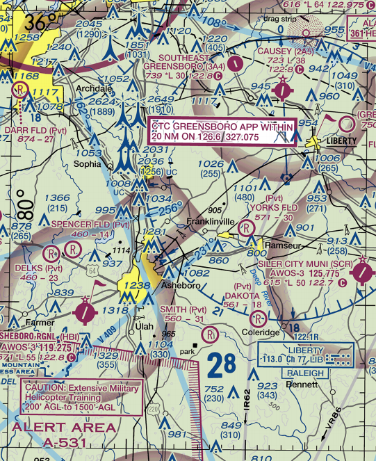
- `image=p012_img01_1baa7bdacfa2.png` `size=541x663` `bbox_area_ratio=0.1476`

## Page 13

`source: cug-complete_20260122.pdf#page=13`

FAA Chart Users’ Guide - VFR Terms and Symbols
MEF - Natural Terrain Feature or Natural Vertical Obstacle
When a natural terrain feature or natural vertical obstacle (e.g. a tree) is the highest feature within the quadrangle:
1.	 Determine the elevation of the feature.
2.	 Add the possible vertical error of the source to the above figure (100’ or 1/2 the contour interval when interval on 
source exceeds 200’).
3.	 Add a 200’ allowance for uncharted natural or 
manmade obstacles. Chart specifications don’t 
require the portrayal of obstacles below minimum 
height.
4.	 Round the figure up to the next higher hundred-
foot level.
Example:	
	
	
	
  	
 
Elevation of obstacle top (MSL)     13161
Possible vertical error                       +100
Obstacle Allowance                           +200
equals                                               13461
Raise to the following 100’ level     13500
Maximum Elevation Figure (MEF)  
Pilots should be aware that while the MEF is based on the best information available to the Specialist, the figures are not 
verified by field surveys. Also, users should consult the Aeronautical Information Services website to ensure that your 
chart has the latest MEF data available.
LAND FEATURES - MOUNTAIN PASSES
The Mountain Pass symbol 
 does not indicate 
a recommended route or direction of flight, and pass 
elevation does not indicate a recommended clearance 
altitude. Hazardous flight conditions may exist within 
and near mountain passes. For high-traffic mountain 
passes, VFR Checkpoints may be provided to increase 
situational awareness by indicating key landmarks inside 
confined terrain. A collocated VFR Waypoint and Check­
point may be provided to assist with identifying natural 
entry points for commonly flown mountain passes.
13

### Images

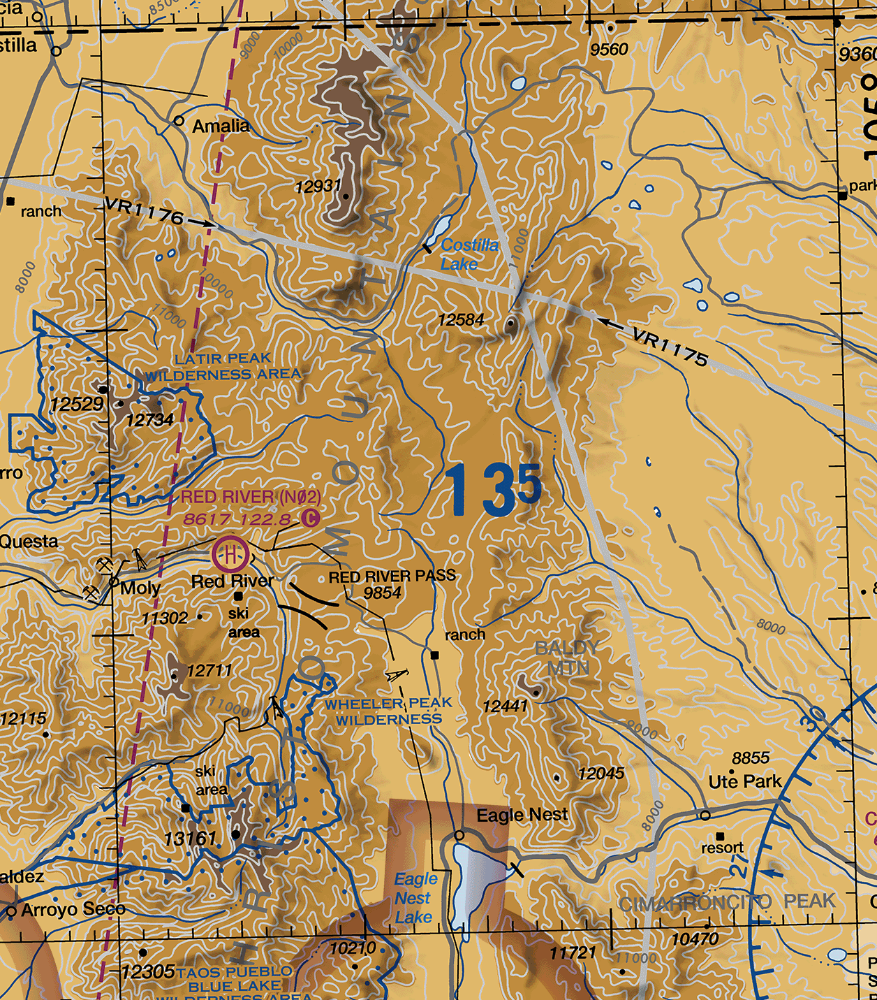
- `image=p013_img01_a4615aa51348.png` `size=1256x1431` `bbox_area_ratio=0.1919`

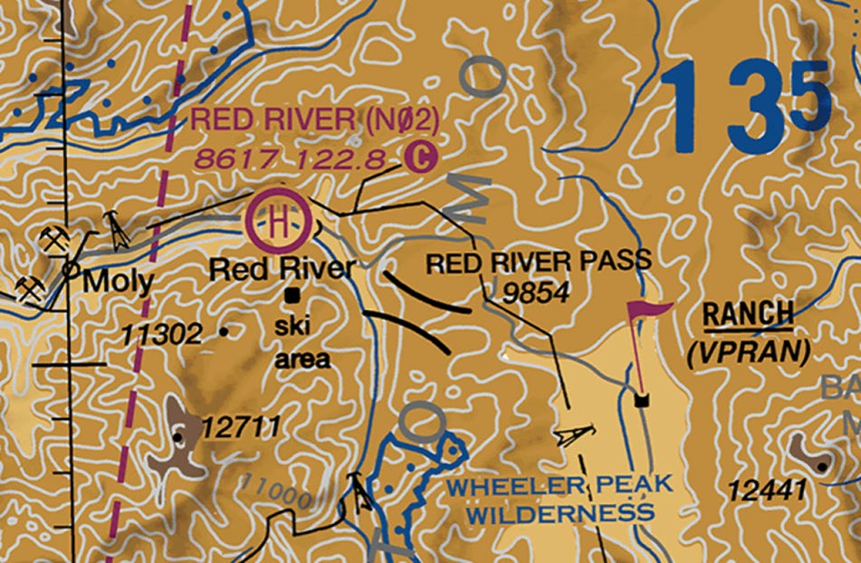
- `image=p013_img02_515dba6f6554.jpeg` `size=951x622` `bbox_area_ratio=0.1031`

## Page 14

`source: cug-complete_20260122.pdf#page=14`

RADIO AIDS TO NAVIGATION
On VFR Charts, information about radio aids to navigation (NAVAID) are boxed, as illustrated. Duplication of data is 
avoided. When two or more radio aids in a general area have the
 
same name with different frequencies, Tactical Air Navigation 
(TACAN) channel numbers, or identification letters, and no 
misinterpretation can result, the name of the radio aid may be 
indicated only once within the identification box. Very High 
Frequency/Ultra High Frequency (VHF/UHF) NAVAID names 
and identification boxes (shown in blue) take precedence. Only 
those items that differ (e.g., frequency, Morse Code) are repeated in the box in the appropriate color. The choice of 
separate or combined boxes is made in each case on the basis of economy of space and clear identification of the radio 
aids.
A NAVAID that is physically located on an airport may not always be represented as a 
 
typical NAVAID symbol. A small open circle indicates the NAVAID location when 
collocated with an airport icon.
The type of NAVAID will be identified by: "VOR," (VHF Omni-Directional Range) 
"VORTAC" (VOR Tactical Aircraft Control), "VOR-DME," (VOR-Distance Measuring 
Equipment) or “DME” (Distance Measuring Equipment) positioned on and breaking 
the top line of the NAVAID box.
DMEs are shown without the compass rose. 
AIRPORTS
Airports in the following categories are charted as indicated (additional symbols are shown later in this Section).
Public use airports:
     Hard-surfaced runways greater than 8069’ or some multiple runways less than 8069’
    Hard-surfaced runways 1500’ to 8069’
 
     Other than hard-surfaced runways
 
      Seaplane bases
Military airports:
    Other than hard-surfaced runways
Foreign airports:
  
Hard-surfaced runways are depicted the same as public-use airports.
U.S. military airports are identified by abbreviations such as AAF (Army Air Field), AFB (Air Force Base), MCAS (Marine 
Corps Air Station), NAS (Naval Air Station), NAV (Naval Air Facility), and NAAS (Naval Auxiliary Air Station).
Fuel Available:
Fuel availability indicated by use of tick marks around the basic airport symbol. Consult Chart Supplement for 
details and availability.  
Other airports with or without fuel:
14
FAA Chart Users’ Guide - VFR Terms and Symbols

## Page 15

`source: cug-complete_20260122.pdf#page=15`

FAA Chart Users’ Guide - VFR Terms and Symbols
Airports are plotted in their true geographic position unless the symbol conflicts with a NAVAID at the same location. In 
such cases, the airport symbol will be displaced, but the relationship between the airport and the NAVAID will be retained. 
When a waypoint is collocated with a towered airport, the waypoint symbol will not be charted and the waypoint name 
followed by (WP) will be shown leadered to the waypoint true location. When depicting a seaplane base, the eye of the 
anchor symbol will be charted as close to the docking area as possible, with the remainder of the symbol in the water.
Airports are identified by their official FAA designated name. 	
	
	
	
   
UNICOM
 
The elevation of an airport is the highest point on the usable portion of the landing areas. 
Runway length is the length of the longest active runway, including displaced thresholds 
and excluding overruns. Runway length is shown to the nearest 100', using 70 as the 
rounding point; a runway 8070' in length is charted as 81, while a runway 8069' in length is 
charted as 80. If an airport has waterways, it will be indicated by a seaplane base symbol 
and additional elevation, lighting, and length information under primary airport information.
Flight Service Station on field
Elevation in feet
Airports where fixed wing special VFR 
operations are prohibited (shown above 
airport name) FAR 91
Lighting in operation Sunset to Sunrise
Indicates FAR 93 Special Air Traffic 
Rules and Airport Traffic Pattern
Lighting limitations exist; refer to Chart Supple­
ment
Location Identifier
Length of longest runway in hundreds of feet; 
usable length may be less
ICAO Location Identifier
Aeronautical advisory station
Control Tower (CT) - primary frequency
Runways with Right Traffic Patterns (public use)
Star indicates operation part-time. See 
tower frequencies tabulation for hours of 
operation
See Chart Supplement
Follows the Common Traffic Advisory 
Frequency (CTAF)
VFR Advisory Service Shown when ATIS is 
not available and frequency is other than the 
primary CT frequency
Automatic Terminal Information Services
Weather Camera (Alaska)
Automatic Flight Information Service
Airport of Entry
Automated Surface Weather Observing 
Systems; shown when full-time ATIS is 
not available
When information is lacking, the respective 
character is replaced by a dash. Lighting codes 
refer to runway edge lights and may not repre­
sent the longest runway or full length lighting.
Airports with Control Towers (CT) and their related data are shown in blue. All other airports and their related data are 
shown in magenta. The  symbol indicates that runway lights are on from dusk to dawn. 
 indicates that the pilot must 
consult the Chart Supplement to determine runway lighting limitations, such as: available on request (by radio-call, letter, 
phone, etc), part-time lighting, or pilot/airport controlled lighting. Lighting codes refer to runway edge lights. The lighted 
runway may not be the longest runway available, and lights may not be illuminated along the full length of the runway. The 
Chart Supplement has a detailed description of airport and air navigation lighting aids for each airport. A dash represents 
no runway edge lights.
The symbol  
 indicates the existence of a rotating or flashing airport beacon operating from dusk to dawn. The Aeronau­
tical Information Manual (AIM) thoroughly explains the types and uses of airport lighting aids.
15

## Page 16

`source: cug-complete_20260122.pdf#page=16`

Right traffic information is shown using the abbreviation 'RP' for right pattern, followed by the appropriate runway 
number(s) (RP 18). Special conditions or restrictions to the right pattern are indicated by the use of an asterisk (*RP) to 
direct the pilot to the Chart Supplement for special instructions and/or restrictions.
The type “OBJECTIONABLE” associated with an airport symbol indicates that an objectionable airspace determination 
has been made for the airport per FAA JO 7400.2 Section 4, Airport Charting and Publication of Airport Data. Objection­
able airspace determinations are based upon a number of factors including conflicting traffic patterns with another airport, 
hazardous runway conditions, or natural or man-made obstacles in close proximity to the landing area. FAA Regional 
Airports Offices are responsible for airspace determinations. Address any challenges to objectionable airspace determina­
tions to your FAA Regional Airports Office.
AIRSPACE
CONTROLLED AIRSPACE
Controlled airspace consists of those areas where some or all aircraft may be subject to air traffic control, such as: Class 
A, Class B, Class C, Class D, Class E Surface (SFC) and Class E Airspace.
Class A Airspace within the United States extends from 18,000' up to FL600. While visual charts do not depict Class A, it 
is important to note its existence.
Class B Airspace is shown on the Sectional Aeronautical Chart (Sectional) and Terminal Area Chart (TAC).  
The MSL ceiling and floor altitudes of each sector are shown in solid blue figures with the last two zeros 
omitted. Floors extending "upward from above" a certain altitude are preceded by a (+). Operations at and below these 
altitudes are outside of Class B Airspace. Radials and arcs used to define Class B are prominently shown on TACs. 
Detailed rules and requirements associated with the particular Class B are shown. The name by which the Class B is 
shown as 
 for example.
Class C Airspace is shown on Sectionals and TACs. The MSL ceiling and floor altitudes of each sector are  
shown in solid magenta figures with the last two zeros eliminated.
A ceiling value of “T” indicates the ceiling is to, but not including, the floor of the overlying Class B airspace. 
Surface.
Class C Airspace is identified by name: 
Separate notes, enclosed in magenta boxes, give the approach control frequencies to be used by arriving VFR aircraft to 
establish two-way radio communication before entering the Class C (generally within 20 NM): 
Class C operating less than continuous is indicated by the following note: 
Class D Airspace is identified with a blue dashed line. Class D operating less than continuous is indicated by the follow­
ing note:  
Ceilings of Class D are shown as follows: 
A minus in front of the figure is used to indicate "from surface to, but not including..."
16
FAA Chart Users Guide - VFR Terms and Symbols

## Page 17

`source: cug-complete_20260122.pdf#page=17`

FAA Chart Users’ Guide - VFR Terms and Symbols
Class E Surface (SFC) Airspace is symbolized with a magenta dashed line. Class E (SFC) operating less than continu­
ous is indicated by the following note:  
Class E Airspace exists at 1200' AGL unless designated otherwise. The lateral and vertical 
  
limits of all Class E, (up to, but not including 18,000') are shown by narrow bands of vignette 
on Sectionals and TACs.
Controlled airspace floors of 700' above the ground are defined by a magenta vignette; 
floors other than 700' that laterally abut uncontrolled airspace (Class G) are defined by a 
blue vignette; differing floors greater than 700' above the ground are annotated by a symbol 
and a number indicating the floor. 
  
If the ceiling is less than 18,000' MSL, the value (preceded by the word "ceiling") is shown along the limits of the controlled 
airspace. These limits are shown with the same symbol indicated above.
UNCONTROLLED AIRSPACE
Class G Airspace within the United States extends up to 14,500' Mean Sea Level. At and above this altitude is Class E, 
excluding the airspace less than 1500' above the terrain and certain special use airspace areas.
SPECIAL USE AIRSPACE
Special Use Airspace (SUA) confines certain flight activities and re­
stricts entry, or cautions other aircraft operating within specific boundar­
ies. Except for Controlled Firing Areas, SUA areas are depicted on VFR 
Charts. Controlled Firing Areas are not charted because their activities 
are suspended immediately when spotter aircraft, radar, or ground 
lookout positions indicate an aircraft might be approaching the area. 
Nonparticipating aircraft are not required to change their flight paths. 
SUA areas are shown in their entirety (within the limits of the chart), 
even when they overlap, adjoin, or when an area is designated within 
another area. The areas are identified by type and identifying name/
number, and are positioned either within or immediately adjacent to the 
area.
* Alert Areas do not extend into Class A, B, C and D airspace, or Class E airport surface areas. 
OTHER AIRSPACE AREAS
Mode C Required Airspace (from the surface to 10,000' MSL) within a 30 NM radius of the primary airport(s) for which a 
Class B is designated, is depicted by a solid magenta line.
MO
DE
 C
 & 
AD
S-
B 
OU
T
30
 N
M
Mode C is required, but not depicted for operations within and above all Class C up to 10,000' MSL. 
Enroute Mode C requirements (at and above 10,000' MSL except in airspace at and below 2500' AGL) are not depicted. 
See FAR 91.215 and the AIM.
FAR 93 Airports and heliports under Federal Aviation Regulation 93 (FAR 93), (Special Air Traffic  Rules and
 
Airport Traffic Patterns), are shown by "boxing" the airport name.
FAR 91 Airports where fixed wing special visual flight rules operations are prohibited (FAR 91) are shown 
with the type "NO SVFR" above the airport name. 
Miscellaneous Activity Areas are indicated with the symbols illustrated on p. 31. The charting of a symbol in the area 
of an airport indicates both miscellaneous activity and regular air operations may be present at these locations. Due to 
the wide range of hazards associated with these areas, pilots are expected to check NOTAMs prior to flight for additional 
information regarding the airspace.
17

### Images

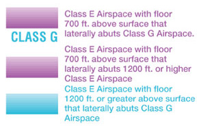
- `image=p017_img01_8f8c585019c5.jpeg` `size=294x187` `bbox_area_ratio=0.021`

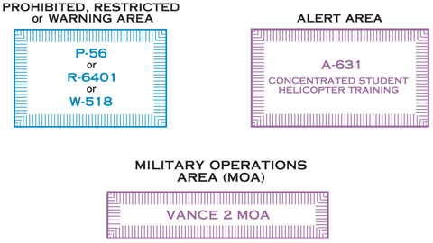
- `image=p017_img02_6394bff75b8a.jpeg` `size=480x270` `bbox_area_ratio=0.0426`

## Page 18

`source: cug-complete_20260122.pdf#page=18`

National Security Areas indicated with a broken magenta line 
 and Special Flight Rules Areas (SFRAs) in­
dicated with the following symbol: 
, consist of airspace with defined vertical and lateral dimensions estab­
lished at locations where there is a requirement for increased security and safety of ground facilities. Pilots should avoid 
flying through these depicted areas. When necessary, flight may be temporarily prohibited.
The Washington DC Flight Restricted Zone (FRZ) is related to National Security. It is depicted using the Prohibited/
Restricted/Warning Area symbology 
 and is located within the SFRA. It is defined as the airspace within 
approximately a 13 to 15 NM radius of the DCA VOR-DME. Additional requirements are levied upon aviators requesting 
access to operate inside the National Capital Region.
Temporary Flight Restriction (TFR) Areas Relating to National Security are indicated with a broken blue line 
. A Temporary Flight Restriction (TFR) is a type of Notice to Airmen (NOTAM). A TFR defines an area where 
air travel is restricted due to a hazardous condition, a special event, or a general warning for the entire airspace. The text 
of the actual TFR contains the fine points of the restriction. It is important to note that only TFRs relating to National Secu­
rity are charted.
Air Defense Identification Zones (ADIZs) are symbolized using the ADIZ symbol: 
. As defined in Code of 
Federal Regulations 14 (CFR 14) Part 99, an ADIZ is an area in which the ready identification, location, and control of all 
aircraft is required in the interest of national security. ADIZ boundaries include Alaska, Hawaii, Guam and the Contiguous 
U.S.
National Defense Airspace Temporary Flight Restriction (TFR) Areas are bounded with cross hatching: 
. These areas include airspace that is subject to routine TFRs published as NOTAMs that have a 12+ 
month duration.
Terminal Radar Service Areas (TRSAs) are shown in their entirety, symbolized by a screened black outline of the entire 
area including the various sectors within the area 
.
The outer limit of the entire Terminal Radar Service Areas (TRSA) is a continuous screened black line. The various sec­
tors within the TRSA are symbolized by narrower screened black lines.
Each sector altitude is identified in solid black color by the MSL ceiling and floor values of the respective sector, elimi­
nating the last two zeros. A leader line is used when the altitude values must be positioned outside the respective sec­
tors because of charting space limitations. The TRSA name is shown near the north position of the TRSA as follows: 
. Associated frequencies are listed in a table on the chart border.
Military Training Routes (MTRs) are shown on Sectionals and TACs. They are identified by the route designator:  
. Route designators are shown in solid black on the route centerline, positioned along the route for 
continuity. The designator IR or VR is not repeated when two or more routes are established over the same airspace, e.g., 
IR201-205-227. Routes numbered 001 to 099 are shown as IR1 or VR99, eliminating the initial zeros. Direction of flight 
along the route is indicated by small arrowheads adjacent to and in conjunction with each route designator.
The following note appears on Helicopters, Sectionals and TACs except for Hawaiian Islands, which is different.
                                                      
There are IFR (IR) and VFR (VR) routes as follows: 

Route identification:
a. MTRs with no segment above 1500' are identified by four-digit numbers; e.g., VR1007, etc. These routes are 
generally developed to be flown under Visual Flight Rules.
b. MTRs that include one or more segments above 1500' AGL are identified by three or fewer digit numbers; e.g., 
IR21, etc. These routes are developed to be flown, to the maximum extent possible under Instrument Flight Rules.
18
FAA Chart Users Guide - VFR Terms and Symbols

## Page 19

`source: cug-complete_20260122.pdf#page=19`

FAA Chart Users Guide - VFR Terms and Symbols
Route width varies for each MTR and can extend several miles on either side of the charted MTR centerline. Detailed 
route width information is available in the Flight Information Publication (FLIP) AP/1B (a Department of Defense publica­
tion), or through the 56 Day NASR Subscription from the National Flight Data Center (NFDC).
Special Military Activity areas are indicated on Sectionals by an underlying IFR Military Training Route with the lateral 
limits of the route shown by a gray Special Use Airspace symbol. A boxed note accompanies the area. The note contains 
radio frequency and route identifier information to use for obtaining area activity status.
                                                                      
SPECIAL MILITARY ACTIVITY
FOR IR850, IR851, IR852 CTC BANGOR RADIO
ON 122.4 255.4 FOR ACTIVITY STATUS
The following guidance appears in the margin of applicable Sectional Charts.
The chart identifies IFR Military Training Routes and Military Operations Area within which the Department of Defense 
conducts periodic operations involving Unmanned Aircraft Systems. These aircraft may be accompanied by military or 
other aircraft which provide the pilots of the Unmanned Aircraft Systems visual observation information about other 
aircraft operations near them. Status of these routes and areas may be obtained by contacting the FAA/DoD facility on
designated frequencies along the IFR route, referencing the identifier, e.g., IR214 as depicted on this chart. The lateral 
limits of these specified routes are shown by the Special Use Airspace symbol. Altitudes for these route segments are 
also shown.
SPECIAL MILITARY ACTIVITY
FOREIGN AREAS
The data depicted in areas outside the U.S. is skeletonized on all VFR aeronautical charts. Only major airports, NAVAIDs, 
and airways are charted in foreign areas in screened black. Cultural features, hydrographic information and geographic 
relief are depicted in subdued and different shades of gray. A note regarding the expectation of the use of foreign charts 
and flight information publications is depicted along the boundary.
19

### Images

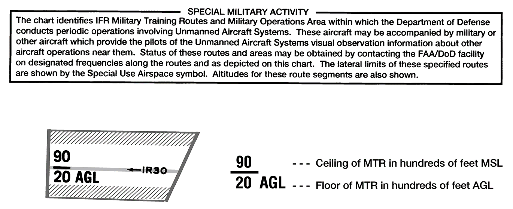
- `image=p019_img01_c0b94e53e1b2.png` `size=1370x559` `bbox_area_ratio=0.1512`

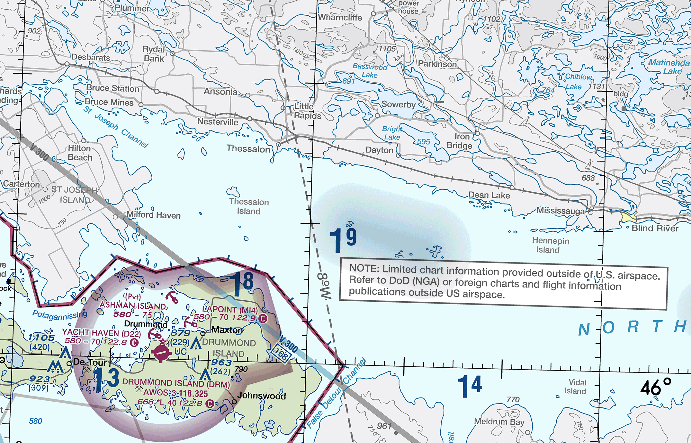
- `image=p019_img02_69a5ec1c0685.png` `size=2150x1382` `bbox_area_ratio=0.1969`

## Page 20

`source: cug-complete_20260122.pdf#page=20`

TERMINAL AREA CHART (TAC) COVERAGE
TAC coverage is shown on appropriate Sectionals by a 1/4" masked line as indicated below. Within this area pilots should 
use TACs, which provide greater detail. A note indicating that the area is on the TAC appears near the masked boundary 
line.
 
 
INSET AND SPECIAL CHART COVERAGE
Inset and Special Chart Coverage (.i.e., Grand Canyon Chart) is shown on appropriate Sectionals by a 1/8" masked line 
as indicated below. A note to this effect appears near the masked boundary line. (Additional examples shown in VFR Sec­
tional and Terminal Charts > Navigational and Procedural Information > Chart Limits.)
 
       
CHART TABULATIONS
Airport Tower Communications are provided in a columnized tabulation for all tower-controlled airports that appear on 
the respective chart. Airport names are listed alphabetically. If the airport is military, the type of airfield, e.g., AAF, AFB, 
NAS, is shown after the airfield name. In addition to the airport name, tower operating hours, primary Very High Fre­
quency/Ultra High Frequency (VHF/UHF) local Control Tower (CT), Ground Control (GND CON), and Automatic Terminal 
Information Service (ATIS) frequencies, when available, will be given. Airport Surveillance Radar (ASR) and/or Precision 
Approach Radar (PAR) procedures are listed when available.
Approach Control Communications are provided in a columnized tabulation listing Class B, Class C, Terminal Radar 
Service Areas (TRSA) and Selected Approach Control Facilities when available. Primary VHF/UHF frequencies are pro­
vided for each facility. Sectorization occurs when more than one frequency exists and/or is approach direction dependent. 
Availability of service hours is also provided.
Special Use Airspace (SUA): Prohibited, Restricted and Warning Areas are presented in blue and listed numerically 
for U.S. and other countries. A tabulation of Alert Areas (listed numerically) and Military Operations Areas (MOA) (listed 
alphabetically) appear on the chart in magenta. All are supplemented with altitude, time of use and the controlling agency/
contact facility, and its frequency when available. Users need to be aware that a NOTAM addressing activation will NOT 
be issued to announce permanently listed times of use. The controlling agency will be shown when the contact facility and 
frequency data is unavailable.
20
FAA Chart Users Guide - VFR Terms and Symbols

### Images

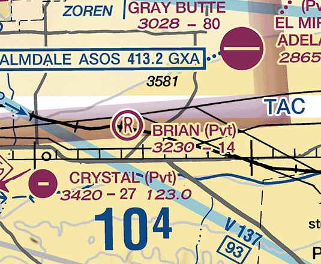
- `image=p020_img01_6519cab10457.png` `size=535x440` `bbox_area_ratio=0.0445`

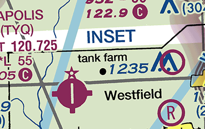
- `image=p020_img02_c7154e312a59.png` `size=403x255` `bbox_area_ratio=0.0251`

## Page 21

`source: cug-complete_20260122.pdf#page=21`

FAA Chart Users Guide - VFR Terms and Symbols
Airport
Name
Hours of 
Operation
(local time)
Frequencies (VHF/UHF)
Runway dependent
Approach
direction
dependent
Radar Instrument
Approach available
Airspace
Name
VHF/UHF
VHF/UHF
{
{
{
{
VHF
UHF{
{
Sectors for
VHF and UHF traffic
local time
Sunrise to Sunset
Frequencies (VHF/UHF)
Radar 
Approach 
Control
{
NOT FOR NAVIGATION
{
21

## Page 22

`source: cug-complete_20260122.pdf#page=22`

FAA Chart Users Guide - VFR Terms and Symbols
22

## Page 23

`source: cug-complete_20260122.pdf#page=23`

VFR SECTIONAL AND TERMINAL AREA CHARTS
GENERAL INFORMATION
The symbols shown in this section illustrate those that appear in the Sectional Aeronautical Charts (Sectionals) and 
Terminal Area Charts (TACs). The same symbology is utilized in VFR Flyway Planning Charts, Helicopter Route Charts 
and Caribbean Aeronautical Charts (CACs), however the scale of the symbols may be different due to the particular chart 
scales. Where symbology is distinctive to a given chart, examples and explanations are given in the additional examples. 
These charts are updated every 56 days.
AIRPORTS
Landplane: Civil                           
Non-Towered
Towered
Airports having control towers (CT) 
are shown in blue, all others are 
shown in magenta. 
All recognizable runways, including 
some that may be closed, are shown 
for visual identification purposes. Fuel 
available.
Runway patterns will be depicted 
at airports with at least one hard 
surfaced runway 1500´ or greater in 
length.
Landplane: Civil-Military                                 
  
Landplane: Military                   Non-Towered
Towered
Refueling and repair facilities not 
indicated.
Heliport                                       Non-Towered
Towered
(Selected)
Foreign                                                       
Foreign Airport Note
NOTE: Airports outside the U.S. Flight Information Region (FIR)
are shown with the standard        symbol.
Only the airport names and ICAO identifiers are shown.
                        
Non-Towered
Towered

Landplane:   
Landmark Value         

Fuel not available
or
Complete information     
is not available.

PUBLIC USE - (Soft surfaced 
runway, or hard surfaced runway 
less than 1500’ in length.) Fuel 
not available.

RESTRICTED OR PRIVATE - 
(Soft surfaced runway, or hard 
surfaced runway less than 1500’ 
in length.) Non-public use having 
landmark value.
23
	
                           
	
	
           

Appropriate note as         
required for hard surfaced 
runways only: “(CLOSED)”
OBJECTIONABLE is an airport 
that has an airspace determina­
tion based upon a number of 
factors including conflicting traffic 
patterns with another airport, 
hazardous runway conditions, or 
natural or man-made obstacles 
in close proximity to the landing 
area. 
UNVERIFIED - A landing area 
available but warranting more 
than ordinary precaution due to: 

(1) lack of current information on 
field conditions, 

and/or

(2) available information indi­
cates peculiar operating limita­
tions.
ABANDONED - Depicted for 
landmark value or to prevent 
confusion with an adjacent us­
able landing area. (Normally at 
least 3000’ paved).
FAA Chart Users’ Guide - VFR Symbology - Sectional and Terminal Charts
  
Ultralight Flight Park                                             
(Selected)

## Page 24

`source: cug-complete_20260122.pdf#page=24`

AIRPORTS (Continued)
Seaplane   
                                                           
Airport Data Grouping
Boxed airport name indicates airport for which a Special Traffic
Rule has been established.
(Pvt): Non-public use having landmark value.
“OBJECTIONABLE”: This airport may adversely affect airspace use.
Facility No Fuel
Facility With Fuel
Non-Towered    Towered
Facility With Runway 
and Waterway
UNICOM
UNICOM
Flight Service Station on field                           

  
Airports where fixed wing special VFR opera­
tions are prohibited (shown above airport 
name) FAR 91

Indicates FAR 93 Special Air Traffic Rules and 
Airport Traffic Pattern

Location Identifier

ICAO Location Identifier

Control Tower (CT) - primary frequency

Star indicates operation part-time. See tower 
frequencies tabulation for hours of operation

Follows the Common Traffic Advisory Fre­
quency (CTAF)

Automatic Terminal Information Services
Automatic Flight Information Service

Automated Surface Weather Observing 
Systems; shown when full-time ATIS is not 
available.
Elevation in feet                                              

Lighting in operation Sunset to Sunrise

Lighting limitations exist; refer to Chart 
Supplement

Length of longest runway in hundreds of 
feet; usable length may be less.

Aeronautical advisory station
Runways with Right Traffic Patterns (public 
use)

See Chart Supplement

VFR Advisory Service Shown when ATIS is 
not available and frequency is other than the 
primary CT frequency.

Weather Camera (Alaska)                    

Airport of Entry
When information is lacking. the respective 
character is replaced by a dash. Lighting 
codes refer to runway edge lights and may 
not represent the longest runway or full 
length lighting.
24
FAA Chart Users’ Guide - VFR Symbology - Sectional and Terminal Area Charts

## Page 25

`source: cug-complete_20260122.pdf#page=25`

RADIO AIDS TO NAVIGATION
VOR
                                  
Operates less than 
contiuous or On-Request
Underline indicates no
voice on this frequency
VORTAC
                                        
When an NDB NAVAID 
shares the same name 
and Morse Code as 
the VOR NAVAID the 
frequency can be col­
located inside the same 
box to conserve space.
VOR-DME
	
                   
Crosshatch indicates 
Shutdown status
DME
                                              
 
	
	
	
           
	
	
	
	
  
DME co-located at an airport
Note: DMEs are shown without the 
compass rose.
Compass Rose 
	
	
      
Compass Rose is “reference”
oriented to magnetic north
Example of VOR 
NAVAID co-located at 
airport
Non-Directional Radio Beacon (NDB)
 	
	
                 
NDB-DME
	
                              
NAVAID Used To Define Class B Airspace
ILS Components
ILS-DME                                 
   
TAC - Shown when used 
in description of Class B 
airspace.
Compass Rosette
	
	
                 
Shown only in areas void of 
VOR roses.
Compass rosette will be 
based on the five year epoch 
magnetic variation model.
25
FAA Chart Users’ Guide - VFR Symbology - Sectional and Terminal Area Charts

## Page 26

`source: cug-complete_20260122.pdf#page=26`

RADIO AIDS TO NAVIGATION (Continued)
Automated Weather Broadcast Services
               	
	
	
      
VHF/UHF
LF/MF
 
Automated Weather Observing System 
(AWOS) / Automated Surface Observing 
System (ASOS).
Flight Service Station (FSS)  
	
	
	
             
  
Heavy line box indicates Flight 
Service Station (FSS). Frequencies 
121.5, 122.2 and 243.0 are avail­
able at many Alaskan FSSs and are 
not shown above boxes. All other 
frequencies are shown. Frequen­
cies transmit and receive except 
those followed by an R. 
R - receive only
Off Airport AWOS/ASOS
	
	
	
       
Broadcast Stations (BS)
	
	
	
       
On request by the proper au­
thority or when a VFR Check­
point
Remote Communications Outlet (RCO)
	
	
       
FSS Radio
providing 
voice 
communications
 
Frequencies above 
thin line box are 
remoted to NAVAID 
site. Other frequen­
cies at FSS providing 
voice communication 
may be available 
determined by altitude 
and terrain. Consult 
Chart Supplement for 
complete information.
Thin line box with­
out frequencies and 
controlling FSS name 
indicates no FSS frequency available.
AIRSPACE INFORMATION
Class B Airspace
Sectional
 
                    
Appropriate notes as required may be shown.
Only the airspace effective below 18,000 feet MSL are shown.
(Mode C see FAR 91.215 / AIM)
Terminal Area Chart (TAC)
                     
All mileages are nautical (NM).
All radials are magnetic.
26
FAA Chart Users’ Guide - VFR Symbology - Sectional and Terminal Area Charts

## Page 27

`source: cug-complete_20260122.pdf#page=27`

AIRSPACE INFORMATION (Continued)
Class C Airspace
	
	
	
   
Appropriate notes as 
required may be shown. 
(Mode C see FAR 91.215/
AIM)
Class E Airspace
The limits of Class E  
airspace shall be 
shown by narrow 
vignettes or by the 
dashed magenta 
symbol. Individual 
units of designated 
airspace are not 
necessarily shown; 
instead, the aggre­
gate lateral and vertical limits shall be defined by the following:
Airspace beginning at the surface designated for airports and 
extension areas.	       
Airspace beginning at 700 feet AGL 
 
that laterally abuts 1200 feet or 
higher Class E Airspace.
Airspace beginning at 700 feet AGL 
that laterally abuts uncontrolled 
(Class G) airspace.
                                                      
Airspace beginning at 1200 feet AGL  
 
that laterally abuts uncontrolled 
(Class G) airspace.
Differentiates floors of airspace greater than 
700 feet above the surface.
When the ceiling is less than 18,000 feet 
MSL, the value prefixed by the word 
“CEILING”, shall be shown along the limits.
Class D Airspace
Altitude in hundreds of      
feet MSL
(A minus in front of the 
figure is used to indicate 
“from surface to but not 
including...”)
Airspace beginning at       
the surface designated for 
airports and extension 
areas.

Airspace beginning at the 
surface with an airspace 
exclusion area where 
Class E airspace is ex­
cluded below 1200’ MSL.
27
FAA Chart Users’ Guide - VFR Symbology - Sectional and Terminal Area Charts

## Page 28

`source: cug-complete_20260122.pdf#page=28`

AIRSPACE INFORMATION (Continued)
Class E Airspace (Continued)
Low Altitude Airways VOR and LF/MF 
(Class E Airspace)
Low altitude Federal Airways are indicated by centerline.
Only the controlled airspace effective below 18,000 feet MSL is 
shown
Miscellaneous Air Routes
Combined Federal Airway/RNAV 2 “T” Routes are identified in 
solid blue type adjacent to the solid magenta federal airway iden­
tification.
The joint route symbol is screened magenta.
Flight Information Regions (FIR) 
	
	
           
MEXICO FIR MMFR
NEW YORK OCEANIC CTA/FIR KZNY
WINNIPEG FIR CZWG
OAKLAND OCEANIC 
CONTROL AREA
MONTERREY CTA SECTOR 3
 
Oceanic Control Areas (OCA)
Control Areas (CTA)
                  
                  
Offshore Control Areas             
 
  
Foreign Airspace Note
 
28
FAA Chart Users’ Guide - VFR Symbology - Sectional and Terminal Area Charts

### Images

- `image=p028_img01_9be17e379af7.png` `size=1409x253` `bbox_area_ratio=0.0248`

## Page 29

`source: cug-complete_20260122.pdf#page=29`

AIRSPACE INFORMATION (Continued)
Special Conservation Areas
National Park, Wildlife    

Refuge, Primitive and
Wilderness Areas, etc.
Special Flight Rules Area (SFRA) Relating to National 
Security
Example: Washington DC  
Appropriate notes as 
required may be shown.
Note: Delimiting line not 
shown when it coincides 
with International 
Boundary, projection lines 
or other linear features.
Temporary Flight Restriction (TFR) Relating to National 
Security
Example: Washington DC  
Appropriate notes as 
required may be shown.
NOAA Regulated National            

Marine Sanctuary 
Designated Areas
    
29
FAA Chart Users’ Guide - VFR Symbology - Sectional and Terminal Area Charts

### Images

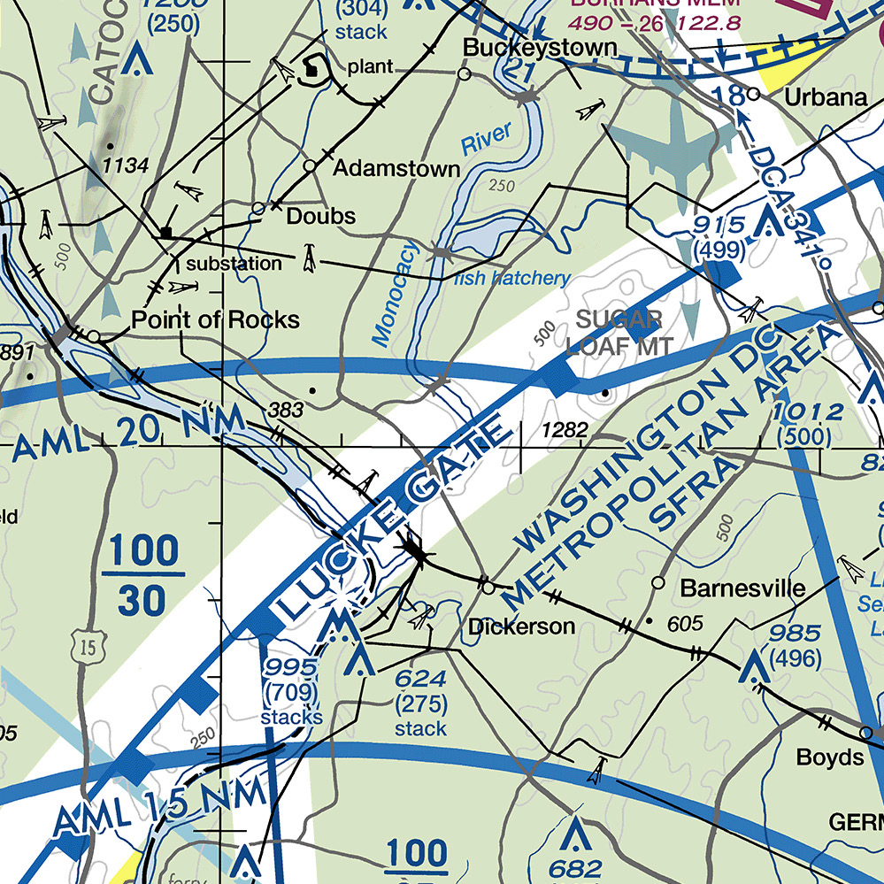
- `image=p029_img01_301e5abe3db7.jpeg` `size=999x999` `bbox_area_ratio=0.1186`

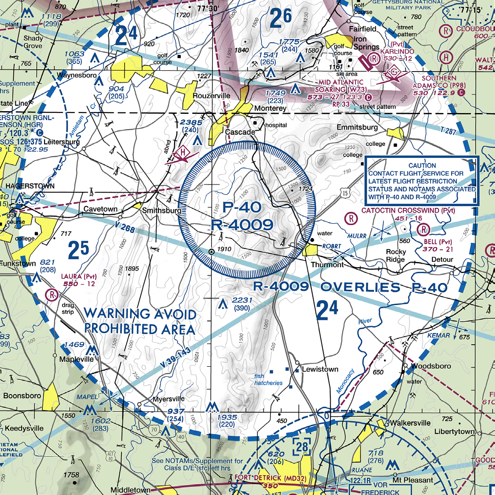
- `image=p029_img02_667baec6189d.png` `size=1100x1100` `bbox_area_ratio=0.1436`

## Page 30

`source: cug-complete_20260122.pdf#page=30`

AIRSPACE INFORMATION (Continued)
Special Flight Rules Area (SFRA)
	
	
                
Special Use Airspace
	
	
	
    
Only the airspace effective 
below 18,000 feet MSL is 
shown.
The type of area shall be 
spelled out in large areas if 
space permits.
* Alert Areas do not extend 
into Class A, B, C and D 
airspace, or Class E airport 
surface areas. 
Special Air Traffic Rules / Airport Patterns (FAR Part 93)
	
	
	
              
Appropriate boxed note as required 
shown adjacent to area.
Inside the FAR Part 93 boundary 
area, the cross hatching is at a 45 
degree angle. The hypsometric tint 
shall be masked within the area 
around the yellow city tint when 
applicable (should not be confused 
with white glacier tint).
Flight Restricted Zone (FRZ) Relating to 
National Security
 	
 	
National Security Area
	
	
           
FOR REASONS OF NATIONAL SECURITY
PILOTS ARE REQUESTED TO AVOID FLIGHT
BELOW 1200' MSL IN THIS AREA
NOTICE
Small Area
Appropriate notes as 
required may be shown
Special Awareness Training Areas
 	
	
	
    
 
Mode C (FAR 91.215)      
	
	
	
   
MO
DE
 C
 & 
AD
S-
B 
OU
T
30
 N
M
Appropriate notes as 
required may be shown.
Air Defense Identification Zone (ADIZ)
	
	
	
     

Note: Delimiting line not 
shown when it coincides with 
International Boundary, 
projection lines or other linear 
features. 
30
FAA Chart Users’ Guide - VFR Symbology - Sectional and Terminal Area Charts

## Page 31

`source: cug-complete_20260122.pdf#page=31`

AIRSPACE INFORMATION (Continued)
High Energy Radiation Areas
                                                         
                                                     
Appropriate notes as required may 
be shown
  
Military Training Routes (MTR)
                                               
  
Special Military Activity Routes (SMAR)
                                                 
SPECIAL MILITARY ACTIVITY
FOR IR850, IR851, IR852 CTC BANGOR RADIO
ON 122.4 255.4 FOR ACTIVITY STATUS
Boxed notes shown adjacent 
to route.
  
IFR Routes
Arrival                                      
Departure
Arrival/Departure
TAC only
  
Special Security Notice Permanent Continuous Flight 
Restriction Areas
	
	
	
           
31
FAA Chart Users’ Guide - VFR Symbology - Sectional and Terminal Area Charts
Sporting Event Temporary Flight Restriction (TFR) 
Sites
	
      	
 	
	
  
National Defense Airspace Temporary Flight Restric­
tion (TFR) Areas 
                                              
                                                  
  
Space Operations Area (FAR Part 91.143)
	
	
	
       
 
  
Miscellaneous Activity Areas	 	
	
   
	
	
	
	
	
  
Aerobatic Practice Area
Glider Operations 
Hang Glider Activity
Ultralight Activity 
Unmanned Aircraft Activity
Parachute Jumping Area with Frequency
Space Launch Activity Area

## Page 32

`source: cug-complete_20260122.pdf#page=32`

AIRSPACE INFORMATION (Continued)
VFR Transition Routes
Appropriate notes as required         

may be shown.
Uni-directional
Bi-directional
Bi-directional with NAVAID Ident 
and Radial
                                       	
	
	
 TAC only
Terminal Radar Service Area (TRSA)        	
	
	
	
	
	
            
	
TRSA Name	
	
           
TRSA Boundaries
TRSA Sectors
Appropriate notes as required 
may be shown.
Examlple: Los Angeles
Example: Harrisburg, PA
NAVIGATIONAL AND PROCEDURAL INFORMATION
Isogonic Line and Value
	
	
	
           
Isogonic lines and values shall 
be based on the five year epoch 
magnetic variation model.
Local Magnetic Notes
	
	
	
             
Unreliability Notes
Intersections 
            	 	
	
          
Named intersections used as 
reporting points. Arrows are 
directed toward facilities that 
establish intersection.
Aeronautical Lights
By Request	
	
	
  
Site
	
	
Rotating or Oscillating
Isolated Location
Rotating Light with Flashing Code 
Identification Light
Rotating Light with Course Lights and 
Site Number
32
FAA Chart Users Guide - VFR Symbology - Sectional and Terminal Area Charts

### Images

- `image=p032_img01_35b0896c35de.png` `size=678x448` `bbox_area_ratio=0.0886`

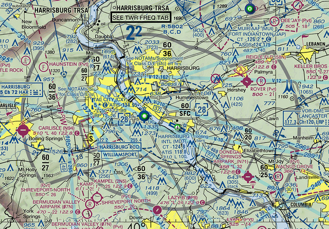
- `image=p032_img02_43a4800f087e.png` `size=640x446` `bbox_area_ratio=0.0935`

## Page 33

`source: cug-complete_20260122.pdf#page=33`

33
FAA Chart Users’ Guide - VFR Symbology - Sectional and Terminal Area Charts
Airport Beacons	
	
	
	
	
        
Rotating or Flashing
Isolated Locations
VFR Checkpoints
	
     	
                  
Underline indicates proper 
name of VFR Checkpoint.
Waypoints	
	
	
	
	
	
     
RNAV	
VFR Stand-Alone
VFR Collocated with Checkpoint
Obstruction
	
	
	
	
             
Above 200’ & below 1000’ AGL 
(above 299’ AGL in urban area)
Under Construction (UC) or reported and 
position/elevation unverified
1000’ and higher (AGL)
Wind Turbine
High-Intensity Obstruction Lights
	
	
	
  	
            
Less than 1000’ (AGL)
1000’ and higher (AGL)
Wind Turbine
Group obstruction
Wind Turbines 
High-intensity lights may operate part-time 
or by proximity activation.
Marine Lights	  
	
   	
	
With Characteristics of Light 	
  	
Red
White
Green
Blue
Orange
Black
Yellow
Sector
Fixed
Single Occulting
Group Occulting
Composite Group Occulting
Isophase
Flashing
Group Flashing
Composite Group Flashing
Quick
Interrupted Quick/Interrupted Quick Flashing
Morse Code
Fixed and Flashing
Alternating
Group
Long Flash
Group Quick Flashing
Very Quick Flashing
Group Very Quick Flashing
Interrupted Very Quick Flashing
Ultra Quick Flashing
Interrupted Ultra Quick Flashing
* Marine Lights are white unless other­
wise noted. Alternating lights are red and white unless 
otherwise noted.
Group Obstruction
	 	
	
	
	
     
Above 200’ & below 1000’ AGL 
(above 299’ AGL in urban area)
1000’ and higher (AGL)
At least two in group
1000’ and higher (AGL)
Wind Turbines
Wind Turbine Farms           
	
	
	
	
      
2894 UC
When highest wind turbine is unverified, 
UC will be shown after MSL value.
Maximum Elevation Figure (MEF)            
	
	
	
	
	
	
(see VFR Terms tab for explanation)
Land Light
NAVIGATIONAL AND PROCEDURAL INFORMATION (Continued)

## Page 34

`source: cug-complete_20260122.pdf#page=34`

Chart Limits
Outline on Sectional of Terminal Area Chart
	
	
	
         
TAC
	
Outline of Special Chart on     
Sectional and Terminal Area 
Chart
Outline on Sectional of Inset Chart
	
	
    	
        
NAVIGATIONAL AND PROCEDURAL INFORMATION (Continued)
CULTURE
Railroads
	
                                           
Single Track
Double Track
More Than Two Tracks
Electric
Non-operating, Abandoned or 
Under Construction	
Roads
     	
	
                             
Dual-Lane Divided Highway 
Category 1
Primary
Category 2
Secondary
Category 2
Trails
	
	
	
	
  
Category 3
Provides symbolization for 
dismantled railroad when combined 
with label “dismantled railroad.”
Railroad Yards	         
Limiting Track To Scale
	
	
     	
              
  
Location Only	
	
	
	
	
	
Railroad Stations     	
         
	
	
	
	
Railroad Sidings and Short Spurs
	
	
	
	
Road Markers
	
	
	
	
Interstate Route No.	
	
U.S. Route No.
Air Marked Identification Label	
Road Names 	 	
	
	
	
	
	
Roads Under Construction
	
	
	
	
34
FAA Chart Users’ Guide - VFR Symbology - Sectional and Terminal Area Charts

## Page 35

`source: cug-complete_20260122.pdf#page=35`

35
FAA Chart Users’ Guide - VFR Symbology - Sectional and Terminal Area Charts
CULTURE (Continued)
Related Features to Railroads and Roads
Bridges and Viaducts
	
	
	
	
Railroad
Causeways	
	
	
Overpasses and Underpasses
	
	
	
	
Tunnels-Road and Railroad
             		
	
	
 
Bridges and Viaducts  
	
	
	
            
Road
Ferries, Ferry Slips and Fords
	
	
	
          
Populated Places	
	
	
	
	
	
	
	
	
	
	
	
	
	
             
Yellow tinted areas indicate populated places. 
Small circle indicates an area too small to depict using 
yellow tint.
Font Style and Size indicate the category of the populated area:
Large Cities Category 1	
	
	
	
	
	
	
	
	

 - population more than 250,000
Cities and Large Towns Category 2
 - population 25,000 to 250,000
Towns and Villages Category 3
 - population less than 25,000

### Images

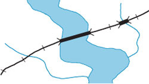
- `image=p035_img01_733a6ccd51d8.jpeg` `size=250x141` `bbox_area_ratio=0.0117`

- `image=p035_img02_a06ac382e745.jpeg` `size=250x121` `bbox_area_ratio=0.0102`

- `image=p035_img03_3744903bc9f1.jpeg` `size=250x131` `bbox_area_ratio=0.0124`

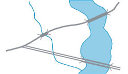
- `image=p035_img04_a15c2dcd51b2.jpeg` `size=250x145` `bbox_area_ratio=0.0118`

## Page 36

`source: cug-complete_20260122.pdf#page=36`

Boundaries
International	
	
	
	
	
      
State or Province	
	
	
	
      
Convention or Mandate Line
	
	
	
	
Miscellaneous Cultural Features
Dams
	
	
	
	
    
Passable Locks
	
	
	
	
     
	
Weirs and Jetties
 	
     	
	
        	
Breakwaters
	
	
	
	
Pipelines
	
	
	
	
         
Underground
	
	
	
	
Landmark Features	
	
	
Mines or Quarries	
	
	
	
	
	
      
Shaft Mines or Quarries
Wells
	
 	
	
	
	
Other than water
Lookout Towers	
	
	
	
   
(Elevation Base of Tower)	
	
	
Aerial Cableways,Conveyors, Etc.
 	
	
	
                      
  
618
Dam Carrying Road
	
	
	
	
	
Small Locks
	
	
	
	
Seawalls
	
	
	
	
Piers, Wharfs, Quays, etc.
	
	
	
	
 
Power Transmission 
and Telecommunication Lines
	
	
	
	
     
Tanks
	
	
	
	
	
Outdoor Theater
	
	
	
	
                 
	
Race Tracks
	
	
	
	
	
    
Coast Guard Station
	
	
	
	
	
    	
     
Landmark Areas
	
	
	
	
      
Time Zones
	
	
	
	
	
	
Date Line
	
	
	
CULTURE (Continued)
36
FAA Chart Users’ Guide - VFR Symbology - Sectional and Terminal Area Charts

## Page 37

`source: cug-complete_20260122.pdf#page=37`

37
FAA Chart Users’ Guide - VFR Symbology - Sectional and Terminal Area Charts
HYDROGRAPHY
Open Water
	
	
	
	
  
Open/Inland Water
	
	
	
	
  
Lakes
	
	
	
	
Label as required.
  
Perennial
	
	
	
         
When too numerous to show 
individual lakes, show 
representative pattern and 
descriptive note. Number 
indicates elevation.
  
Non-Perennial
	
	
	
	
              
(dry, intermittent, etc.) Illustration
includes small perennial lake.
  
Reservoirs
	
	
	
                 
Natural Shorelines
Man-made Shorelines	
	
        
Label when necessary for   
clarity
Too small to show to scale		
	
     
Under Construction	
       
Inland Water
	
	
	
	
  
Shorelines
	
	
	
	
Definite
 
 
	
	
	
	
Fluctuating
 
 
	
	
	
	
Unsurveyed 
Indefinite
 
	
	
	
	
Man-made

## Page 38

`source: cug-complete_20260122.pdf#page=38`

HYDROGRAPHY (Continued)
Streams	
	
	
Perennial	
	
   
Non-Perennial	
	
   
Fanned Out 
Alluvial fan	
	
	
           
   
Braided	 	
	
	
            
Disappearing	
	
	
	
     
Seasonally Fluctuating	
	
         

with undefined limits	
	
      
with maximum bank limits, 	
         
prominent and constant	
	
       
Sand Deposits in and along 	
	
riverbeds	
	
	
           
  
Wet Sand Areas	
	
 
	
	
	
	
	
Within and adjacent to desert areas
  
	
 
Canals	
	
	
	
	
To Scale		
	
	
Abandoned or Under Construction	
Abandoned to Scale	
	
  
Small Canals and Drainage / Irrigation Ditches
Perennial	
	
	
Non-Perennial	
	
	
Abandoned or Ancient	
	
Numerous	
	
	
Representative pattern and/or 	
descriptive note.
  
Aqueducts
To Scale		
	
	
Abandoned or Under Construction	
 
Underground	
	
	
Suspended or Elevated	
	
Tunnels	 	
	
	
Kanats	 	
	
	
Underground with Air Vents
38
FAA Chart Users’ Guide - VFR Symbology - Sectional and Terminal Area Charts

## Page 39

`source: cug-complete_20260122.pdf#page=39`

39
39
FAA Chart Users’ Guide - VFR Symbology - Sectional and Terminal Area Charts
HYDROGRAPHY (Continued)
Falls	
	
	
	
	
Double-Line 	
	
	
	
Single-Line	
	
	
              
  
Rapids
	
	
	
	
Double-Line 	
	
	
Single-Line	
	
	
  
Salt Evaporators and Salt Pans Man Exploited	
	
	
	
	
	
	
 
  
Hummocks and Ridges
	
	
	
	
  
Peat Bogs	
	
	
	
	
	
	
  
Rice Paddies
	
	
	
              
Extensive areas indicated 
by label only.
  
Springs, Wells and Waterholes
	
	
	
	
	
   
 
Swamps, Marshes and Bogs
	
	
	
 	
  
Mangrove And Nipa
	
	
	
	
  
Cranberry Bogs
	
	
	
	
  
 Land Subject To Inundation
	
	
	
	
 
  
Reefs-Rocky or Coral
	
	
	
	
  
coral
	
  
Fish Ponds and Hatcheries
	
	
	
        
  
Miscellaneous Underwater Features Not Otherwise 
Symbolized
	
	
 	
   	
  
  
Wrecks
	
	
	
	
	
    
Exposed
 
  
Rocks-Isolated
	
	
	
	
	
      
Bare or Awash	
	
	
  
Tundra

## Page 40

`source: cug-complete_20260122.pdf#page=40`

HYDROGRAPHY (Continued)
Permanent Snow and Ice Areas
Glaciers
	
	
	
	
   
Glacial Moraines
	
	
	
	
  
Ice Cliffs
	
	
	
	
   
Snowfields, Ice Fields And Ice Caps 
	
	
	
              
Foreshore Flats
	
	
	
	
  
Tidal flats exposed at low tide.
RELIEF
Contours	
	
	
	
 
Basic 
Approximate
 
Intermediate	
	
	
	
 
 
	
	
	
 
Auxiliary
Ice	
	
            
Permanent 
Polar Ice
 
 
 
Pack Ice
Ice Peaks
	
	
	
	
          
  
Depression	
	
	
	

(Illustration includes mound 
within depression)
Values
40
FAA Chart Users’ Guide - VFR Symbology - Sectional and Terminal Area Charts

## Page 41

`source: cug-complete_20260122.pdf#page=41`

41
FAA Chart Users’ Guide - VFR Symbology - Sectional and Terminal Area Charts
RELIEF (Continued)
Sand or Gravel Areas
	
	
	
	
	
  
Sand Dunes	
	
	
           
To Scale
  
Hachuring	
	
	
          
  
Spot Elevations
	
	
	
	
	
      
Position Accurate
Position Accurate, Elevation Approximate
Highest in General Area
Highest on Chart
  
Mountain Pass  
	
	
	
	
	
         
  
 	
Distorted Surface Areas
	
	
	
	
	
  
Lava Flows
	
	
	
	
	
  
Sand Ridges
	
	
	
	
	
To Scale
Shaded Relief
	
	
	
	
	
  
Quarries To Scale
	
	
	
	
	
  
Craters	
	
	
             
  
Unsurveyed Areas
	
	
	
	
              
Label appropriately as required
  
	
Levees And Eskers
	
	
	
	
        
  
Rock Strata Outcrop
	
	
	
	
         
  
Strip Mines, Mine Dumps And Tailings
	
	
	
             
To Scale
  
Escarpments, Bluffs, Cliffs, Depressions, Etc.
 

  
Uncontoured Areas
	
	
	
	
     
RELIEF DATA INCOMPLETE
Label appropriately as required

### Images

- `image=p041_img01_98c6185bb2dc.jpeg` `size=230x138` `bbox_area_ratio=0.0085`

## Page 42

`source: cug-complete_20260122.pdf#page=42`

42
FAA Chart Users’ Guide - VFR Symbology - Sectional and Terminal Area Charts

## Page 43

`source: cug-complete_20260122.pdf#page=43`

VFR FLYWAY PLANNING CHARTS
GENERAL INFORMATION
VFR Flyway Planning Charts are printed on the reverse sides of the Baltimore-Washington, Charlotte, Chicago, Cincin­
nati, Dallas-Ft. Worth, Denver, Detroit, Houston, Las Vegas, Los Angeles, Miami, Orlando, New Orleans, Phoenix, St. Lou­
is, Salt Lake City, San Diego, San Francisco, Seattle, and Tampa Terminal Area Charts (TACs). The scale is 1:250,000, 
with area of coverage the same as the associated TACs. Flyway Planning Charts depict flight paths and altitudes recom­
mended for use to by-pass areas heavily traversed by large turbine-powered aircraft. Ground references on these charts 
provide a guide for visual orientation. VFR Flyway Planning charts are designed for use in conjunction with TACs and are 
not to be used for navigation. These charts are updated every 56 days.
AIRPORTS
Landplane
No distinction is made      	 	

between airports with fuel and 
those without fuel. Runways 
may be exaggerated to clearly 
portray the pattern. Hard-
surfaced runways that are 
closed but still exist are	
          
included in the charted pattern.
FAR 91 - Fixed wing special 
VFR operations prohibited.
(Pvt): Non-public use having            
 landmark value. 
“OBJECTIONABLE”: This 	              
airport may adversely affect 
airspace use.
RADIO AIDS TO NAVIGATION
VHF Omni-Directional Radio
Range (VOR)	                       
VORTAC
	
	
	
         
VOR-DME
	
	
	
        
 
DME	
	
                  
	
	
	
	
        
Example: DME co-located at an airport.
Landplane (continued)
ABANDONED - Depicted for	
landmark value or to prevent 
confusion with an adjacent 
usable landing area. Only 
portrayed beneath or close to 
the VFR flyway routes or 
requested by the FAA.
(Normally at least 3000’ paved).
FOREIGN
Foreign Airport Note
NOTE: Airports outside the U.S. Flight Information Region (FIR)
are shown with the standard        symbol.
Only the airport names and ICAO identifiers are shown.
Non-Directional Radio Beacon
(NDB)	 	
	
	
NDB-DME
	
	
	
	
NAVAIDS Used to Define Class Airspace
	
	
	
 
	
	
	
43
FAA Chart Users’ Guide - VFR  Chart Symbology - Flyway Planning Chars

## Page 44

`source: cug-complete_20260122.pdf#page=44`

AIRSPACE INFORMATION
Class B Airspace
	
	
                 
Appropriate notes as required
may be shown.
(Mode C see 
FAR 91.215/AIM)
All mileages are nautical 
(NM).
All radials are magnetic.
Floors extending “upward and above” a certain altitude are pre­
ceded by a +. Operations at or below these altitudes are outside 
of the Class B Airspace.)
Class D Airspace            
	
	
	
        
(A minus sign in front of the 
figure used to indicate “from 
surface to but not including...”)
	
	
    
ALTITUDE IN HUNDREDS OF FEET MSL.
Special Airspace Areas
Special Flight Rules Area (SFRA)
Relating to National Security
Example: Washington DC
Appropriate notes as required may be shown.
Note: Delimiting line not shown when it coincides with Internation­
al Boundary, projection lines or other linear features.
Class C Airspace
	
	
             
Appropriate notes as 
required may be shown.
(Mode C see 
FAR 91.215/AIM)
Class E Surface      
(SFC) Airspace	
    
44
FAA Chart Users’ Guide - VFR Symbology - Flyway Planning Charts

### Images

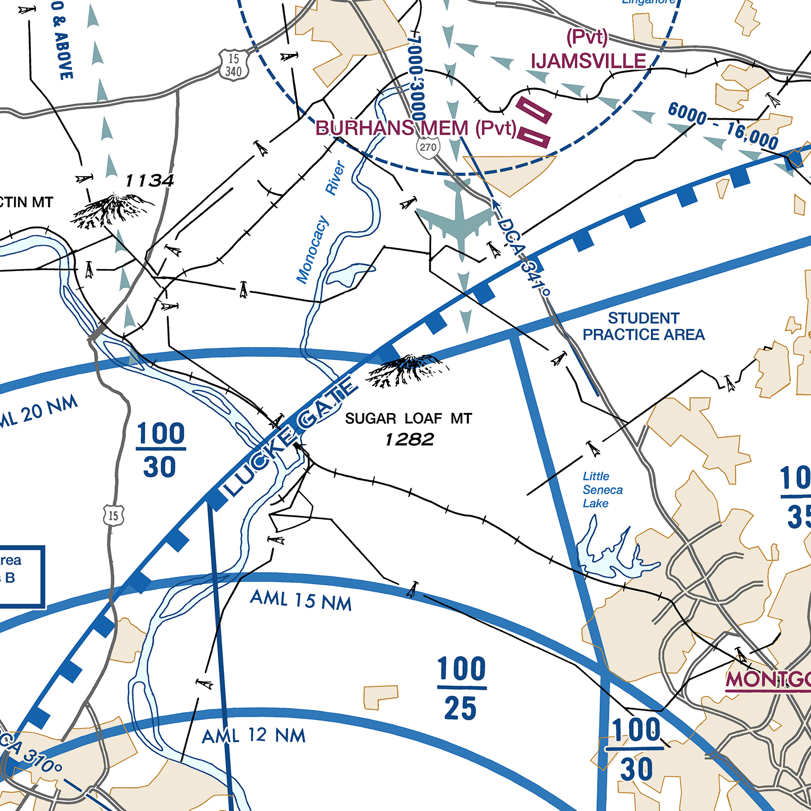
- `image=p044_img01_cbf7e445aa23.png` `size=1565x1565` `bbox_area_ratio=0.1445`

## Page 45

`source: cug-complete_20260122.pdf#page=45`

AIRSPACE INFORMATION (Continued)
Flight Restricted Zone (FRZ) Relating To National Se­
curity
Example: Washington DC
Temporary Flight Restriction (TFR) Relating To 
National Security
Example: Washington DC
Appropriate notes as required may be shown.
Special Use Airspace
 	
	
	
 
Only the airspace effective 
below 18,000 feet MSL is 
shown.
The type of area shall be 
spelled out in large areas if 
space permits.
Air Defense Identification Zone (ADIZ)
	
	
           	  
Note: Delimiting line not 
shown when it coincides 
with International Bound­
ary, projection lines or other 
linear features.
  
Foreign Airspace Note
45
FAA Chart Users’ Guide - VFR  Chart Symbology - Flyway Planning Chars

### Images

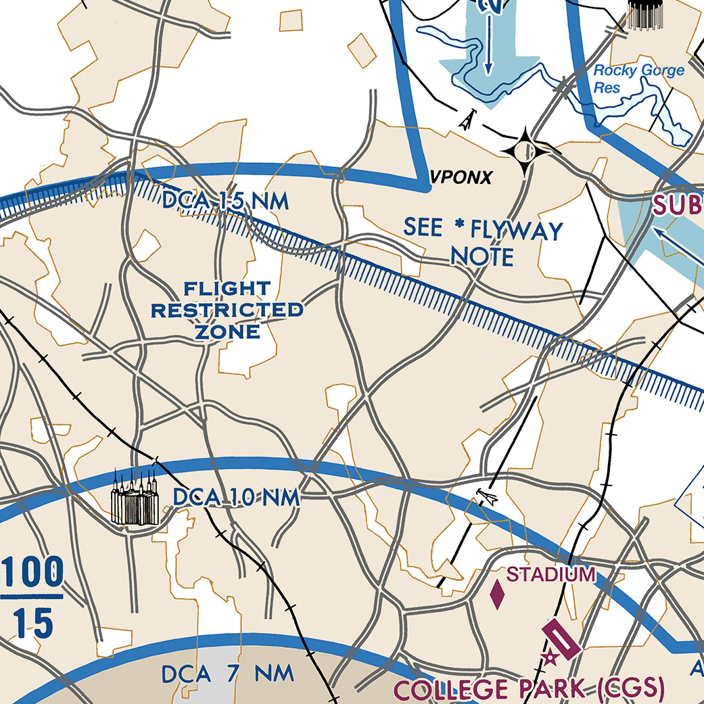
- `image=p045_img01_1128ecbe49c7.jpeg` `size=1041x1041` `bbox_area_ratio=0.1457`

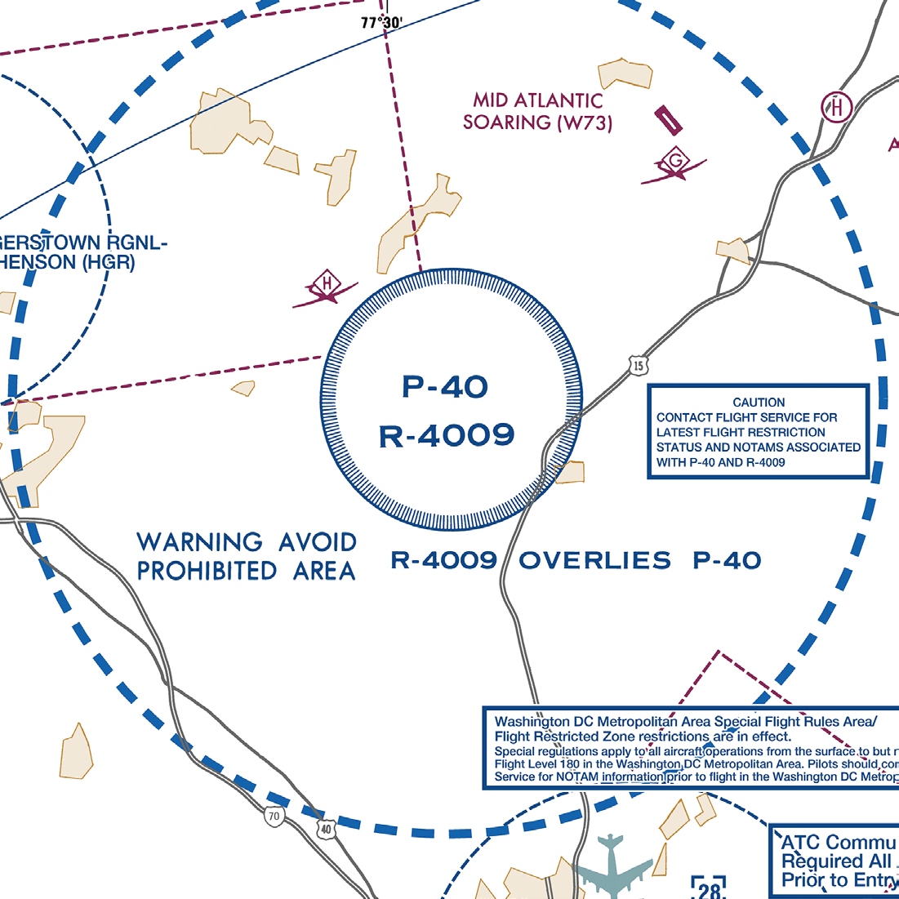
- `image=p045_img02_62f475bc1338.png` `size=1101x1101` `bbox_area_ratio=0.1439`

- `image=p045_img03_9be17e379af7.png` `size=1409x253` `bbox_area_ratio=0.0253`

## Page 46

`source: cug-complete_20260122.pdf#page=46`

AIRSPACE INFORMATION (Continued)
Special Air Traffic Rules/Airport Traffic Areas (FAR Part 
93)
	
	
        	
        
Appropriate boxed note as re­
quired shown adjacent to area. 
Inside the FAR Part 93 bound­
ary area, the cross hatching is 
at a 45 degree angle.
  
Terminal Radar Service Area (TRSA)
	
 	
                 	
     
 
  
IFR Routes
	
	
	
             
Arrival 
Departure 
Arrival/Departure
  
VFR Transition Routes
	
	
	
	
    
Appropriate notes as required 
may be shown.
Uni-directional
Bi-directional
Bi-directional with NAVAID Ident 
and Radial
  
Special Conservation Areas
	
	
	
	
NOAA Regulated National  Marine
Sanctuary Designated Areas
Mode C (FAR 91.215)
	
	
                         
MO
DE
 C
 & 
AD
S-
B 
OU
T
30
 N
M
Appropriate notes as required may 
be shown.
Sporting Event Temporary Flight Restriction (TFR) 
Sites
	
      	
 	
	
	
  
	
National Defense Airspace Temporary Flight Restric­
tion (TFR) Areas
                                               
                                                  
  
Miscellaneous Activity Areas
	
	
	
	
	
 
Aerobatic Practice Area
Glider Operations 
Hang Glider Activity
Ultralight Activity

Unmanned Aircraft Activity
Parachute Jumping Area
with Frequency 
Space Launch Activity Area
  
Example: Los Angeles
  
46
FAA Chart Users’ Guide - VFR Symbology - Flyway Planning Charts

### Images

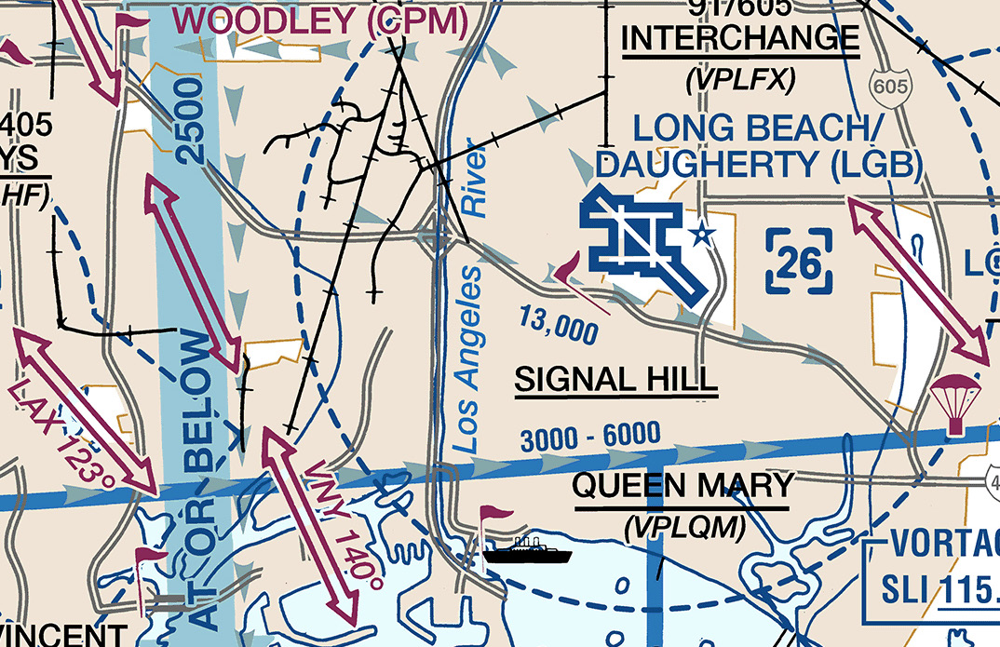
- `image=p046_img01_4220929a6e91.jpeg` `size=1074x695` `bbox_area_ratio=0.0876`

## Page 47

`source: cug-complete_20260122.pdf#page=47`

Suggested VFR Flyway And Altitude
	
	
	
   
  
Military Training Routes (MTR)
	
	
  	
        
    
  
VFR Checkpoints
	
	
	
	
 
Underline indicates proper name of 
VFR Checkpoint
VFR Waypoints
	
	
	
	
	
      
Stand-Alone  
Collocated with VFR Checkpoint
Navigational Data
	
	
	
            
Obstructions
	
	
	
           
Obstacles may be lit or unlit.
Only obstacles greater than 
999’ above ground level (AGL) 
or specified by the local ATC 
Facility shall be shown.
AGL heights are not shown.    
High-intensity lights may 
operate part-time or by 
proximity activation.
Under Construction or reported  
and position/elevation unveri­
fied.
47
AIRSPACE INFORMATION (Continued)
FAA Chart Users’ Guide - VFR  Chart Symbology - Flyway Planning Chars
NAVIGATIONAL AND PROCEDURAL INFORMATION

## Page 48

`source: cug-complete_20260122.pdf#page=48`

CULTURE
Railroads 
	
	
	
	
	
Single and Multiple Tracks
  
Populated Places
	
	
	
	
Built-up Areas 
Towns
  
BOUNDARIES
	
	
	
	
	
International
  
HYDROGRAPHY
Shorelines
	
	
	
	
             
RELIEF
	
	
	
	
	
Spot Elevations	
	
Position Accurate 
Mountain Peaks
Roads
	
	
                	
 
Dual-Lane
Divided Highway Primary
  
Prominent Pictorials
	
	
	
	
	
  
Power Transmission Lines
	
	
	
              
 
  
Landmarks
  
Reservoirs
	
	
	
	
   
Major Lakes and Rivers
	
	
              
 
  
48
FAA Chart Users’ Guide - VFR Symbology - Flyway Planning Charts

## Page 49

`source: cug-complete_20260122.pdf#page=49`

FAA Chart Users’ Guide - VFR  Chart Symbology - Flyway Planning Chars
49

## Page 50

`source: cug-complete_20260122.pdf#page=50`

HELICOPTER ROUTE CHARTS
GENERAL INFORMATION
Helicopter Route Charts are three-color charts that depict current aeronautical information useful to helicopter pilots navigating 
in areas with high concentrations of helicopter activity. Information depicted includes helicopter routes, four classes of heliports 
with associated frequency and lighting capabilities, NAVAIDS, and obstructions. In addition, pictorial symbols, roads, and easily-
identified geographical features are portrayed. The scale is 1:125,000. These charts are updated every 56 days.
Landplane
	
	
	
	
   
All recognizable runways, including
some that may be closed, are shown 
for visual identification.
Public
Private
Unverified
Abandoned
Foreign
Seaplane	
	
	
	
       
Heliport
	
	
	
	
	
      
Heliports public and private
Medical Center
Helipads located at major airports
(when requested)
Ultralight Flight Park 	 	
	
       
Foreign Airport Note
NOTE: Airports outside the U.S. Flight Information Region (FIR)
are shown with the standard        symbol.
Only the airport names and ICAO identifiers are shown.
Airport Data Grouping
Boxed airport name indicates airport for which a Special Traffic 
Rule has been established.
(Pvt): Non-public use having landmark value.
“OBJECTIONABLE”: This airport may adversely affect airspace 
use.
Flight Service Station on field
Airspace where fixed wing special visual flight 
rules operations are prohibited (shown above 
airport name) FAR 91
Indicates FAR 93 Special Air Traffic Rules and 
Airport Traffic
Location Idendtifier
ICAO Location Identifier
Control Tower (CT) - primary frequency
Star indicates operation part-time. See tower 
frequencies tabulation for hours of operation
                          
Automated Terminal 
Information Service
Automated Surface Weather Observing 
Systems (shown when full-time ATIS is not 
available). Some ASOS/AWOS 
facilities may not be located at airports.
Elevation in feet
Lighting in operation Sunset to Sunshine
Lighting limitations exists, refer
 to Chart Supplement
UNICOM - Aeronautical advisory station
Follows the Common Traffic Advisory 
Frequency (CTAF)
Unverified Heliport
Airport of Entry
When lighting is lacking, the respective character is replaced by a dash.
Lighting codes refer to runway edge lights and may not represent the longest runway or full length lighting. Dashes are not shown on 
heliports or helipads unless additional information follows the elevation (e.g. UNICOM, CTAF).
50
AIRPORTS
FAA Chart Users’ Guide - VFR  Chart Symbology - Helicopter Charts

## Page 51

`source: cug-complete_20260122.pdf#page=51`

FAA Chart Users’ Guide - VFR  Chart Symbology - Helicopter Charts
RADIO AIDS TO NAVIGATION
NAVAIDs
VHF Omni-Directional Radio (VOR) Range
	
	
          
Open Circle
Open circle symbol 
shown when NAVAID 
located on airport. Type 
of NAVAID shown in top 
of box.
Compass Rose is 
“reference” oriented to 
magnetic north.
VOR
 	
                      	
     
Operates less than 
contiuous or On-Request
Underline indicates no
voice on this frequency
VORTAC
	
	
	
          
ASOS/AWOS
Frequency
Channel
Identifier
} Morse 
Code
NDB Frequency
When an NDB NAVAID shares 
the same name and Morse Code 
as the VOR NAVAID the frequen­
cy can be collocated inside the 
same box to conserve space.
VOR-DME	
                          
Crosshatch indicates 
Shutdown status
DME
	
	
  	
             
  
Flight Service Station (FSS)
Heavy line box indicates Flight 
Service Station (FSS). Frequen­
cies 121.5, 122.2 and 243.0 are 
available at many Alaskan FSSs 
and are not shown above boxes. 
All other frequencies are shown.
Certain FSSs provide Airport 
Advisory Service, refer to Chart 
Supplement.
R - Receive Only
Non-Directional Radio Beacon (NDB)
	
	
                      
 
NDB-DME
	
	
	
         
NAVAID Used to Define         
Class B Airspace	
	
     
Broadcast Stations (BS)
	
	
	
	
       
On request by the proper authority
or when a VFR Checkpoint.
Remote Communications Outlet (RCO)
Frequencies above thin line box 
are remoted to NAVAID site. 
Other FSS frequencies providing
voice communications may be
available as determined by altitude
and terrain. Consult Chart
Supplement for complete information.
Thin line box without frequencies
and controlling FSS name
indicates no FSS frequency available.
51

## Page 52

`source: cug-complete_20260122.pdf#page=52`

AIRSPACE INFORMATION
Class B Airspace
	
	
                        
Ceiling of Class B in 
hundreds of feet MSL
Floor of Class B in 
hundreds of feet MSL
CLASS B
SURFACE AREA
NAVAID identifier and 
radial from facility
NAVAID identifier and 
distance from facility
Appropriate notes as required 
may be shown. (Mode C see FAR 
91.215/AIM)
All mileages are nautical (NM)
(Floors extending “upward from 
above” a certain altitude are 
preceded by a +. Operations at 
and below these altitudes are 
outside of Class B Airspace.)
All radials are magnetic.
Class D Airspace
	
	
	
	
      
(A minus in front of the figure is used to 
indicate “from surface to but not includ­
ing...”)
Altitudes in hundreds of feet MSL.
Special Airspace Areas
Special Flight Rules Area (SFRA) Relating 
to National Security
	
	
	
               
Example: Washington DC
Appropriate notes as required 
may be shown.
Note: Delimiting line not shown           
when it coincides with International
Boundary, projection lines or other 
linear features.
Class C Airspace
	
	
	
	
Ceiling of Class C in 
hundreds of feet MSL
Floor of Class C in 
hundreds of feet MSL
Ceiling is to but not 
including floor of Class B
Surface
Appropriate notes as required
may be shown. (Mode C see 
FAR 91.215/AIM)
Class E Surface (SFC) Airspace
            		
	
	
 
52
FAA Chart Users’ Guide - VFR  Chart Symbology - Helicopter Charts

### Images

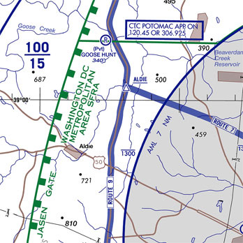
- `image=p052_img01_14866a37ab0a.jpeg` `size=348x348` `bbox_area_ratio=0.1438`

## Page 53

`source: cug-complete_20260122.pdf#page=53`

FAA Chart Users’ Guide - VFR  Chart Symbology - Helicopter Charts
AIRSPACE INFORMATION (Continued)
Special Airspace Areas (Continued)
Flight Restricted Zone (FRZ) Relating to National
Security
	
	
	
	
Air Defense Identification Zone (ADIZ)	
	
	
	
      
Note: Delimiting line not 
shown  when it coincides 
with International Boundary, 
projection lines or other linear 
features.
  
Special Security Notice Permanent Continuous
Flight Restriction Areas
	
	
	
            
 
  
Mode C (FAR 91.215)
	
	
	
	
	
30 N
M
MODE
 C & 
ADS-
B OU
T
Appropriate notes as required
may be shown.
  
Terminal Radar Service Area (TRSA)
 	
	
              
Appropriate notes as 
required 
may be shown.
Example: Washington DC
Special Air Traffic Rules / Airport Traffic Areas
(FAR Part 93)
	
	
	
	
Appropriate boxed notes as 
required shown adjacent to 
area. Inside the FAR Part 93 
boundary area, the cross 
hatching is at a 45 degree 
angle.
  
Sporting Event Temporary Flight Restriction (TFR) 
Sites
	
	
	
	
	
    
  
 
National Defense Airspace Temporary Flight Restric­
tion (TFR) Areas
                                               
                                               
53

### Images

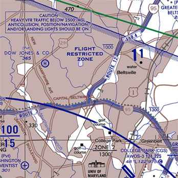
- `image=p053_img01_72fd95fb2765.jpeg` `size=348x348` `bbox_area_ratio=0.1427`

## Page 54

`source: cug-complete_20260122.pdf#page=54`

AIRSPACE INFORMATION (Continued)
Miscellaneous Activity Areas
Aerobatic Practice Area
Glider Operations 
Hang Glider Activity
Ultralight Activity
Unmanned Aircraft Activity
Parachute Jumping Area with Frequency
Space Launch Activity Area
Military Training Routes (MTR)
	
	
	
	
     
Helicopter Routes
	
	
	
	
Primary Route with Route 
Name and Tower Frequency
Secondary Route
Transition Symbol
Reporting Points
	
	
     	
	
  
	 	
Non-compulsory   
Compulsory
Reporting Point Name 
Foreign Airspace Note
Police Zones
Special Use Airspace
	
	
	
Only the airspace effective 
below 18,000 feet MSL is 
shown.
The type of area shall be 
spelled out in large areas if 
space permits.
One-way Route	 	
	
Altitude Changeover Point
Recommended Altitudes
	
	
	
	
	
    
Maximum Altitude
Minimum Altitude
Recommended Altitude
54
FAA Chart Users’ Guide - VFR  Chart Symbology - Helicopter Charts

### Images

- `image=p054_img01_9be17e379af7.png` `size=1409x253` `bbox_area_ratio=0.0253`

## Page 55

`source: cug-complete_20260122.pdf#page=55`

FAA Chart Users’ Guide - VFR  Chart Symbology - Helicopter Charts
Special Conservation Areas
	
	
               	
  
National Park, Wildlife Refuge,         
Primitive and Wilderness Areas, etc.
VFR Checkpoints
	
	
	
	
	
Underline indicates proper 
name of VFR Checkpoint.
Obstruction
Above 299’ and below 1000’ AGL
1000’ and higher AGL
High-Intensity Obstruction Lights
	
	
	
	
   	
  
High-intensity lights may operate	
part-time or by proximity activation.
Navigation Data                   
	
	
	
       
NOAA Regulated National        
Marine Sanctuary Designated
Areas
VFR Waypoints
	
	
	
	
	
Stand-Alone
Collocated with VFR Checkpoint
Collocated with VFR Checkpoint 
& Reporting Point	
Group Obstruction
	
	
	
	
       
Above 299’ and below 1000’ AGL
1000’ and higher AGL
Wind Turbine Farms
	
	
	
	
      
2894 UC
When highest wind turbine is 
unverified, UC will be shown 
after MSL value.
Maximum Elevation Figure (MEF)                
	
	
	
	
	
     
(see VFR Terms tab for explanation)
55
AIRSPACE INFORMATION (Continued)
NAVIGATIONAL AND PROCEDURAL INFORMATION

## Page 56

`source: cug-complete_20260122.pdf#page=56`

Roads	 	
	
	
	
	
	
	
Dual-Lane:
Divided Highways
Major Boulevards & Major Streets
Primary
Boundaries
	
	
	
     
 
International
State or Province
Power Transmission Lines
	
	
	
       
Prominent Pictorials
	
	
	
	
	
Landmarks
	
	
	
       
CULTURE
Railroads
 	
	
	
       
Single Track	
	
Double Track
Bridges
	
	
	
	
Populated Places	
	
	
	
	
Built-up Areas
56
FAA Chart Users’ Guide - VFR  Chart Symbology - Helicopter Charts

## Page 57

`source: cug-complete_20260122.pdf#page=57`

FAA Chart Users’ Guide - VFR  Chart Symbology - Helicopter Charts
57

## Page 58

`source: cug-complete_20260122.pdf#page=58`

58
CARIBBEAN VFR AERONAUTICAL CHARTS (CAC)
The Caribbean Charts are published as two VFR Charts: 
Caribbean 1 (CAC-1) covers Southern Florida, Cuba, 
Haiti and the Bahamas; Caribbean 2 (CAC-2) covers 
Puerto Rico, Haiti, Dominican Republic, the Lesser 
Antilles and Leeward Islands. Charts are updated every 
56-day chart cycle.
Caribbean Charts are designed for VFR flights and 
provide aeronautical and topographic information of the 
Caribbean. The aeronautical information includes 
airports, radio aids to navigation, Class airspace and 
special use airspace in U.S. and major airports, and 
radio aids to navigation in foreign areas. The topographic 
information includes city tint, populated places, principal 
roads, drainage patterns and shaded relief.
The chart symbols used on the 
Caribbean Charts are similar to 
those used in the Sectional and 
Terminal Area Charts, the major 
difference being in scale. The 
Caribbean VFR Chart scale is 
1:1,000,000 versus the Sectional 
Chart Scale of 1:500,000 and 
Terminal Area Chart Scale of 
1:250,000. Chart symbology will 
appear smaller on the Caribbean 
VFR Charts.
Example from Caribbean 2 VFR 
Aeronautical Chart
FAA Chart Users’ Guide - Caribbean VFR Aeronautical Charts (CAC)

### Images

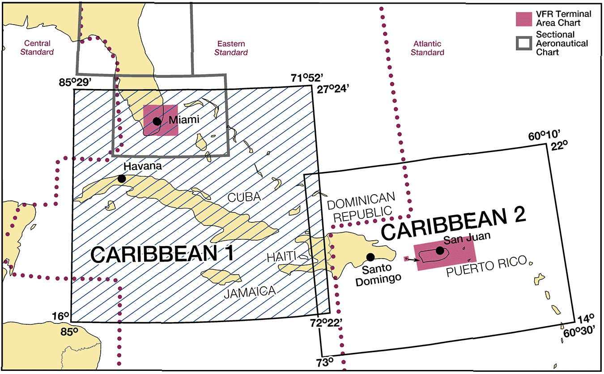
- `image=p058_img01_6fc7c73e1101.png` `size=1350x836` `bbox_area_ratio=0.1021`

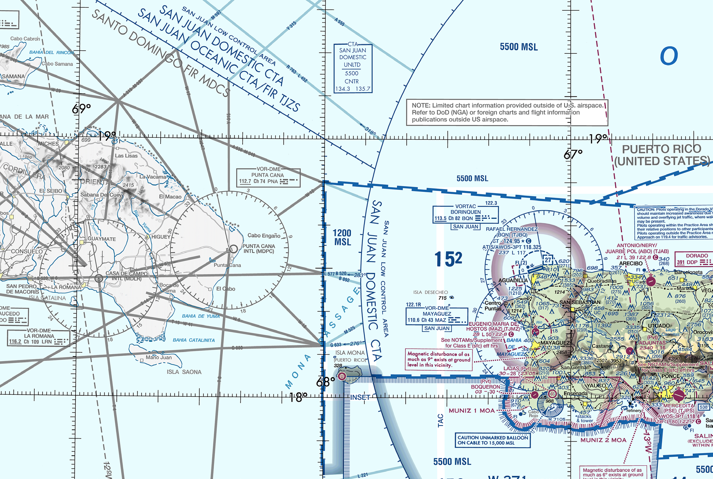
- `image=p058_img02_ca5ed03c1646.png` `size=1869x1256` `bbox_area_ratio=0.2261`

## Page 59

`source: cug-complete_20260122.pdf#page=59`

FAA Chart Users’ Guide - Caribbean VFR Aeronautical Charts (CAC)
59

## Page 60

`source: cug-complete_20260122.pdf#page=60`

U.S. Airspace depiction as shown on Visual Aeronautical Charts
60
AIRSPACE
FAA Chart Users’ Guide -  Airspace

### Images

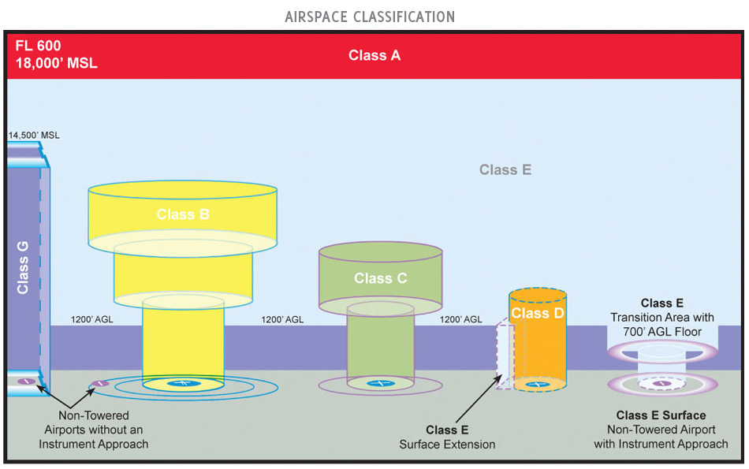
- `image=p060_img01_54fe990905d0.jpeg` `size=950x595` `bbox_area_ratio=0.3708`

## Page 61

`source: cug-complete_20260122.pdf#page=61`

FAA Chart Users’ Guide - Airspace
Excerpt from Detroit Sectional Chart
61
SPORTING
EVENT
TFR SITE
CLASS E
with
SURFACE 
FLOOR
CLASS C
INNER BOUNDARY
CLASS C
OUTER BOUNDARY
SPORTING
EVENT
TFR SITES
CLASS E
AIRSPACE
EXTENSION
with
SURFACE
FLOOR
MODE C
BOUNDARY
CLASS D AIRSPACE
CLASS B
INTERNAL SECTOR
BOUNDARIES
CLASS B
OUTER
BOUNDARY
CLASS E
with
700’ AGL FLOOR
CLASS E
with
700’ AGL FLOOR
{
{
CLASS B
EXTENSIONS
CLASS B
EXTENSION
CLASS E
with
1200’ AGL
FLOOR
CLASS E
with
1200’ AGL
FLOOR
{
CLASS E
with
1200’ AGL
FLOOR

### Images

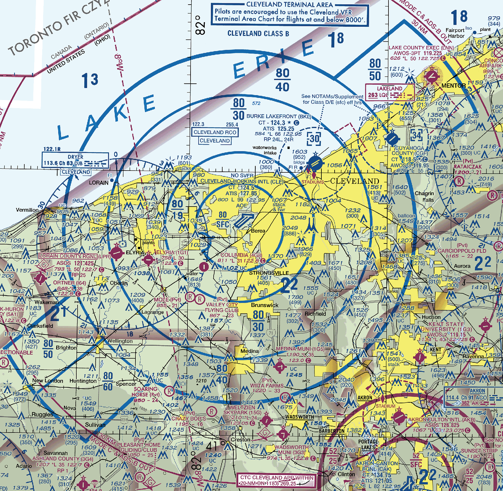
- `image=p061_img01_b6247a1350fc.png` `size=1634x1595` `bbox_area_ratio=0.3096`

## Page 62

`source: cug-complete_20260122.pdf#page=62`

FAA Chart Users’ Guide -  Airspace
62

## Page 63

`source: cug-complete_20260122.pdf#page=63`

EXPLANATION OF IFR ENROUTE TERMS
FAA charts are prepared in accordance with specifications of the Interagency Air Committee (IAC), and are approved by 
representatives of the Federal Aviation Administration and the Department of Defense (DoD). Some information on these 
charts may only apply to military pilots.
The explanations of symbols used on Instrument Flight Rule (IFR) Enroute Charts and examples in this section are based 
primarily on the IFR Enroute Low Altitude Charts. Other IFR products use similar symbols in various colors. The chart leg­
ends portray aeronautical symbols with a brief description of what each symbol depicts. This section provides more details 
of the symbols and how they are used on IFR Enroute charts.
AIRPORTS
Operational airports are shown on IFR Enroute Charts. 
Low Charts:
•	
All IAP Airports are shown on the Low Altitude Charts (US and Alaska).
•	
Non-IAP Airports are shown on the U.S. Low Altitude Charts (Contiguous US) have a minimum hard surface 
runway of 3,000’.
•	
Non-IAP airports are shown on the U.S. Low Altitude Alaska Charts are show if the runway is 3000’ or longer, 
hard or soft surface.
•	
Public heliports with an Instrument Approach Procedure (IAP) or requested by the FAA or DoD are depicted on 
the IFR Enroute Low Altitude Charts.
•	
Seaplane bases requested by the FAA or DoD are depicted on the IFR Enroute Low Altitude Charts.
On IFR Enroute Low Altitude Charts, airport tabulation is provided that identifies airport names, IDs and the panels they 
are located on.
High Charts:
•	
Airports shown on the U.S. High Enroute Charts (Contiguous US) have a minimum hard surface runway of 5000’.
•	
Airports shown on the U.S. High Enroute Alaska Charts have a minimum hard surface runway of 4000’. 
Charted airports are classified according to the following criteria:
LOW/HIGH ALTITUDE
	
	
	
	
	
Blue - Airports with an Instrument Approach Procedure and/or RADAR MINIMA published in the high altitude DoD 
Flight Information Publications (FLIPs) 
Green - Airports that have an approved Instrument Approach Procedure and/or RADAR MINIMA published in 
either the U.S. Terminal Procedures Publications (TPPs) or the DoD FLIPs 
Brown - Airports without a published Instrument Approach Procedure or RADAR MINIMA
Black - Foreign airports
Airports are plotted at their true geographic position.
Airports are identified by the airport name. In the case of military airports, Air Force Base (AFB), Naval Air Station (NAS), 
Naval Air Facility (NAF), Marine Corps Air Station (MCAS), Army Air Field (AAF), etc., the abbreviated letters appear as 
part of the airport name.
63
FAA Chart Users’ Guide - IFR Enroute Terms

## Page 64

`source: cug-complete_20260122.pdf#page=64`

Airports marked "Pvt" immediately following the airport name are not for public use, but otherwise meet the criteria for 
charting as specified above.
Runway length is the length of the longest active runway (including displaced thresholds but excluding overruns) and is 
shown to the nearest 100 feet using 70 feet as the division point; e.g., a runway of 8,070' is labeled 81. The following run­
way compositions (materials) constitute a hard-surfaced runway: asphalt, bitumen, chip seal, concrete, and tar macadam. 
Runways that are not hard-surfaced have a small letter "s" following the runway length, indicating a soft surface.
AIRPORT DATA DEPICTION
Low Altitude                    
1. Airport elevation given in feet above or below mean sea level
2. Pvt - Private use, not available to general public
3. A solid line box enclosed the airport name indicates FAR 93 
Special Requirements - see Directory/Supplement
4. “NO SVFR” above the airport name indicates FAR 91 fixed-
wing special VFR flight is prohibited.
5. 
 or 
 following the airport identifier indicates Class C or 
Class D Airspace
High Altitude - U.S.
6. Associated city names for public airports are shown above or 
preceding the airport name. If airport name and city name are 
the same, only the airport name is shown. The airport identifier in 
parentheses follows the airport name. City names for military and 
private airports are not shown.
7. Airport Ident ICAO Location Indicator shown outside contigu­
ous U.S.
8. AFIS Alaska only
High Altitude - Alaska     
LIGHTING CAPABILITY	
	
    
   Lighting Available
   Pilot Controlled Lighting
   Part-time or on request	
	
	
    
   No lighting available
   At private facilities- indicates no lighting
   information is available
A 
 symbol between the airport elevation and runway length means that runway lights are in operation sunset to sunrise. 
A 
 symbol indicates there is Pilot Controlled Lighting. A 
 symbol means the lighting is part-time or on request, the 
pilot should consult the Chart Supplement for light operating procedures. The Aeronautical Information Manual (AIM) thor­
oughly explains the types and uses of airport lighting aids.
VOR Minimum Operational Network (MON) Airports Designator
MON Airports with the            Airport designator at the top of the Airport Data Block. The MON designation is to alert pilots 
to those airports that have retained ILS and VOR instrument approach procedures for safe recovery in the event of a GPS 
outage. Refer to the Aeronautical Information Manual (AIM) for expanded MON Airport guidance.
64
FAA Chart Users’ Guide - IFR Enroute Terms

## Page 65

`source: cug-complete_20260122.pdf#page=65`

RADIO AIDS TO NAVIGATION
All IFR radio NAVAIDs that have been flight checked and are operational are shown on all IFR Enroute Charts. Very High 
Frequency/Ultrahigh Frequency (VHF/UHF) NAVAIDs, Very high frequency Omnidirectional Radio range (VORs), Tactical 
Air Navigation (TACANs) are shown in black, and Low Frequency/Medium Frequency (LF/MF) NAVAIDs, (Compass Loca­
tors and Aeronautical or Marine NDBs) are shown in brown.
On IFR Enroute Charts, information about NAVAIDs is boxed as illustrated below. To avoid duplication of data, when two 
or more NAVAIDs in a general area have the same name, the name is usually printed only once inside an identification 
box with the frequencies, TACAN channel numbers, identification letters, or Morse Code Identifications of the different 
NAVAIDs are shown in appropriate colors.
NAVAIDs in a shutdown status have the frequency and channel number crosshatched. Use of the NAVAID status "shut­
down" is only used when a facility has been decommissioned but cannot be published as such because of pending 
airspace actions.
NAVIGATION AND COMMUNICATION BOXES - COMMON ELEMENTS
LOW ENROUTE CHARTS
RCO Frequencies                                
NAVAID Name, SSV(s)
FREQ, Ident, CH, Morse Code
Latitude, Longitude
Controlling FSS Radio or FSS Name (AK)
HIGH ENROUTE CHARTS
RCO Frequencies	
	
NAVAID Name
Frequency, Ident, SSV(s), Channel
Latitude, Longitude
Controlling FSS Radio or FSS Name (AK)
COMMON ELEMENTS (HIGH AND LOW CHARTS)
RCO FREQUENCY 
Single Frequency
Multiple Frequencies 
Frequencies transmit and receive except those followed by R and 
T:
R - Receive Only           T - Transmit Only	
                        
NAVAID BOX
Thin line NAVAID boxes without frequency(s) and FSS radio name 
indicates no FSS frequencies available.
(AK only) Shadow NAVAID box indicates NAVAID and Flight Ser­
vice Station (FSS) have same name.
                 VHF/UHF                        LF/MF 
       
65
FAA Chart Users’ Guide - IFR Enroute Terms

## Page 66

`source: cug-complete_20260122.pdf#page=66`

NAVAID STANDARD SERVICE VOLUME (SSV) CLASSIFICATIONS
SSV Class
Altitudes
Distance (NM)
(T) Terminal
1000’ to 12,000’
25
(L) Low Altitude
1000’ to 18,000’
40
(H) High Altitude
1000’ to 14,500’
14,500’ to 18,000’
18,000’ to 45,000’
45,000’ to 60,000’
40
100
130
100
(VL) VOR Low
1000’ to 5,000’
5,000’ to 18,000’
40
70
(VH) VOR High
1000’ to 5,000’
5,000’ to 14,500’
14,500’ to 18,000’
18,000’ to 45,000’
45,000’ to 60,000’
40
70
100
130
100
(DL) DME Low & (DH) DME High*
1000’ to 12,900’
40 increasing to 130
(DL) DME Low
12,900’ to 18,000’
130
(DH) DME High
12,900’ to 45,000’
45,000’ to 60,000’
130
100
* Between 1000’ to 12,900’, DME service volume follows a parabolic curve used by flight managment computers.
Notes: For NAVAIDs with two SSVs, the SSV for each component is shown in paired parentheses with the VOR SSV 
shown first followed by the DME or TACAN SSV. Additionally, High Altitude facilities provide Low Altitude and Terminal 
service volume and Low Altitude facilities provide Terminal service volume. Altitudes are with respect to the station’s 
site elevation. Coverage is not available in a cone of airspace directly above the facility. In some cases local conditions 
(terrain, buildings, trees, etc.) may require that the service volume be restricted. The public shall be informed of any 
such restriction by a remark in the NAVAID entry or by a NOTAM. 
DISTANCE MEASURING EQUIPMENT
Facilities that operate in the “Y” mode for DME reception
                                             (Y)
VOICE COMMUNICATIONS VIA NAVAID
Voice Transmitted
No Voice Transmitted	
             
	
	
	
NAVAID SHUTDOWN STATUS	
                          VHF/UHF          LF/MF
	
	
 
PART TIME OR ON-REQUEST
                               VHF/UHF          LF/MF
                                         
AUTOMATED WEATHER BROADCAST SERVICES
ASOS/AWOS - Automated Surface Observing Station/Automated 
Weather Observing Station
                                  
VHF/UHF 
LF/MF
Automated weather, when available, is broadcast on the associ­
ated NAVAID frequency.
LATITUDE AND LONGITUDE
Latitude and Longitude coordinates are provided for those 
NAVAIDs that make up part of a route/airway or a holding pattern. 
All TACAN facilities will include geographic coordinates.
	
   LOW ENROUTE                   HIGH ENROUTE
            
66
FAA Chart Users’ Guide - IFR Enroute Terms

## Page 67

`source: cug-complete_20260122.pdf#page=67`

AIRSPACE INFORMATION
CONTROLLED AIRSPACE
Controlled airspace consists of those areas where some or all aircraft are subjected to air traffic control within the follow­
ing airspace classifications of A, B, C, D, & E.
Air Route Traffic Control Centers (ARTCC) are established to provide Air Traffic Control to aircraft operating on IFR flight 
plans within controlled airspace, particularly during the enroute phase of flight. Boundaries of the ARTCCs are shown in 
their entirety using the symbol below.
 Air Route Traffic Control Center (ARTCC)
When Controller Pilot Data Link Communication (CPDLC) exists for an ARTCC, the text CPDLC (LOGON KUSA) will be 
shown parallel to the boundary above or below the ARTCC identification as shown below.
  Air Route Traffic Control Center (ARTCC) with
                                                                        Controller Pilot Data Link Communication (CPDLC)

The responsible ARTCC Center names are shown adjacent and parallel to the boundary line. ARTCC sector frequencies 
are shown in boxes outlined by the same symbol.
ARTCC Name
Site Name
Frequency
   ARTCC Remoted Sites with 
                                                        discrete VHF and UHF frequencies
Class A Airspace is depicted as open area (white) on the IFR Enroute High Altitude Charts. It consists of 
airspace from 18,000 Mean Sea Level (MSL) to FL600.
Class B Airspace is depicted as screened blue area with a solid line encompassing the area.
Class C Airspace is depicted as screened blue area with a dashed line encompassing the area with a let­
ter “C” enclosed in a box following the airport name.
Class B and Class C Airspace consist of controlled airspace extending upward from the surface or a des­
ignated floor to specified altitudes, within which all aircraft and pilots are subject to the operating rules and 
requirements specified in the Federal Aviation Regulations (UHF) 71. Class B and C Airspace are shown 
in abbreviated forms on IFR Enroute Low Altitude Charts. A general note adjacent to Class B airspace 
refers the user to the appropriate VFR Terminal Area Chart.
Class D Airspace (airports with an operating control tower) are depicted as open area (white) with a letter 
“D” enclosed in a box following the airport name.
Class E Airspace is depicted as open area (white) on the IFR Enroute Low Altitude Charts. It consists of 
airspace below FL180.
UNCONTROLLED AIRSPACE
Class G Airspace within the United States extends to 14,500’ MSL. This uncontrolled airspace is shown 
as screened brown.
SPECIAL USE AIRSPACE
Special Use Airspace (SUA) confines certain flight activities, restricts entry, or cautions other aircraft operating within 
specific boundaries. SUA areas are shown in their entirety, even when they overlap, adjoin, or when an area is designated 
within another area. SUA with altitudes from the surface and above are shown on the IFR Enroute Low Altitude Charts. 
Similarly, SUA that extends above 18,000' MSL are shown on IFR Enroute High Altitude Charts. IFR Enroute Charts 
tabulations identify the type of SUA, ID, effective altitudes, times of use, controlling agency and the panel it is located on. 
67
FAA Chart Users’ Guide - IFR Enroute Terms

## Page 68

`source: cug-complete_20260122.pdf#page=68`

Users need to be aware that a NOTAM addressing activation will NOT be issued to announce permanently listed times of 
use.
	
	
	
	
	
      
           
High and Low
Low Altitude Only
P - Prohibited Area
MOA - Military Operations Area
R - Restricted Area
A - Alert Area *
W - Warning Area
* Alert Areas do not extend into Class A, B, C and D airspace, or Class E airport surface areas.
See Airspace Tabulation on chart for complete information.
 	
	
 	
	
OTHER AIRSPACE
FAR 91 Special Air Traffic Rules are shown with the type NO SVFR above the airport name.
FAR 93 Special Airspace Traffic Rules are shown with a solid line box around the airport name, indicating FAR 93 Spe­
cial Requirements see Chart Supplement.
Mode C Required Airspace (from the surface to 10,000' MSL) within 30 NM radius of the primary airport(s) for which a 
Class B airspace is designated, is depicted on IFR Enroute Low Altitude Charts as a blue circle labeled MODE C & ADS-B 
OUT 30 NM.
MO
DE
 C
 & 
AD
S-
B 
OU
T
30
 N
M
Mode C & ADS-B Out is also required for operations within and above all Class C airspace up to 10,000' MSL, but not 
depicted. See FAR 91.215 and the AIM.
INSTRUMENT AIRWAYS
The FAA has established two fixed route systems for air navigation. The VOR and LF/MF system-designated from 1,200' 
Above Ground Level (AGL) to but not including FL 180 is shown on IFR Enroute Low Altitude Charts, and the Jet Route 
system designated from FL 180 to FL 450 inclusive is shown on IFR Enroute High Altitude Charts.
VOR LF/MF AIRWAY SYSTEM (IFR LOW ALTITUDE ENROUTE CHARTS)
In this system VOR airways - airways based on VOR or VORTAC NAVAIDs - are depicted in black and identified by a "V" 
(Victor) followed by the route number (e.g., "V12").
LF/MF airways - airways based on LF/MF NAVAIDs - are sometimes called "colored airways" because they are identified 
by color name and number (e.g., "Amber One", charted as "A1"). In Alaska, Green and Red airways are plotted east and 
west, and Amber and Blue airways are plotted north and south. Regardless of their color identifier, LF/MF airways are 
shown in brown.
68
FAA Chart Users’ Guide - IFR Enroute Terms

## Page 69

`source: cug-complete_20260122.pdf#page=69`

AIRWAY/ROUTE DATA
On both series of IFR Enroute Charts, airway/route data such as the airway identifications, magnetic courses bearings or 
radials, mileages, and altitudes (e.g., Minimum Enroute Altitudes (MEAs), Minimum Reception Altitudes (MRAs), Maxi­
mum Authorized Altitudes (MAAs), Minimum Obstacle Clearance Altitudes (MOCAs), Minimum Turning Altitudes (MTAs) 
and Minimum Crossing Altitudes (MCAs)) are shown aligned with the airway.
As a rule the airway/route data is charted and in the same color as the airway, with one exception. Charted in blue, Global 
Navigation Satellite System (GNSS) MEAs, identified with a "G" suffix, have been added to "V" and "colored airways" for 
aircraft flying those airways using Global Positioning System (GPS) navigation.
Airways/Routes predicated on VOR or VORTAC NAVAIDs are defined by the outbound radial from the NAVAID. Airways/
Routes predicated on LF/MF NAVAIDs are defined by the inbound bearing.
•	
Minimum Enroute Altitude (MEA) - The MEA is the lowest published altitude between radio fixes that assures 
acceptable navigational signal coverage and meets obstacle clearance requirements between those fixes. The 
MEA prescribed for a Federal airway or segment, RNAV low or high route, or other direct route applies to the en­
tire width of the airway, segment, or route between the radio fixes defining the airway, segment, or route. MEAs for 
routes wholly contained within controlled airspace normally provide a buffer above the floor of controlled airspace 
consisting of at least 300 feet within transition areas and 500 feet within control areas. MEAs are established 
based upon obstacle clearance over terrain and man-made objects, adequacy of navigation facility performance, 
and communications requirements.
•	
Minimum Reception Altitude (MRA) - MRAs are determined by FAA flight inspection traversing an entire route 
of flight to establish the minimum altitude the navigation signal can be received for the route and for off-course 
NAVAID facilities that determine a fix. When the MRA at the fix is higher than the MEA, an MRA is established for 
the fix and is the lowest altitude at which an intersection can be determined.
•	
Maximum Authorized Altitude (MAA) - An MAA is a published altitude representing the maximum usable 
altitude or flight level for an airspace structure or route segment. It is the highest altitude on a Federal airway, jet 
route, RNAV low or high route, or other direct route for which an MEA is designated at which adequate reception 
of navigation signals is assured.
•	
Minimum Obstruction Clearance Altitude (MOCA) - The MOCA is the lowest published altitude in effect be­
tween radio fixes on VOR airways, off-airway routes, or route segments that meets obstacle clearance require­
ments for the entire route segment and assures acceptable navigational signal coverage only within 25 statute (22 
nautical) miles of a VOR. A MOCA is only shown on the Enroute Low Charts and only published when it is lower 
than the MEA. When shown, it is preceded by an asterisk.
•	
Minimum Turning Altitude (MTA) - Minimum turning altitude (MTA) is a charted altitude providing vertical and 
lateral obstruction clearance based on turn criteria over certain fixes, NAVAIDs, waypoints, and on charted route 
segments. When a VHF airway or route terminates at a NAVAID or fix, the primary area extends beyond that 
termination point. When a change of course on VHF airways and routes is necessary, the enroute obstacle clear­
ance turning area extends the primary and secondary obstacle clearance areas to accommodate the turn radius 
of the aircraft. Since turns at or after fix passage may exceed airway and route boundaries, pilots are expected to 
adhere to airway and route protected airspace by leading turns early before a fix. The turn area provides obstacle 
clearance for both turn anticipation (turning prior to the fix) and flyover protection (turning after crossing the fix). 
Turning fixes requiring a higher MTA are charted with a flag along with accompanying text describing the MTA 
restriction.
•	
Minimum Crossing Altitude (MCA) - An MCA is the lowest altitude at certain fixes at which the aircraft must 
cross when proceeding in the direction of a higher minimum enroute IFR altitude. MCAs are established in all 
cases where obstacles intervene to prevent pilots from maintaining obstacle clearance during a normal climb to a 
higher MEA after passing a point beyond which the higher MEA applies. The same protected enroute area vertical 
obstacle clearance requirements for the primary and secondary areas are considered in the determination of the 
MCA.
Victor Route (with RNAV/GPS MEA shown in blue)
69
FAA Chart Users’ Guide - IFR Enroute Terms

## Page 70

`source: cug-complete_20260122.pdf#page=70`

AREA NAVIGATION (RNAV) "T" ROUTE SYSTEM
The FAA has created new low altitude area navigation (RNAV) "T" routes for the enroute and terminal environments. The 
RNAV routes will provide more direct routing for IFR aircraft and enhance the safety and efficiency of the National Air­
space System. To utilize these routes aircraft are required to be equipped with IFR approved GNSS. In Alaska, TSO-145a 
and 146a equipment is required.
Low altitude RNAV only routes are identified by the prefix "T", and the prefix "TK" for RNAV helicopter routes followed by a 
three digit number (T-200 to T-500). Routes are depicted in blue on the IFR Enroute Low Altitude Charts. RNAV route data 
(route line, identification boxes, mileages, waypoints, waypoint names, magnetic reference courses and MEAs) will also 
be printed in blue. Magnetic reference courses will be shown originating from a waypoint, fix/reporting point or NAVAID. 
GNSS MEA for each segment is established to ensure obstacle clearance and communications reception. GNSS MEAs 
are identified with a "G" suffix.
Joint Victor/RNAV routes are charted as outlined above except as noted. The joint Victor route and the RNAV route iden­
tification boxes are shown adjacent to each other. Magnetic reference courses are not shown. MEAs are charted above 
the appropriate identification box or stacked in pairs, GNSS and Victor. On joint routes, RNAV specific information will be 
printed in blue.
UNUSABLE AIRWAY/ROUTE SEGMENTS
Airway/Route segments designated by the FAA as unusable will be depicted as shown below.
Unusable Victor Route
Pilots should not file a flight plan for or accept a clearance that includes navigation on any route or route segment depict­
ed as unusable. Pilots using RNAV may request ATC clearance to fly point-to-point between valid waypoints or fixes, even 
those on routes depicted as unusable (refer to AC 90-108 for RNAV eligibility).
70
FAA Chart Users’ Guide - IFR Enroute Terms

## Page 71

`source: cug-complete_20260122.pdf#page=71`

Coincident Airways/Routes with Unusable Segment
When two airways/routes are coincident, but only one airway/route is designated as unusable, the following note indicat­
ing which airway the unusable symbology applies to will be placed in close proximity to the airway/route identifiers.
OFF ROUTE OBSTRUCTION CLEARANCE ALTITUDE (OROCA)
The Off Route Obstruction Clearance Altitude (OROCA) is depicted on IFR Enroute Low Altitude and Pacific charts and 
is represented in thousands and hundreds of feet above MSL. OROCAs are shown in every 30 x 30 minute quadrant on 
Area Charts, every one degree by one degree quadrant for IFR Enroute Low Altitude Charts - U.S. and every two de¬gree 
by two degree quadrant on IFR Enroute Low Altitude Charts - Alaska. The OROCA is based on the highest known terrain 
feature or obstruction in each quadrangle, bounded by the ticked lines of latitude/longitude including data 4 NM outside 
the quadrant. In this example the OROCA represents 12,500 feet.
OROCA is computed just as the Maximum Elevation Figure (MEF) found on Visual Flight Rule (VFR) Charts except that it 
provides an additional vertical buffer of 1,000 feet in designated non-mountainous areas and a 2,000 foot vertical buffer in 
designated mountainous areas within the United States. Evaluating the area around the quadrant provides the chart user 
the same lateral clearance an airway provides should the line of intended flight follow a ticked line of latitude or longitude. 
OROCA altitudes are not assessed for NAVAID signal coverage, air traffic control surveillance, or communications cover­
age, and are published for general situational awareness, flight planning, and in-flight contingency use. OROCAs can be 
found over all land masses and open water areas containing man-made obstructions (such as oil rigs).
	
	
	
	
	
	
       
MILITARY TRAINING ROUTES (MTRs)
Military Training Routes (MTRs) are routes established for the conduct of low-altitude, high-speed military flight training 
(generally below 10,000 feet MSL at airspeeds in excess of 250 knots Indicated Air Speed). These routes are depicted in 
brown on IFR Enroute Low Altitude Charts, and are not shown on inset charts or on IFR Enroute High Altitude Charts. IFR 
Enroute Low Altitude Charts depict all IFR Military Training Routes (IRs) and VFR Military Training Routes (VRs), except 
those VRs that are entirely at or below 1,500 feet AGL.
MTRs are identified by designators (IR-107, VR-134) that are shown in brown on the route centerline. Arrows are shown 
to indicate the direction of flight along the route. The width of the route determines the width of the line that is plotted on 
the chart:
Route segments with a width of 5 NM or less, both sides of the centerline, are shown by a .02" line.
Route segments with a width greater than 5 NM, either or both sides of the centerline, are shown by a .035" line. 
	
	
	
	
	
MTRs for particular chart pairs (ex. L1/2, etc.) are alphabetically, then numerically tabulated. The tabulation includes MTR 
type and unique identification and altitude range.
71
FAA Chart Users’ Guide - IFR Enroute Terms

## Page 72

`source: cug-complete_20260122.pdf#page=72`

FAA Chart Users’ Guide - IFR Enroute Terms
72
ALASKA CAPSTONE ROUTES (R Routes)
The Alaska Capstone program is an initiative to enhance safety and improve the efficient use of the navigable airspace in 
Alaska. R Routes are low altitude RNAV Routes that require specific FAA authorization. The routes are published on the 
L-1 Alaska Low Altitude Enroute Chart. The R Routes and associated notes are published in green with a “R” identifier 
followed by the route number, followed by a negative “R” identifier. An associated boxed note, also in green, is shown in 
close proximity to the routes. 
JET ROUTE SYSTEM (HIGH ALTITUDE ENROUTE CHARTS)
Jet routes are based on VOR or VORTAC NAVAIDs, and are depicted in black with a "J" identifier followed by the route 
number (e.g., "J12"). In Alaska, Russia and Canada some segments of jet routes are based on LF/MF NAVAIDs.
AREA NAVIGATION (RNAV) "Q" ROUTE SYSTEM (IFR ENROUTE HIGH ALTITUDE CHARTS)
The FAA has adopted certain amendments to Title 14, Code of Federal Regulations, which paved the way for the develop­
ment of new area high altitude navigation (RNAV) "Q" routes in the U.S. National Airspace System (NAS). These amend­
ments enable the FAA to take advantage of technological advancements in navigation systems such as the GPS. RNAV 
"Q" Route MEAs are shown when other than FL 180 MEAs for DME/DME/Inertial Reference Unit (IRU) RNAV aircraft 
have a "D" suffix. 
                                                         
	
	
	
	
	
RNAV routes and associated data are charted in blue."Q" Routes on the IFR Gulf of Mexico charts are shown in black. 
Magnetic reference courses are shown originating from a waypoint, fix/reporting point, or NAVAID.
Joint Jet/RNAV route identification boxes will be located adjacent to each other with the route charted in black. With the 
exception of Q-Routes in the Gulf of Mexico, GNSS or DME/DME/IRU RNAV are required, unless otherwise indicated. Q-
Routes in Alaska are GNSS Only. Altitude values are stacked highest to lowest.
 
                                                                       Joint Jet/RNAV Route

## Page 73

`source: cug-complete_20260122.pdf#page=73`

FAA Chart Users’ Guide - IFR Enroute Terms
FOREIGN AREAS
Limited data is depicted in areas outside the U.S. on all appropriate Enroute U.S., Alaska and Pacific High/Low IFR 
aeronautical charts. The data provided outside the U.S. is for situational awareness and transition planning. Areas outside 
of the U.S. have been skeletonized and sybmolized in black and/or a black screen applied. This highlights the intent that 
U.S. charts should only be used for navigation within domestic airspace and charts of other countries should be used 
within their respective airspace.
 
TERRAIN CONTOURS ON AREA CHARTS
Based on a recommendation of the National Transportation Safety Board, terrain contours have been added to the 
Enroute Area Charts and are intended to increase pilots' situational awareness for safe flight over changes in terrain. The 
following Area Charts portray terrain: Anchorage, Denver, Fairbanks, Juneau, Los Angeles, Nome, Phoenix, San Fran­
cisco, Vancouver and Washington.
When terrain rises at least a 1,000 feet above the primary airports' elevation, terrain is charted using shades of brown with 
brown contour lines and values. The initial contour will be 1,000 or 2,000 feet above the airports' elevation. Subsequent 
intervals will be 2,000 or 3,000 foot increments.
Contours are supplemented with a representative number of spots elevations and are shown in solid black. The highest 
elevation on an Area Chart is shown with a larger spot and text.
The following boxed note is added to the affected Area Charts.
73

### Images

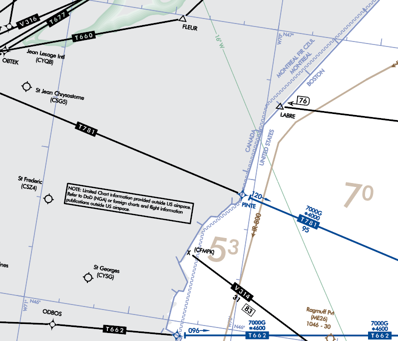
- `image=p073_img01_d7b717364f9e.png` `size=797x682` `bbox_area_ratio=0.1172`

## Page 74

`source: cug-complete_20260122.pdf#page=74`

FAA Chart Users’ Guide - IFR Enroute Terms
74

## Page 75

`source: cug-complete_20260122.pdf#page=75`

AIRPORTS
Airport Data - Low/High Altitude
Civil	
	
	
	
Charts: High/Low
	
	
	
	
Civil And Military	
	
Charts: High/Low
	
	
	
	
Military	
	
	
Charts: High/Low
	
	
	
	
Seaplane - Civil	
	
Charts: Low
	
	
	
	
Heliport	
	
	
Charts: Low
	
	
	
	
Emergency Use Only
	
	
	
	
      Pacific Only	 
	
	
	
	
	
 
IFR ENROUTE LOW / HIGH ALTITUDE SYMBOLS 
(U.S., PACIFIC AND ALASKA CHARTS)
Facilities in BLUE or GREEN have an approved Instrument Approach Procedure and/or RADAR MINIMA published in either the FAA 
Terminal Procedures Publication or the DoD FLIPs. Those in BLUE have an Instrument Approach Procedure and/or RADAR MINIMA 
published at least in the High Altitude DoD FLIPs. Facilities in BROWN do not have a published Instrument Procedure or RADAR 
MINIMA. Facilities in BLACK are foreign airports.
All IAP Airports are shown on the Low Altitude Charts.
Non-IAP Airports shown on the U.S. Low Altitude Charts have a minimum hard surface runway of 3000’.
Airports shown on the U.S. High Altitude Charts have a minimum hard surface runway of 5000’.
Airports shown on the Alaska High Altitude Charts have a minimum hard or soft surface runway of 4000’.
Associated city names for public airports are shown above or preceding the airport name and city name are the same only the airport 
name is shown. City names for military and private airports are not shown.
The airport identifier in parentheses follows the airport name or Pvt.
Pvt - Private Use
75
AIRPORT DATA DEPICTION
Low Altitude	
                    
1. Airport elevation given in feet above or below mean sea level
2. Pvt - Private use, not available to general public
3. A solid line box enclosed the airport name indicates FAR 93 
Special Requirements - see Directory/Supplement
4. “NO SVFR” above the airport name indicates FAR 91 fixed-
wing special VFR flight is prohibited.
5. 
 or 
 following the airport identifier indicates Class C or 
Class D Airspace
High Altitude - U.S.
6. Associated city names for public airports are shown above or 
preceding the airport name. If airport name and city name are 
the same, only the airport name is shown. The airport identifier in 
parentheses follows the airport name. City names for military and 
private airports are not shown.
7. Airport Ident ICAO Location Indicator shown outside contiguous 
U.S.
8. AFIS Alaska only
High Altitude - Alaska     
FAA Chart Users’ Guide - IFR Enroute Symbology

## Page 76

`source: cug-complete_20260122.pdf#page=76`

Airports (Continued)
LIGHTING CAPABILITY	
	
    
   Lighting Available
   Pilot Controlled Lighting
   Part-time or on request	
	
	
    
   No lighting available
   At private facilities- indicates no lighting
   information is available
RADIO AIDS TO NAVIGATION
NAVAIDS
	
VOR	
VOR/DME    TACAN	
DME	
NDB	
NDB/DME	
Reporting Function
	
 
	
     
	           
	
	
	
    
	
	
	
	
	
	
	
	
	
	
Non Compulsory Reporting or Off Airway
	
	
	
	
	
	
	
	
	
Compulsory Reporting
Note: VHF/UHF is depicted in Black. LF/MF is depicted in Brown. RNAV is depicted in Blue
Compass Roses
VHF/UHF	
	
	
	
	
LF/MF	 	
	
	
Compass Roses are oriented to Magnetic North of the NAVAID that cannot be adjusted to the charted isogonic values.
76
Compass Locator Beacon
	
	
	
                LOW ALTITUDE
	
	
	
	
            
Chart Example : Enroute Low L-27 US
FAA Chart Users’ Guide - IFR Enroute Symbology

## Page 77

`source: cug-complete_20260122.pdf#page=77`

RADIO AIDS TO NAVIGATION (Continued)
	
 	
	
	
     LOW ALTITUDE
ILS LOCALIZER
ILS Localizer Course with                 
additional navigation function

ILS Localizer Back Course with        
additional navigation function

  	
            HIGH ALTITUDE - ALASKA
VOR/DME RNAV
WAYPOINT DATA
	
	
	
         
Coordinates
Frequency
Identifier
Reference
Facility Elevation
Radial/Distance
(Facility to Waypoint)
ILS Localizer Example with Back Course
(Chart: Enroute Low L-1 US)
77
NAVIGATION AND COMMUNICATION BOXES - COMMON ELEMENTS
LOW ENROUTE CHARTS
RCO Frequencies	
                  
NAVAID Name, SSV(s)
FREQ, Ident, CH, Morse Code
Latitude, Longitude
Controlling FSS Radio or FSS Name (AK)
COMMON ELEMENTS (HIGH AND LOW CHARTS)
RCO Frequency 
Single Frequency
Multiple Frequencies 
Frequencies transmit and receive except those followed by R 
and T:
R - Receive Only           T - Transmit Only
NAVAID Box
Thin line NAVAID boxes without frequency(s) and FSS radio name 
indicates no FSS frequencies available.
(AK only) Shadow NAVAID box indicates NAVAID and Flight Service 
Station (FSS) have same name.
HIGH ENROUTE CHARTS
RCO Frequencies	
	
NAVAID Name
Frequency, Ident, SSV(s), Channel
Latitude, Longitude
Controlling FSS Radio or FSS Name (AK)
	
	
	
	
 
       	
	
VHF/UHF                           LF/MF
	
     
FAA Chart Users’ Guide - IFR Enroute Symbology

## Page 78

`source: cug-complete_20260122.pdf#page=78`

NAVAID STANDARD SERVICE VOLUME (SSV) CLAS­
SIFICATIONS
(VL), (T), etc. indicate SSV. See “NAVAID STANDARD SERVICE 
VOLUME (SSV) CLASSIFICATIONS” on page 66 or the Chart 
Supplement for SSV Altitude and Range Boundaries.
DISTANCE MEASURING EQUIPMENT
Facilities that operate in the “Y” mode for DME reception
VOICE COMMUNICATIONS VIA NAVAID
Voice Transmitted
No Voice Transmitted
NAVAID SHUTDOWN STATUS
PART TIME OR ON-REQUEST
 	
	
	
  
	
         (T) (L) (VL) (H) (VH) (DL) (DH)  	
	
	
	
  
 	
	
	
      (Y)
	
	
	
    
       	
	
            VHF/UHF             LF/MF
	
	
	
       	
	
           VHF/UHF              LF/MF
	
	
	
 
78
RADIO AIDS TO NAVIGATION (Continued)
Navigation and Communication Boxes - Common Elements
AUTOMATED WEATHER BROADCAST SERVICES
ASOS/AWOS - Automated Surface Observing Station/Automated 
Weather Observing Station
LATITUDE AND LONGITUDE
Latitude and Longitude coordinates are provided for those 
NAVAIDs that make up part of a route/airway or a holding pattern. 
All TACAN facilities will include geographic coordinates.
	
	
  	
  
VHF/UHF 
LF/MF
	
   LOW ENROUTE                   HIGH ENROUTE
            
Navigation and Communication Boxes -  Examples
LOW ENROUTE CHARTS
VOR	
	
	
	
	
R - Receive only 122.1R
Controlling FSS Name - ANDERSON
(T) - Service Volume 
Receive & Transmit on 122.35
(T) - Service Volume 
Latitude and Longitude
Controlling FSS Name - MACON
HIGH ENROUTE CHARTS
VOR	
	
	
	
	
FAA Chart Users’ Guide - IFR Enroute Symbology

## Page 79

`source: cug-complete_20260122.pdf#page=79`

RADIO AIDS TO NAVIGATION (Continued)
Navigation And Communication Boxes - Examples (Continued)
LOW ENROUTE CHARTS
VOR/DME
	
	
	
	
	
No Voice Communications
(Y) Mode DME
R - Receive only 122.1R
Controlling FSS Name - BUFFALO
(AK only) Shadow NAVAID Box
FSS Associated with NAVAID
TACAN		
	
	
	
TACAN Channels are without 
voice but not underlined 
Part Time NAVAID
VORTAC
Shutdown status
DME
	
	
	
	
	
DME Channel, Ident, Morse Code, 
VHF Frequency
NDB
	
	
	
	
       
A - ASOS/AWOS Available
Shutdown status 
NDB/DME	
	
	
 	
                 
No Voice Communications
(Y) Mode DME
(AK only) Shadow NAVAID Box
FSS Associated with NAVAID
HIGH ENROUTE CHARTS
VOR/DME
	
	
	
	
	
Off Route (Greyed NAVAID Box 
and NAVAID)
DME in Y Mode
(AK only) Shadow NAVAID Box
FSS Associated with NAVAID	
TACAN	
	
	
	
	
	
Off Route 
Off Route - Part Time NAVAID
(Greyed NAVAID Box and NAVAID) 
VORTAC
Off Route (Greyed NAVAID Box 
and NAVAID) 
DME
	
	
	
	
	
DME Channel, Ident, 
VHF Frequency
NDB
	
	
	
	
	
NDB/DME
	
	
	
	
        
No Voice Communications
(Y) Mode DME
(AK only) Shadow NAVAID Box 
FSS Associated with NAVAID
Notes: Morse Code is not shown on High NAVAID Boxes.
79
FAA Chart Users’ Guide - IFR Enroute Symbology

## Page 80

`source: cug-complete_20260122.pdf#page=80`

RADIO AIDS TO NAVIGATION (Continued)
Stand Alone Flight Services and Communication Outlets
Flight Service Station (FSS) - Alaska Only
Shadow NAVAID boxes indicate Flight Service Station (FSS) loca­
tions. Frequency 122.2 (Conterminous U.S) and 121.5 and 243.0 
(Alaska) are available at many FSSs and are not shown. All other 
frequencies are shown above the box.
Certain FSSs provide Local Airport Advisory (LAA) on 123.6.
Frequencies transmit and receive except those followed by R and 
T:
R - Receive Only
T - Transmit Only
Remote Communications Outlet (RCO)
Thin line NAVAID boxes without frequencies and controlling FSS 
name indicate no FSS frequencies available. Frequencies posi­
tioned above the thin line boxes are remoted to the NAVAID sites. 
Other frequencies at the controlling FSS named are available, 
however altitude and terrain may determine their reception.
Stand Alone AWOS & ASOS
LOW CHARTS
Stand Alone FSS
	
      
Stand Alone FSS Associated 
with an Airport
        
Part-time FSS
               
Stand Alone RCO
              
RCO Associated/Co-located 
with an Airport
            
HIGH CHARTS
Stand Alone FSS
	
         
Stand Alone FSS Associated 
with an Airport
	
          
Stand Alone RCO
              
RCO Associated/Co-located 
with an Airport
           
CASPER 122.4
MON
DOUGLAS
Converse County
(DGW)
80
FAA Chart Users’ Guide - IFR Enroute Symbology

## Page 81

`source: cug-complete_20260122.pdf#page=81`

81
AIRSPACE INFORMATION
Airway/Route Types
Low and High Enroute Airway Data:
Low Enroute Charts
Victor Airways		
	
     
LF/MF Airway	 	
	
     
  
RNAV T Route	                  	
       
GNSS Required
  
RNAV TK Helicopter Route    	        
GNSS Required
  
Preferred Direction Victor Route	
 $V0
  
Unusable Route Segment        	        
  
Military Training Routes (MTR)
MTRs 5NM or less both sides	
 
of centerline
MTRs greater than 5NM either 	
 
or both sides of centerline 
Arrow indicates direction of route
See MTR tabulation for altitude range information
All IR and VR MTRs are shown except those VRs at or bleow 
1500’ AGL
CAUTION: Inset charts do not depict MTRs
 Alaska Capstone Routes (R Routes)
”R” Routes (R2010, R2015, R2020, R2025) are RNP 1 Naviga­
tion Specification. Users must have specific FAA authorization, 
through Operations Specification or Letter of Authorization, 
obtained from Flight Standards to use these routes. The aircraft’s 
lateral deviation display scaling must support the RNP 1 Enroute 
operation.
Low and High Enroute Charts
ATS Route	
	
	
   
Oceanic Route		
	
VHF/UHF Data is depicted in Black.
LF/MF Data is depicted in Brown.
RNAV Route data is depicted in Blue
High Enroute Charts
Jet Routes	
	
	
   
  
Atlantic Routes	
	
   
  
Bahama Routes	
	
   
  
RNAV Q Routes	
	
     
Alaska Q Routes require GNSS and radar surveillance. Within the 
CONUS, GNSS or DME/DME/IRU RNAV required, unless other­
wise indicated. DME/DME/IRU aircraft require radar surveillance.
   
 
Preferred Direction Jet Routes             
   
Preferred Direction RNAV Q Routes     
	
  
Preferred Direction ATS Route	
  
Unusable Route Segment        	          
   
Substitute Route	
	
    
All relative and supporting data        See NOTAMs or appropriate
shown in brown.                                publication for specific 
	
	
	
	
information.
FAA Chart Users’ Guide - IFR Enroute Symbology

## Page 82

`source: cug-complete_20260122.pdf#page=82`

82
Airspace Information (Continued)
FIXES
VHF/UHF        LF/MF
  
                  
  
                  
  
  
 
           
         
          
VHF/UHF
VHF/UHF        LF/MF
  
               
   
                  
  
              
          
          
       
 	 	
    N/A
	
N/A	
	
	
N/A	
	
    N/A
REPORTING FUNCTION
Compulsory Position Reporting
Non-Compulsory Position Reporting
Fix or Waypoint Coordinates
Fix Coordinates are shown for compulsory, offshore and 
holding fixes.
Waypoints Coordinates are shown when waypoint is not 
part of a RNAV route and when located on or beyond the 
boundary of the U.S. Continental Control (12 mile limit).
Off-set arrows indicate facility forming a fix 
- Arrow points away from the VHF/UHF NAVAID
- Arrow points towards the LF/MF NAVAID
Distance Measuring Equipment (DME) Fix
Denotes DME fix (distance same as airway / route mileage)
Distance Measuring Equipment (DME) Fix
Denotes DME fix (encircled mileage shown when not other­
wise obvious)
Example:
First segment, 5NM; second segment 10NM; total milage 
provided in encircled DME arrow.
Total Mileages between Compulsory Reporting 
Points or NAVAIDs
Note: All mileages are in Nautical Miles
MILEAGE BETWEEN OTHER FIXES, NAVAIDs 
AND/OR MILEAGE BREAKDOWN
Mileage Breakdown or Computer Navigation Fix 
(CNF)
Five letter identifier in parentheses indicates CNF with no 
ATC function
FACILITY LOCATOR BOATS
Crosshatch indicates Shutdown status of NAVAID
RADIAL OUTBOUND FROM A VHF/UHF NAVAID
All Radials are magnetic.	
BEARING INBOUND TO AN LF/MF NAVAID
All Bearings are magnetic.
MAGNETIC REFERENCE BEARING, outbound from 
a NAVAID or Fix    
Note: Not shown on joint Victor/RNAV or Jet/RNAV Routes.
WAYPOINTS
RNAV
N/A
N/A
RNAV
N/A
N/A
RNAV
N/A
N/A
N/A
N/A
N/A
FAA Chart Users’ Guide - IFR Enroute Symbology

## Page 83

`source: cug-complete_20260122.pdf#page=83`

83
Airspace Information (Continued)
VHF/UHF          LF/MF
   LOW CHARTS    LOW CHARTS 
   
               
           
      
   HIGH CHARTS    HIGH CHARTS 
  MEA-29000         MEA-FL240
                       LOW CHARTS
         
                       HIGH CHARTS
       
65
279
$J505$
91
MEA G AP
MEA-24000
108
TWISP
     LOW / HIGH              LOW / HIGH 
        CHARTS                   CHARTS
     
       
    LOW  CHARTS       LOW CHARTS
          
 	            
    LOW  CHARTS       LOW CHARTS
	
	
	
 
	
	
	
 
          
	            
      LOW / HIGH              LOW / HIGH 
         CHARTS                   CHARTS
	
	
	
      
    
        
	
	
  
MINIMUM ENROUTE ALTITUDE (MEA)
All Altitudes Are MSL Unless Otherwise Noted.
Directional MEAs
MEAs are shown on IFR High Altitude Charts when MEA is 
other than 18,000’.
MINIMUM ENROUTE ALTITUDE (MEA) GAP
MEA is established when there is a gap in navigation signal 
coverage.
Maximum Authorized Altitude (MAA)
All Altitudes Are MSL Unless Otherwise Noted.
MAAs are shown on IFR High Altitude Charts when MAA is 
other than 45,000’.
Minimum Obstruction Clearance Altitude (MOCA)
All Altitudes Are MSL Unless Otherwise Noted.
Minimum Turning Altitude (MTA) and Minimum 
Crossing Altitude (MCA)
See Low Enroute Chart Example below for examples of 
both MTAs and MCAs.
MINIMUM RECEPTION ALTITUDE (MRA)
ALTITUDE CHANGE
MEA, MOCA and/or MAA change at other than NAVAIDs
CHANGEOVER POINT
Changeover Point giving mileage to NAVAIDs (Not shown 
at midpoint locations.)
HOLDING PATTERNS
RNAV Holding Pattern Magnetic Reference Bearing is de­
termined by the isogonic value at the waypoint or fix.
Holding Pattern with maximum restriction airspeed 210K 
applies to altitudes 6000’ to and including 14000’. 175K ap­
plied to all altitudes. Airspeed depicted is Indicated Airspeed 
(IAS)
RNAV
LOW CHARTS
HIGH CHARTS 
     MEA for GNSS RNAV        	
aircraft
MEA-24000G
     MEA for DME/DME/IRU 
RNAV aircraft
MEA-24000D
N/A
            
LOW / HIGH 
                CHARTS                   
            
LOW CHARTS
          
LOW CHARTS
N/A
N/A
FAA Chart Users’ Guide - IFR Enroute Symbology

## Page 84

`source: cug-complete_20260122.pdf#page=84`

84
AIRSPACE INFORMATION (Continued)
Enroute Chart Examples
Low Enroute Chart
1
2
3
4
5
6
FAA Chart Users’ Guide - IFR Enroute Symbology

## Page 85

`source: cug-complete_20260122.pdf#page=85`

85
Enroute Chart Examples
Low Enroute Chart (Continued)
Reference Number
1
2
3
4
Description
Multiple MCAs at a NAVAID
V21 and V257 - MCA at DBS of 8600’ traveling North
V298 - MCA at DBS of 9800’ traveling West
V343 - MCA at DBS of 8500’ traveling North
V520 - MCA at DBS of 9000’ traveling East
V520 - MCA at DBS of 10600’ traveling West
MCA and MRA at a Fix
MCA at SABAT on V298 of 11,100 traveling East.
MRA at SABAT of 10000.
Example of MOCA and directional MEAs along a Victor 
Route
Traveling East from DBS, MEA 13,000’ the first two segments, 
15,000 along third segment.
Traveling West from QUIRT, MEA of 15,000’ the first segment, 
MEA of 10,000 the second segment and MEA of 9,000 the third 
segment. 
MOCA for DBS to SABAT and SABAT to LAMON segments of 
8100
MCA Example
MCA at OSITY on V330. MCA of 9500’ traveling East on V330 
from Idaho Falls (IDA) VOR-DME.
AIRSPACE INFORMATION (Continued)
FAA Chart Users’ Guide - IFR Enroute Symbology

## Page 86

`source: cug-complete_20260122.pdf#page=86`

AIRSPACE INFORMATION (Continued)
Enroute Chart Examples
Low Enroute Chart (Continued)
Reference Number
5
6
Description
MEA VHF and RNAV Example
MEA for aircraft utilizing VHF NAVAID of 15000’
MEA for aircraft utilizing RNAV of 13300’
MOCA of 13300’
MCA and MTA Example at a NAVAID
MCA for aircraft traveling West along V520 to cross JAC at 15200’
MCA for aircraft traveling West along V330 to cross JAC at 13400’
MTA for aircraft crossing over and turning at JAC:
Aircraft traveling NE on V465 and turning to V330 on a W heading 
or turning to V520 on a W heading must turn at altitude of 16000’ 
or higher
Aircraft traveling E on V520 and turning to V330 on a W heading 
must turn at altitude of 14200’
Aircraft traveling E on V330 and turning to V520 on a W heading 
must turn at altitude of 16000’ or higher
Aircraft traveling NW on V328 and turning to V465 on a SW head­
ing must turn at altitude of 15100’ or higher.
86
FAA Chart Users’ Guide - IFR Enroute Symbology

## Page 87

`source: cug-complete_20260122.pdf#page=87`

87
Airspace Information (Continued)
Enroute Chart Examples
High Enroute Chart
2
3
1
Reference Number
1
2
Description
High RNAV Route with MEA for DME/DME/IRU RNAV 
Aircraft
MEA of 24,000’
Preferred Directional Jet Route with Time Restrictions
Jet Route 34 available between 1100 - 0300Z
FAA Chart Users’ Guide - IFR Enroute Symbology

## Page 88

`source: cug-complete_20260122.pdf#page=88`

Enroute Chart Examples
High Enroute Chart (Continued)
Reference Number
3
Description
Preferred Directional Jet Route with Time Restrictions, 
MAA and MEA
Jet Route 149 available between 1100 - 0300Z
MAA - 41,000’
MEA - 31,000’
AIRSPACE INFORMATION (Continued)
AIRSPACE BOUNDARIES
	
	
	
	
LOW / HIGH CHARTS
Air Defense	
	
	
 
Identification Zone (ADIZ)
	
	
	
	
CANADA ADIZ
ALASKA ADIZ
	
	
	
	
Adjoining ADIZ
Air Traffic Service 	
	
LOW / HIGH CHARTS
Identification Data	
	
Ceiling
Floor
Call Sign
Frequency
	
	
	
	
Ceiling
Floor
Call Sign
Frequency
	
	
Flight Information Regions (FIR)
	
	
	
	
LOW / HIGH CHARTS
	
	
	
	
Upper Information Regions
(UIR) 
Upper Control Areas (UTA)
	
	
	
	
     LOW / HIGH CHARTS
Air Route Traffic  Control
Center (ARTCC)
ARTCC Remoted Sites with 
discrete VHF and UHF frequencies
Air Route Traffic Control Center 
(ARTCC) with Controller Pilot 
Data Link Communications 
(CPDLC) 
Altimeter Setting Change	
    
	
	
	
	
     LOW / HIGH CHARTS
Control Areas (CTA)
	
	
	
	
Adjoining CTA
Additional Control Areas
LOW ALTITUDE
HIGH ALTITUDE
  
Foreign Airspace Note
ARTCC Name
Site Name
Frequency
MIAMI OCEANIC CTA/FIR KZMA
NEW YORK OCEANIC CTA/FIR KZWY
CONTROL  1419 H
NOTE: Limited chart information provided outside U.S. airspace.
Refer to DoD (NGA) or foreign charts and flight information
publications outside U.S. airspace.
88
FAA Chart Users’ Guide - IFR Enroute Symbology

### Images

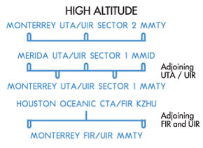
- `image=p088_img01_dd56133149fd.jpeg` `size=290x211` `bbox_area_ratio=0.0146`

## Page 89

`source: cug-complete_20260122.pdf#page=89`

89
AIRSPACE INFORMATION (Continued)
Airspace - U.S.
Class A
High Chart Only
Controlled 
Airspace
Class B
Low Chart Only
Controlled 
Airspace
Mode C Area
Low Chart Only
Controlled 
Airspace
Open Area (White)
That airspace from 18,000’ MSL to and including FL 600, 
including the airspace overflying the waters within 12 NM 
of the coast of the contiguous United States and Alaska 
and designated offshore areas, excluding Santa Barbara 
Island, Farallon Island, the airspace south of latitude 
25° 04’00” N, the Alaska peninsula west of longitude 
160°00’00” W, and the airspace less than 1,500’ AGL.
That airspace from 18,000’ MSL to and including FL 
450, including Santa Barbara Island, Farallon Island, the 
Alaska peninsula west of longitude 160°00’00” W, and 
designated offshore areas.
Screened Blue with a Solid Blue Outline
M
OD
E C 
& A
DS
-B O
U
T
30 NM 
30 
NM
MODE
 C
 & A
DS
-B
 O
UT
That airspace from the surface to 10,000’ MSL (unless 
otherwise designated) surrounding the nation’s busi­
est airports. Each Class B airspace area is individually 
tailored and consists of a surface area and two or more 
layers.
A Solid Blue Outline
That airspace within 30 NM of the primary airports of 
Class B airspace and within 10 NM of designated airports. 
Mode-C transponder and ADS-B Out equipment is re­
quired. (See FAR 91.215)
Example:
M
OD
E 
C 
& A
DS
-B 
OU
T
MO
DE 
C 
& 
AD
S-B 
OUT
Example:
See Chart example above.
FAA Chart Users’ Guide - IFR Enroute Symbology

## Page 90

`source: cug-complete_20260122.pdf#page=90`

CLASS C
Low Chart Only
Controlled Air­
space
CLASS D
Low Chart Only
Controlled Air­
space
Screened Blue with a Solid Blue Dashed Outline
            
That airspace from the surface to 4,000’ (unless other­
wise designated) above the elevation of selected airports 
(charted in MSL). The normal radius of the outer limits of 
Class C airspace is 10NM. Class C airspace is also indi­
cated by the letter C in a box following the airport name.
Open Area (White)
That airspace from the surface to 2,500’ unless otherwise 
designated) above the airport elevation (charted in MSL), 
surrounding those airports that have an operational con­
trol tower. Class D airspace is indicated by the letter D in 
a box following the airport name.
Example:
Example:
AIRSPACE INFORMATION (Continued)
Airspace - U.S. (Continued)
90
FAA Chart Users’ Guide - IFR Enroute Symbology

## Page 91

`source: cug-complete_20260122.pdf#page=91`

91
Airspace Information (Continued)
AIRSPACE - U.S.
CLASS E
Low Chart Only
Controlled Air­
space 
CLASS G 
High and Low 
Chart
Uncontrolled 
Airspace
Open Area (White)
The controlled airspace below 14,500’ MSL that is not 
Class B, C or D.
Federal Airways from 1,200’ AGL to but not including 
18,000’ MSL (unless otherwise specified).
Other designated control areas below 14,500’ MSL. 
Not Charted
That airspace from 14,500’ MSL to but not including 
18,000’ MSL, including the airspace overflying the waters 
within 12 NM of the coast of the contiguous United States 
and Alaska and designated offshore areas, excluding the 
Alaska peninsula west of longitude 160°00’00” W, and the 
airspace less than 1,500’ AGL.
Screened Brown Area
Low Altitude
That portion of the airspace below 14,500’ MSL that has 
not been designated as Class B, C, D or E Airspace.
High Altitude
That portion of the airspace from 18,000’ MSL and above 
that has not been designated as Class A airspace.
Example:
FAA Chart Users’ Guide - IFR Enroute Symbology

## Page 92

`source: cug-complete_20260122.pdf#page=92`

AIRSPACE INFORMATION (Continued)
Special Use Airspace - U.S.
Low and High 
Charts
Low Charts Only
P - Prohibited Area
R - Restricted Area
W - Warning Area
See Airspace Tabulation on each chart for complete 
documentation information on:
Area Identification
Effective Altitude
Operating Times
Controlling Agency Voice Call
A - Alert Area
* Alert Areas do not extend into Class A, B, C and D air­
space, or Class E airport surface areas.
MOA - Military Operations Area
See Airspace Tabulation on each chart for complete 
documentation information on:
Area Identification
Effective Altitude
Operating Times
Controlling Agency Voice Call
Example: P-56 - 
Washington DC, Area A-1 Chart
Example: P-40 and R-4009 -
Washington DC, Area A-1 Chart
Example: R3601A -
Example: W-50
92
FAA Chart Users’ Guide - IFR Enroute Symbology

## Page 93

`source: cug-complete_20260122.pdf#page=93`

93
AIRSPACE INFORMATION (Continued)
Off Route Obstruction Clearance Altitude (OROCA)
Low Charts Only
OROCA is computed similarly to the Maximum Elevation 
Figure (MEF) found on Visual charts except that it pro­
vides an additional vertical buffer of 1,000 feet in desig­
nated non-mountainous areas and a 2,000 foot vertical 
buffer in designated mountainous areas within the United 
States.
Example: 12,500 feet
Example:  Low L-13 Chart  
Special Flight Rules Area (SFRA)
Low and High 
Charts
SFRA Symbology
Example: Low Chart (Washington Area Chart) 
Example: High Chart (H-12)
FAA Chart Users’ Guide - IFR Enroute Symbology

## Page 94

`source: cug-complete_20260122.pdf#page=94`

94
Cruising Altitudes - Low Charts - U.S. Only
IFR outside controlled airspace.               
IFR within controlled airspace as
assigned by ATC.
ALL courses are magnetic.
	
	
	
	
          VFR above 3000’ AGL
	
	
	
	
          unless otherwise 
	
	
	
	
          authorized by ATC.
Cruising Altitudes - High Charts - U.S. Only

IFR within controlled airspace         18,000’ MSL to FL280
as assigned by ATC	
	
All courses are magnetic.
	
	
	
	
VFR or VFR On Top 
	
	
	
	
add 500’
	
	
	
	
No VFR flights within 
	
	
	
	
Class A Airspace above 
	
	
	
	
3000’ AGL unless 
	
	
	
	
otherwise authorized 
RVSM Levels FL290 to FL410             FL430 and above
       
 	   	
  
        No VFR or VFR On Top 
        authorized above FL285 in 
        RVSM airspace.
NAVIGATIONAL AND PROCEDURAL INFORMATION
FAA Chart Users’ Guide - IFR Enroute Symbology

## Page 95

`source: cug-complete_20260122.pdf#page=95`

95
MORSE CODE
ISOGONIC LINE AND 	 	
LOW/HIGH CHARTS
VALUE		
	
	
	
      
ENLARGEMENT AREA
TIME ZONE	
	
	
       
All time is Coordinated Universal
Time (UTC)
During periods of Day­
lights Savings Time (DT), 
effective hours will be one 
hour earlier than shown. 
All states observe DT ex­
cept Arizona and Hawaii
MATCH MARK		
	
      LOW/HIGH CHARTS
	
	
	
	
         
HYDROGRAPHY
SHORELINES	 	
	
TOPOGRAPHY
TERRAIN	
	
      
Area Charts
CULTURE
Boundaries
	
	
  	
         
LOW/HIGH ALTITUDE
International	
	
U.S./Russia Maritime Line	
LOW/HIGH ALTITUDE
Date Line	
          
LOW/HIGH ALTITUDE
Navigational and Procedural Information (Continued)
FAA Chart Users’ Guide - IFR Enroute Symbology

## Page 96

`source: cug-complete_20260122.pdf#page=96`

FAA Chart Users’ Guide - IFR Enroute Symbology
96

## Page 97

`source: cug-complete_20260122.pdf#page=97`

U.S. TERMINAL PROCEDURES PUBLICATION
The U.S. Terminal Procedures Publication (TPPs) includes the Instrument Approach Procedures (IAPs), Departure Proce­
dures (DPs) charts, Standard Terminal Arrival (STAR) charts, Charted Visual Flight Procedure (CVFP) charts,  and Airport 
Diagrams. Also included are Takeoff Minimums, (Obstacle) Departure Procedures, Diverse Vector Area (RADAR Vectors), 
RADAR and Alternate Minimum textual procedures.
EXPLANATION OF TPP TERMS AND SYMBOLS
The information and examples in this section are based primarily on the IFR (Instrument Flight Rules) Terminal Proce­
dures Publication (TPP). The publication legends list aeronautical symbols with a brief description of what each symbol 
depicts. This section will provide more detailed information of some of the symbols and how they are used on TPP charts.
FAA Terminal charts are prepared in accordance with specifications of the Interagency Air Committee (IAC) and their sup­
porting technical groups for the purpose of standardization, which are approved by representatives of the Federal Aviation 
Administration (FAA), and the Department of Defense (DoD).
The Terminal Procedure Publication is made up of the following charts:
•	
Instrument Approach Procedure (IAP) Charts
•	
Airport Diagrams
•	
Departure Procedures (DP)
•	
Standard Terminal Arrival (STAR) Charts
•	
Charted Visual Flight Procedure (CVFP) Charts
97
FAA Chart Users’ Guide - Terminal Procedures Publication (TPP) - Terms

## Page 98

`source: cug-complete_20260122.pdf#page=98`

INSTRUMENT APPROACH PROCEDURE CHART
The IAPs (charts) are divided into various sections:
	
	
Margin Identification Information		
	
	
Profile View
	
	
Briefing Strip Information	
	
	
	
Landing Minimums
	
	
Planview	
	
	
	
	
	
Airport Sketch
	
	
Missed Approach Information
Airport
 Sketch
Information
       Information        
Landing
Minima
Planview
NOT FOR 
NAVIGATION
98
FAA Chart Users’ Guide - Terminal Procedures Publication (TPP) - Terms

## Page 99

`source: cug-complete_20260122.pdf#page=99`

Margin Identification Information
   
The margin identification at the top, bottom, and sides of the chart provides information about the airport location, proce­
dure identification, and chart currency. The charts are organized by city first, then airport name and state, with the excep­
tion of military charts, which are organized by airport name. Going from the top of the chart, reading from left to right, and 
going down the chart, Margin Identification Information is organized in the following way.
The hash marks along the top and bottom borders of military Instrument Approach Charts indicate that the procedure 
was designed using High Altitude criteria contained in FAA Order 8260.3. These procedures are designed to support high 
performance military aircraft operations and are not intended for civilian use.
99
FAA Chart Users’ Guide - Terminal Procedures Publication (TPP) - Terms

## Page 100

`source: cug-complete_20260122.pdf#page=100`

Top Margin Information:
The city and state with which the airport is associated are located on both the top and bottom margins.
At the center of the top margin is the FAA numbering system. This Approach and Landing (AL) number is followed by the 
organization responsible for the procedure in parentheses, e.g., AL-18 (FAA). Military procedures do no show an AL num­
ber, but do show the appropriate authority for the procedure, e.g., (USAF).
The procedure title is located on both the top and bottom margins. It is derived from the type of navigational facility that is 
providing the final approach course guidance. The title is abbreviated, e.g. ILS, RNAV, NDB, etc. For airports with parallel 
runways and simultaneous approach procedures, “L”, “R” or “C” follows the runway number to distinguish between left, 
right, and center runways.
The airport name is shown on both the top and bottom margins below the procedure title. The airport identifier is shown 
in parentheses following the airport name. Civil and joint-use airports outside the contiguous United States will be shown 
with the FAA airport location identifier followed by the ICAO location indicator. Military airports that are not joint-use will be 
shown with only the ICAO location indicator.
The Date of Latest Revision is shown on the top margin above the procedure title. The Date of Latest Revision identifies 
the Julian date the chart was last revised for any reason. The first two digits indicate the year, the last three digits indicate 
the day of the year (001 to 365/6).
	
	
	
	
	
	
        
                                                                                    Year|Day of Year
Side Margin Information:
The side margins show the volume identification, i.e. SW-3, followed by the current issue date and the next issue date, 
e.g. SW-3, 21 JUL 2016 to 15 SEP 2016.
Bottom Margin Information:
The FAA Procedure Amendment Number, located on the left bottom margin below the City, State, represents the most 
current amendment of a given procedure. The Procedure Amendment Effective Date represents the AIRAC cycle date on 
which the procedure amendment was incorporated into the chart. Updates to the amendment number and effective date 
represent procedural/criteria revisions to the charted procedure, e.g., course, fix, altitude, minima, etc.
Example: Original Procedure Date
Example: Amendment Procedure Date
The coordinates for the airport reference point are located at the center of the bottom margin. 
100
FAA Chart Users’ Guide - Terminal Procedures Publication (TPP) - Terms

## Page 101

`source: cug-complete_20260122.pdf#page=101`

BRIEFING STRIP INFORMATION
At the top of every TPP is the Briefing Strip that consists of three stacked strips of information immediately above the plan­
view. Information varies depending upon the type of procedure. 
Top Briefing Strip
The top briefing strip contains procedural information in three separate boxes, in the following sequence from left to right:
1
2
3
NAVAID
Info
•	
Box 1: Primary Procedure Navigation Information: The primary navigation type (VOR, LOC, NDB, RNAV, etc.) 
with its identifier and frequency/channel. If applicable, WAAS, the WAAS Channel Number, and the WAAS Refer­
ence Path indicator are shown stacked top to bottom. If the primary navigation type is GBAS, then the following 
information is shown, stacked top to bottom: GBAS, CH NNNN, RPI XXXX. If there is not a primary Navigation 
Box required, the first box is removed.
•	
Box 2: Final Approach Course Information. The inbound Approach Course (APP CRS) is shown.
•	
Box 3: Runway Landing Information: Stacked top to bottom, the runway landing distance (Rwy Ldg), the 
Touchdown Zone Elevation (TDZE), and the Airport Elevation (Apt Elev) are shown. Runway landing distance is 
determined by comparing the total runway length with the displaced threshold accounted for against the published 
Declared Distance Landing Distance Available (LDA). The shortest of these lengths, either the published Declared 
Distance LDA or the total runway length (minus displaced threshold) on the approach end of the runway, will be 
charted.
Top Briefing Strip Examples:
Ground based NAVAID:
RNAV-WAAS:
101
FAA Chart Users’ Guide - Terminal Procedures Publication (TPP) - Terms

### Images

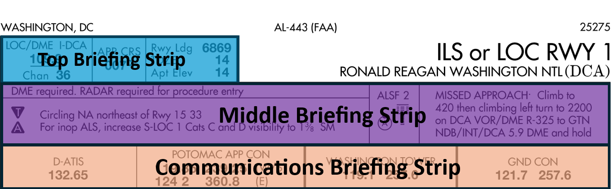
- `image=p101_img01_2f68587017d3.png` `size=1360x422` `bbox_area_ratio=0.0962`

## Page 102

`source: cug-complete_20260122.pdf#page=102`

GBAS:
No Primary NAVAID box:
Circling Approach:
Sidestep Procedure:
Middle Briefing Strip
The middle briefing strip may contain information in up to three separate boxes, when available, in the following sequence 
from left to right:
1
2
3
NOTES BOX
MISSED APPROACH 
PROCEDURE TEXT BOX
APPROACH
LIGHTING
SYSTEM
•	
Box 1: Notes Box: contains procedure notes, Equipment/Requirements Notes box and Takeoff, Alternate, RA­
DAR, WAAS, and/or Cold Weather indicators (details provided below under Notes Box).
•	
Box 2: Approach Lighting System Box (when applicable): shows the approach lighting system name and 
charting icon. Multiple approach lighting systems may be shown for approaches that have straight-in minimums 
for parallel runways. 
•	
Box 3: Missed Approach Procedure Text Box: The full textual description of the missed approach procedure is 
provided here.
102
FAA Chart Users’ Guide - Terminal Procedures Publication (TPP) - Terms

## Page 103

`source: cug-complete_20260122.pdf#page=103`

Notes Box
Procedure Equipment Requirements Notes Box
Performance-Based Navigation (PBN) Requirements and ground-based Equipment Requirements are displayed in sepa­
rate, standardized notes boxes. For procedures with PBN elements, the PBN box contains the procedure’s navigation 
specification(s). If required, specific sensors or infrastructure needed for the navigation solution, additional or advanced 
functional requirements, and the minimum Required Navigation Performance (RNP) value and any amplifying remarks 
will also be included. Items listed in this PBN box are REQUIRED. The separate Equipment Requirements Box will list 
ground-based equipment requirements.
On procedures with both PBN elements and ground-based equipment requirements, the PBN requirements box is listed 
first.
Remote Altimeter Airport Notes
Approach minimums are based on the local altimeter setting for that airport unless annotated otherwise. When more than 
one altimeter source is authorized, and the minima are different, they will be shown by separate lines in the approach 
minima box or as a note in the briefing strip; e.g., use MHK altimeter setting; when not available use SLN altimeter setting 
and increase all MDAs 40 feet. The altimeter source location is referenced by the FAA airport identifier. An airport outside 
the contiguous U.S. will use both the FAA and ICAO identifiers. Until all charts reference the airport identifier, the notes 
may contain altimeter sources referenced by city name, city and state, or airport name.
Notes Symbols
Several different symbols may appear within the Notes Box:
An entry is published in the Takeoff Minimums, (Obstacle) Departure Procedures, and Diverse Vector Area 
(Radar Vectors) section of the TPP. 
Non-standard IFR alternate minimums exist. Refer to IFR Alternate Airport Minimums section of the TPP.
The IAP may not be used as an alternate due to unmonitored facility, absence of weather reporting service, or 
lack of adequate navigation coverage. IAPs designated with this symbol are not listed in the IFR Alternate 
Minimums section of the TPP. 
WAAS (Wide Area Augmentation System)
Cold Temperature Airport
	
The negative 
 within a black square box symbol shown in the Notes section below any “A” or “T” Symbol indicates that 
outages of the WAAS (Wide Area Augmentation System) vertical guidance may occur daily at this location due to initial 
system limitations. WAAS NOTAMs for vertical outages are not provided for this approach. Use LNAV minima for flight 
planning at these locations, whether as a destination or alternate. For flight operations at these locations, when the WAAS 
avionics indicate that LNAV/VNAV or LPV service is available, then vertical guidance may be used to complete the ap­
proach using the displayed level of service. Should an outage occur during the procedure, reversion to LNAV minima may 
be required.
103
FAA Chart Users’ Guide - Terminal Procedures Publication (TPP) - Terms

## Page 104

`source: cug-complete_20260122.pdf#page=104`

When 
 appears in the Notes section below all other symbols it indicates a cold temperature altitude correction is 
required at that airport when the reported temperature is at or below the published temperature. Advise ATC with alti­
tude correction. Advising ATC with altitude corrections is not required in the final segment. See Aeronautical Information 
Manual (AIM), Chapter 7, for guidance and additional information. For a complete list of cold temperature airports, see 
https://aeronav.faa.gov/d-tpp/Cold_Temp_Airports.pdf. 
When “ASR”, “PAR” or “ASR/PAR” appear in the Note section immediately below the “T” and “A” symbols it indicates there 
are published Radar Instrument Approach Minimums. Where radar is approved for approach control service, it is used 
not only for radar approaches (Airport Surveillance Radar [ASR] and Precision Approach Radar [PAR]) but is also used to 
provide vectors in conjunction with published non-radar approaches based on radio NAVAIDs (ILS, VOR, NDB, TACAN). 
Radar vectors can provide course guidance and expedite traffic to the final approach course of any established IAP or to 
the traffic pattern for a visual approach.
Bottom Briefing Strip (Communications Information)
The communications briefing strip contains communication information when available, in separate boxes, listed from left 
to right in the order that they would be used during arrival with the tower frequency box bolded:
•	
ATIS, D-ATIS, AFIS (AK Only) or ASOS/AWOS frequencies (when available, ATIS or AFIS will be the only local 
weather frequency/s published)
•	
The primary Approach Control (APP CON) name and frequencies; when the primary approach service is provided 
by other than Approach Control, e.g. FSS (Radio), Tower, Center, the appropriate air traffic facility call name is 
provided
•	
The Control Tower (TOWER) name and frequencies, to include Precision Radar Monitoring (PRM) and frequency
•	
Ground Control (GND CON) frequencies
•	
Clearance Delivery (CLNC DEL) frequencies; where a Control Tower does not exist or is part-time, a remoted 
CLNC DEL may be listed.
•	
Ground Communications Outlet (GCO) frequency
•	
Common Traffic Advisory Frequency (CTAF), shown in parentheses when shares a frequency, e.g. UNICOM 
122.8 (CTAF)
•	
UNICOM or AUNICOM frequency
•	
Controller Pilot Data Link Communication (CPDLC)
Note: Part-time operations will be annotated with a star. Check Chart Supplement for times of operation.
Note: Departure ATIS, CLNC DEL, and CPDLC will not be charted on the IAP at locations where the information is shown 
on the corresponding Airport Diagram.
104
FAA Chart Users’ Guide - Terminal Procedures Publication (TPP) - Terms

## Page 105

`source: cug-complete_20260122.pdf#page=105`

PLANVIEW
The planview of the IAP charts provides an overhead view of the entire instrument approach procedure.The data on the 
planview is shown to scale, unless concentric rings, scale breaks or an inset have been used.
Planview Items
	
	
Approach Segments	
	
	
	
	
Hydrography
	
	
NAVAIDs	
	
	
	
	
	
International Boundary
	
	
Area Navigation (RNAV) Waypoints	
	
	
Obstacles (Man-made, Terrain and Vegetation)
	
	
Restrictive Airspeeds	
	
	
	
	
Special Use Airspace
	
	
Restrictive Altitudes	
	
	
	
	
Minimum Safe Altitude
	
	
Holding Patterns and Procedure Turns	 	
	
Terminal Arrival Areas
	
	
Airports		
	
	
	
	
	
Helicopter (Copter) Procedures
	
	
Relief (Contours)	
	
	
	
	
Approach Segments
The planview includes a graphical depiction of procedure entry through missed approach.

                                                                           
                                                                           
    
                            
Simple IAP Example
Legend:
      
  	
	
Feeder Route	
	
     Initial Approach	
   Intermediate Approach        Final Approach Course           Missed Approach
NAVIGATION
NOT FOR
105
FAA Chart Users’ Guide - Terminal Procedures Publication (TPP) - Terms

## Page 106

`source: cug-complete_20260122.pdf#page=106`

NOT FOR
      NAVIGATION
Complex IAP Example with RF Legs 
 
•	
Feeder Routes (highlighted in blue - See Simple IAP Example on previous page) may be used to provide a tran­
sition from the enroute structure to the IAF.
•	
Initial Approach (highlighted in purple in examples above) is the segment between the initial approach fix (IAF) 
and the intermediate fix (IF) or the point where the aircraft is established on the intermediate course or final ap­
proach course. 
•	
Intermediate Approach (highlighted in yellow in examples above) is the segment between the intermediate fix or 
point and the final approach fix. 
•	
Final Approach Course (highlighted in red in the examples above) is the segment between the final approach fix 
or point and the runway, airport, or missed approach point.
•	
Missed Approach (highlighted in green in the example above) begins at the MAP and continues until the desig­
nated fix or waypoint. The missed approach track is shown as a hash marked line in the planview. If any portion of 
the missed approach procedure track falls outside of the area of the planview it will be shown in a separate box in 
the planview.
106
FAA Chart Users’ Guide - Terminal Procedures Publication (TPP) - Terms

## Page 107

`source: cug-complete_20260122.pdf#page=107`

•	
DME arcs or Radius-to-Fix legs (RF) are shown as smooth arcs from a designated start point to a designated 
terminus. RF legs depict the altitude and distance. In order to differentiate RF legs from Track to Fix (TF) legs on 
IAPs that contain one or more RF legs, the course value will always be shown on all TF legs.

                                 

•	
Visual segment -  Instrument approach procedures, including Copter approach procedures, that terminate or 
have missed approaches prior to the airport/heliport, and are authorized to proceed visually, will depict the visual 
flight path by a dashed line symbol from the missed approach point to the airport.

On RNAV charts where the visual track may only apply to a specific line of minima, the visual procedure track line 
will not be shown in the planview. There will be a note directed to that portion of the procedure track.
                                       	
     
   

Traditional (NAVAID) Approach                                                           RNAV Approach
107
FAA Chart Users’ Guide - Terminal Procedures Publication (TPP) - Terms

### Images

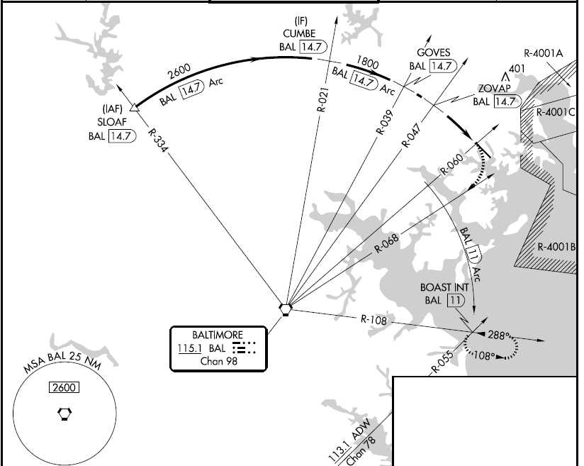
- `image=p107_img01_2b1c32008ffd.png` `size=824x657` `bbox_area_ratio=0.1641`

## Page 108

`source: cug-complete_20260122.pdf#page=108`

NAVAIDs
NAVAIDs used on ground based charts will show the appropriate symbol accompanied by a data box that contains the 
facility name, frequency, identifier and Morse code. A NAVAID box with a heavy line indicates the primary NAVAID used for 
the approach.
NAVAIDs used on GPS based charts show the appropriate symbol identified with the name and identifier.
                                       Primary NAVAID - LOC                                  Secondary NAVAID - VORTAC
                     
                                    
                                     
                              Primary NAVAID - NDB/DME                                 Secondary NAVAID - NDB/DME
                     
 
	
	
       NAVAID - ILS Approach                                                NAVAID - RNAV Approach
Area Navigation (RNAV) Waypoints
Waypoints are shown with the waypoint symbol accompanied by the five letter identifier. If an RNAV waypoint is collocated 
with an intersection, DME fix, or NAVAID, the appropriate Intersection, DME fix, or NAVAID symbol will be charted.
ELIZE
On RNAV (RNP) charts, any requirement/capability notes are depicted below the fix/waypoint/NAVAID name. When 
the required RNP lateral accuracy value for any approach segment other than final approach (e.g. feeder, initial and/or 
intermediate or missed) are less than standard (RNP 2.00 for feeder, RNP 1.00 for initial and/or intermediate and missed), 
a note stating the required RNP value may be placed adjacent to the applicable fix at the beginning of the Feeder Route 
(or annotated in the PBN box). If there is more than one lateral accuracy value within these portions of the procedure, the 
lowest value is annotated. These notes will take the form “RNP 0.XX, or Min RNP 0.XX” and will be located in close prox­
imity to the relevant fix name (or be identified in the PBN Box).
SHNON
(RNP 0.50)
108
FAA Chart Users’ Guide - Terminal Procedures Publication (TPP) - Terms

## Page 109

`source: cug-complete_20260122.pdf#page=109`

Localizer Depiction
The localizer is depicted in the Planview using the following symbol. The size of the charted localizer symbol does not 
serve as an indication of the service volume.
Restrictive Airspeed
Restrictive airspeeds are shown paired with their respective fix/facility.
Type
Description
Example
Recommended Speed
Recommended speed is depicted with no lines above or below it
Minimum Speed
Minimum speed is depicted as a number with a line below it
Maximum Speed
Maximum speed is depicted as a number with a line above it
Mandatory Speed
Mandatory speed is depicted as a number with a line above and below it

Altitudes
Restrictive altitudes are shown paired with their respective fix/ facility. Minimum, Maximum, Mandatory and Recommend­
ed Altitudes are shown.
Type
Description
Example
Recommended Altitude
Recommended altitude is depicted with no lines above or below it
Minimum Altitude
Minimum altitude is depicted as a number with a line below it
Maximum Altitude
Maximum altitude is depicted as a number with a line above it
Mandatory Altitude
Mandatory altitude is depicted as a number with a line above and below it
Mandatory Block 
Altitude
Mandatory block altitude is depicted with a minimum and a maximum altitude.
Altitudes that are shown along a route are minimum altitudes. 
	
109
FAA Chart Users’ Guide - Terminal Procedures Publication (TPP) - Terms

## Page 110

`source: cug-complete_20260122.pdf#page=110`

Holding Patterns and Procedure Turns
Holding Patterns are used for many reasons, including deteriorating weather or high traffic volume. Holding might also be 
required following a missed approach. Each holding pattern has a fix, a direction to hold from the fix, and an airway, bear­
ing, course, radial, or route on which the aircraft is to hold. These elements, along with the direction of the turns, define 
the holding pattern. Holding Patterns may not always be depicted to scale.
         Missed Approach                                          Hold In-Lieu of Procedure Turn                                                        Arrival   
            
If a holding pattern has a non-standard speed restriction, it will be depicted by an icon with the limiting air speed shown 
inside the holding pattern symbol. These elements, along with the direction of the turns, define the holding pattern. If two 
types of holds are located at the same point, the procedural holding pattern will be shown in-lieu of arrival or missed ap­
proach holding patterns. Timing or distance limits for Hold-in-lieu of Procedure Turn Holding Patterns will be shown.
Waypoints designated as a holding fix are shown as fly-by, without the circle around the symbol. However, in the event the 
holding fix/waypoint is also designated in all other parts of the procedure unrelated to holding with a fly-over function, then 
the holding fix/waypoint will be charted as a fly-over point.
A procedure turn (PT) is the maneuver prescribed to perform a course reversal to establish the aircraft inbound on an 
intermediate or final approach course. The procedure turn or hold-in-lieu-of procedure turn is a required maneuver when it 
is depicted on the approach chart. However, the procedure turn or the hold-in-lieu-of PT is not permitted when the symbol 
“NoPT” is depicted on the initial segment being flown, when a RADAR VECTOR to the final approach course is provided, 
or when conducting a timed approach from a holding fix. The procedure turn will be shown in the planview and in the 
profile of the chart. In the planview, the tip of the procedure turn barb is shown at the procedure turn limit, e.g., 10 NM, 15 
NM. Users should be aware that it is possible for there to be a terminal/feeder fix along the procedure track that is not as­
sociated with the procedure turn. Fixes associated with the procedure turn are depicted in the profile.
	
	
	
	
	
           
Airports
The primary approach airport is shown to scale by a pattern of all the runways. Airports other than the primary approach 
airport may be shown with an airport pattern and name when in close proximity to the primary airport.
110
FAA Chart Users’ Guide - Terminal Procedures Publication (TPP) - Terms

## Page 111

`source: cug-complete_20260122.pdf#page=111`

Relief (Contours)
Relief (Contours) is depicted in the planview portion of all IAPs at airports that meet the following criteria:
•	
If the terrain within the planview exceeds 4,000 feet above the airport elevation, or
•	
If the terrain within a 6.0 nautical mile radius of the Airport Reference Point (ARP) rises to at least 2,000 feet 
above the airport elevation.
When an airport meets either of the above criteria, terrain will be charted by gradient tints of brown on all IAPs for that air­
port. Contour layers will be shown in no more than five brown tints, with consecutively darker tints used for consecutively 
higher elevation contour layers.
Hydrography (Water)
Water Depiction is depicted in grey, in the planview portion of IAPs. See previous example. The following hydrographic 
features are shown:
•	
Oceans
•	
Significant rivers and streams
•	
Significant lakes - If only one river or one small lake is involved, not located in the immediate airport vicinity, the 
hydrographic information requirement may be waived.
International Boundary
	
	
	
	
	
	
	
     
When the planview includes a boundary of another country 
the International boundaries are shown by a dashed line. 
International boundaries are identified with country name 
within the country area.
111
FAA Chart Users’ Guide - Terminal Procedures Publication (TPP) - Terms

## Page 112

`source: cug-complete_20260122.pdf#page=112`

Obstacles
Procedural obstacles specifically indicated for charting by the approving authority will be charted. Obstacles identified as 
vegetation or ships will be indicated by a doubtful accuracy symbol 
 following the elevation value.
                   
                       	
	
	
	
	
Procedure Obstacle
Special Use Airspace (SUA)
	
	
	
	
	
	
	
	
	
	
	
       
SUAs consists of that airspace wherein activities must be confined because of their nature, or  
wherein limitations are imposed upon aircraft operations that are not a part of those activi­
ties, or both. These are prohibited areas, restricted areas, warning areas, Military Operations 
Areas (MOAs), and alert areas. SUA that falls within the area of coverage of the instrument 
approach procedure chart are shown only when designated by the approving authority.
Air Defense Identification Zone (ADIZ)
ADIZ is an area of airspace in which the identification, location, and control of aircraft is re­
quired in the interest of national security. When designated by the approving authority, ADIZ 
boundaries that fall within the area of coverage of the chart are shown. 
Minimum Safe Altitude (MSA)
MSAs are published for emergency use on IAP charts. MSAs appear in the planview of all IAPs except on approaches 
for which a Terminal Arrival Area (TAA) is used. The MSA is based on the primary NAVAID, waypoint, or airport reference 
point on which the IAP is predicated. The MSA depiction on the approach chart contains the identifier of the NAVAID/way­
point/airport used to determine the MSA altitudes. MSAs are expressed in feet above mean sea level and normally have 
a 25 NM radius; however, this radius may be expanded to 30 NM if necessary to encompass the airport landing surfaces. 
Ideally, a single sector altitude is established and depicted on the planview of approach charts; however, when necessary 
to obtain relief from obstructions, the area may be further sectored and as many as four MSAs established. When estab­
lished, sectors may be no less than 90° in spread. MSAs provide 1,000 feet clearance over all obstructions but do not 
necessarily assure acceptable navigation signal coverage.
        
     
     
               Single MSA                   Multiple MSA’s
112
FAA Chart Users’ Guide - Terminal Procedures Publication (TPP) - Terms

## Page 113

`source: cug-complete_20260122.pdf#page=113`

Terminal Arrival Areas (TAAs)
The TAA icons will be positioned in the planview relative to their relationship to the procedure. The icon will not have 
feeder routes, airways, or radar vectors depicted. The TAA provides a transition from the enroute structure to the terminal 
environment with little required pilot/air traffic control interface for aircraft equipped with Area Navigation (RNAV) systems. 
A standard TAA has three areas: straight-in, left base, and right base. The arc boundaries of the three areas of the TAA 
are published portions of the approach. A TAA provides minimum altitudes with standard obstacle clearance when operat­
ing within the TAA boundaries. TAAs are primarily used on RNAV approaches but may be used on an ILS approach when 
RNAV is the sole means for navigation to the IF; however, they are not normally used in areas of heavy concentration of 
air traffic.
	
Example of Standard TAA
Non-standard TAAs may also be published; i.e., one base leg, no base legs. 
Example of Non-Standard TAA
113
FAA Chart Users’ Guide - Terminal Procedures Publication (TPP) - Terms

## Page 114

`source: cug-complete_20260122.pdf#page=114`

Helicopter (Copter) Procedures
Copter procedures may contain either a visual or a VFR segment. Visual segments are depicted using the dashed line 
symbol below.

Visual Flight Segment
VFR Segments are not depicted with a line, but include the reference bearing and distance information at the endpoint of 
the VFR Segment, when provided, as shown below.

Example of Copter with VFR Segment (JFK)
114
FAA Chart Users’ Guide - Terminal Procedures Publication (TPP) - Terms

## Page 115

`source: cug-complete_20260122.pdf#page=115`

MISSED APPROACH INFORMATION
Missed approach information is shown in 3 locations on the chart:
•	
The Middle Briefing Strip - The complete textual missed approach instructions are provided at the top of the ap­
proach chart in the middle pilot briefing strip.
•	
The Planview - The missed approach track is drawn using a thin, hash marked line with a directional arrow. If any 
portion of the missed approach procedure track is off the chart, the missed approach track shall extend to the 
chart border.
Missed approach holding patterns that lie outside the geographic parameters of the planview and are unable to be shown 
with a scale break will be shown as a boxed inset. All alternate missed approach holding patterns will be shown in an inset.
•	
The Profile Box - Missed Approach Icons will be depicted in the upper left or upper right of the profile box. The 
Missed Approach Icons are intended to provide quick, at a glance intuitive guidance to the pilot, to supplement 
the textual missed approach instructions in the briefing strip. Space permitting, all textual missed approach in­
structions will be graphically depicted in sequence. If space does not permit the depiction of all missed approach 
icons, only the first four icon boxes will be shown.
Example Missed Approach Icons
Missed Approach Text
MISSED APPROACH: Climb to 13000 on RIL VOR/DME 
R-250 to TEKGU INT/RIL 19 DME and on EKR VOR/DME 
R-179 to WOKPA/EKR 44.2 DME and hold, continue climb-in-
hold to 13000.
MISSED APPROACH: Climbing left turn to 8000 via SVC 
R-128, then reverse course to SVC VOR/DME and hold.
MISSED APPROACH: Climb to 9000 on track 112° to JETRY, 
cross JETRY at or above 6700, and on track 112° to PAKPE, 
right turn to WULKU, and on track 289° to JNC VOR/DME and 
hold.
MISSED APPROACH: Climb to 14000 via 174° course to 
HOMDU and via 160° track to DEVEC and 160° track to FTI 
VORTAC and hold.
MISSED APPROACH: Climb to 5800, then climbing left turn to 
10000 via heading 190° and SVC VOR/DME R-193 to KUNRE 
INT/SVC VOR/DME 24.1 DME and hold.
115
FAA Chart Users’ Guide - Terminal Procedures Publication (TPP) - Terms

## Page 116

`source: cug-complete_20260122.pdf#page=116`

PROFILE VIEW
A profile diagram of the instrument approach procedure is shown below the planview. The published descent profile and 
graphical depiction of the vertical path using those facilities, intersections, fixes, etc. identified in the procedure to the 
runway are shown. A profile view of the procedure track is shown. The approach track begins toward the top of the pri­
mary facility line, unless otherwise dictated by the procedure, and shall descend to where the final approach ends and the 
missed approach begins.
When a reference mark (*, **, #, etc.) is shown in the profile, the qualifying footnote is provided within the profile section.
 
            
       
 
116
FAA Chart Users’ Guide - Terminal Procedures Publication (TPP) - Terms

## Page 117

`source: cug-complete_20260122.pdf#page=117`

Precision Approaches
On precision approaches, the glideslope (GS) intercept altitude is illustrated by a zigzag line and an altitude. This is the 
minimum altitude for GS interception after completion of the procedure turn. Precision approach profiles also depict the 
GS angle of descent, threshold crossing height (TCH) and GS altitude at the outer marker (OM) or designated fix. The 
missed approach track is symbolized using the hatched line pattern. Where separate missed approach points exist for 
precision and non-precision approaches on the same chart, e.g., ILS and LOC, the track will be shown from the precision 
point only.
   Traditional (NAVAID) Approach
    RNAV Approach
Non-Precision Approaches
On non-precision approaches, the final segment begins at the Final Approach Fix (FAF), which is identified with the Mal­
tese cross symbol 
. When no FAF is depicted, the final approach point is the point at which the aircraft is established in­
bound on the final approach course. Stepdown fixes may also be provided between the FAF and the airport for authorizing 
a lower minimum descent altitude (MDA) and are depicted with the fix or facility name and a dashed line. Altitude restric­
tions at stepdown fixes on the final approach on procedures with both precision and non-precision minima are not appli­
cable to precision (ILS, LPV, or LNAV/VNAV) use of the approach. On non-precision only approach procedures, the ap­
proach track descends to the MDA or VDP point, thence horizontally to the missed approach point. The missed approach 
track on non-precision approaches is symbolized using the hatched line pattern and begins at the missed approach point.
     Traditional (NAVAID) Approach
     RNAV Approach
Visual Decent Point (VDP)
The Visual Descent Point (VDP), is shown by a bold letter “V” positioned above the procedure track and centered on the 
accompanying dashed line. (See example below.) The VDP is a defined point on the final approach course of a non-
precision straight-in approach procedure from which normal descent from the MDA to the runway touchdown point may be 
commenced.
	
	
                                   
117
FAA Chart Users’ Guide - Terminal Procedures Publication (TPP) - Terms

## Page 118

`source: cug-complete_20260122.pdf#page=118`

Vertical Descent Angle (VDA) and Threshold Crossing Heights (TCH)
A VDA and TCH may be published on non-precision approaches. For Copter approach procedures, a Heliport Crossing 
Height (HCH) will be depicted in place of the TCH. The VDA is strictly advisory and provides a means to establish a stabi­
lized descent to the MDA. The presence of a VDA does not guarantee obstacle protection in the visual segment. If there 
are obstacles in the visual segment that could cause an aircraft to destabilize the approach between MDA and touchdown, 
the profile will not show a VDA and will instead show a note that states “Visual Segment-Obstacles”.
Visual Flight Path
Instrument approach procedures, including Copter approach procedures, that terminate or have missed approaches prior 
to the airport, and are authorized to proceed visual, shall depict the visual segment by the dashed line symbol from the 
missed approach point to the airport. The note “Fly visual” (“Proceed visually” on Copter procedures) along with the bear­
ing and distance shall be shown leadered to the visual flight path.
RNAV charts sometimes have visual flight for LNAV/VNAV minima that do not start at the missed approach point. An ad­
ditional note indicating “LNAV/VNAV” will be placed above the note.
Copter approach procedures with a VFR segment from the missed approach point will not depict the VFR segment with a 
line in the profile. The note similar to “Proceed VFR from MAP” will be shown.
Copter VFR Segment
Chart Examples
  Traditional (NAVAID) Approach
     RNAV Approach
     
ILS Glide Slope and RNAV Glidepath
A note providing the glide slope (GS) or glidepath (GP) angle and the threshold crossing height (TCH), are positioned in 
the lower half of the profile box
•	
GS will be shown on all ILS procedures.
•	
GP will be shown GLS procedures and all RNAV procedures with a published decision altitude
Threshold Crossing Height (TCH) has been traditionally used in “precision” approaches as the height of the glide slope 
above threshold. With publication of LNAV/VNAV minimums and RNAV descent angles, including graphically depicted 
descent profiles, TCH also applies to the height of the “descent angle,” or glidepath, at the threshold.
118
FAA Chart Users’ Guide - Terminal Procedures Publication (TPP) - Terms

## Page 119

`source: cug-complete_20260122.pdf#page=119`

34:1 Surface Clear Symbol
On RNAV approach charts, a small shaded arrowhead shaped symbol from the end of the VDA to the runway indicates 
that the 34:1 Obstacle Clearance Surface (OCS) for the visual segment is clear of obstacles. The absence of the symbol 
indicates that the 34:1 OCS is not clear or a Visual Segment-Obstacles note is indicated on the chart. (See example in 
VDP Section.)
Secondary Airports
Airports other than the airport of intended landing will be shown when requested and will be portrayed in the same manner 
as the primary airport. It will be placed in its approximate location along the final approach course. 
	
	
	
	
119
FAA Chart Users’ Guide - Terminal Procedures Publication (TPP) - Terms

### Images

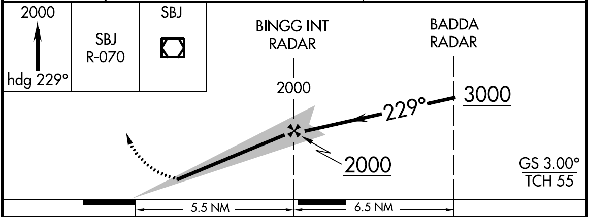
- `image=p119_img01_09241990fd27.png` `size=1160x428` `bbox_area_ratio=0.0374`

## Page 120

`source: cug-complete_20260122.pdf#page=120`

LANDING MINIMUMS
The landing minimums section is positioned directly below the profile. This section gives the pilot the lowest altitude and 
visibility requirements for the approach. There are two types of landing minimums: Straight-in landing or Circling. Straight-
in landing minimums are the MDA and visibility, or DA and visibility, required for a straight-in landing on a specified runway. 
Circling minimums are the MDA and visibility required for the circle-to-land maneuver.
The minimums for straight-in and circling are located under each aircraft category. When there is not a division line be­
tween minimums for each category, the minimums apply to two or more categories.
      
A second category of straight-in minimums called "sidestep" may be depicted where parallel runways exist.
	
	
  
The terms used to describe the minimum approach altitudes differ between precision and nonprecision approaches. Preci­
sion approaches use DA and nonprecision approaches use MDA, both expressed in feet MSL. The minimum approach 
altitudes are also referenced to height above touchdown elevation (HAT) for straight-in approaches, or height above 
airport (HAA) for circling approaches. The figures listed parenthetically are for military operations and are not used in civil 
aviation.
The visibility values are shown after the DA or MDA. They are provided in statue miles or runway visual range (RVR). RVR 
is reported in hundreds of feet. If the visibility is in statute miles, there is an altitude number, hyphen, whole or fractional 
number, e.g. 530-1. This indicates 530 feet MSL and 1 statute mile of visibility. The RVR value is separated from the 
minimum altitude with a slash, e.g., 1540/24. This indicates 1540 feet MSL and RVR of 2400 feet. When an RVR value 
is shown, the comparable statute mile equivalent is shown within the military minimums in parentheses as shown in the 
examples above. This value is determined from the Comparable Values of RVR and Visibility table located in the TPP 
Legend.
120
FAA Chart Users’ Guide - Terminal Procedures Publication (TPP) - Terms

## Page 121

`source: cug-complete_20260122.pdf#page=121`

If a visibility adjustment is required for a procedure with an RVR value, the RVR value should first be converted to visibility 
using this table. The visibility should then be increased by the adjustment value, and then may be converted back to the 
highest RVR value associated with that visibility. For example, if a procedure with 2000 RVR requires a 1/8 mile adjust­
ment, first convert 2000 RVR to 1/2 SM. Adding 1/8 SM results in 5/8 SM, which may then be converted to 3500 RVR.
When a reference mark (*, **, #, etc.) is shown on a line of minimums, the qualifying footnote is provided in the notes sec­
tion. 
AIRPORT SKETCH
	
	
                                                                                                                            
The airport sketch is a depiction of the airport with emphasis on runway pattern and related 
information, positioned in either the lower left or lower right corner of the chart to aid pi­
lot recognition of the airport from the air and to provide some information to aid on ground 
navigation of the airport. The runways are drawn to scale and oriented to true north. Runway 
dimensions (length and width) are shown for all active runways.
Runway(s) are depicted based on what type and construction of the runway.
Hard Surface
Other Than 
Hard Surface
Metal Surface
Closed Runway
Under 
Construction
Stopways,     
Taxiways,     
Parking Areas
Displaced 
Threshold
Closed 
Pavement
Water Runway
Taxiways, aprons, and hardstands are only shown at airports that do not have a published airport diagram.Other run­
way features that may be shown are runway numbers, runway dimensions, runway slope, arresting gear, and displaced 
threshold.
Other information concerning lighting, airport beacon, control tower, NAVAIDs, and helipads may also be shown. The final 
approach course or an extension of the final approach course will be shown on all IAPs except ILS CAT II, ILS CAT II & III, 
ILS SA CAT I, ILS SA CAT II, and ILS SA CAT I & II.
121
FAA Chart Users’ Guide - Terminal Procedures Publication (TPP) - Terms

## Page 122

`source: cug-complete_20260122.pdf#page=122`

Airport Elevation and Touchdown Zone Elevation
The airport elevation is shown enclosed within a box in the upper left corner of the sketch box and the touchdown zone 
elevation (TDZE) is shown in the upper right corner of the sketch box. The airport elevation is the highest point of an 
airport’s usable runways measured in feet from mean sea level. The TDZE is the highest elevation in the first 3,000 feet of 
the landing surface. Circling only approaches will not show a TDZE.
Runway Declared Distance Information
Runway declared distance information when available will be indicated by 
 and is shown to the right of the airport 
elevation in the sketch box. Declared distances for a runway represent the maximum distances available and suitable for 
meeting takeoff and landing distance performance requirements.
Runway Lights 
 
Notes regarding approach lighting systems are shown at the bottom of the sketch box. Runway lights (HIRL) (MIRL) 
(LIRL) (TDZL) (TDZL/RCLS) shall be indicated by a note, e.g. HIRL Rwy 9-27. Pilot capability to acitvate the airport light­
ing is shown using a 
 symbol.
Other approach lighting is shown on the airport sketch as a symbol on the side of the runway 
where they are actually located. Symbols that are shown in negative indicate pilot-controlled 
lighting.
Runway centerline lights (RCLS) are installed on some precision approach runways to facili­
tate landing under adverse visibility conditions. They are located along the runway centerline 
and are spaced at 50 foot intervals. Runways with RCLS are shown in a negative dot pattern 
through the middle of the solid runway as illustrated in the airport sketch to right.
Runway centerline lights will be indicated by a note only when pilot controlled or when paired 
with TDZL, e.g., TDZL/RCLS Rwys 10 and 33L.
Time/Distance Table
When applicable, a Time/Distance Table is provided below the airport sketch. The table pro­
vides the distance and time that is required from the final approach fix to the missed approach 
point for select groundspeeds.
Base Information (Copter Approaches Only)
Base Information, as required and necessary to identify the MAP area and in the vicinity of the landing area shall be pro­
vided. Information shall be limited to and depict significant visual landmark features at and surrounding the MAP area and 
the heliport/pad of intended landing.
AIRPORT DIAGRAMS
Airport Diagrams are specifically designed to assist in the movement of ground traffic at locations with complex runway/
taxiway configurations. Airport Diagrams are not intended for use in approach and landing or departure operations. An 
airport diagram assists pilots in identifying their location on the airport, thus reducing requests for “progressive taxi instruc­
tions” from controllers.
	
	
                 
122
FAA Chart Users’ Guide - Terminal Procedures Publication (TPP) - Terms

## Page 123

`source: cug-complete_20260122.pdf#page=123`

Airport Diagram Features:
1.	 Runways

a.  Complete with magnetic head­
ings (including magnetic variation 
and epoch year) and identifiers.
b.  Runways under construction 
shall also be shown.
c.  Runway dimensions, displaced 
thresholds, runway end elevations.
d.  Runway surface composition
e.  Weight bearing capacity (land­
ing gear configuration or Pavement 
Classification Number)
f.  Land and Hold Short (LAHSO) 
lines, ILS hold lines, Localizer/
Glide Slope Critical Areas.
g.  Arresting Gear. To include Engi­
neered Materials Arresting System 
(EMAS).
2.	 Taxiways, with identifiers. Taxiways 
under construction shall also be 
shown.
3.	 Hot Spot locations.
4.	 Parking areas, run-up pads, alert 
areas, landing pads, “Non-Move­
ment” areas (where pilot is NOT 
under air traffic control), ramps, 
aprons and hold pads.
5.	 Turnarounds and run-up areas.
6.	 Stopways, overruns, and blast 
pads.
7.	 Large tanks, including fueling area.
8.	 Control towers.
9.	 Airport beacon.
10.	Landing direction indicators.
11.	 Lighting.
12.	Navigational Aids (NAVAIDs).
13.	Helicopter pads.
14.	Radar reflectors.
15.	Any building that pilot can taxi to. Other buildings to include terminal/administration and Base operations, fire sta­
tion, NWS, AFSS, FAA, FSDO, ANG, USCG, FBO.
16.	Comm Frequencies.

Note: Star when used in the Comm Frequencies indicates part-time status. Check Chart Supplement for times of 
operation.
123
FAA Chart Users’ Guide - Terminal Procedures Publication (TPP) - Terms

## Page 124

`source: cug-complete_20260122.pdf#page=124`

124
FAA Chart Users’ Guide - Terminal Procedures Publication (TPP) - Terms
Runway Construction
Paved or hard surfaced runways consisting of concrete, asphalt, bitumen, or macadam are shown in solid color. Metal 
surfaced runways are shown using a solid color crosshatch pattern. Ultralight areas, ski landing areas, unpaved or runway 
other than hard surface, such as sod, clay, gravel, etc., is shown using a solid color dot pattern. Further details regarding 
runway surface and surface treatment can be found in the Chart Supplement.
Runway construction is depicted as follows:
Hard Surface
Other Than Hard 
Surface
Metal Surface
Closed Runway
Under Construction
Taxiways, 
Parking Areas
Displaced 
Threshold
Closed 
Pavement
Water Runway
Stopways, 
Overruns, 
Blast Pads
Hot Spots
Hot Spots (HS) are a runway safety related problem area or intersection on an airport. Typically it is a complex or confus­
ing taxiway/taxiway or taxiway/runway intersection. A confusing condition may be compounded by a miscommunication 
between a controller and a pilot, and may cause an aircraft separation standard to be compromised. The area may have a 
history of surface incidents or the potential for surface incidents.
Hot Spots are indicated on the Airport Diagram with a brown open circle or ellipse leadered to a Hot Spot number, e.g., HS 
1. The number corresponds to a listing and description on the Hot Spot page in the front the TPP. More information and 
the location of Hot Spots can be found at https://www.faa.gov/air_traffic/flight_info/aeronav/digital_products/dtpp/search/.
DEPARTURE PROCEDURES (DPs)
Departure Procedures (DPs) are designed specifically to assist pilots in avoiding obstacles during the climb to the mini­
mum enroute altitude, and/or airports that have civil IFR takeoff minimums other than standard. There are two types of 
DPs: Obstacle Departure Procedures (ODPs), printed either textually or graphically and Standard Instrument Departures 
(SIDs), always printed graphically. SIDs are primarily designed for system enhancement and to reduce pilot/controller 
workload, and require ATC clearance. ODPs provide obstruction clearance via the least onerous route from the terminal 
area and may be flown without ATC clearance. All DPs provide the pilot with a safe departure from the airport and transi­
tion to the enroute structure.
Generally, DP charts are depicted “not to scale” due to the great distances involved on some procedures or route seg­
ments. A “to scale” portrayal may be used if readability is assured.
The DP will show the departure routing, including transitions to the appropriate enroute structure. All routes, turns, alti­
tudes, NAVAIDs, facilities forming intersections and fixes, and those facilities terminating the departure route are shown. A 
textual description of the departure procedure is also provided. For RNAV DPs, the transition text consists of the transition 
name and associated computer code. On non-RNAV DPs, the transition text will also include the description of all turns, 
altitudes, radials, bearings and facilities/fixes needed to guide the user from the common departure point to the terminat­
ing facility fix.

## Page 125

`source: cug-complete_20260122.pdf#page=125`

FAA Chart Users’ Guide - Terminal Procedures Publication (TPP) - Terms
125
Copter DPs may also include a visual or VFR segment. Visual segments are depicted using the dashed line symbol be­
low. 

Visual Flight Segment
VFR Segments are not depicted with a line, but include the reference bearing and distance information at the endpoint of 
the VFR Segment, when provided, as shown below. 

Example of Copter with VFR Segment
STANDARD TERMINAL ARRIVAL (STARs) CHARTS
STARs are pre-planned Instrument Flight Rule (IFR) air traffic control arrival procedures for pilot use in graphic and/or tex­
tual form. STARs depict prescribed routes to transition the aircraft from the enroute structure to a fix in the terminal area 
from which an instrument approach can be conducted. STARs reduce pilot/controller workload and air-ground communi­
cations, minimizing error potential in delivery and receipt of clearances.
STAR charts generally shall be depicted ‘not to scale’ due to the great distances involved on many procedures and route 
segments. A ‘to scale’ depiction may be used only if readability is assured.
The STAR will show the arrival routing, including transitions from the appropriate enroute structure. All routes, turns, 
altitudes, NAVAIDs, facilities forming intersections and fixes, and those facilities/fixes terminating or beginning the arrival 
route shall be shown in the graphic depiction. A textual description of the arrival procedure is also provided. For RNAV 
STARs, transition text will consist of the transition name and associated computer code. For non-RNAV STARs, the transi­
tion text will also include a description of all turns, altitudes, radials, bearings and facilities/fixes needed to guide the user 
from the entry point to the common facility/fix.
CHARTED VISUAL FLIGHT PROCEDURE (CVFP) CHARTS
CVFPs are charted visual approaches established for environmental/noise considerations, and/or when necessary for the 
safety and efficiency of air traffic operations. The approach charts depict prominent landmarks, courses, and recommend­
ed altitudes to specific runways. CVFPs are designed to be used primarily for turbojet aircraft. CVFPs are not instrument 
approaches and do not have missed approach segments.
CVFPs are named for the primary landmark and the specific runway for which the procedure is developed, such as: 
RIVER VISUAL RWY 18, STADIUM VISUAL RWY 24. The CVFP charts are divided into planview and notes sections 
separated by a bar scale in 1 NM increments. The planview of the CVFP includes the portrayal of visual approach proce­
dures information, such as landmarks, NAVAIDs, visual track, hydrography, special use airspace and cultural features, as 
applicable.
CVFPs originate at or near, and are designed around, prominent visual landmarks and typically do not extend beyond 
15 flight path miles from the landing runway. Visual tracks start at a geographical point or landmark where the procedure 
must be flown visually to the airport. The visual track is indicated by a dashed line. Visual tracks may include the track 
value, distance and minimum or recommended altitudes.

## Page 126

`source: cug-complete_20260122.pdf#page=126`

126
U.S. TERMINAL PROCEDURES PUBLICATION SYMBOLS
GENERAL INFORMATION
Symbols shown are for the Terminal Procedures Publication (TPP), which includes Standard Terminal Arrival (STARs) 
Charts, Departure Procedures (DPs), Instrument Approach Procedures (IAP) and Airport Diagrams.
PLANVIEW SYMBOLS
	
	
   
22 JAN 2026 to 19 MAR 2026
22 JAN 2026 to 19 MAR 2026
FAA Chart Users’ Guide - Terminal Procedures Publication (TPP) - Symbols

## Page 127

`source: cug-complete_20260122.pdf#page=127`

FAA Chart Users’ Guide - Terminal Procedures Publication (TPP) - Symbols         
127
PLANVIEW SYMBOLS (Continued)
	
	
     
22 JAN 2026 to 19 MAR 2026
22 JAN 2026 to 19 MAR 2026

## Page 128

`source: cug-complete_20260122.pdf#page=128`

128
PROFILE VIEW
	
	
   
22 JAN 2026 to 19 MAR 2026
22 JAN 2026 to 19 MAR 2026
FAA Chart Users’ Guide - Terminal Procedures Publication (TPP) - Symbols

## Page 129

`source: cug-complete_20260122.pdf#page=129`

FAA Chart Users’ Guide - Terminal Procedures Publication (TPP) - Symbols         
STANDARD TERMINAL ARRIVAL (STAR) CHARTS
129
                                
22 JAN 2026 to 19 MAR 2026
22 JAN 2026 to 19 MAR 2026

## Page 130

`source: cug-complete_20260122.pdf#page=130`

DEPARTURE PROCEDURE (DP) CHARTS
130
                                
22 JAN 2026 to 19 MAR 2026
22 JAN 2026 to 19 MAR 2026
FAA Chart Users’ Guide - Terminal Procedures Publication (TPP) - Symbols

## Page 131

`source: cug-complete_20260122.pdf#page=131`

FAA Chart Users’ Guide - Terminal Procedures Publication (TPP) - Symbols         
131
AIRPORT DIAGRAM/AIRPORT SKETCH
    	
	
   
22 JAN 2026 to 19 MAR 2026
22 JAN 2026 to 19 MAR 2026

## Page 132

`source: cug-complete_20260122.pdf#page=132`

132
APPROACH LIGHTING SYSTEM
                                 
22 JAN 2026 to 19 MAR 2026
22 JAN 2026 to 19 MAR 2026
FAA Chart Users’ Guide - Terminal Procedures Publication (TPP) - Symbols

## Page 133

`source: cug-complete_20260122.pdf#page=133`

FAA Chart Users’ Guide - Terminal Procedures Publication (TPP) - Symbols         
133
APPROACH LIGHTING SYSTEM (Continued)
	
	
   
22 JAN 2026 to 19 MAR 2026
22 JAN 2026 to 19 MAR 2026

## Page 134

`source: cug-complete_20260122.pdf#page=134`

FAA Chart Users’ Guide - Terminal Procedures Publication (TPP) - Symbols         
134

## Page 135

`source: cug-complete_20260122.pdf#page=135`

REFERENCES
There are several references available from the FAA to aid pilots and other interest parties to learn more about FAA 
Charts and other aspects of aviation.
Publication
FAA Publication ID
Aeronautical Information Manual (AIM)
URL: http://www.faa.gov/air_traffic/publications/
Airplane Flying Handbook
URL: https://www.faa.gov/regulations_policies/handbooks_manuals/aviation/
airplane_handbook/
FAA-H-8083-3A
Helicopter Flying Handbook

URL: http://www.faa.gov/regulations_policies/handbooks_manuals/aviation/heli­
copter_flying_handbook/
FAA-H-8083-21A
Instrument Procedures Handbook

URL: http://www.faa.gov/regulations_policies/handbooks_manuals/aviation/in­
strument_procedures_handbook/
FAA-H-8083-16B
Instrument Flying Handbook

URL: https://www.faa.gov/sites/faa.gov/files/regulations_policies/handbooks_
manuals/aviation/FAA-H-8083-15B.pdf
FAA-H-8083-15B
Pilot's Handbook of Aeronautical Knowledge

URL: https://www.faa.gov/regulations_policies/handbooks_manuals/aviation/
phak/
FAA-H-8083-25B
Remote Pilot - Small Unmanned Aircraft Systems Study Guide
URL:  https://www.faa.gov/sites/faa.gov/files/regulations_policies/handbooks_
manuals/aviation/remote_pilot_study_guide.pdf
FAA-G-8082-22
 
135
FAA Chart Users’ Guide - References

### Images

- `image=p135_img01_7051605b0deb.jpeg` `size=246x320` `bbox_area_ratio=0.0093`

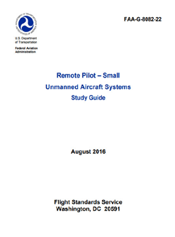
- `image=p135_img02_bafdba764d2a.png` `size=247x333` `bbox_area_ratio=0.0097`

## Page 136

`source: cug-complete_20260122.pdf#page=136`

136
FAA Chart Users’ Guide - References

## Page 137

`source: cug-complete_20260122.pdf#page=137`

A
AAF - Army Air Field
AAS - Airport Advisory Service
AAUP - Attention All Users Page
AC - Advisory Circular
ADF - Automatic Direction Finder
ADIZ - Air Defense Identification Zone
ADS - Automatic Dependent Surveillance
ADS-B - Automatic Dependent Surveillance-Broadcast
Advsry - Advisory
AFB - Air Force Base
AFIS - Automatic Flight Information Service
AFS - Air Force Station
AFSS - Automated Flight Service Station
AGL - Above Ground Level
AIM - Aeronautical Information Manual
AIRAC - Aeronautical Information Regulation And Control
AK - Alaska
AL - Approach and Landing
ANG - Air National Guard
APP - Approach
APP CON - Approach Control
APP CRS - Approach Course
Apt - Airport
APV - Approaches with Vertical Guidance
ARP - Airport Reference Point
ARTCC - Air Route Traffic Control Center
ASDA - Accelerate-Stop Distance Available
ASDE-X - Airport Surface Detection Equipment-Model X
ASOS - Automated Surface Observing Station
ASR - Airport Surveillance Radar
ATC - Air Traffic Control
ATIS - Automatic Terminal Information Service
ATS - Air Traffic Service
AUNICOM - Automated Aeronautical Advisory Station
AWOS - Automated Weather Observing Station
B
Baro-VNAV - Barometric Vertical Navigation
BS - Broadcast Station
C
CAC - Caribbean Aeronautical Chart
CAT - Category
CFA - Controlled Firing Areas
CFR - Code of Federal Regulations
CH - Channel
CLNC DEL - Clearance Delivery
CNF - Computer Navigation Fix
COP - Changeover Point
CPDLC - Controller Pilot Data Link Communication
CRS - Course
CT - Control Tower
CTAF - Common Traffic Advisory Frequency
CVFP - Charted Visual Flight Procedure
CZ - Control Zone (Canada)

D
DA - Decision Altitude
DA - Density Altitude
D-ATIS - Digital Automatic Terminal Information Service
DH - Decision Height
DME - Distance Measuring Equipment
DND - Department of National Defense (Canada) 
DoD - Department of Defense
DOF - Digital Obstacle File
DP - Departure Procedure
DT - Daylight Savings Time
DVA - Diverse Vector Area
E
E - East
EFAS - Enroute Flight Advisory Service
EFB - Electronic Flight Bag
Elev - Elevation
EMAS - Engineered Materials Arresting System
F
FAA - Federal Aviation Administration
FAF - Final Approach Fix
FAP - Final Approach Point
FAR - Federal Aviation Regulation
FBO - Fixed-Based Operator
FIR - Flight Information Region
FL - Flight Level
FLIP - Flight Information Publication
FMS - Flight Management System
FREQ - Frequency
FRZ - Flight Restricted Zone
FSDO - Flight Standards District Office
FSS - Flight Service Station
G
GBAS - Ground-Based Augmentation System
GCO - Ground Communications Outlet
GLS - GBAS Landing System
GND - Ground
GND CON - Ground Control
GNSS - Global Navigation Satellite System
GP - Glide Path
GPS - Global Positioning System
GS - Glide Slope
GS - Ground Speed
ABBREVIATIONS
137
FAA Chart Users’ Guide - Abbreviations

## Page 138

`source: cug-complete_20260122.pdf#page=138`

H
HAA - Height Above Airport 
HAR - High Altitude Redesign 
HAT - Height Above Touchdown
HCH - Heliport Crossing Height
HF - High Frequency
HIRL - High Intensity Runway Lights
HS - Hot Spot
I
IAC - Interagency Air Committee
IACC - Interagency Air Cartographic Committee
IAF - Initial Approach Fix
IAP - Instrument Approach Procedure
ICAO - International Civil Aviation Authority
IDT - Identifier
IF - Intermediate Fix
IFR - Instrument Flight Rules
ILS - Instrument Landing System
IMC - Instrument Meteorological Conditions
INS - Inertial Navigation System
IR - Instrument Route (Military)
IRU - Inertial Reference Unit
J
JO - Joint Order
K
KIAS - Knots
L
LAA - Local Airport Advisory
LAAS - Local Area Augmentation System
LAHSO - Land and Hold Short
LDA - Landing Distance Available 
LDA - Localizer-type Directional Aid
Ldg - Landing
LF - Low Frequency
LIRL - Low Intensity Runway Lights
LNAV - Lateral Navigation
LOC - Localizer
LOM - Locator Outer Marker
LPV - Localizer Performance with Vertical Guidance
LRRS - Long Range Radar Station
LTP - Landing Threshold Point
M
MAA - Maximum Authorized Altitude
MAP - Missed Approach Point
MCA - Minimum Crossing Altitude
MCAS - Marine Corps Air Station
MDA - Minimum Descent Altitude
MDH - Minimum Descent Height
MEA - Minimum Enroute Altitude
MEF - Maximum Elevation Figure
MF - Medium Frequency
MIA - Minimum IFR Altitude
MIRL - Medium Intensity Runway Lights
MOA - Military Operations Areas
MOCA - Minimum Obstruction Clearance Altitude
MON - Minimum Operational Network
MORA - Minimum Off-Route Altitude
MRA - Minimum Reception Altitude
MSA - Minimum Safe Altitude
MSL - Mean Sea Level
MTA - Minimum Turning Altitude
MTR - Military Training Route
MVA - Minimum Vector Altitude
N
N - North
N/A - Not Applicable
NA - Not Authorized
NAAS - Naval Auxiliary Air Station
NAS - Naval Air Station
NAS - National Airspace System
NAV - Naval Air Facility
NAVAID - Navigational Aid (Ground based)
NDB - Non-Directional Radiobeacon
NextGen - Next Generation Air Transportation System
NFDC - National Flight Data Center
NFPO - National Flight Procedures Office
NM - Nautical Mile
NOAA - National Oceanic and Atmospheric Administration
NO A/G - No Air-to-Ground Communication
NOTAM - Notice to Airmen
NoPT - No Procedure Turn
NPA - Non-Precision Approach
NWS - National Weather Service
O
OAT - Outside Air Temperature
OBS - Omni Bearing Selector
OCA - Ocean Control Area
OCS - Obstacle Clearance Surface
ODP - Obstacle Departure Procedure
OM - Outer Marker
OROCA - Off Route Obstruction Clearance Altitude
P
PA - Precision Approach
PAR - Precision Approach Radar
PBN - Performance-Based Navigation
PRM - Precision Runway Monitor
PT - Procedure Turn
PTP - Point-to-Point
Pvt - Private
138
FAA Chart Users’ Guide - Abbreviations

## Page 139

`source: cug-complete_20260122.pdf#page=139`

R
R - Radial
R - Receive
R - Restricted Area (Special Use Airspace)
RCO - Remote Communications Outlet
RCLS - Runway Centerline Lighting Systems
RF - Radius-to-Fix
RNAV - Area Navigation
RNP - Required Navigation Performance
RNP AR - Required Navigation Performance Authorization 
                   Required
ROC - Required Obstacle Clearance
RP - Right Pattern
RVR - Runway Visual Range
RVSM - Reduced Vertical Separation Minimum
Rwy - Runway
S
S - South
SAAAR - Special Aircraft and Aircrew Authorization 
                 Required
SAAR - Special Aircraft and Aircrew Requirements
SATNAV - Satellite Navigation
SDF - Simplified Directional Facility
SER - Start End of Runway
SFAR - Special Flight Rules Area
SFC - Surface
SFRA - Special Flight Rules Area
SIAPs - Standard Instrument Approach Procedures
SID - Standard Instrument Departure
SM - Statute Mile
SMAR - Special Military Activity Routes
SMGCS - Surface Movement Guidance and Control 
                  System
SOIA - Simultaneous Offset Instrument Approaches
SSV - Standard Service Volume
STAR - Standard Terminal Arrival Procedure
SUA - Special Use Airspace
SVFR - Special Visual Flight Rules
T
T - Transmit
TA - Travel Advisory
TAA - Terminal Arrival Area
TAC - Terminal Area Chart
TACAN - Tactical Air Navigation
TAS - True Air Speed
TCA - Terminal Control Areas (Canada)
TCH - Threshold Crossing Height
TDZ - Touchdown Zone
TDZE - Touchdown Zone Elevation
TDZL - Touchdown Zone Lights
TERPS - U.S. Standard for Terminal Instrument Procedures
TFR - Temporary Flight Restriction
TIBS - Telephone Information Briefing Service
TIS-B - Traffic Information Service - Broadcast
TOC - Top of Climb
TOD - Top of Descent
TODA - Takeoff Distance Available
TOGA - Takeoff/Go Around
TORA - Takeoff Runway Available
TPP - Terminal Procedures Publication
TRSA - Terminal Radar Service Area
TWR - Tower
U
UC - Under Construction
UHF - Ultra High Frequency
UIR - Upper Information Region
UNICOM - Universal Communications
U.S. - United States
USA - United States Army
USAF - United States Air Force
USCG - United State Coast Guard
UTA - Upper Control Area
V
VCOA - Visual Climb Over Airport / Airfield
VDA - Vertical Descent Angle
VDP - Visual Decent Point
VFR - Visual Flight Rules
VGSI - Visual Glide Slope Indicator
VHF - Very High Frequency
VMC - Visual Meteorological Conditions
VNAV - Vertical Navigation
VOR - VHF Omnidirectional Radio Range
VORTAC - VHF Omnidirectional Radio Range/Tactical Air 
                    Navigation
VPA - Vertical Path Angle
VR - Visual Route (Military)
W
W - Warning Area (Special Use Airspace)
W - West
WAAS - Wide-Area Augmentation System
WAC - World Aeronautical Chart
WP - Waypoint
WX CAM - Weather Camera (Alaska)
139
FAA Chart Users’ Guide - Abbreviations
