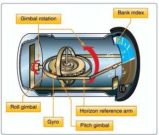
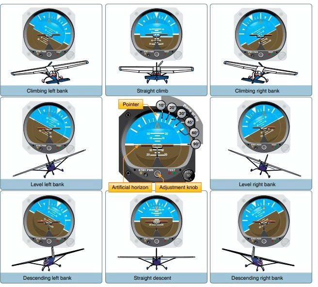

# PHAK_Addendum_C

- Source file: `PHAK_Addendum_C.pdf`
- Total pages: 2
- Relevance: P3 (Broad pilot knowledge reference; use only Part 107-relevant sections.)
- Large images kept: False
- Generated UTC: 2026-02-19T12:27:28.320926+00:00

Each page section below includes extracted text and linked page-clipped images.

## Page 1

`source: PHAK_Addendum_C.pdf#page=1`

FAA-H-8083-25B, Pilot’s Handbook of Aeronautical Knowledge – Addendum C 
March 1, 2023 
Flight Standards Service – Regulatory Support Division – Airman Testing Standards Branch 
Page 1 of 2 
 
FAA 
Flight Standards Service 
Regulatory Support Division 
Airman Testing Standards Branch 
 
FAA-8083-25B, Pilot’s Handbook of Aeronautical Knowledge—Addendum C 
 
Reference: National Transportation Safety Board (NTSB) Recommendation A-14-109. 
 
The NTSB A-14-109 states, “Revise the Pilot’s Handbook of Aeronautical Knowledge (FAA-H-
8083-25) to clarify the information it contains on attitude indicator pitch and bank limitations to 
explain that attitude indicators have pitch and bank indication limits, that the pitch indicating range 
is required to be at least + 25 degrees, and that, if an aircraft operates at a pitch that exceeds the 
indicating limits, the pitch indicator may stop and remain at the limit until the pitch no longer 
exceeds the limitation, or the pitch indicator may tumble.” 
 
The details of this safety recommendations can be accessed at http://www.ntsb.gov.  
 
The following will be included in FAA-H-8083-25, Pilot’s Handbook of Aeronautical Knowledge, 
Chapter 8, Flight Instruments, Attitude Indicator section. Change bars indicate exact change. 
 
Attitude Indicator 
The attitude indicator, with its miniature aircraft and horizon bar, displays a picture of the attitude 
of the aircraft. The relationship of the miniature aircraft to the horizon bar is the same as the 
relationship of the real aircraft to the actual horizon. The instrument gives an instantaneous 
indication of even the smallest changes in attitude.  
 
The gyro in the attitude indicator is mounted in a horizontal plane and depends upon rigidity in 
space for its operation. The horizon bar represents the true horizon. This bar is fixed to the gyro 
and remains in a horizontal plane as the aircraft is pitched or banked about its lateral or 
longitudinal axis, indicating the attitude of the aircraft relative to the true horizon. [Figure 8-23]  
 
Figure 8-23. Attitude indicator.

### Images

- `image=p001_img01_6647be1ffda7.jpeg` `size=320x272` `bbox_area_ratio=0.0532`

- `image=p001_img02_8cc6273c0e38.png` `size=217x218` `bbox_area_ratio=0.0105`

## Page 2

`source: PHAK_Addendum_C.pdf#page=2`

FAA-H-8083-25B, Pilot’s Handbook of Aeronautical Knowledge – Addendum C 
March 1, 2023 
Flight Standards Service – Regulatory Support Division – Airman Testing Standards Branch 
Page 2 of 2 
The gyro spins in the horizontal plane and resists deflection of the rotational path. Since the gyro 
relies on rigidity in space, the aircraft actually rotates around the spinning gyro 
  
An adjustment knob is provided with which the pilot may move the miniature aircraft up or down 
to align the miniature aircraft with the horizon bar to suit the pilot’s line of vision. Normally, the 
miniature aircraft is adjusted so that the wings overlap the horizon bar when the aircraft is in 
straight-and-level cruising flight.  
 
The pitch and bank limits of an attitude indicator depend upon the make and model of the 
instrument. Some attitude indicators have limits in the banking plane from 100° to 110°, and the 
pitch limits can be from 60° to 70°. For those attitude indicators that display only pitch information 
of +/- 25° vertically, the instrument could "peg" (stop) and remain at this pitch indication until the 
pitch no longer exceeds limitation or "tumble" and provide erroneous pitch and bank indications 
when the aircraft exceeds these limits. This may be extremely hazardous when the aircraft is 
operating in instrument meteorological conditions or confuse a pilot during an unusual attitude 
recovery. A number of modern attitude indicators do not have this problem. 
 
Every pilot should be able to interpret the banking scale illustrated in Figure 8-24. Most banking 
scale indicators on the top of the instrument move in the same direction from that in which the 
aircraft is actually banked. Some other models move in the opposite direction from that in which 
the aircraft is actually banked. This may confuse the pilot if the indicator is used to determine the 
direction of bank. This scale should be used only to control the degree of desired bank. The 
relationship of the miniature aircraft to the horizon bar should be used for an indication of the 
direction of bank. The attitude indicator is reliable and the most realistic flight instrument on the 
instrument panel. Its indications are very close approximations of the actual attitude of the 
aircraft.  
 
Figure 8-24. Attitude representation by the attitude indicator corresponds to the relation of the 
aircraft to the real horizon.  
  
 
 
Note: Until the revision of FAA-H-8083-25 is published, this addendum is considered part of the 
current edition of the handbook and should be used as reference.

### Images

- `image=p002_img01_38d57f8f732c.jpeg` `size=656x592` `bbox_area_ratio=0.1249`
