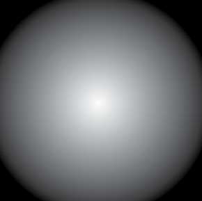
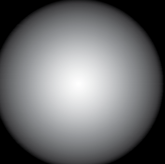
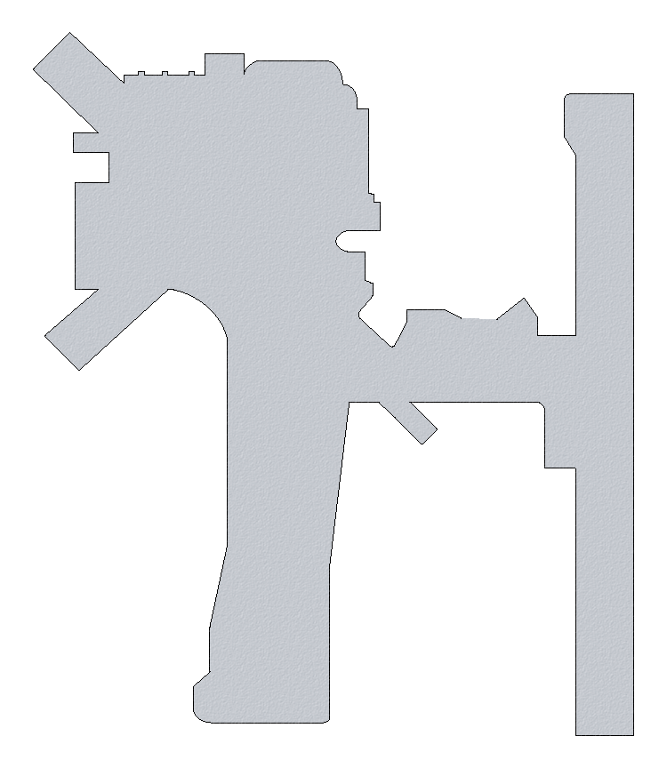

# sport_rec_private_akts

- Source file: `sport_rec_private_akts.pdf`
- Total pages: 113
- Relevance: P1 (Figure/chart source for map and diagram-based questions.)
- Large images kept: True
- Generated UTC: 2026-02-19T12:27:49.401176+00:00

Each page section below includes extracted text and linked page-clipped images.

## Page 1

`source: sport_rec_private_akts.pdf#page=1`

_No extractable text found on this page._

### Images

- `image=p001_img01_5da0044c38ce.png` `size=2484x3234` `bbox_area_ratio=1.0`

## Page 2

`source: sport_rec_private_akts.pdf#page=2`

_No extractable text found on this page._

## Page 3

`source: sport_rec_private_akts.pdf#page=3`

Airman Knowledge Testing 
Supplement for Sport Pilot, 
Recreational Pilot, Remote 
Pilot, and Private Pilot
U.S. Department of Transportation
FEDERAL AVIATION ADMINISTRATION
Flight Standards Service
2018

### Images

- `image=p003_img01_3daaf49ded87.png` `size=1520x852` `bbox_area_ratio=0.2265`

- `image=p003_img02_f91d16db6bf4.png` `size=1436x388` `bbox_area_ratio=0.0113`

## Page 4

`source: sport_rec_private_akts.pdf#page=4`

ii

## Page 5

`source: sport_rec_private_akts.pdf#page=5`

iii
This testing supplement supersedes FAA-CT-8080-2G, Airman Knowledge Testing Supplement for Sport Pilot, Recreational 
Pilot, and Private Pilot, dated 2016.
This Airman Knowledge Testing Supplement is designed by the Federal Aviation Administration (FAA) Flight Standards 
Service. It is intended for use by Airman Knowledge Testing (AKT) Organization Designation Authorization (ODA) 
Holders and other entities approved and/or authorized to administer airman knowledge tests on behalf of the FAA in the 
following knowledge areas:
Sport Pilot–Airplane (ASEL and ASES)
Sport Pilot–Gyroplane
Sport Pilot–Glider
Sport Pilot–Airship (LTA)
Sport Pilot–Balloon (LTA)
Sport Pilot–Weight-Shift Control (WSCS and WSCL)
Sport Pilot–Powered Parachute (PPL and PPS)
Recreational Pilot–Airplane (RPA)
Recreational Pilot–Rotorcraft/Helicopter (RPH)
Recreational Pilot–Rotorcraft/Gyroplane (RPG)
Private Pilot–Airplane/Recreational Pilot–Transition (PAT)
Private Pilot–Helicopter/Recreational Pilot–Transition (PHT)
Private Pilot–Gyroplane/Recreational Pilot–Transition (POT)
Private Pilot–Airplane (PAR)
Private Pilot–Rotorcraft/Helicopter (PRH)
Private Pilot–Rotorcraft/Gyroplane (PRO)
Private Pilot–Glider (POL)
Private Pilot–Free Balloon–Hot Air (PBH)
Private Pilot–Free Balloon–Gas (PBG)
Private Pilot–Lighter-Than-Air–Airship (PLA)
Private Pilot–Powered-Parachute (PPP)
Private Pilot–Weight-shift Control (PWS)
Unmanned Aircraft General–Small (UAG)
Comments regarding this supplement, or any Airman Testing publication, should be emailed to AFS630comments@faa.gov.
Preface

### Images

- `image=p005_img01_4d8d60e625ac.png` `size=1436x260` `bbox_area_ratio=0.0126`

## Page 6

`source: sport_rec_private_akts.pdf#page=6`

iv

## Page 7

`source: sport_rec_private_akts.pdf#page=7`

v
Contents
Preface.............................................................................................................................................................. iii
Contents............................................................................................................................................................. v
Appendix 1
Legend 1.  Sectional Aeronautical Chart..............................................................................................................................1-1
Legend 2.  Chart Supplement..............................................................................................................................................1-2
Legend 3.  Chart Supplement..............................................................................................................................................1-3
Legend 4.  Chart Supplement..............................................................................................................................................1-4
Legend 5.  Chart Supplement..............................................................................................................................................1-5
Legend 6.  Chart Supplement..............................................................................................................................................1-6
Legend 7.  Chart Supplement..............................................................................................................................................1-7
Legend 8.  Chart Supplement..............................................................................................................................................1-8
Legend 9.  Chart Supplement..............................................................................................................................................1-9
Legend 10.  Chart Supplement..........................................................................................................................................1-10
Legend 11.  Chart Supplement..........................................................................................................................................1-11
Legend 12.  Chart Supplement..........................................................................................................................................1-12
Legend 13.  Chart Supplement..........................................................................................................................................1-13
Legend 14.  Chart Supplement..........................................................................................................................................1-14
Legend 15.  Chart Supplement..........................................................................................................................................1-15
Legend 16.  Chart Supplement..........................................................................................................................................1-16
Legend 17.  Chart Supplement..........................................................................................................................................1-17
Legend 18.  Chart Supplement..........................................................................................................................................1-18
Legend 19.  Chart Supplement..........................................................................................................................................1-19
Appendix 2
Figure 1.  Lift Vector.............................................................................................................................................................2-1
Figure 2.  Load Factor Chart................................................................................................................................................2-2
Figure 3.  Altimeter...............................................................................................................................................................2-3
Figure 4.  Airspeed Indicator................................................................................................................................................2-4
Figure 5.  Turn Coordinator..................................................................................................................................................2-5
Figure 6.  Heading Indicator.................................................................................................................................................2-6
Figure 7.  Attitude Indicator..................................................................................................................................................2-7
Figure 8.  Density Altitude Chart..........................................................................................................................................2-8
Figure 9.  Control Position for Taxi.......................................................................................................................................2-9
Figure 10.  Gyroplane Rotor Blade Position.......................................................................................................................2-10
Figure 11.  Glider Yaw String..............................................................................................................................................2-11
Figure 12.  Aviation Routine Weather Reports (METAR)...................................................................................................2-12
Figure 13.  Telephone Weather Briefing.............................................................................................................................2-13
Figure 14.  Pilot Weather Report........................................................................................................................................2-14
Figure 15.  Terminal Aerodrome Forecasts (TAF)..............................................................................................................2-15
Figure 17.  Winds and Temperatures Aloft Forecast..........................................................................................................2-16
Figure 18.  Weather Depiction Chart..................................................................................................................................2-17
Figure 19.  Low-Level Significant Weather (SIGWX) Prognostic Charts...........................................................................2-18
Figure 20.  Sectional Chart Excerpt. .................................................................................................................................2-19
Figure 21.  Sectional Chart Excerpt. .................................................................................................................................2-20
Figure 22.  Sectional Chart Excerpt. .................................................................................................................................2-21

### Images

- `image=p007_img01_3340985239e8.png` `size=1436x252` `bbox_area_ratio=0.0143`

## Page 8

`source: sport_rec_private_akts.pdf#page=8`

vi
Figure 23.  Sectional Chart Excerpt. .................................................................................................................................2-22
Figure 24.  Sectional Chart Excerpt. .................................................................................................................................2-23
Figure 25.  Sectional Chart Excerpt. .................................................................................................................................2-24
Figure 26.  Sectional Chart Excerpt. .................................................................................................................................2-25
Figure 27.  Time Conversion Table....................................................................................................................................2-26
Figure 28.  VOR.................................................................................................................................................................2-27
Figure 31.  Chart Supplement............................................................................................................................................2-28
Figure 32.  Airplane Weight and Balance Tables...............................................................................................................2-29
Figure 33.  Airplane Weight and Balance Tables...............................................................................................................2-30
Figure 34.  Airplane Weight and Balance Graphs..............................................................................................................2-31
Figure 35.  Airplane Power Setting Table...........................................................................................................................2-32
Figure 36.  Crosswind Component Graph..........................................................................................................................2-33
Figure 37.  Airplane Landing Distance Graph....................................................................................................................2-34
Figure 38.  Airplane Landing Distance Table......................................................................................................................2-35
Figure 39.  Gyroplane Takeoff and Landing Graphs..........................................................................................................2-36
Figure 40.  Airplane Takeoff Distance Graph.....................................................................................................................2-37
Figure 41.  Helicopter Weight and Balance Graph.............................................................................................................2-38
Figure 42.  Helicopter Weight and Balance Graphs...........................................................................................................2-39
Figure 43.  Helicopter CG Envelopes.................................................................................................................................2-40
Figure 44.  Gyroplane Weight and Balance Graph............................................................................................................2-41
Figure 45.  Gyroplane Weight and Balance Graph. ..........................................................................................................2-42
Figure 46.  Helicopter Height Velocity Diagram.................................................................................................................2-43
Figure 47.  VASI Illustrations..............................................................................................................................................2-44
Figure 48.  Airport Diagram................................................................................................................................................2-45
Figure 49.  Airport Diagram................................................................................................................................................2-46
Figure 50.  Wind Sock Airport Landing Indicator................................................................................................................2-47
Figure 51.  Flight Plan Form...............................................................................................................................................2-48
Figure 52.  Chart Supplement............................................................................................................................................2-49
Figure 53.  Glider Weight and Balance Diagram................................................................................................................2-50
Figure 54.  Glider Performance Graph...............................................................................................................................2-51
Figure 56.  Hot Air Balloon Performance Graph.................................................................................................................2-53
Figure 57.  Hot Air Balloon Performance Graph.................................................................................................................2-54
Figure 58.  Compass Card.................................................................................................................................................2-55
Figure 59.  Sectional Chart Excerpt...................................................................................................................................2-56
Figure 60.  Weight and Balance Diagram..........................................................................................................................2-57
Figure 61.  Weight and Balance Diagram..........................................................................................................................2-58
Figure 62.  Rectangular Course.........................................................................................................................................2-59
Figure 63.  Chart Supplement............................................................................................................................................2-60
Figure 64.  Airport Markings...............................................................................................................................................2-61
Figure 65.  U.S. Airport Signs.............................................................................................................................................2-62
Figure 66.  S-Turn Diagram...............................................................................................................................................2-63
Figure 67.  Weight and Balance Chart...............................................................................................................................2-64
Figure 68.  Wind Triangle...................................................................................................................................................2-65
Figure 69.  Sectional Chart Excerpt...................................................................................................................................2-66
Figure 70.  Sectional Chart Excerpt...................................................................................................................................2-67
Figure 71.  Sectional Chart Excerpt...................................................................................................................................2-68
Figure 72.  Velocity vs. G-Loads........................................................................................................................................2-69
Figure 73.  Glider Hand Signals.........................................................................................................................................2-70
Figure 74.  Sectional Chart Excerpt...................................................................................................................................2-71
Figure 75.  Sectional Chart Excerpt...................................................................................................................................2-72
Figure 76.  Sectional Chart Excerpt...................................................................................................................................2-73

## Page 9

`source: sport_rec_private_akts.pdf#page=9`

vii
Figure 77.  Chart Supplement............................................................................................................................................2-74
Figure 78.  Sectional Chart Excerpt...................................................................................................................................2-75
Figure 79.  Chart Supplement............................................................................................................................................2-76
Figure 80.  Sectional Chart Excerpt...................................................................................................................................2-77
Figure 81.  Chart Supplement............................................................................................................................................2-78
Figure 82.  Altimeter...........................................................................................................................................................2-79

## Page 10

`source: sport_rec_private_akts.pdf#page=10`

viii

## Page 11

`source: sport_rec_private_akts.pdf#page=11`

Appendix 1

### Images

- `image=p011_img01_eea5e1f9879f.png` `size=1436x264` `bbox_area_ratio=0.0284`

## Page 12

`source: sport_rec_private_akts.pdf#page=12`

_No extractable text found on this page._

## Page 13

`source: sport_rec_private_akts.pdf#page=13`

1-1
Appendix 1
LEGEND
SECTIONAL AERONAUTICAL CHART
SCALE 1:500,000
Airports having control towers are shown in blue, all others in magenta. Consult Chart Supplement for details involving airport lighting, navigation aids, and services. For additional symbol information refer to the Chart User’s Guide. 
Only the controlled and reserved airspace
effective below 18,000 ft. MSL are shown 
on this chart. All times are local.
Class B Airspace
Roads &
Road Markers
Railroad
Power Transmission Lines
Aerial Cable
Coast Guard Station
CG
Race Track
Tank-water, oil or gas
Oil Well        Water Well
Mine or Quarry
Mountain Pass
11823 (Elevation of Pass)
Landmark Feature - stadium, factory,
school, golf course, etc.
Outdoor Theater
Lookout Tower 
618 (Elevation Base of Tower)
Ultralight 
Activity
Isogonic Line (2010 VALUE)
Marine Light
Hang Glider
Activity
Glider Operations
Parachute Jumping Area
(See Chart Supplement.)
VFR Waypoints (See 
Chart Supplement 
for latitude/longitude).
Class D Airspace
Class E (sfc) Airspace
2400 MSL
4500 MSL
Class E Airspace with floor 
700 ft. above surface.
Class E Airspace with floor 
1200 ft. or greater above 
surface that abuts Class G 
Airspace.
Differentiates floors of 
Class E Airspace greater 
than 700 ft. above surface.
Class E Airspace exists at 1200' AGL unless 
otherwise designated as shown above.
Class E Airspace low altitude Federal 
Airways are indicated by center line.
Intersection - Arrows are directed towards 
facilities which establish intersection.
Ceiling of Class D Airspace
in hundreds of feet. (A minus 
ceiling value indicates surface 
up to but not including that 
value).
Class C Airspace (mode C
See FAR 91.215/AIM.)
AIRPORT DATA
AIRPORT TRAFFIC SERVICE AND AIRSPACE INFORMATION
TOPOGRAPHIC INFORMATION
OBSTRUCTIONS
MISCELLANEOUS
FSS – Flight Service Station
NO SVFR – Fixed wing special VFR flight is prohibited.
CT– 118.3 – Control Tower (CT) primary frequency
   – Star indicates operation part-time (see tower frequencies
tabulation for hours of operation).
      – Indicates Common Traffic Advisory Frequencies (CTAF)
ATIS 123.8 – Automatic Terminal Information Service
ASOS/AWOS 135.42 – Automated Surface Weather Observing
Systems (shown where full-time ATIS is not available). 
Some ASOS/AWOS facilities may not be located at airports.
UNICOM – Aeronoutical advisory station
VFR Advsy – VFR Advisory Service shown where full-time ATIS 
not available and frequency is other than primary CT frequency.
285 – Elevation in feet
  L – Lighting in operation sunset to sunrise
     L – Lighting limitations exist, refer to Airport/Facility 
       Directory.
  72 – Length of longest runway in hundreds of feet;
         usable length may be less.
When information is lacking, the respective charactor is 
replaced by a dash. Lighting codes refer to runway edge lights 
and may not represent the longest runway or full length lighting. 
Box indicators FAR 93
Special Air Traffic 
Rules & Airport 
Traffic Patterns
Runways with 
Right Traffic Patterns 
(public use)
RP   Special conditions 
exist - see Chart Supplement
Location
identifier
ICAO
Location 
indicator 
shown 
outside 
contiguous 
U.S.
UNICOM
Airport 
of Entry
285 L 72 122.95
RP 23, 34
VFR Advsy 125.0
AOE
FAR 91
FSS
NO SVFR
(NAM)(PNAM)
NAME
ATIS  123.8
CT – 118.3
C
C
V 69
132°
1000 ft. and higher AGL
                  below 1000 ft. AGL
Group Obstruction
NOTICE: Guy wires may extend outward 
from structures.
Obstruction with high-intensity lights
   May operate part-time
Elevation of the top above 
mean sea level
Height above ground
Under construction or 
reported; position and 
elevation unverified.
or
2049
(1149)
UC
or
U
H
G
Unmanned Aircraft Activity
UA
1° E
40
169
TK313
RNAV
(helicopter only)
waypoint
T319
95
40
AIRPORTS
ADDITIONAL AIRPORT INFORMATION
Other than hard-surfaced runways
Hard-surfaced runways 1500 ft. to 8069 ft. in length
Hard-surfaced runways greater than 8069 ft., or same 
multiple runways less than 8069 ft.
Open dot within hard-surfaced runway configuration
indicates approxmate VOR, VOR-DME, or VORTAC 
location.
All recognizable hard-surfaced runways, including those closed, are 
shown for visual identification. Airports may be public or private.
Restricted or Private – (Soft surfaced runway, or hard surfaced
  
runway less than 1500' in length.) Use only in 
 
emergency, or by specific authorization.
Military –  Other than hard-surfaced. All military airports are 
 
identified by abbreviations AFB, NAS, AAF, etc.
 
For complete airport information, consult DOD FLIP.
Abandoned–paved,
having landmark value,
3000 ft. or greater
Ultralight
Flight Park
Selected
Heliport
Selected
Unverified
Services–fuel available and field attended during normal working
hours depicted by use of ticks around basic airport symbol. (Normal 
working hours are Mon thru Fri 10:00 A.M. to 4:00 P.M. local time. 
Consult Chart Supplement for service availability at airports with
hard-surfaced runways greater than 8069 ft. 
       Rotating airport beacon in operation Sunset to Sunrise
Seaplane Base
R
H
U
F
 
 
Prohibited, Restricted, 
 
and Warning Areas; 
 
Canadian Advisory, 
 
Danger, and Restricted 
 
Areas.
 
Alert Area and MOA - 
 
Military Operations 
 
Area
 
Special Airport Traffic 
 
Area (See FAR Part 93 
 
for details)
 
ADIZ - Air Defense 
 
Identification Zone
 
Mode C 
 
(See FAR 91.215/AIM). 
 
National Security Area
 
Terminal Radar Service 
 
Area (TRSA)
 
MTR - Military Training 
 
Route
IR211
VHF OMNI RANGE (VOR)
VORTAC
VOR-DME
Non-Directional
Radiobeacon (NDB)
NDB-DME
Other facilities. i.e., FSS Outlet,
RCO, etc.
RADIO AIDS TO NAVIGATION 
COMMUNICATION BOXES
Frequencies above thin line box are remoted to 
NAVAID site. Other FSS frequencies providing voice 
communication may be available as determined by 
altitude and terrain. Consult Chart Supplement
for complete information.
Heavy line box indicates Flight Service Station (FSS). 
Frequencies 121.5, 122.2, 243.0 and 255.4 
(Canada - 121.5, 126.7 and 243.0) are available at many 
FSSs and are not shown above boxes. All other 
frequencies are shown.
Certain FSSs provide Airport 
Advisory Service, see Chart Supplement.
R - Receive Only.
CHICAGO CHI
122.1R
MIAMI
122.1R
OAKDALE
116.8  OAK
382
122.1R 122.6  123.6
H
Underline indicates
no voice on this frequency.
Crosshatch indicates
Shutdown Status
FSS radio
providing voice 
communication
Operates less than
continuous or On-Request.
ASOS/AWOS                         
HIWAS
A
H
NAME 
(VPXYZ)
(Pass symbol does not indicate a 
recommended route or direction of flight
and pass elevation does not indicate a 
recommended clearance altitude.
Hazardous flight conditions may exist 
within and near mountain passes).
Dams
Bridges and Viaducts
Perennial Lake
Non-Perennial Lake
Pier
Rocks
Total mileage
between NAVAID, on direct Airways
Class E Airspace low altitude RNAV routes 
are indicated by center line.
Legend 1.  Sectional Aeronautical Chart.

## Page 14

`source: sport_rec_private_akts.pdf#page=14`

1-2
Appendix 1
Legend 2.  Chart Supplement.

### Images

- `image=p014_img01_5fe73aa1b4e7.png` `size=1701x2643` `bbox_area_ratio=0.5632`

## Page 15

`source: sport_rec_private_akts.pdf#page=15`

1-3
Appendix 1
Legend 3.  Chart Supplement.

### Images

- `image=p015_img01_9fda844f6152.png` `size=1701x2643` `bbox_area_ratio=0.5632`

## Page 16

`source: sport_rec_private_akts.pdf#page=16`

1-4
Appendix 1
Legend 4.  Chart Supplement.

### Images

- `image=p016_img01_e6aa648316a9.png` `size=1701x2643` `bbox_area_ratio=0.5632`

## Page 17

`source: sport_rec_private_akts.pdf#page=17`

1-5
Appendix 1
Legend 5.  Chart Supplement.

### Images

- `image=p017_img01_3fe6a37f6707.png` `size=1701x2643` `bbox_area_ratio=0.5632`

## Page 18

`source: sport_rec_private_akts.pdf#page=18`

1-6
Appendix 1
Legend 6.  Chart Supplement.

### Images

- `image=p018_img01_3bef18008e1a.png` `size=1701x2643` `bbox_area_ratio=0.5632`

## Page 19

`source: sport_rec_private_akts.pdf#page=19`

1-7
Appendix 1
Legend 7.  Chart Supplement.

### Images

- `image=p019_img01_bab82b45ef50.png` `size=1701x2643` `bbox_area_ratio=0.5632`

## Page 20

`source: sport_rec_private_akts.pdf#page=20`

1-8
Appendix 1
Legend 8.  Chart Supplement.

### Images

- `image=p020_img01_a16095f0877c.png` `size=1701x2643` `bbox_area_ratio=0.5632`

## Page 21

`source: sport_rec_private_akts.pdf#page=21`

1-9
Appendix 1
Legend 9.  Chart Supplement.

### Images

- `image=p021_img01_ad15649b1f57.png` `size=1701x2643` `bbox_area_ratio=0.5632`

## Page 22

`source: sport_rec_private_akts.pdf#page=22`

1-10
Appendix 1
Legend 10.  Chart Supplement.

### Images

- `image=p022_img01_d74b18577444.png` `size=1701x2643` `bbox_area_ratio=0.5632`

## Page 23

`source: sport_rec_private_akts.pdf#page=23`

1-11
Appendix 1
Legend 11.  Chart Supplement.

### Images

- `image=p023_img01_133cd51c16a3.png` `size=1701x2643` `bbox_area_ratio=0.5632`

## Page 24

`source: sport_rec_private_akts.pdf#page=24`

1-12
Appendix 1
Legend 12.  Chart Supplement.

### Images

- `image=p024_img01_621e1e71c0ed.png` `size=1701x2643` `bbox_area_ratio=0.5632`

## Page 25

`source: sport_rec_private_akts.pdf#page=25`

1-13
Appendix 1
Legend 13.  Chart Supplement.

### Images

- `image=p025_img01_79051f0cac72.png` `size=1701x2643` `bbox_area_ratio=0.5632`

## Page 26

`source: sport_rec_private_akts.pdf#page=26`

1-14
Appendix 1
Legend 14.  Chart Supplement.

### Images

- `image=p026_img01_f3f87378c6b2.png` `size=1701x2643` `bbox_area_ratio=0.5632`

## Page 27

`source: sport_rec_private_akts.pdf#page=27`

1-15
Appendix 1
Legend 15.  Chart Supplement.

### Images

- `image=p027_img01_4011d34e6a10.png` `size=1701x2643` `bbox_area_ratio=0.5632`

## Page 28

`source: sport_rec_private_akts.pdf#page=28`

1-16
Appendix 1
Legend 16.  Chart Supplement.

### Images

- `image=p028_img01_4e3d8fb44682.png` `size=1701x2643` `bbox_area_ratio=0.5632`

## Page 29

`source: sport_rec_private_akts.pdf#page=29`

1-17
Appendix 1
Legend 17.  Chart Supplement.

### Images

- `image=p029_img01_0607f37ae1b1.png` `size=1701x2643` `bbox_area_ratio=0.5632`

## Page 30

`source: sport_rec_private_akts.pdf#page=30`

1-18
Appendix 1
Legend 18.  Chart Supplement.

### Images

- `image=p030_img01_b781c8b15c3a.png` `size=1701x2643` `bbox_area_ratio=0.5632`

## Page 31

`source: sport_rec_private_akts.pdf#page=31`

1-19
Appendix 1
Legend 19.  Chart Supplement.

### Images

- `image=p031_img01_a4dc5e95bbbb.png` `size=1701x2643` `bbox_area_ratio=0.5632`

## Page 32

`source: sport_rec_private_akts.pdf#page=32`

1-20
Appendix 1

## Page 33

`source: sport_rec_private_akts.pdf#page=33`

Appendix 2

### Images

- `image=p033_img01_c32e64e1020b.png` `size=1436x264` `bbox_area_ratio=0.0303`

## Page 34

`source: sport_rec_private_akts.pdf#page=34`

_No extractable text found on this page._

## Page 35

`source: sport_rec_private_akts.pdf#page=35`

2-1
Appendix 2
Relative wind
Center of pressure
Chord line
Lift
Drag
Resultant
Force
A
Figure 1.  Lift Vector.

## Page 36

`source: sport_rec_private_akts.pdf#page=36`

2-2
Appendix 2
0°
10°
30°
45°
60°
70°
80°
85°
90°
 
1.0
 
1.015
 
1.154
 
1.414
 
2.000
 
2.923
 
5.747
 
11.473
        ∞
Load 
factor
n
Angle of 
bank
o
Load factor chart
Bank angle – in degrees
Load factor – G units
9
8
7
6
5
4
3
2
1
0 10 20 30 40 50 60 70 80 90
Figure 2.  Load Factor Chart.

## Page 37

`source: sport_rec_private_akts.pdf#page=37`

2-3
Appendix 2
29.6
29.5
29.4
I00
FEET
I
4
5
6
7
9
2
0
8
3
 
 
 
 
 
1
0
0
0
 
F
E
E
T
 
1
0
0
0
 
F
E
E
T
29.6
29.5
29.4
I00
FEET
I
4
5
6
7
9
2
0
8
3
 
 
 
 
 
1
0
0
0
 
F
E
E
T
 
1
0
0
0
 
F
E
E
T
29.6
29.5
29.4
I00
FEET
I
4
5
6
7
9
2
0
8
3
 
 
 
 
 
1
0
0
0
 
F
E
E
T
 
1
0
0
0
 
F
E
E
T
1
2
3
Figure 3.  Altimeter.

### Images

- `image=p037_img01_284f28a3dda1.png` `size=721x720` `bbox_area_ratio=0.1116`

- `image=p037_img02_edda15be5634.png` `size=164x164` `bbox_area_ratio=0.0581`

- `image=p037_img03_7ed5931db8a3.png` `size=172x171` `bbox_area_ratio=0.0633`

- `image=p037_img04_01ab16918280.png` `size=379x379` `bbox_area_ratio=0.0309`

- `image=p037_img05_61aa29d6dc00.png` `size=164x164` `bbox_area_ratio=0.0581`

- `image=p037_img06_42cb21a10fba.png` `size=172x171` `bbox_area_ratio=0.0633`

- `image=p037_img07_cd1bbd04810a.png` `size=164x164` `bbox_area_ratio=0.0581`

- `image=p037_img08_513a73275922.png` `size=172x171` `bbox_area_ratio=0.0633`

## Page 38

`source: sport_rec_private_akts.pdf#page=38`

2-4
Appendix 2
40
60
80
100
140
160
180
200
220
240
Figure 4.  Airspeed Indicator.

### Images

- `image=p038_img01_47f023692874.png` `size=745x746` `bbox_area_ratio=0.2848`

- `image=p038_img02_e130c7c11955.png` `size=268x267` `bbox_area_ratio=0.1544`

- `image=p038_img03_c7b1ecbd704f.png` `size=298x297` `bbox_area_ratio=0.1904`

- `image=p038_img04_d2228eff8145.png` `size=300x297` `bbox_area_ratio=0.193`

## Page 39

`source: sport_rec_private_akts.pdf#page=39`

2-5
Appendix 2
TURN COORDINATOR
2  MIN.
D.C.
ELEC.
L
R
NO  PITCH
INFORMATION
Figure 5.  Turn Coordinator.

### Images

- `image=p039_img01_7d420d4813f4.png` `size=744x744` `bbox_area_ratio=0.2877`

- `image=p039_img02_0080a09d01d2.png` `size=289x287` `bbox_area_ratio=0.1793`

- `image=p039_img03_cae30df3d6ca.png` `size=301x299` `bbox_area_ratio=0.1942`

- `image=p039_img04_ca63cb97c5ea.png` `size=290x289` `bbox_area_ratio=0.181`

## Page 40

`source: sport_rec_private_akts.pdf#page=40`

2-6
Appendix 2
33
30
24
2I
I5
I2
6
3
Figure 6.  Heading Indicator.

### Images

- `image=p040_img01_08023c1ec7ed.png` `size=754x741` `bbox_area_ratio=0.2927`

- `image=p040_img02_cdfbd711f72f.png` `size=271x270` `bbox_area_ratio=0.1579`

- `image=p040_img03_66f3c5e64f9a.png` `size=271x271` `bbox_area_ratio=0.1583`

- `image=p040_img04_0d43a866a425.png` `size=300x297` `bbox_area_ratio=0.192`

## Page 41

`source: sport_rec_private_akts.pdf#page=41`

2-7
Appendix 2
B
A
B
C
Figure 7.  Attitude Indicator.

### Images

- `image=p041_img01_85bde157a5f9.png` `size=797x749` `bbox_area_ratio=0.4065`

- `image=p041_img02_9575b36e7ead.png` `size=242x227` `bbox_area_ratio=0.1188`

- `image=p041_img03_182e0d311e36.png` `size=247x159` `bbox_area_ratio=0.0848`

- `image=p041_img04_85dcd9b98c9f.png` `size=311x311` `bbox_area_ratio=0.2095`

- `image=p041_img05_ac17e4a040cc.png` `size=308x308` `bbox_area_ratio=0.2047`

- `image=p041_img06_00daec1a99dc.png` `size=307x196` `bbox_area_ratio=0.1298`

- `image=p041_img07_ff671e94b7f5.png` `size=307x169` `bbox_area_ratio=0.1119`

- `image=p041_img08_a3401ef40d4e.png` `size=336x293` `bbox_area_ratio=0.2128`

- `image=p041_img09_c4a7502d767b.png` `size=342x340` `bbox_area_ratio=0.2521`

## Page 42

`source: sport_rec_private_akts.pdf#page=42`

2-8
Appendix 2
DENSITY ALTITUDE CHART
Outside air temperature
Approximate density altitude (thousand feet)
15
14
13
12
11
10
9
8
7
6
5
4
3
2
1
S.L.
°C -18° 
-12° 
-7° 
-1° 
4° 
10° 
16° 
21° 
27° 
32° 
38° 
43°
°F 0° 
10° 
20° 
30° 
40° 
50° 
60° 
70° 
80° 
90° 
100° 
110° 
 
28.0 
1,824
28.1 
1,727
28.2 
1,630
28.3 
1,533
28.4 
1,436
28.5 
1,340
28.6 
1,244
28.7 
1,148
28.8 
1,053
28.9 
957
29.0 
863
29.1 
768
29.2 
673
29.3 
579
29.4 
485
29.5 
392
29.6 
298
29.7 
205
29.8 
112
29.9 
20
29.92 
0
30.0 
−73
30.1 
−165
30.2 
−257
30.3 
−348
30.4 
−440
30.5 
−531
30.6 
−622
30.7 
−712
30.8 
−803
30.9 
−893
31.0 
−983
Altimeter setting 
("Hg)
Pressure altitude
conversion factor
14,000
13,000
12,000
11,000
10,000
9,000       Pressure altitude (feet)
8,000
7,000
6,000
5,000
4,000
3,000
2,000
1,000
–1,000
Sea level
Standard temperature
Figure 8.  Density Altitude Chart.

## Page 43

`source: sport_rec_private_akts.pdf#page=43`

2-9
Appendix 2
A
B
C
D
Figure 9.  Control Position for Taxi.

### Images

- `image=p043_img01_73474fb25c08.png` `size=486x444` `bbox_area_ratio=0.4688`

## Page 44

`source: sport_rec_private_akts.pdf#page=44`

2-10
Appendix 2
A
B
C
D
Figure 10.  Gyroplane Rotor Blade Position.

### Images

- `image=p044_img01_29ee8906c5ef.png` `size=377x374` `bbox_area_ratio=0.3061`

## Page 45

`source: sport_rec_private_akts.pdf#page=45`

2-11
Appendix 2
OFF
GO
L
NET
AVG
PULL
PUSH
0
2
4
6
8
10
-2
-4
Acceleration
G UNITS
160
40
140
60
120
80
20
100
knots
0
2
2
4
4
6
6
8
8
10
10
knots
winter
5
0 
  
  
  
  
  
  
  
6
0
  
  
  
  
  
  
  
  
  
 7
0 
  
  
  
  
  
  
  
  
  
 8
0 
  
  
  
  
  
  
  
  
  
9
0 
  
  
  
  
  
  
  
  
  
  
  
  
  
  
  
  
  
  
1
0
0
k
n
o
t
s 
  
 
S
A
L
T
O
OFF
GO
L
NET
AVG
PULL
PUSH
0
2
4
6
8
10
-2
-4
Acceleration
G UNITS
160
40
140
60
120
80
20
100
knots
0
2
2
4
4
6
6
8
8
10
10
knots
winter
5
0 
  
  
  
  
  
  
  
6
0
  
  
  
  
  
  
  
  
  
 7
0 
  
  
  
  
  
  
  
  
  
 8
0 
  
  
  
  
  
  
  
  
  
9
0 
  
  
  
  
  
  
  
  
  
  
  
  
  
  
  
  
  
  
1
0
0
k
n
o
t
s 
  
 
S
A
L
T
O
OFF
GO
L
NET
AVG
PULL
PUSH
0
2
4
6
8
10
-2
-4
Acceleration
G UNITS
160
40
140
60
120
80
20
100
knots
0
2
2
4
4
6
6
8
8
10
10
knots
winter
5
0 
  
  
  
  
  
  
  
6
0
  
  
  
  
  
  
  
  
  
 7
0 
  
  
  
  
  
  
  
  
  
 8
0 
  
  
  
  
  
  
  
  
  
9
0 
  
  
  
  
  
  
  
  
  
  
  
  
  
  
  
  
  
  
1
0
0
k
n
o
t
s 
  
 
S
A
L
T
O
30.0
29.9
29.8
I00
FEET
I
4
5
6
7
9
2
0
8
3
CALIBRATED
TO 
20,000 FEET
ALT
OFF
GO
L
NAV
NET
AVG
PULL
PUSH
HW
DIST
ALT
PUSH
0
2
4
6
8
10
-2
-4
Acceleration
G UNITS
N 
30 
60 
E 
120 150
STEER
FOR
S 
210 240 
W 
300 330
STEER
RADIO
FOR
ON
ON
160
40
140
60
120
80
20
100
knots
0
2
2
4
4
6
6
8
8
10
10
knots
winter
5
0 
  
  
  
  
  
  
  
6
0
  
  
  
  
  
  
  
  
  
 7
0 
  
  
  
  
  
  
  
  
  
 8
0 
  
  
  
  
  
  
  
  
  
9
0 
  
  
  
  
  
  
  
  
  
  
  
  
  
  
  
  
  
  
1
0
0
k
n
o
t
s 
  
 
S
A
L
T
O
+
−
PWR
FNCN
SEL
VOL BATT
KNOTS
PUSH
30.0
29.9
29.8
I00
FEET
I
4
5
6
7
9
2
0
8
3
CALIBRATED
TO 
20,000 FEET
ALT
OFF
GO
L
NAV
NET
AVG
PULL
PUSH
HW
DIST
ALT
PUSH
0
2
4
6
8
10
-2
-4
Acceleration
G UNITS
N 
30 
60 
E 
120 150
STEER
FOR
S 
210 240 
W 
300 330
STEER
RADIO
FOR
ON
ON
160
40
140
60
120
80
20
100
knots
0
2
2
4
4
6
6
8
8
10
10
knots
winter
5
0 
  
  
  
  
  
  
  
6
0
  
  
  
  
  
  
  
  
  
 7
0 
  
  
  
  
  
  
  
  
  
 8
0 
  
  
  
  
  
  
  
  
  
9
0 
  
  
  
  
  
  
  
  
  
  
  
  
  
  
  
  
  
  
1
0
0
k
n
o
t
s 
  
 
S
A
L
T
O
+
−
PWR
FNCN
SEL
VOL BATT
KNOTS
PUSH
30.0
29.9
29.8
I00
FEET
I
4
5
6
7
9
2
0
8
3
CALIBRATED
TO 
20,000 FEET
ALT
OFF
GO
L
NAV
NET
AVG
PULL
PUSH
HW
DIST
ALT
PUSH
0
2
4
6
8
10
-2
-4
Acceleration
G UNITS
N 
30 
60 
E 
120 150
STEER
FOR
S 
210 240 
W 
300 330
STEER
RADIO
FOR
ON
ON
160
40
140
60
120
80
20
100
knots
0
2
2
4
4
6
6
8
8
10
10
knots
winter
5
0 
  
  
  
  
  
  
  
6
0
  
  
  
  
  
  
  
  
  
 7
0 
  
  
  
  
  
  
  
  
  
 8
0 
  
  
  
  
  
  
  
  
  
9
0 
  
  
  
  
  
  
  
  
  
  
  
  
  
  
  
  
  
  
1
0
0
k
n
o
t
s 
  
 
S
A
L
T
O
+
−
PWR
FNCN
SEL
VOL BATT
KNOTS
PUSH
1
2
3
4
5
6
Figure 11.  Glider Yaw String.

### Images

- `image=p045_img01_ed61770fa3e9.png` `size=169x209` `bbox_area_ratio=0.0758`

- `image=p045_img02_448ded63a380.png` `size=169x208` `bbox_area_ratio=0.0758`

- `image=p045_img03_0d9bc4a6f5b3.png` `size=169x209` `bbox_area_ratio=0.0758`

## Page 46

`source: sport_rec_private_akts.pdf#page=46`

2-12
Appendix 2
METAR  KINK  121845Z  11012G18KT  15SM  SKC  25/17  A3000
METAR  KBOI  121854Z  13004KT  30SM  SCT150  17/6  A3015
METAR  KLAX  121852Z  25004KT  6SM  BR  SCT007  SCT250  16/15  A2991
SPECI  KMDW  121856Z  32005KT  1  1/2SM  RA  OVC007  17/16  A2980  RMK  RAB35
SPECI  KJFK  121853Z  18004KT  1/2SM FG R04/2200  OVC005  20/18  A3006
Figure 12.  Aviation Routine Weather Reports (METAR).

## Page 47

`source: sport_rec_private_akts.pdf#page=47`

2-13
Appendix 2
Dallas
Caddo Mills
This is a telephone weather briefing from the Dallas FSS for local operation
of gliders and lighter-than-air at Caddo Mills, Texas (about 30 miles east of 
Dallas). The briefing is at 13Z.
“There are no adverse conditions reported or forecast for today.”
“A weak low pressure over the Texas Panhandle and eastern New Mexico is 
causing a weak southerly flow over the area.”
“Current weather here at Dallas is wind south 5 knots, visibility 12 miles, 
clear, temperature 21, dewpoint 9, altimeter 29 point 78.”
“By 15Z, we should have a few scattered cumuliform clouds at 5 thousand 
AGL, with higher scattered cirrus at 25 thousand MSL. After 20Z, the wind 
should pick up to about 15 knots from the south.”
“The winds aloft are: 3 thousand 170 at 7, temperature 20; 6 thousand 200 
at 18, temperature 14; 9 thousand 210 at 22, temperature 8; 12 thousand 
225 at 27, temperature 0; 18 thousand 240 at 30, temperature −7.”
Figure 13.  Telephone Weather Briefing.

### Images

- `image=p047_img01_6b9b2d3298e3.png` `size=215x210` `bbox_area_ratio=0.0855`

## Page 48

`source: sport_rec_private_akts.pdf#page=48`

2-14
Appendix 2
UA/OV  KOKC-KTUL/TM  1800/FL120/TP  BE90/SK  BKN018-TOP055/OVC072-
TOP089/CLR  ABV/TA  M7/WV  08021/TB  LGT  055-072/IC  LGT-MOD  RIME  072-089
Figure 14.  Pilot Weather Report.

## Page 49

`source: sport_rec_private_akts.pdf#page=49`

2-15
Appendix 2
TAF
KMEM 121720Z 1218/1324 20012KT 5SM HZ BKN030 PROB40 1220/1222 1SM TSRA OVC008CB
 
FM122200 33015G20KT P6SM BKN015 OVC025 PROB40 1220/1222 3SM SHRA
 
FM120200 35012KT OVC008 PROB40 1202/1205 2SM-RASN BECMG 1306/1308 02008KT BKN012
 
BECMG 1310/1312 00000KT 3SM BR SKC TEMPO 1212/1214 1/2SM FG
 
FM131600 VRB06KT P6SM SKC=
KOKC 051130Z 0512/0618 14008KT 5SM BR BKN030 TEMPO 0513/0516 1 1/2SM BR
 
FM051600 18010KT P6SM SKC BECMG 0522/0524 20013G20KT 4SM SHRA OVC020 
 
PROB40 0600/0606 2SM TSRA OVC008CB BECMG 0606/0608 21015KT P6SM SCT040=
Figure 15.  Terminal Aerodrome Forecasts (TAF).

## Page 50

`source: sport_rec_private_akts.pdf#page=50`

2-16
Appendix 2
FB WBC 151745
DATA BASED ON 151200Z
VALID 1600Z FOR USE 1800-0300Z. TEMPS NEG ABV 24000
 
FT 
3000 
6000 
9000 
12000 
18000 
24000 
30000 
34000 
39000
 
ALS 
 
 
2420 
2635-08 
2535-18 
2444-30 
245945 
246755 
246862
 
AMA 
 
2714 
2725+00 
2625-04 
2531-15 
2542-27 
265842 
256352 
256762
 
DEN 
 
 
2321-04 
2532-08 
2434-19 
2441-31 
235347 
236056 
236262
 
HLC 
 
1707-01 
2113-03 
2219-07 
2330-17 
2435-30 
244145 
244854 
245561
 
MKC 
0507 
2006+03 
2215-01 
2322-06 
2338-17 
2348-29 
236143 
237252 
238160
 
STL 
2113 
2325+07 
2332+02 
2339-04 
2356-16 
2373-27 
239440 
730649 
731960
Figure 17.  Winds and Temperatures Aloft Forecast.

## Page 51

`source: sport_rec_private_akts.pdf#page=51`

2-17
Appendix 2
SHADED AREAS...IFR WITH CIG LESS THAN
1000 FT AND/OR VSBY LESS THAN 3 MILES
CONTOURED WITHOUT SHADING...MVFR AREAS WITH 
CIG GREATER THAN OR EQUAL TO 1000 TO LESS THAN OR 
EQUAL TO 3000 FT AND/OR VSBY GREATER THAN OR EQUAL 
TO 3 TO LESS THAN OR EQUAL TO 5 MI NO CONTOURS...VFR 
AREAS WITH CIG GREATER THAN 3000 FT AND VSBY GREATER THAN 5 MI
TROF
TROF
TROF
COLD WK
COLD WK
STNY WK
IS AUTOMATIC WX DBS
US DEPT OF COMMERCE
NOAA/NWS/NMC WASHINGTON
WEATHER DEPICTION
16Z  SAT  14  APR  20XX
NO91
0188
CMC.
21
45
25
35
70
50
65
14
48
70
36
50
50
50
29
60
60
39
20
26
180
100
150
80
43
40
30
70
32
200
200
200
150
110
29
60
37
250
250
250
60
19
14
55
65
65
25
25
12
18
48
10
15
250
250
250
250
80
15
55
65
4
4
3
2
5
2
15
16
7
12
2
9
2
4
14
1
2
20
15
14
84
220
78
68
200
200
150
250
250
260
260
100
110
150
130
200
85
45
95
95
5
17
17
16
3
25
55
40
22
30
250
29
25
15
17
25
32
17
36
200
250
19
14
4
14
250
13
13
3
2
2
3
3
4
5
5
5
5
5
2
3
3
3
55
12
23
15
16
5
5
5
2
120
24
25
33
3
3
5
8
8
8
8
8
9
9
14
10
7
10
10
16
11
10
10
10
10
10
10
10
10
12
12
12
12
12
22
11
26
21
12
12
14
15
15
15
2 1/2
2 1/2
1 1/2
23
23
13
13
3
6
16
6
13
19
40
30
30
60
15
7
5
9
72
9
9
9
2
11
11
18
18
20
1/2
0
42
11
11
16
5
40
36
2 1/2
45
12
12
44
44
42
26
65
70
48
8
30
2
1
6
240
250
220
220
15
23
25
220
100
10
24
30
20
16
17
15
3
3
16
23
70
70
55
16Z  SAT 14  APR  20XX  A6+41
US DEPT OF COMMERCE
NOAA/NWS/NMC WASHINGTON
TOTAL STATIONS
AVAILABLE FOR
ANALYSIS
1262 OUT OF 1462
C
D
E
F
G
H
A
B
Figure 18.  Weather Depiction Chart.

### Images

- `image=p051_img01_932073d4fa79.png` `size=492x311` `bbox_area_ratio=0.554`

- `image=p051_img02_af3d6ccd24c6.png` `size=483x304` `bbox_area_ratio=0.5392`

## Page 52

`source: sport_rec_private_akts.pdf#page=52`

2-18
Appendix 2
120W
90W
80W
100W
70W
40N
VT 18Z
Sat Apr 14 2012
12 HR SIG WX PROG
LOW LVL SFC-400MB
120
120
040
040
080
080
120 /
120 /
240 /
180 /
240 /
120W
90W
80W
70W
40N
VT 06Z
Sun Apr 15 2012
24 HR SIG WX PROG
LOW LVL SFC-400MB
120
040
040
040
040
080
080
120 /
120 /
240 /
180 /
080 /
240 /
070 /
Flight planning only
see TAF for specific terminal forecast 
Ceiling less than 1,000 feet and/or visibility 
less than 3 miles
Ceiling 1,000-3,000 feet inclusive and/or 
visibility 3-5 miles incl.
Moderate or greater turbulence
Freezing level at surface
Freezing level above mean sea level
Moderate turbulence
Severe turbulence
Extreme turbulence
100/070
Top (hundreds of feet MSL)
Base (hundreds of feet MSL)
Figure 19.  Low-Level Significant Weather (SIGWX) Prognostic Charts.

### Images

- `image=p052_img01_eb41ac9b8736.png` `size=520x318` `bbox_area_ratio=0.3588`

- `image=p052_img02_c60430aa4cb7.png` `size=520x318` `bbox_area_ratio=0.3587`

## Page 53

`source: sport_rec_private_akts.pdf#page=53`

2-19
Appendix 2
Figure 20.  Sectional Chart Excerpt. 
NOTE: Chart is not to scale and should not be used for navigation. Use associated scale.

### Images

- `image=p053_img01_1f7cf06ac785.png` `size=1944x2592` `bbox_area_ratio=0.6313`

## Page 54

`source: sport_rec_private_akts.pdf#page=54`

2-20
Appendix 2
Figure 21.  Sectional Chart Excerpt. 
NOTE: Chart is not to scale and should not be used for navigation. Use associated scale.

### Images

- `image=p054_img01_060d778f1f36.png` `size=1944x2592` `bbox_area_ratio=0.6313`

## Page 55

`source: sport_rec_private_akts.pdf#page=55`

2-21
Appendix 2
Figure 22.  Sectional Chart Excerpt. 
NOTE: Chart is not to scale and should not be used for navigation. Use associated scale.

### Images

- `image=p055_img01_9bd970c3d464.png` `size=1944x2592` `bbox_area_ratio=0.6313`

## Page 56

`source: sport_rec_private_akts.pdf#page=56`

2-22
Appendix 2
Figure 23.  Sectional Chart Excerpt. 
NOTE: Chart is not to scale and should not be used for navigation. Use associated scale.

### Images

- `image=p056_img01_e219e14acaed.png` `size=1941x2592` `bbox_area_ratio=0.6286`

## Page 57

`source: sport_rec_private_akts.pdf#page=57`

2-23
Appendix 2
Figure 24.  Sectional Chart Excerpt. 
NOTE: Chart is not to scale and should not be used for navigation. Use associated scale.

### Images

- `image=p057_img01_8734bac5b1c7.png` `size=2592x1944` `bbox_area_ratio=0.6313`

## Page 58

`source: sport_rec_private_akts.pdf#page=58`

2-24
Appendix 2
Figure 25.  Sectional Chart Excerpt. 
NOTE: Chart is not to scale and should not be used for navigation. Use associated scale.

### Images

- `image=p058_img01_cac69460f43e.png` `size=2592x1944` `bbox_area_ratio=0.6313`

## Page 59

`source: sport_rec_private_akts.pdf#page=59`

2-25
Appendix 2
Figure 26.  Sectional Chart Excerpt. 
NOTE: Chart is not to scale and should not be used for navigation. Use associated scale.

### Images

- `image=p059_img01_503c652c3034.png` `size=1944x2592` `bbox_area_ratio=0.6313`

## Page 60

`source: sport_rec_private_akts.pdf#page=60`

2-26
Appendix 2
ALABAMA
A R I Z O N A
ARKANSAS
CALIFORNIA
COLORADO
CONNECTICUT
DELAWARE
FLORIDA
GEORGIA
I D A H O
ILLINOIS
INDIANA
I O W A
KANSAS
KENTUCKY
LOUISIANA
MAINE
MARYLAND
MASSACHUSETTS
MICHIGAN
MINNESOTA
MISSISSIPPI
MISSOURI
M O N T A N A
NEBRASKA
N E V A D A
NEW
HAMPSHIRE
NEW JERSEY
N E W  M E X I C O
NEW
YORK
NORTH CAROLINA
NORTH DAKOTA
OHIO
OKLAHOMA
O R E G O N
PENNSYLVANIA
RHODE ISLAND
SOUTH
CAROLINA
SOUTH
DAKOTA
TENNESSEE
TEXAS
U T A H
VERMONT
VIRGINIA
WASHINGTON
WEST
VIRGINIA
WISCONSIN
WYOMING
Easterly variation
Westerly variation
Pacific standard time
Mountain standard time
Central standard time
Eastern standard time
20°E
20°E
15°E
10°E
10°E
5°E
5°E
5°W
5°W
10°W
10°W
15°W
15°W
20°W
20°W
0°
0°
15°E
 
To convert from 
To coordinated universal time
 Eastern standard time 
add 5 hours
 
Eastern daylight time 
add 4 hours
 
Central standard time 
add 6 hours
 
Central daylight time 
add 5 hours
 Mountain standard time 
add 7 hours
 Mountain daylight time 
add 6 hours
 
Pacific standard time 
add 8 hours
 
Pacific daylight time 
add 7 hours
Agonic line
Figure 27.  Time Conversion Table.

### Images

- `image=p060_img01_437eb8d5027a.png` `size=413x634` `bbox_area_ratio=0.5675`

## Page 61

`source: sport_rec_private_akts.pdf#page=61`

2-27
Appendix 2
1
2
3
4
5
6
7
8
9
OBS
FR
TO
N
E
S
W
3
33
24
21
15
12
30
6
OBS
FR
TO
N
E
S
W
3
33
24
21
15
12
30
6
OBS
FR
TO
N
E
S
W
3
33
24
21
15
12
30
6
OBS
FR
TO
N
E
S
W
3
33
24
21
15
12
30
6
OBS
FR
TO
N
E
S
W
3
33
24
21
15
12
30
6
OBS
FR
TO
N
E
S
W
3
33
24
21
15
12
30
6
OBS
FR
TO
N
E
S
W
3
33
24
21
15
12
30
6
OBS
FR
TO
N
E
S
W
3
33
24
21
15
12
30
6
OBS
FR
TO
N
E
S
W
3
33
24
21
15
12
30
6
Figure 28.  VOR.

## Page 62

`source: sport_rec_private_akts.pdf#page=62`

2-28
Appendix 2
Figure 31.  Chart Supplement.

### Images

- `image=p062_img01_924766065410.png` `size=1913x2692` `bbox_area_ratio=0.2997`

## Page 63

`source: sport_rec_private_akts.pdf#page=63`

2-29
Appendix 2
Useful load weights and moments
Occupants
Front seats ARM 85
Rear seats ARM 121
Weight
120
130
140
150
160
170
180
190
200
102
110
119
128
136
144
153
162
170
120
130
140
150
160
170
180
190
200
145
157
169
182
194
206
218
230
242
Moment
100
Weight
Moment
100
Baggage or 5th
seat occupant
ARM 140
Weight
10
20
30
40
50
60
70
80
90
100
110
120
130
140
150
160
170
180
190
200
210
220
230
240
250
260
270
14
28
42
56
70
84
98
112
126
140
154
168
182
196
210
224
238
252
266
280
294
308
322
336
350
364
378
Moment
100
Usable fuel
Main wing tanks ARM 75
Gallons
5
10
15
20
25
30
35
40
44
30
60
90
120
150
180
210
240
264
22
45
68
90
112
135
158
180
198
Weight
Moment
100
Empty weight~2,015
MOM/100~1,554
Moment limits vs weight
Moment limits are based on the
following weight and center of 
gravity limit data (landing gear 
down).
Auxiliary wing tanks ARM 94
Gallons
5
10
15
19
30
60
90
114
28
56
85
107
Weight
Moment
100
*Oil
Quarts
10
*Included in basic empty weight.
19
5
Weight
Moment
100
Weight
condition
2,950 lb (takeoff or landing)
2,525 lb
2,475 lb or less
Forward
CG limit
82.1
77.5
77.0
AFT
CG limit
84.7
85.7
85.7
Figure 32.  Airplane Weight and Balance Tables.

## Page 64

`source: sport_rec_private_akts.pdf#page=64`

2-30
Appendix 2
Moment limits vs weight (continued)
Weight
Minimum
Moment
100
Maximum
Moment
100
2,100
2,110
2,120
2,130
2,140
2,150
2,160
2,170
2,180
2,190
2,200
2,210
2,220
2,230
2,240
2,250
2,260
2,270
2,280
2,290
2,300
2,310
2,320
2,330
2,340
2,350
2,360
2,370
2,380
2,390
2,400
2,410
2,420
2,430
2,440
2,450
2,460
2,470
2,480
2,490
1,617
1,625
1,632
1,640
1,648
1,656
1,663
1,671
1,679
1,686
1,694
1,702
1,709
1,717
1,725
1,733
1,740
1,748
1,756
1,763
1,771
1,779
1,786
1,794
1,802
1,810
1,817
1,825
1,833
1,840
1,848
1,856
1,863
1,871
1,879
1,887
1,894
1,902
1,911
1,921
1,800
1,808
1,817
1,825
1,834
1,843
1,851
1,860
1,868
1,877
1,885
1,894
1,903
1,911
1,920
1,928
1,937
1,945
1,954
1,963
1,971
1,980
1,988
1,997
2,005
2,014
2,023
2,031
2,040
2,048
2,057
2,065
2,074
2,083
2,091
2,100
2,108
2,117
2,125
2,134
Weight
Minimum
Moment
100
Maximum
Moment
100
2,500
2,510
2,520
2,530
2,540
2,550
2,560
2,570
2,580
2,590
2,600
2,610
2,620
2,630
2,640
2,650
2,660
2,670
2,680
2,690
2,700
2,710
2,720
2,730
2,740
2,750
2,760
2,770
2,780
2,790
2,800
2,810
2,820
2,830
2,840
2,850
2,860
2,870
2,880
2,890
2,900
2,910
2,920
2,930
2,940
2,950
1,932
1,942
1,953
1,963
1,974
1,984
1,995
2,005
2,016
2,026
2,037
2,048
2,058
2,069
2,080
2,090
2,101
2,112
2,123
2,133
2,144
2,155
2,166
2,177
2,188
2,199
2,210
2,221
2,232
2,243
2,254
2,265
2,276
2,287
2,298
2,309
2,320
2,332
2,343
2,354
2,365
2,377
2,388
2,399
2,411
2,422
2,143
2,151
2,160
2,168
2,176
2,184
2,192
2,200
2,208
2,216
2,224
2,232
2,239
2,247
2,255
2,263
2,271
2,279
2,287
2,295
2,303
2,311
2,319
2,326
2,334
2,342
2,350
2,358
2,366
2,374
2,381
2,389
2,397
2,405
2,413
2,421
2,428
2,436
2,444
2,452
2,460
2,468
2,475
2,483
2,491
2,499
Figure 33.  Airplane Weight and Balance Tables.

## Page 65

`source: sport_rec_private_akts.pdf#page=65`

2-31
Appendix 2
Notes: 
1. Lines representing adjustable seats show the pilot or passenger center of gravity 
 
 
on adjustable seats positioned for an average occupant. Refer to the Loading 
 
 
Arrangements diagram for forward and aft limits of occupant CG range.
 
2.  Engine Oil: 8 qt = 15 lb at −0.2 Moment/1,000 
 
 
Note: The empty weight of this airplane does not include the weight of the oil.
400
350
300
250
200
150
100
50
0
5 
10 
15 
20 
25 
30
Load Moment/1,000 (pounds-inches)
Load  Weight (pounds)
Loading Graph
 Maximum Usable Fuel
    * Standard tanks
   ** Long range tanks
Pilot & front passenger
Rear passengers
Baggage or passenger on 
child’s seat (120 lb max.)
Fuel (6 lb/gal)
48 gal**
38 gal*
30 gal 
20 gal 
10 gal 
2,300
2,200
2,100
2,000
1,900
1,800
1,700
1,600
1,500
45 
50 
55 
60 
65 
70 
75 
80 
85 
90 
95 
100 
105 
110
Loaded Aircraft Moment/1,000 (pounds-inches)
Loaded  Airplane Weight (pounds)
Utility category
Normal
category
Figure 34.  Airplane Weight and Balance Graphs.

## Page 66

`source: sport_rec_private_akts.pdf#page=66`

2-32
Appendix 2
Cruise power settings
65% Maximum continuous power (or full throttle 2,800 pounds) 
Press
ALT.
ISA −20 °C (−36 °F)
IOAT
°F
Feet
°C
RPM
IN HG
PSI
GPH
KTS MPH
27
19
12
5
−2
−8
−15
−22
−29
SL
2,000
4,000
6,000
8,000
10,000
12,000
14,000
16,000
−3
−7
−11
−15
−19
−22
−26
−30
−34
2,450
2,450
2,450
2,450
2,450
2,450
2,450
2,450
2,450
20.7
20.4
20.1
19.8
19.5
19.2
18.8
17.4
16.1
6.6
6.6
6.6
6.6
6.6
6.6
6.4
5.8
5.3
11.5
11.5
11.5
11.5
11.5
11.5
11.5
10.5
9.7
147
149
152
155
157
160
162
159
156
169
171
175
178
181
184
186
183
180
Engine
speed
MAN.
press
Fuel flow
per engine
TAS
Standard day (ISA)
IOAT
°F
°C
RPM
IN HG
PSI
GPH
KTS MPH
63
55
48
41
36
28
21
14
7
17
13
9
5
2
−2
−6
−10
−14
2,450
2,450
2,450
2,450
2,450
2,450
2,450
2,450
2,450
21.2
21.0
20.7
20.4
20.2
19.9
18.8
17.4
16.1
6.6
6.6
6.6
6.6
6.6
6.6
6.1
5.6
5.1
11.5
11.5
11.5
11.5
11.5
11.5
10.9
10.1
9.4
150
153
156
158
161
163
163
160
156
173
176
180
182
185
188
188
184
180
Engine
speed
MAN.
press
Fuel flow
per engine
TAS
ISA +20 °C (+36 °F)
IOAT
°F
°C
RPM
IN HG
PSI
GPH
KTS MPH
99
91
84
79
72
64
57
50
43
37
33
29
26
22
18
14
10
6
2,450
2,450
2,450
2,450
2,450
2,450
2,450
2,450
2,450
21.8
21.5
21.3
21.0
20.8
20.3
18.8
17.4
16.1
6.6
6.6
6.6
6.6
6.6
6.5
5.9
5.4
4.9
11.5
11.5
11.5
11.5
11.5
11.4
10.6
9.8
9.1
153
156
159
161
164
166
163
160
155
176
180
183
185
189
191
188
184
178
Engine
speed
MAN.
press
Fuel flow
per engine
TAS
Note: 1. Full throttle manifold pressure settings are approximate.
 
2. Shaded area represents operation with full throttle.
Figure 35.  Airplane Power Setting Table.

## Page 67

`source: sport_rec_private_akts.pdf#page=67`

2-33
Appendix 2
Use plastic overlay
Crosswind component
Headwind component
60
50
40
30
20
10
0
 
10 
20 
30 
40 
50 
60 
70
10°
0°
20°
30°
40°
50°
60°
70°
80°
90°
B
C
A
D
Wi
nd
 ve
lo
cit
y
Example:
40 knots wind at 30° angle
A 30° angle between wind and runway
B 40 knots total wind velocity
C 35 knots headwind component
D 20 knots crosswind component
Figure 36.  Crosswind Component Graph.

## Page 68

`source: sport_rec_private_akts.pdf#page=68`

2-34
Appendix 2
  °C -40° -30° -20° -10° 0° 10° 20° 30° 40° 50° 
2,800 
2,600 
2,400 
2,200 
0 
10 20 30 
0 
 
 
50
 
 
 
 
°F -40° -20° 0° 
20° 40° 60° 80° 100° 120°
3,500
3,000
2,500
2,000
1,500
1,000
500
 
Outside air temperature 
Weight (pounds) 
Wind component 
Obstacle
 
 
 
(knots) 
(feet)
 
 
 
 
Distance (feet)
Tailwind
Headwind
Reference line
Reference line
Reference line
Weight
pounds
Speed at 50 ft
  kts
MPH
2,950
Associated conditions:
Power 
Retarded to maintain 900/ft on final approach
Flaps 
Down
Landing gear 
Down
Runway 
Paved, level, dry surface
Approach speed IAS as tabulated
Braking 
Maximum
2,800
2,600
2,400
2,200
70
68
65
63
60
80
78
75
72
69
Example:
OAT 
25 °C (77 °F)
Pressure altitude 3,965 feet
Weight 
2,814 lb
Wind component 9.0 knots
 
(headwind)
Ground roll 
1,080 feet
Total over 50 feet obstacle 1,700 feet
Approach speed 68 knots (78 mph)
10,000
8,000
6,000
4,000
2,000
S.L.
Guide lines not applicable
for Intermediate 
Obstacle heights
Pressure altitude - feet
 ISA
Figure 37.  Airplane Landing Distance Graph.

## Page 69

`source: sport_rec_private_akts.pdf#page=69`

2-35
Appendix 2
Landing distance
Flaps lowered to 40° – Power off
Hard surface runway – Zero wind
Gross weight
lb
At sea level & 59 °F
At 2,500 feet & 50 °F
At 5,000 feet & 41 °F
At 7,500 feet & 32 °F
Approach
speed, IAS, 
MPH
60
1,600
445
1,075
470
1,135
495
1,195
520
1,255
Ground roll
Total to clear
50 feet OBS
Ground roll
Total to clear
50 feet OBS
Ground roll
Total to clear
50 feet OBS
Ground roll
Total to clear
50 feet OBS
 
1. Decrease the distances shown by 10% for each 4 knots of headwind.
 
2. Increase the distance by 10% for each 60 °F temperature increase above standard.
 
3. For operation on a dry, grass runway, increase distance (both “ground roll” and “total to clear 50 feet obstacle”) by 20% of the “total to clear 50 feet obstacle” figure.
NOTE:
Figure 38.  Airplane Landing Distance Table.

## Page 70

`source: sport_rec_private_akts.pdf#page=70`

2-36
Appendix 2
Total landing distance
Total landing distance to clear a 50 feet obstacle
500 
510 
520 
530 
540
0 °F OAT
20 °
40 °
60 °
80 °
100 °
Pressure
altitude
4,000
3,000
2,000
1,000
0
Total takeoff distance to clear a 50 feet obstacle
800 
1,000 1,200 1,400 1,600 1,800 2,000 2,200 2,400 2,600 2,800 3,000 
0 °F OAT
20 °
40 °
60 °
80 °
100 °
Weight 1,500 lb – Zero wind – Rotor pre-rotated to 450 rpm – Smooth hard surface runway
Total takeoff distance
Figure 39.  Gyroplane Takeoff and Landing Graphs.

## Page 71

`source: sport_rec_private_akts.pdf#page=71`

2-37
Appendix 2
°F -40° -20° 0° 
20° 40° 60° 80° 100° 120°
  °C -40° -30° -20° -10° 0° 10° 20° 30° 40° 50° 
2,800 
2,600 
2,400 
2,200 
0 
10 20 30 
0 
 
 
50
 
 
 
 
6,000
5,000
4,000
3,000
2,000
1,000
0
Reference line
Reference line
Reference line
Tailwind
Headwind
Weight
pounds
  kts
MPH
Takeoff speed
Lift-off
50 ft
  kts
MPH
2,950
2,800
2,600
2,400
2,200
66
64
63
61
58
76
74
72
70
67
72
70
68
66
63
83
81
78
76
73
Associated conditions
Power 
Full throttle 2,600 rpm
Mixture Lean to appropriate fuel 
 
pressure
Flaps 
Up
Landing  Retract after positive 
gear 
climb established
Cowl 
Open
flaps
Example:
OAT 
15 °C (59 °F)
Pressure altitude 
5,650 feet
Takeoff weight 
2,950 lb
Headwind comp. 
9.0 knots
Ground roll 
1,375 feet
Total distance over 
a 50 feet obstacle 
2,300 feet
Takeoff speed at
Lift-off 
66 knots (76 mph)
50 feet 
72 knots (83 mph)
 ISA
10,000
8,000
6,000
4,000
2,000
S.L.
Pressure altitude - feet
Guide lines not 
applicable for
Intermediate
Obstacle heights
Outside air temperature
Weight (pounds)
Wind component 
(knots)
Obstacle height 
(feet)
Figure 40.  Airplane Takeoff Distance Graph.

## Page 72

`source: sport_rec_private_akts.pdf#page=72`

2-38
Appendix 2
86 
88 
90 
92 
94 
96 
98 
100
2,400
2,300
2,200
2,100
2,000
1,900
1,800
1,700
1,600
1,500
Weight (pounds)
CG (inches aft of datum)
Note: Assumed 170 lb pilot & passengers
600 lb cabin load
195 lb fuel
3 Passengers
1 Pilot
Pilot and one passenger
Max. approved weight
240 lb
40 gallons
Zero fuel
Figure 41.  Helicopter Weight and Balance Graph.

## Page 73

`source: sport_rec_private_akts.pdf#page=73`

2-39
Appendix 2
34
32
30
28
26
24
22
20
18
16
14
12
10
8
6
4
2
0
Load weight (pounds)
Loading chart
Moment in thousands of pound (inches)
Main tank & auxilliary tank 
Sta. 107.0
Pilot and passenger 
Sta. 83.90
5
10
15
20
25
30
35
40
44
 
 
Denotes aux fuel range
0 
100 
200 
300 
400
 
 
Denotes aux fuel range
170
165
160
155
150
145
140
135
130
125
120
115
110
105
100
95
Aircraft weight (pounds)
CG chart
Moment in thousands of pound (inches)
Forward CG limit 
fuel tank full 25 gal
Aft CG limit 100.0
Forward CG limit 95.0  0 fuel
1,000 
1,100 1,200 1,300 1,400 1,500 1,600 1,700
A
A
B
B
C
C
Figure 42.  Helicopter Weight and Balance Graphs.

## Page 74

`source: sport_rec_private_akts.pdf#page=74`

2-40
Appendix 2
−5,000
−4,000
−3,000
−2,000
−1,000
0
1,000
2,000
3,000
4,000
5,000
2,300
2,200
2,100
2,000
1,900
1,800
1,700
1,600
Lateral offset moment envelope
Gross weight (pounds)
Left 
     Lateral offset moment 
Right
 
     Pound (inches)
92 
94 
96 
98 
100
2,200
2,000
1,800
1,600
Approved center of gravity envelopes 
lateral and longitudinal
Gross weight (pounds)
Longitudinal CG (inches aft of datum)
Approved area
Figure 43.  Helicopter CG Envelopes.

## Page 75

`source: sport_rec_private_akts.pdf#page=75`

2-41
Appendix 2
1,500
1,450
1,400
1,350
1,300
1,250
92 
94 
96 
98 
100 
102 
104 
106 
108 
110 
112 
114 
116 
118
Total aircraft moment X 1,000 (pound - inches)
Center of gravity moment envelope
Normal category
Total weight (pounds)
Maximum takeoff weight
Example point
Fuel consumption
Minimum flying weight
Figure 44.  Gyroplane Weight and Balance Graph.

## Page 76

`source: sport_rec_private_akts.pdf#page=76`

2-42
Appendix 2
300
250
200
150
100
50
0
0 
2 
4 
6 
8 
10 
12 
14 
16 
18 
20 
22
 Load moment x 1000 (pound – inches)
Loading chart
Weight (pounds)
Seat FWD
Seat AFT
5 gal
10 gal
15 gal
Max
Full
Code Configuration
 
 
Pilot/passenger
 
 
Baggage
 
 
Fuel
Figure 45.  Gyroplane Weight and Balance Graph.

## Page 77

`source: sport_rec_private_akts.pdf#page=77`

2-43
Appendix 2
Height above terrain (feet)
Height velocity diagram for operation at sea level
(Tests conducted on prepared surfaces)
2,200 pounds gross weight
Indicated airspeed (mph)
600
500
400
300
200
100
0 0 
  
20 
  
40 
  
60 
  
80 
  
100
40
Recommended takeoff 
profile
Best rate of climb speed 
at sea level
Use caution in this area to 
avoid contact of tail rotor 
guard with ground
Avoid operation in this area
Safe operating area
Figure 46.  Helicopter Height Velocity Diagram.

## Page 78

`source: sport_rec_private_akts.pdf#page=78`

2-44
Appendix 2
A
B
C
D
Figure 47.  VASI Illustrations.

### Images

- `image=p078_img01_a1673237dbbc.png` `size=487x524` `bbox_area_ratio=0.5536`

- `image=p078_img02_15f432b3fe54.png` `size=225x209` `bbox_area_ratio=0.1009`

- `image=p078_img03_c43046da681e.png` `size=225x209` `bbox_area_ratio=0.1009`

## Page 79

`source: sport_rec_private_akts.pdf#page=79`

2-45
Appendix 2
Tower
Air Carrier
Terminal
30
35
R
17
 L
Ramp
12
35
L
17
R
N
Itinerant Rammp
E
D
C
B
A
Figure 48.  Airport Diagram.

### Images

- `image=p079_img01_f38634a3df02.png` `size=750x864` `bbox_area_ratio=0.5666`

## Page 80

`source: sport_rec_private_akts.pdf#page=80`

2-46
Appendix 2
18
36
4
22
Figure 49.  Airport Diagram.

### Images

- `image=p080_img01_ec8b3831fc4b.png` `size=488x417` `bbox_area_ratio=0.4406`

## Page 81

`source: sport_rec_private_akts.pdf#page=81`

2-47
Appendix 2
Wind cone
N
Figure 50.  Wind Sock Airport Landing Indicator.

### Images

- `image=p081_img01_1cc815ce1813.png` `size=487x417` `bbox_area_ratio=0.4406`

## Page 82

`source: sport_rec_private_akts.pdf#page=82`

2-48
Appendix 2
  Approved OMB No. 2120-0026 
Exp. 5/31/2017 
U S Department of Transportation 
Federal Aviation Administration 
International Flight Plan 
PRIORITY 
ADDRESSEE(S) 
<=FF 
<= 
FILING TIME 
ORIGINATOR 
<= 
SPECIFIC IDENTIFICATION OF ADDRESSEE(S) AND / OR ORIGINATOR 
3 MESSAGE TYPE 
<=(FPL 
7 AIRCRAFT IDENTIFICATION 
8 FLIGHT RULES 
TYPE OF FLIGHT <= 
9 NUMBER 
TYPE OF AIRCRAFT 
WAKE TURBULENCE CAT. 
/ 
10 EQUIPMENT 
/ 
<= 
13 DEPARTURE AERODROME 
TIME 
<= 
15 CRUISING SPEED 
LEVEL 
ROUTE 
<= 
16 DESTINATION AERODROME 
TOTAL EET 
HR 
MIN 
ALTN AERODROME 
2ND ALTN AERODROME 
<= 
18 OTHER INFORMATION 
<= 
SUPPLEMENTARY INFORMATION (NOT TO BE TRANSMITTED IN FPL MESSAGES) 
19 
E/ 
ENDURANCE 
HR 
MIN 
PERSONS ON BOARD 
P/ 
EMERGENCY RADIO 
R/ 
UHF 
VHF 
ELT 
SURVIVAL EQUIPMENT 
/ 
POLAR DESERT MARITIME JUNGLE 
JACKETS 
/ 
LIGHT FLUORES 
UHF 
VHF 
D / 
DINGHIES 
NUMBER CAPACITY COVER 
COLOR 
<= 
A/ 
AIRCRAFT COLOR AND MARKINGS 
N / 
REMARKS
<= 
C/ 
PILOT-IN-COMMAND 
)<= 
FILED BY 
ACCEPTED BY 
ADDITIONAL INFORMATION 
FAA Form 7233-4 (7/15) 
F
L
U
V
P
D
M
J
U
V
E
C
Figure 51.  Flight Plan Form.

## Page 83

`source: sport_rec_private_akts.pdf#page=83`

2-49
Appendix 2
Figure 52.  Chart Supplement.

### Images

- `image=p083_img01_06411b2a58ae.png` `size=2001x2817` `bbox_area_ratio=0.4609`

## Page 84

`source: sport_rec_private_akts.pdf#page=84`

2-50
Appendix 2
Front seat
STA. 43.80
Rear seat STA. 74.70
STA. 0
Empty weight...............................................610 pounds
Empty weight station ................................. 96.47 inches
Maximum gross weight.............................1,040 pounds
Center of gravity limits...............Stations 78.20 to 86.10
Stations diagram
Figure 53.  Glider Weight and Balance Diagram.

## Page 85

`source: sport_rec_private_akts.pdf#page=85`

2-51
Appendix 2
30 34 38 42 46 50 54 58 62 66 70 74 78 82 86 90 94 94 98
30
28
26
24
22
L/D
20
12
10
8
6
4
Vs
FPS
2
 L/D max 30.9:1 at 53 mph – min sink 2.2 FPS at 44 mph
L/D glide angle
Vs sinking speed
V-MPH
Figure 54.  Glider Performance Graph.

## Page 86

`source: sport_rec_private_akts.pdf#page=86`

2-52
Appendix 2
Fishtail
Roll
Roll
Move out
Pull gently
Pull gently
Waggle rudder
Roll
Fans
Rudder
1
2
3
4
5
6
7
8
Fishtail
9
10
11
12
13
Figure 55.  Standard Soaring Signals.

### Images

- `image=p086_img01_3cd18679d715.png` `size=168x128` `bbox_area_ratio=0.0461`

## Page 87

`source: sport_rec_private_akts.pdf#page=87`

2-53
Appendix 2
Gross Weight (pounds)
Air temperature
600 
800 
1000 
1200 
1400 
1600 
1800
+120
+100
+80
+60
+40
+20
0
−20
−40
°C
+50
+40
+30
+20
+10
0
−10
−20
−30
−40
Sample: computed maximum
Envelope temperature 
300 °F
Gross weight 
1,663 lb
Typical free lift 
150 lb
Ambient temperature 
60 °F
Basket weight 
130 lb
Envelope weight 
152 lb
Empty tanks 
78 lb
Fuel 
126 lb
Passenger weight 
720 lb
Total weight 
1,206 lb
At “gross weight” find 1,206 lb 
proceed vertical to intersect 60 °F
horizontal line. Maximum height
with 1,206 total weight would be
11,000 feet MSL. 
Max gross weight
Free lift only
11,000
12,000
13,000
14,000
15,000 feet
10,000 feet
5,000 feet
Sea level
°F
Figure 56.  Hot Air Balloon Performance Graph.

## Page 88

`source: sport_rec_private_akts.pdf#page=88`

2-54
Appendix 2
 -20° 
-10° 
0° 
10° 
20° 
30° 
40° 
50° 
60° 
70 
°80° 
90° 
100° 
110° 
120°
1600
1400
1200
1000
800
600
400
200
0
15,000 feet
10,000 feet
5,000 feet
Sea-level – pressure altitude
Note: Propane pressure marginal below 0°F 
Balloon volume = 56,400 cu ft
Balloon internal temp = 250°F
(Max. permissible for sustained operation
Approx. empty weight = 335 lb) (with two tanks)
Ambient temperature altitude (°F)
Gross  weight (pounds)
Standard temperature
Maximum gross weight limits
Figure 57.  Hot Air Balloon Performance Graph.

## Page 89

`source: sport_rec_private_akts.pdf#page=89`

2-55
Appendix 2
 For 
N 
30 
60 
E 
120 
150
 Steer 
0 
27 
56 
85 
116 
148
 For 
S 
210 
240 
W 
300 
330
 Steer 
181 
214 
244 
274 
303 
332
Figure 58.  Compass Card.

## Page 90

`source: sport_rec_private_akts.pdf#page=90`

2-56
Appendix 2
Figure 59.  Sectional Chart Excerpt.
Note: Chart is not to scale and should not be used for navigation. Use associated scale.

### Images

- `image=p090_img01_0ddcd00c091b.png` `size=1944x2592` `bbox_area_ratio=0.6313`

## Page 91

`source: sport_rec_private_akts.pdf#page=91`

2-57
Appendix 2
CG
CG
500 LB
250 LB
20"
15"
Plank weight 200 LB
CG
45"
45"
15"
Figure 60.  Weight and Balance Diagram.

## Page 92

`source: sport_rec_private_akts.pdf#page=92`

2-58
Appendix 2
50"
100"
25"
Fulcrum
Datum
Z
CG
X
CG
Y
CG
Figure 61.  Weight and Balance Diagram.

## Page 93

`source: sport_rec_private_akts.pdf#page=93`

2-59
Appendix 2
Wind
1
2
3
4
Figure 62.  Rectangular Course.

### Images

- `image=p093_img01_18d0a19ba87b.png` `size=186x360` `bbox_area_ratio=0.1448`

- `image=p093_img02_135ea61adba0.png` `size=185x135` `bbox_area_ratio=0.0537`

- `image=p093_img03_7c2cc75d2e05.png` `size=185x135` `bbox_area_ratio=0.0537`

- `image=p093_img04_cb53acc54237.png` `size=486x360` `bbox_area_ratio=0.3805`

- `image=p093_img05_a7ba3a224c2e.png` `size=486x360` `bbox_area_ratio=0.3805`

- `image=p093_img06_c5eecd9a72ef.png` `size=486x360` `bbox_area_ratio=0.3805`

## Page 94

`source: sport_rec_private_akts.pdf#page=94`

2-60
Appendix 2
Figure 63.  Chart Supplement.

### Images

- `image=p094_img01_f24904bfa398.png` `size=1991x2801` `bbox_area_ratio=0.5283`

## Page 95

`source: sport_rec_private_akts.pdf#page=95`

2-61
Appendix 2
19
A
4
A
Terminal
C
A
B
D
E
F
Figure 64.  Airport Markings.

## Page 96

`source: sport_rec_private_akts.pdf#page=96`

2-62
Appendix 2
4 - 22
ILS
4 - APCH
B
22
TERM
22
HS-1
B
4
A
B
C
D
E
F
G
H
I
J
K
L
M
N
Figure 65.  U.S. Airport Signs.

## Page 97

`source: sport_rec_private_akts.pdf#page=97`

2-63
Appendix 2
Wind
2
1
3
4
5
6
1
2
3
4
5
6
Figure 66.  S-Turn Diagram.

## Page 98

`source: sport_rec_private_akts.pdf#page=98`

2-64
Appendix 2
Occupants
ARM 85 inches
Rear seats 
Front seats 
Fwd 
Position 
ARM 111
inches
Alt 
Position 
ARM 136
inches
Weight
(pounds)
120
130
140
150
160
170
180
190
200
102
111
119
128
136
145
153
162
170
120
130
140
150
160
170
180
190
200
133
144
155
167
178
189
200
211
222
Moment
(in-lb)
Weight
(pounds)
Moment
(in-lb)
163
177
190
204
218
231
245
258
273
Moment
(in-lb)
Baggage
ARM 150
Weight
(pounds)
10
20
30
40
50
60
70
80
90
100
110
120
130
140
150
160
170
180
190
200
210
220
230
240
250
260
270
15
30
45
60
75
90
105
120
135
150
165
180
195
210
225
240
255
270
285
300
315
330
345
360
375
390
405
Moment
(in-lb)
Fuel
ARM 75 inches
Gallons
5
10
15
20
25
30
35
40
30
60
90
120
150
180
210
240
23
45
68
90
113
135
158
180
45
49
55
60
65
70
75
80
270
294
330
360
390
420
450
480
203
221
248
270
293
315
338
360
Weight
(pounds)
Moment
(in-ib)
Gallons
Weight
(pounds)
Moment
(in-lb)
Empty Weight Data
*Oil is included in 
empty weight
Certificated Weight
Empty 
Weight
(pountds)
2,110
Empty 
Weight
Moment
(/100)
1,652
NOTE: All moments are equal to
weight × arm
100
3,600
3,500
3,400
3,300
3,200
3,100
3,000
2,900
2,800
2,700
2,600
2,500
2,400
2,300
2,200
2,100
2,000
3,000
2,900
2,800
2,700
2,600
2,500
2,400
2,300
2,200
2,100
2,000
1,900
1,800
1,700
1,600
1,500
74 
76 
78 
80 
82 
84 
86 
88 
Center of gravity – inches aft of datum
Moment / 100 – inches pounds
Weight – pounds
Gross Weight Moment Limits
Figure 67.  Weight and Balance Chart.

## Page 99

`source: sport_rec_private_akts.pdf#page=99`

2-65
Appendix 2
N 
S 
A
B
C
Figure 68.  Wind Triangle.

### Images

- `image=p099_img01_09e8135cec0a.png` `size=346x632` `bbox_area_ratio=0.4748`

## Page 100

`source: sport_rec_private_akts.pdf#page=100`

2-66
Appendix 2
Figure 69.  Sectional Chart Excerpt.
NOTE: Chart is not to scale and should not be used for navigation. Use associated scale.

### Images

- `image=p100_img01_9b5b306977cb.png` `size=1944x2592` `bbox_area_ratio=0.6313`

## Page 101

`source: sport_rec_private_akts.pdf#page=101`

2-67
Appendix 2
Figure 70.  Sectional Chart Excerpt.
NOTE: Chart is not to scale and should not be used for navigation. Use associated scale.

### Images

- `image=p101_img01_069da487c648.png` `size=1944x2592` `bbox_area_ratio=0.6313`

## Page 102

`source: sport_rec_private_akts.pdf#page=102`

2-68
Appendix 2
Figure 71.  Sectional Chart Excerpt.
NOTE: Chart is not to scale and should not be used for navigation. Use associated scale.

### Images

- `image=p102_img01_560814a7e6d1.png` `size=2592x1923` `bbox_area_ratio=0.6244`

## Page 103

`source: sport_rec_private_akts.pdf#page=103`

2-69
Appendix 2
0
–1
2
–2
1
5
4
3
Load factor
Indicated airspeed (mph)
Caution
range
Normal
operating range
    Maximum structural cruise
 
20 
40 
60 
80 
100 
120 
140 
160 
180 
200 
220 
    Never exceed
speed
    Structural damage
J
I
H
G
F
E
D
B
C
Normal stall speed
A
–30 fps
+30 fps
–15 fps
+15 fps
Figure 72.  Velocity vs. G-Loads.

### Images

- `image=p103_img01_fb17329397c1.png` `size=413x140` `bbox_area_ratio=0.2128`

## Page 104

`source: sport_rec_private_akts.pdf#page=104`

2-70
Appendix 2
Check controls
Open towhook
Close towhook
Raise wingtip to 
level position
Thumb moves through circle
Figure 73.  Glider Hand Signals.

### Images

- `image=p104_img01_b7dc3d7bd032.png` `size=417x450` `bbox_area_ratio=0.0498`

- `image=p104_img02_51a99bc69024.png` `size=281x450` `bbox_area_ratio=0.0338`

- `image=p104_img03_739c4c46be05.png` `size=316x450` `bbox_area_ratio=0.0383`

- `image=p104_img04_aba409d4e3d3.png` `size=342x450` `bbox_area_ratio=0.04`

## Page 105

`source: sport_rec_private_akts.pdf#page=105`

2-71
Appendix 2
Figure 74.  Sectional Chart Excerpt.
NOTE: Chart is not to scale and should not be used for navigation. Use associated scale.

### Images

- `image=p105_img01_4d489b10ed8d.png` `size=1944x2592` `bbox_area_ratio=0.6313`

## Page 106

`source: sport_rec_private_akts.pdf#page=106`

2-72
Appendix 2
Figure 75.  Sectional Chart Excerpt.
NOTE: Chart is not to scale and should not be used for navigation. Use associated scale.

### Images

- `image=p106_img01_58199415437c.png` `size=1944x2592` `bbox_area_ratio=0.6313`

## Page 107

`source: sport_rec_private_akts.pdf#page=107`

2-73
Appendix 2
Figure 76.  Sectional Chart Excerpt.
NOTE: Chart is not to scale and should not be used for navigation. Use associated scale.

### Images

- `image=p107_img01_7de7fcc40228.png` `size=1944x2592` `bbox_area_ratio=0.6313`

## Page 108

`source: sport_rec_private_akts.pdf#page=108`

2-74
Appendix 2
Figure 77.  Chart Supplement.
 
 
 
 
 
 
 
 
 
 
 
 
 
 
 
 
 
 
 
 
 
 
 
 
 
 
 
 
 
 
 
 
 
 
 
 
 
 
 
 
 
 
 
 
 
 
 
 
 
 
PIERRE RGNL
(PIR)
3 E
UTC
6(
5DT)
N44°22.96 W100°17.16
OMAHA
1744
B
S4
FUEL
100LL, JET A
OX 1, 2, 3, 4
Class I, ARFF Index A
NOTAM FILE PIR
H–2I, L–12H
RWY 13–31: H6900X100 (ASPH–GRVD)
S–91, D–108, 2S–137, 2D–168
HIRL
IAP
RWY 13: REIL. PAPI(P4L)—GA 3.0 ° TCH 52 .
RWY 31: MALSR. PAPI(P4L)—GA 3.0 ° TCH 52 .
RWY 07–25: H6881X150 (ASPH–GRVD)
S–91, D–114, 2S–145,
2D–180
HIRL
0.6% up W
RWY 07: REIL. PAPI(P4L)—GA 3.0 ° TCH 47 . Tank.
RWY 25: REIL. PAPI(P4L)—GA 3.0 ° TCH 54 .
RUNWAY DECLARED DISTANCE INFORMATION
RWY 07:
TORA–6881
TODA–6881
ASDA–6830
LDA–6830
RWY 13:
TORA–6900
TODA–6900
ASDA–6900
LDA–6900
RWY 25:
TORA–6881
TODA–6881
ASDA–6881
LDA–6881
RWY 31:
TORA–6900
TODA–6900
ASDA–6900
LDA–6900
AIRPORT REMARKS: Attended Mon–Fri 1100–0600Z‡, Sat–Sun
1100–0400Z‡. For attendant other times call
605–224–9000/8621. Arpt conditions unmonitored during
0530–1000Z‡. Numerous non–radio acft operating in area. Birds
on and invof arpt and within a 25 NM radius. No line of sight
between rwy ends of Rwy 07–25. ARFF provided for part 121 air
carrier ops only. 48 hr PPR for unscheduled acr ops involving acft
designed for 31 or more passenger seats call 605–773–7447 or
605–773–7405. Taxiway C is 50
wide and restricted to acft 75,000 pounds or less. ACTIVATE HIRL Rwy 13–31
and Rwy 07–25, MALSR Rwy 31, REIL Rwy 07, Rwy 13 and Rwy 25, PAPI Rwy 07, Rwy 25, Rwy 13 and Rwy
31—CTAF 122.7. NOTE: See Special Notices Section—
Aerobatic Practice Areas.
WEATHER DATA SOURCES: ASOS 119.025 (605) 224–6087. HIWAS 112.5 PIR.
COMMUNICATIONS: CTAF 122.7
UNICOM 122.95
RCO 122.2 (HURON RADIO)
R MINNEAPOLIS CENTER APP/DEP CON 125.1
RADIO AIDS TO NAVIGATION: NOTAM FILE PIR.
(L) VORTACW 112.5
PIR
Chan 72
N44 °23.67 W100°09.77
251° 5.3 NM to fld. 1789/11E.
HIWAS.
ILS/DME 111.9
I–PIR
Chan 56
Rwy 31.
Class IA
ILS GS unusable for coupled apch blo 2,255
. GS
unusable blo 2135 .
PINE RIDGE
(IEN)
2 E
UTC
7(
6DT)
N43°01.35 W102°30.66
CHEYENNE
3333
B
NOTAM FILE IEN
H–5B, L–12G
RWY 12–30: H5000X60 (ASPH)
S–12
MIRL
0.7% up SE
IAP
RWY 12: P–line.
RWY 30: PAPI(P2L)—GA 3.0 ° TCH 26 . Fence.
RWY 06–24: H3003X50 (ASPH)
S–12
0.7% up NE
RWY 24: Fence.
AIRPORT REMARKS: Unattended. Rwy 06–24 CLOSED indef. MIRL Rwy
12–30 and PAPI Rwy 30 opr dusk–0530Z ‡, after 0530Z ‡
ACTIVATE—CTAF.
WEATHER DATA SOURCES: ASOS 126.775 (605) 867–1584.
COMMUNICATIONS: CTAF 122.9
DENVER CENTER APP/DEP CON 127.95
RADIO AIDS TO NAVIGATION: NOTAM FILE RAP.
RAPID CITY (H) VORTAC 112.3
RAP
Chan 70
N43 °58.56
W103°00.74
146° 61.3 NM to fld. 3160/13E.
A
T
O
K
A
D
H
T
U
O
S
0
4
3

## Page 109

`source: sport_rec_private_akts.pdf#page=109`

2-75
Appendix 2
Figure 78.  Sectional Chart Excerpt.
NOTE: Chart is not to scale and should not be used for navigation. Use associated scale.

### Images

- `image=p109_img01_74a231560fbb.png` `size=1944x2592` `bbox_area_ratio=0.6313`

## Page 110

`source: sport_rec_private_akts.pdf#page=110`

2-76
Appendix 2
Figure 79.  Chart Supplement.
 
 
 
 
 
 
 
 
 
 
 
 
 
 
 
 
 
 
 
 
 
 
 
 
 
 
 
 
 
 
 
 
 
 
 
 
 
 
 
 
 
 
 
 
 
 
 
 
 
 
SIOUX CITY
N42°20.67 W96°19.42
NOTAM FILE SUX
OMAHA
(L) VORTAC 116.5
SUX
Chan 112
313 ° 4.4 NM to Sioux Gateway/Col Bud Day Fld. 1087/9E.
HIWAS.
L–12I
VOR unusable:
280°–292° byd 25 NM
293°–305° byd 20 NM blo 4,500
293°–305° byd 35 NM
306°–350° byd 20 NM blo 3,000
350°–280° byd 30 NM blo 3,000
RCO 122.45 122.1R 116.5T (FORT DODGE RADIO)
SIOUX CITY
SIOUX GATEWAY/COL BUD DAY FLD
(SUX)
6 S
UTC
6(
5DT)
N42°24.16
W96°23.06
OMAHA
1098
B
S4
FUEL
100LL, 115, JET A
OX 1, 2, 3, 4
Class I, ARFF Index—See Remarks
H–5C, L–12I
NOTAM FILE SUX
IAP, AD
RWY 13–31: H9002X150 (CONC–GRVD)
S–100, D–120, 2S–152,
2D–220
HIRL
RWY 13: MALS. VASI(V4L)—GA 3.0 ° TCH 49 . Tree.
RWY 31: MALSR. VASI(V4L)—GA 3.0
° TCH 50 .
RWY 17–35: H6600X150 (ASPH–PFC)
S–65, D–80, 2S–102,
2D–130
MIRL
RWY 17: REIL. VASI(V4R)—GA 3.0 ° TCH 50 . Trees.
RWY 35: PAPI(P4L)—GA 3.0 ° TCH 54 . Pole.
LAND AND HOLD SHORT OPERATIONS
LANDING
HOLD SHORT POINT
DIST AVBL
RWY 13
17–35
5400
RWY 17
13–31
5650
ARRESTING GEAR/SYSTEM
RWY 13 ←BAK–14 BAK–12B(B) (1392 )
BAK–14 BAK–12B(B) (1492 ) →RWY 31
AIRPORT REMARKS: Attended continuously. PAEW 0330–1200Z ‡ during
inclement weather Nov–Apr. AER 31–BAK–12/14 located (1492 )
from thld. Airfield surface conditions not monitored by arpt
management between 0600–1000Z ‡ daily. Rwy 13–BAK–12/14
located (1392 ) from thld. All A–gear avbl only during ANG flying ops. Twr has limited visibility southeast of
ramp near ARFF bldg and northeast of Rwy 31 touchdown zone. Rwy 31 is calm wind rwy. Class I, ARFF Index
B. ARFF Index E fire fighting equipment avbl on request. Twy F unlit, retro–reflective markers in place. Portions
of Twy A SE of Twy B not visible by twr and is designated a non–movement area. Rwy 13–31 touchdown and
rollout rwy visual range avbl. When twr clsd, ACTIVATE HIRL Rwy 13–31; MIRL Rwy 17–35; MALS Rwy 13;
MALSR Rwy 31; and REIL Rwy 17—CTAF.
WEATHER DATA SOURCES: ASOS (712) 255–6474. HIWAS 116.5 SUX. LAWRS.
COMMUNICATIONS: CTAF 118.7
ATIS 119.45
UNICOM 122.95
SIOUX CITY RCO 122.45 122.1R 116.5T (FORT DODGE RADIO)
R SIOUX CITY APP/DEP CON 124.6 (1200–0330Z ‡)
R MINNEAPOLIS CENTER APP/DEP CON 124.1 (0330–1200Z ‡)
SIOUX CITY TOWER 118.7 (1200–0330Z ‡)
GND CON 121.9
AIRSPACE: CLASS D svc 1200–0330Z‡ other times CLASS E.
RADIO AIDS TO NAVIGATION: NOTAM FILE SUX.
SIOUX CITY (L) VORTAC 116.5
SUX
Chan 112
N42 °20.67 W96°19.42
313° 4.4 NM to fld. 1087/9E.
HIWAS.
NDB (MHW) 233
GAK
N42°24.49 W96°23.16
at fld.
SALIX NDB (MHW/LOM) 414
SU
N42 °19.65 W96°17.43
311° 6.1 NM to fld. Unmonitored.
TOMMI NDB (MHW/LOM) 305
OI
N42°27.61 W96°27.73
128° 4.9 NM to fld. Unmonitored.
ILS 109.3
I–SUX
Rwy 31
Class IT.
LOM SALIX NDB. ILS Unmonitored when twr clsd. Glide path
unusable coupled approach (CPD) blo 1805 .
ILS 111.3
I–OIQ
Rwy 13
LOM TOMMI NDB. Localizer shutdown when twr clsd.
ASR (1200–0330Z‡)
SNORE
N43°13.96 W95°19.66
NOTAM FILE SPW.
OMAHA
NDB (LOM) 394
SP
121 ° 6.8 NM to Spencer Muni.
SOUTHEAST IOWA RGNL
(See BURLINGTON)
A
W
OI
4
6

## Page 111

`source: sport_rec_private_akts.pdf#page=111`

2-77
Appendix 2
Figure 80.  Sectional Chart Excerpt.
NOTE: Chart is not to scale and should not be used for navigation. Use associated scale.

### Images

- `image=p111_img01_d49210103d52.png` `size=1944x2592` `bbox_area_ratio=0.6313`

## Page 112

`source: sport_rec_private_akts.pdf#page=112`

2-78
Appendix 2
Figure 81.  Chart Supplement.
 
 
 
 
 
 
 
 
 
 
 
 
 
 
 
 
 
 
 
 
 
 
 
 
 
 
 
 
 
 
 
 
 
 
 
 
 
 
 
 
 
 
 
 
 
CRAWFORD
(99V)
2 W
UTC
7(
6DT)
N38°42.25 W107°38.62
DENVER
6470
S2
OX 4
TPA—7470(1000)
NOTAM FILE DEN
L–9E
RWY 07–25: H4900X20 (ASPH)
LIRL (NSTD)
RWY 07: VASI (NSTD). Trees.
RWY 25: VASI (NSTD) Tank. Rgt tfc.
RWY E–W: 2500X125 (TURF)
RWY E: Rgt tfc.
RWY W: Trees.
AIRPORT REMARKS: Attended continuously. Rwy 07–25 west 1300
only 25 wide. Heavy glider ops at arpt. Land to the
east tkf to the west winds permitting. 100LL fuel avbl for emergency use only. Pedestrians, motor vehicles, deer
and wildlife on and invof arpt. Unlimited vehicle use on arpt. Rwy West has +15
building 170 from thld 30 left,
+10 road 100 from thld centerline. +45 tree 100 L of Rwy 07 extended centerline 414
from rwy end.
8 to
20 terrain off both sides of first 674
of Rwy 25 end. E–W rwy occasionally has 6 inch diameter irrigation
pipes crossing rwy width in various places. Rwy 07 has 20
trees and –10 to 20 terrain 20 right of rwy first
150 . E–W rwy consists of +12 inch alfalfa vegetation during various times of the year. Arpt lgts opr
dusk–0800Z‡. Rwy 07 1 box VASI left side for local operators only or PPR call 970–921–7700 or
970–921–3018. Rwy 07–25 LIRL on N side from Rwy 25 end W 3800 . Rwy 07 1300
from end E 300 . No thld
lgts Rwy 07–25 3800 usable for ngt ops.
COMMUNICATIONS: CTAF/UNICOM 122.8
RADIO AIDS TO NAVIGATION: NOTAM FILE MTJ.
MONTROSE (H) VORW/DME 117.1
MTJ
Chan 118
N38 °30.39 W107°53.96
033° 16.9 NM to fld. 5713/12E.
CREEDE
MINERAL CO MEM
(C24)
2 E
UTC
7(
6DT)
N37°49.33 W106°55.79
DENVER
8680
NOTAM FILE DEN
H–3E, L–9E
RWY 07–25: H6880X60 (ASPH)
S–12.5, D–70, 2D–110
RWY 07: Thld dsplcd 188 .
RWY 25: Road.
AIRPORT REMARKS: Unattended. Elk and deer on and invof arpt. Glider and hang glider activity on and in vicinity of
arpt. Mountains in all directions. Departure to NE avoid over flight of trailers and resident homes, climb to 200
above ground level on centerline extended prior to turn. Acft stay to right of valley on apch and/or departure
route. 2 cable fence around apron.
COMMUNICATIONS: CTAF 122.9
RADIO AIDS TO NAVIGATION: NOTAM FILE DEN.
BLUE MESA (H) VORW/DME 114.9
HBU
Chan 96
N38 °27.13 W107°02.39
158° 38.1 NM to fld. 8730/14E.
CUCHARA VALLEY AT LA VETA
(See LA VETA)
DEL NORTE
ASTRONAUT KENT ROMINGER
(8V1)
3 N
UTC
7(
6DT)
N37°42.83 W106°21.11
DENVER
7949
NOTAM FILE DEN
H–3E, L–9E
RWY 06–24: 6050X75 (ASPH)
1.1% up SW
RWY 03–21: 4670X60 (TURF–DIRT)
RWY 21: Mountain.
AIRPORT REMARKS: Unattended. Wildlife on and invof arpt. Unlimited vehicle access on arpt. Mountainous terrain
surrounds arpt in all directions.
COMMUNICATIONS: CTAF 122.9
RADIO AIDS TO NAVIGATION: NOTAM FILE ALS.
ALAMOSA (H) VORTACW 113.9
ALS
Chan 86
N37 °20.95 W105°48.93
298° 33.7 NM to fld. 7535/13E.
O
D
A
R
O
L
O
C
6
1
2

## Page 113

`source: sport_rec_private_akts.pdf#page=113`

2-79
Appendix 2
29.6
29.5
29.4
I00
FEET
I
4
5
6
7
9
2
0
8
3
CALIBRATED
TO 
20,000 FEET
ALT
29.6
29.5
29.4
I00
FEET
I
4
5
6
7
9
2
0
8
3
CALIBRATED
TO 
20,000 FEET
ALT
29.6
29.5
29.4
I00
FEET
I
4
5
6
7
9
2
0
8
3
CALIBRATED
TO 
20,000 FEET
ALT
1
2
3
Figure 82.  Altimeter.

### Images

- `image=p113_img01_fab2db88a154.png` `size=721x720` `bbox_area_ratio=0.1105`

- `image=p113_img02_f329533fd3e3.png` `size=163x163` `bbox_area_ratio=0.0571`

- `image=p113_img03_ae16281a8557.png` `size=172x172` `bbox_area_ratio=0.0633`

- `image=p113_img04_6273b2d5f791.png` `size=318x302` `bbox_area_ratio=0.0206`

- `image=p113_img05_ac15eed5518a.png` `size=163x163` `bbox_area_ratio=0.0571`

- `image=p113_img06_73e3ebbbaf63.png` `size=172x171` `bbox_area_ratio=0.0633`

- `image=p113_img07_0d234f4c2d2f.png` `size=318x308` `bbox_area_ratio=0.0211`

- `image=p113_img08_26d7e078ee93.png` `size=721x720` `bbox_area_ratio=0.1099`

- `image=p113_img09_d5a200aae724.png` `size=163x162` `bbox_area_ratio=0.0571`

- `image=p113_img10_883c3a49f18b.png` `size=172x171` `bbox_area_ratio=0.0633`

- `image=p113_img11_bd443bf9fd14.png` `size=318x318` `bbox_area_ratio=0.0217`
